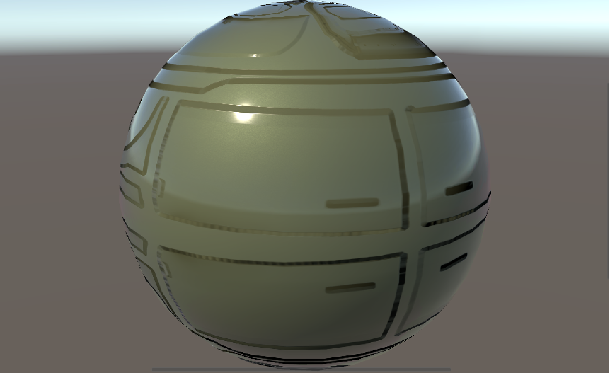
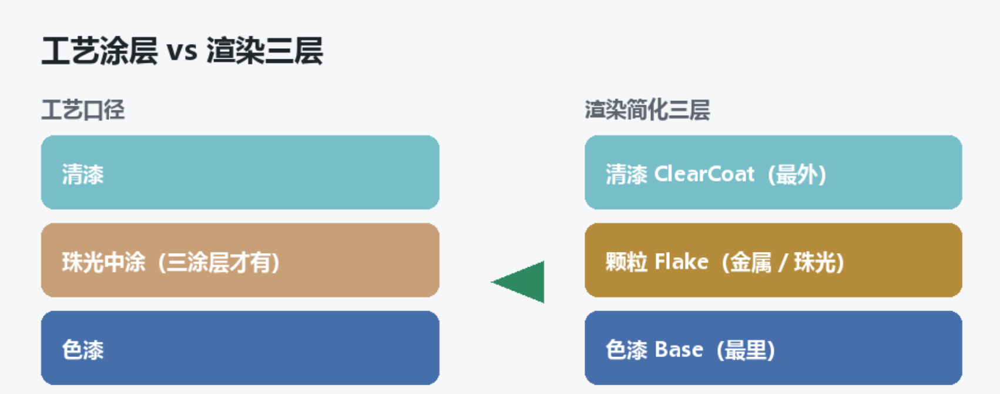

> 开始写车漆的着色器，这篇先分享下车漆可能会由哪些部分组成。之后再从每一份组成出发，去逐个介绍其中细节。

车漆的效果，是一层一层叠出来的。如果只是一个带反射的有金属感的基础色，就会显得有点"假"。在之前的开发过程中，效果上常见的问题是整体发灰，有塑料感，局部高光闪烁。为了解决这些问题，我们尝试对车漆的效果进行分层拆解，并将在之后的本系列文章中逐个做详细说明。



# 分层结构

汽车喷漆至少要喷两个涂层：色漆层和清漆层。有的还有三涂层：色漆层 + 珠光层 + 清漆层。渲染的时候参照这个施工流程，划分为：

- **Base 层（底漆/色漆）**：负责底色的表达，解决侧面发灰的问题
- **Flake 层（金属漆/珠光漆）**：负责颗粒感表达，增加金属感和颗粒感
- **ClearCoat 层（清漆层）**：负责镜面感，提供一层反射柔和的光泽感



# 内容细分

三层（Base / Flake / ClearCoat）是视觉基础，但量产项目的车漆 Shader 不止这些。还要考虑换车身颜色要兼容什么、加充放电效果要准备什么等等。

## 视觉效果

### Base 层：主色 + 边缘色 + Fresnel

色漆层是车漆基本颜色的表达，但这里不能只有一个 BaseColor ，还得配一个 EdgeColor。正面看和侧面看颜色不一样，用 Fresnel（视线和法线的夹角）控制两者的过渡，基础颜色的视觉丰富性就出来了。这一层解决的是"车漆发灰、像塑料"的基础问题。

```hlsl
_BaseColor("BaseColor", Color) = (1,1,1,0)
_EdgeColor("EdgeColor", Color) = (0.5,0.5,0.5,0)
_EdgeFactor("EdgeFactor", Range(0.01, 10)) = 1
_Metallic("Metallic", Range(0, 1)) = 0
_Smoothness("Smoothness", Range(0, 1)) = 0.5
```

这里的光滑度和金属度，由于是底漆，取值会比较低。在后面和清漆层的光滑/金属配合起来用。

### Flake 层：金属颗粒与珠光变色

金属漆里的铝片（Flake）、珠光漆里的云母片，都放在这一层。不同角度看过去要有细微的闪点和色彩变化，才能表达出金属漆和珠光漆的质感。核心是一张 FlakeMap（颗粒纹理）加上视角相关的颜色和反射调制。

纯色漆可以没有这一层，但由于很少会有贴的很近观察车漆的场景，所以留着金属漆和珠光漆是常用做法。没有 Flake 层，车漆有金属感但没有颗粒感，远看问题不大。

```hlsl
_FlakeMap("FlakeMap", 2D) = "white" {}
_FlakeDensity("FlakeDensity", Float) = 40
_FlakeColor("FlakeColor", Color) = (1,1,1,0)
_FlakeColorPower("FlakeColorPower", Range(1, 20)) = 10
_FlakeReflection("FlakeReflection", Range(0, 10)) = 1
_FlakeFactor("FlakeFactor", Range(0.01, 1)) = 0.2
```

`_FlakeMap` 颗粒纹理；`_FlakeDensity` 控制颗粒疏密；`_FlakeColor` 和 `_FlakeColorPower` 管珠光漆的色相偏移；`_FlakeReflection` 和 `_FlakeFactor` 管颗粒的反射强度和整体占比。

这一层解决的是车漆金属颗粒感的问题。

### ClearCoat 层

清漆层是漆面的最外层，需要在视觉上表达出反射感。清漆层产生独立的镜面高光，让车漆在这一层看起来像敷了一层亮油。

真实车漆的亮，是靠最外层那层清漆在反光。没有 ClearCoat，车漆的高光就是"散的、蒙的"，像磨砂面而不是镜面。清漆层的光滑度远高于底漆，两层高光叠在一起，才是真实车漆的光照层次感。

```hlsl
_CoatIntensity("CoatIntensity", Range(0, 1)) = 0.8
_CoatSmoothness("CoatSmoothness", Range(0, 1)) = 0.9
```

`_CoatIntensity` 控制清漆强度；`_CoatSmoothness` 光滑度；

这一层解决的是车漆不够亮、没有反射感的问题。清漆是车漆"高级感"的主要来源。

> 除了以上三层每一层都会有一篇系列文章。考虑到反射特性和抗锯齿的需求，还会再有一篇文章谈到反射与抗锯齿怎么适配车漆材质的。

## 样式变化

在面对同一款车有多种车身颜色、不同的车衣时，我们需要有不同配置的材质。很显然我们不会每种颜色建一个材质。所以我们车漆的着色器要有复用性，能够用一套 Shader ，通过参数、贴图、变体来承载所有车身外观需求。

### 车衣遮罩

用一张 SkinMap（或 MaskMap）把车身部分区域遮盖，实现车衣或者配合车衣实现贴花效果。

### UV 切换

车漆本身的纹理用的 UV是模型（UV0），但车衣、贴花可能需要用到一套独立的 UV（UV1）来绘制，这就形成了车漆和车衣的不同处理。

## 业务扩展

同样是一份 Shader，还得应对座舱业务特有的需求：充电溶解、雨滴、积雪、日夜模式切换……它们并不是一层或一份新的“特效”，而就是要在当前已有的 Shader 层级上，通过颜色、法线、光滑度、透明度的修改来实现。

这里包括以下效果兼容：

- 充放电效果：根据需求不同，可能要支持高度渐变、噪声扰动。
- 天气效果：包括雨滴流动、积雪覆盖两种效果的不同程度的表现。
- 日夜模式：通过全局变量去驱动材质参数随着环境光照而调整。
- 其他效果：比如洗车前的车体脏污效果，局部划痕磨损的效果。

## 基础选型

### 1. URP Lit 扩展

基于URP Lit 模板去做扩展，在 Lit 的光照骨架上叠车漆层（Base / Flake / ClearCoat）和业务开关。代码可能会比较臃肿（用ASE，SG的话另说），但是可以和场景其他的 Lit 材质对反射和阴影的计算方式一致。

### 2. 表面类型

除了为了特殊效果需要准备的透明车壳，使用本车漆的都是不透明物体。所以这里是 **Opaque**。

### 3. 单 Pass

Base、Flake、ClearCoat 在 一个 Pass 中一次处理完，这样 DrawCall 可控，也方便下一节说的业务 Keyword 挂在同一块代码里。

### 4. Keyword 

充放电溶解、雨滴、积雪和车漆是同一套Shader，每一个计算量也都不算小，Keyword可以精简一些。

## 结语

车漆 Shader 将拆分成多篇文章完成内容输出，请关注后续该系列文章。

