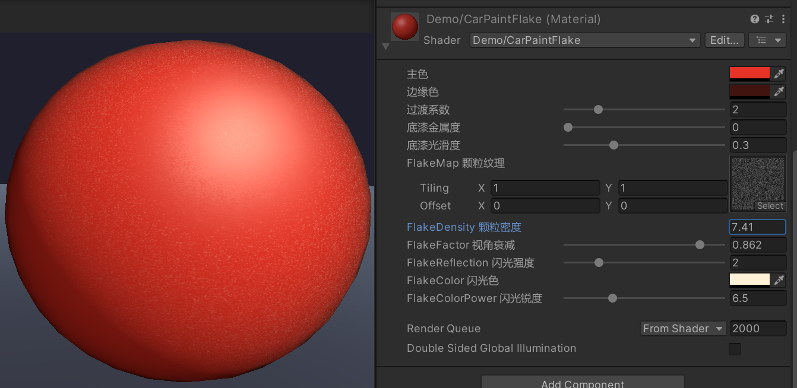
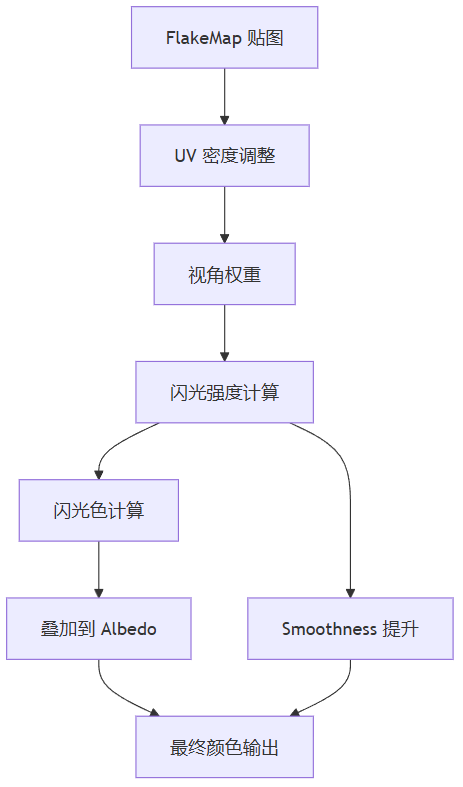
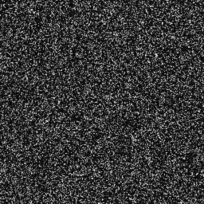

> 上一篇讲了 Base 层的色漆底色。这篇轮到 Flake 层，主要介绍一下金属颗粒与珠光效果。



金属漆里的铝片、珠光漆里的云母片，在车漆材质中都归到了 **Flake 层**，这一层主要是需要输入一张颗粒贴图，然后根据视角相关的参数去计算强度和闪光的颜色。纯色漆理论上可以没有 Flake。但3D HMI 很少会有很贴近车身的场景（比如悬架调节时镜头推进到前轮旁），不足够贴近就看不清有没有颗粒效果。但一般车漆Shader的开发会留这一层，如果不使用，可以不配贴图。



# 示意代码

```hlsl
// 1. 取样 FlakeMap，Density 控制疏密
float flake = tex2D(_FlakeMap, uv * _FlakeDensity).r;

// 2. 视角权重：正面看闪得多，侧看压下去
float viewWeight = 1.0 - pow(NDotV, _FlakeFactor);

// 3. 组合强度和视角
flake *= viewWeight * _FlakeReflection;

// 4. 闪光色：反射方向对视线的幂次高光
float3 specColor = pow(max(0.0, dot(normalize(reflect(-L, N)), V)), _FlakeColorPower)
                 * _FlakeColor.rgb;

// 5. 最终 Flake 贡献加到 Albedo
float3 flakeContribution = specColor * flake;
Albedo += flakeContribution;
```

# 流程说明

**1. 取样 FlakeMap**

用 `uv * _FlakeDensity` 对 `_FlakeMap` 的 R 通道采样，得到颗粒遮罩。Density 越大，贴图重复次数越多，颗粒越密、单个亮点越小；反之越稀、单个亮点越大。贴图本身需要是高频噪点。



**2. 计算视角权重**

通过 `1 - pow(NDotV, _FlakeFactor)` 得到视角权重：正视时权重高、亮点明显；侧视时权重低、亮度被压下去。这里的 NDotV 和 Base 层共用同一份，Base 层用它混边缘色，Flake 用它压暗侧面的亮点。

**3. 组合总强度**

将取样结果乘以视角权重，再乘 `_FlakeReflection`，得到最终的颗粒强度值。Reflection 是全局增益，统一拉高或压低效果。

**4. 计算闪光色**

用反射方向 `reflect(-L, N)` ，与视线方向，算出点积。得到反射方向和视线方向有多大差别之后，对这个差别做幂运算，得到高光度。最后乘 `_FlakeColor`，得到闪光的颜色形态。

`_FlakeColorPower` 控制高光锐度：越大，幂次曲线越陡峭，高光越窄越尖、越像点状；反之越小、金属感越软。金属漆用偏冷白，珠光漆把颜色偏到目标色。

**5. 叠加到 Albedo**

把 `specColor * flake` 以加法方式累加到 Base 层算出的 Albedo 上，同时 flake 值还可以同步加到 Smoothness，让颗粒区光滑度升高。

# 参数说明

```
//注意取值范围
_FlakeMap("FlakeMap", 2D) = "white" {}
_FlakeDensity("FlakeDensity", Float) = 0
_FlakeFactor("FlakeFactor", Range(0.01, 1)) = 0.01
_FlakeReflection("FlakeReflection", Range(0, 10)) = 0
_FlakeColor("FlakeColor", Color) = (0,0,0,0)
_FlakeColorPower("FlakeColorPower", Range(1, 20)) = 10
```


| 参数                 | 管什么    | 调小的视觉            | 调大的视觉              |
| ------------------ | ------ | ---------------- | ------------------ |
| `_FlakeDensity`    | 颗粒疏密   | 颗粒稀、单点大，近看像几粒铝片  | 颗粒密、单点碎，远看易糊成噪点    |
| `_FlakeFactor`     | 正/侧面占比 | 闪点集中在正视区，侧面几乎不闪  | 侧面也带出明显闪点，分布更均匀    |
| `_FlakeReflection` | 整体亮度   | 像没开 Flake，颗粒若有若无 | 车身发白，盖住 Base 底色  |
| `_FlakeColorPower` | 闪光锐度   | 闪光铺开，金属感软、面积大    | 闪光收尖，像点状高光，跳得明显    |
| `_FlakeColor`      | 闪光色相   | 中性白/冷灰，纯金属闪感     | 带明确色相偏移（紫/金/青），珠光感 |


# 结语

效果调参关系到选用了什么FlakeMap，无法给出绝对建议值。FlakeMap的对比度如果比较低，Density、Reflection会需要更高。然后再去调试 Factor 和 Color/ColorPower。找到一个在高光区域边上若隐若现的感觉，我觉得效果上就差不多了。

