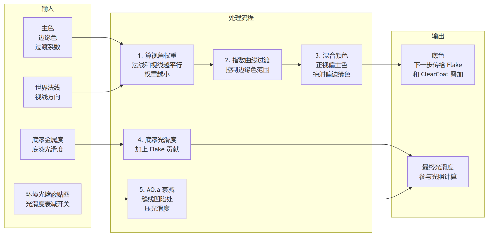
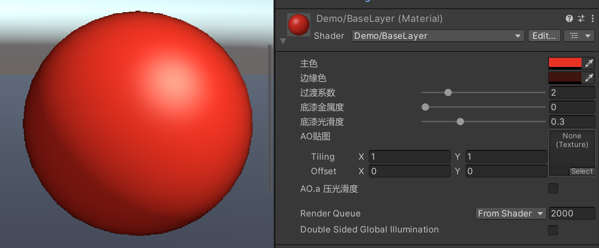

> 上一篇讲了车漆的三层结构：Base / Flake / ClearCoat。这篇从第一层 Base 入手，说说色漆这部分包含了哪些处理。

Base 层处理的事情可以分成几个步骤，整体流程如下图所示：



处理流程分三步：先做颜色混合（主色+边缘色），再算底漆的光照参数，最后用 AO 做一次光滑度衰减。



# 一、主色与边缘色

Base 层第一步：确定车漆的基础颜色，但正视和侧视用同一个颜色是不够的。正面看一个颜色，侧面看应该往深、往冷偏一点，这样会有层次感。

代码里用两个颜色值配合一个过渡系数来实现：

```hlsl
_BaseColor("BaseColor", Color) = (1,1,1,0)
_EdgeColor("EdgeColor", Color) = (0.5,0.5,0.5,0)
_EdgeFactor("EdgeFactor", Range(0.01, 10)) = 1
```

`_BaseColor` 是正视时的颜色，`_EdgeColor` 是侧视时的颜色，`_EdgeFactor` 控制过渡的快慢。

片元着色器里的计算：

```hlsl
float NDotV = 1.0 - saturate(dot(WorldNormal, WorldViewDirection));
float albedoFresnel = pow(NDotV, _EdgeFactor);
float4 baseEdge = lerp(_BaseColor, _EdgeColor, albedoFresnel);
```

1. `dot(WorldNormal, WorldViewDirection)` 用点积计算法线和视线的夹角
2. `NDotV = 1.0 - saturate(...)` 把夹角的特性反过来，即正视接近 0，侧视接近 1。这个值给到菲涅尔系数计算去用。
3. `pow(NDotV, _EdgeFactor)` 把线性关系变成曲线。`_EdgeFactor` 越大，边缘色所占的整个渐变色的区域就越窄。
4. `lerp(_BaseColor, _EdgeColor, albedoFresnel)` 根据基于视角夹角等参数计算出的权重，混合两个颜色，正视偏主色，侧视/边缘偏边缘色。

这样得到的就是 Base 层输出的底色。后面 Flake 和 ClearCoat 会叠在这层之上做更多的处理。

> `albedoFresnel` 只是一个经验性的视角权重，用来驱动颜色过渡，不是物理光学里的 Fresnel 反射公式。清漆层还会有自己的镜面 Fresnel，一个管漫反射底色，一个管高光反射。

# 二、底漆金属度与光滑度

Base 层还有两个参数：`_Metallic` 和 `_Smoothness`。

```hlsl
_Metallic("Metallic", Range(0, 1)) = 0
_Smoothness("Smoothness", Range(0, 1)) = 0.5
```

这两个参数描述的是色漆/底漆本身的光照特性，工艺上色漆偏哑、金属感弱，镜面感主要靠清漆。所以这里的取值通常偏低：

- `_Metallic` 接近 0，或略抬一点给金属漆底子
- `_Smoothness` 中低即可，不要拉满

光滑度最终输出还会叠加 Flake 层的参数：

```hlsl
float ResultSmoothness = flake + _Smoothness;
```

# 三、AO.a 对光滑度的衰减

Base 层还有一项补充处理：用 AO 贴图的 alpha 通道来影响边缘区域的光滑度。

这里需要有一张 `_OcclusionMap`，不同的通道的作用是：

- **G 通道**：常规 AO，实现环境遮蔽效果。
- **A 通道**：乘光滑度，由 `_IsAOAlphaSmooth` 开关控制

```hlsl
float edgeSmoothness = AO.a * _IsAOAlphaSmooth + (1.0 - _IsAOAlphaSmooth);
float smoothness = ResultSmoothness * edgeSmoothness;
```

开关打开后，AO.a 会同时乘到底漆光滑和清漆光滑上。缝线、凹陷、脏污这些区域在 AO.a 里画得暗，光滑度跟着降，高光就会收敛一些。

这一项不是必须的。没有 AO.a 通道时，单靠 `_BaseColor` / `_EdgeColor` / `_EdgeFactor` 也能把颜色过渡做出来。有就多一层质感的提升。

# 完整代码串联

上面三个步骤的代码在片元着色器里按顺序拼接在一起，大概这样：

```hlsl
// 片元着色器片段

// 1. 颜色混合：主色 → 边缘色
float NDotV = 1.0 - saturate(dot(WorldNormal, WorldViewDirection));
float albedoFresnel = pow(NDotV, _EdgeFactor);
float4 baseEdge = lerp(_BaseColor, _EdgeColor, albedoFresnel);

// 2. 底漆光照参数
float metallic = _Metallic;
float smoothness = _Smoothness;

// 3. AO.a 光滑度衰减
float edgeSmoothness = AO.a * _IsAOAlphaSmooth + (1.0 - _IsAOAlphaSmooth);
float ResultSmoothness = smoothness * edgeSmoothness;

// 4. 连接给 URP PBR
// baseEdge → Albedo（后面 Flake 和车衣会再叠加上来）
// ResultSmoothness → 光滑度
// metallic → 金属度
```

Base 层做完之后，`baseEdge` 和 `ResultSmoothness` 会交给 URP 的光照函数，Flake 层（金属颗粒）和 ClearCoat 层（清漆）会在后续步骤中叠加。

# 四、调参

## 色差

边缘色一般比主色更深。深金属漆的边缘甚至接近黑。一套车多颜色复用同一套 Shader 时，每套颜色都要单独配 EdgeColor。

## EdgeFactor

`_EdgeFactor` 控制边缘色过渡的范围：**值越小**，边缘色涵盖的范围越宽，侧视的时候很快就会过渡到 EdgeColor 的视觉表现。建议固定 `_BaseColor` 和 `_EdgeColor` 之后，再单独调 `_EdgeFactor`。

# 结语

真实车漆的视角变色源于颜料定向排列和多次散射，而在shader的开发中，会想到用两种颜色加一个渐变的控制来近似表达，这其实体现的是我理解的技术美术的一个很有特点的工程能力：转化物理世界，压缩参数并近似拟合，达到性能可控效果够用的程度。

