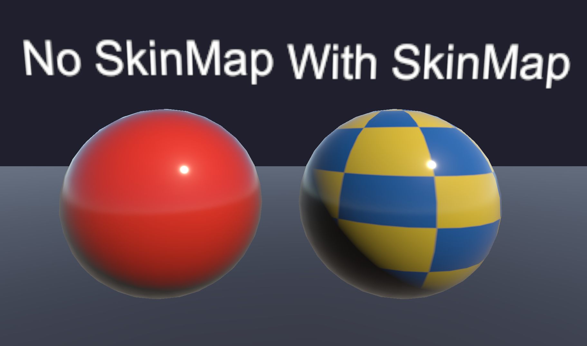
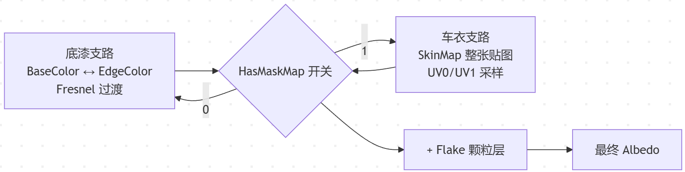

> 根据之前的文章所说，本来这里是要讲反射和抗锯齿的一些问题。但今天考虑到问题比较琐碎和繁杂，还是决定把分层处理的“层”给讲完，再去整理相关的处理过的问题。

对于车漆，常见的需求是数字车衣。用户不光是能选择不同的车漆颜色，还能选择预设的若干车衣。它们的表现就像贴花，如图：



左边纯红球是没贴膜的原始车漆，右边棋盘格球是贴了膜之后的画面。这个棋盘格是测试用的，实际项目里换成你要的车衣图案、拉花、局部彩绘。下文就简述处理方式。

---

# 车衣层

车漆输出到最终的 Albedo 出口，有两条支路：



## 参数

```
//注意取值范围
[Toggle]_HasMaskMap("HasMaskMap", Float) = 0
[Toggle]_IsUV1("IsUV1", Float) = 0
[NoScaleOffset]_SkinMap("SkinMap", 2D) = "white"
```

`_HasMaskMap` 这个开关，当它等于 1 时，Albedo 整块换成 SkinMap 贴图采样的结果。这里没有做逐像素的 alpha 混合权重，是直接硬切的。

## 代码

```hlsl
// 1. 底漆颜色：BaseColor ↔ EdgeColor，Fresnel 过渡
float3 baseEdge = lerp(_BaseColor.rgb, _EdgeColor.rgb, fresnel);

// 2. 车衣采样
float3 skin = tex2D(_SkinMap, uv0).rgb;

// 3. Albedo 出口：_HasMaskMap 做整张替换
float3 albedo =
        baseEdge * (1.0 - _HasMaskMap)   // 走底漆
      + skin     * _HasMaskMap;          // 走车衣

```

在 SkinMap 贴图里，底漆颜色和车衣图案一起呈现。车衣图是一张已经合成好的**成品图**：该是车漆的地方填底漆颜色，该是车衣的地方填车衣图案。这种做法倒也不是必须的，做成根据 alpha 来选择颜色也可以，反正总需要采样一次。

无论开不开车衣这个开关，都是需要走过 Flake 颗粒层的叠加的。

---

# 结语

工程里面为不同的车衣会设置不同的材质，用的时候是换材质，不是改参数。这一点之前文章也讲过。当我们既有国内车型又有海外车型的时候，车衣的贴图可以给到两套UV去适配不同的车型。代码里面给UV切换的开关，可以节省点。