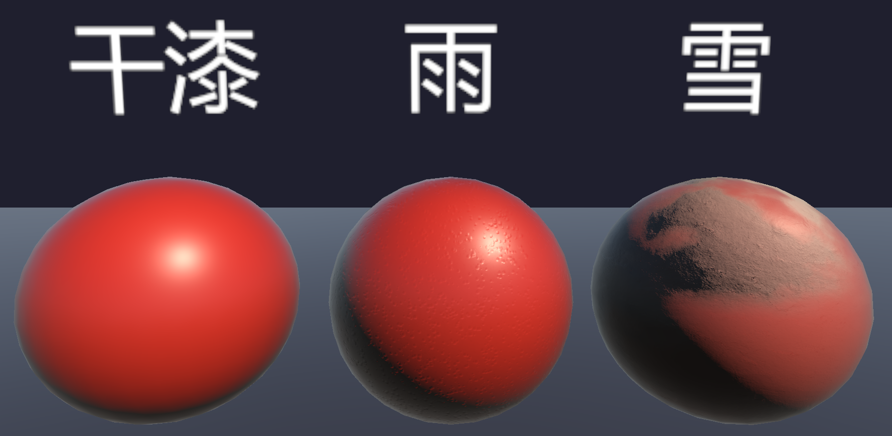
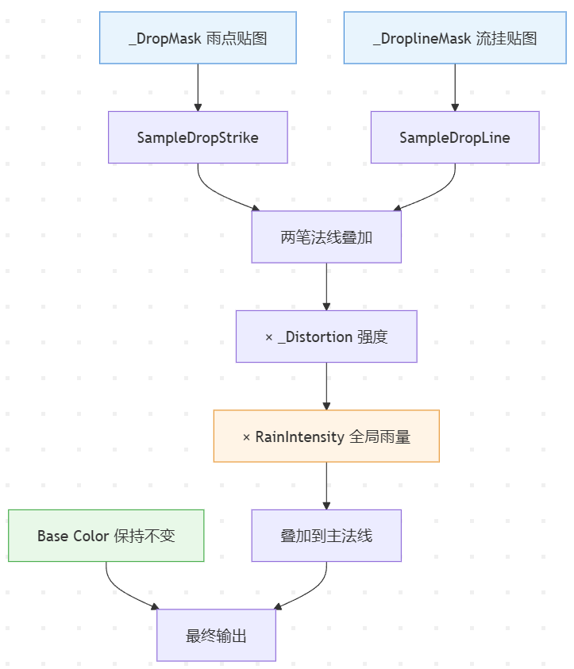

> 继车衣遮罩层之后，这篇把特效这一层的内容写掉，由于之前的文章已经写过充放电特效了，因此本篇就把剩下的天气特效写一写。主要说下雨、下雪在车漆上怎么处理。

在材质层的视角里，天晴、下雨、下雪切换本质上都是状态切换。这里用 Toggle 做开关，把不同特效从主流程里隔离开来。雨水的效果主要是做法线扰动，让表面看起来有水珠和流痕；雪天则是利用合适的噪声遮罩去Lerp，做出积雪落在朝上表面的真实质感。



# 下雨

雨天的视觉感受分为雨水滴落的打击感和雨水挂线的流动。



整张图读下来就是一句话：**两张 mask 各自出一笔法线扰动，叠在一起，乘上强度和全局雨量，最后加到主法线上。** Base Color不动，纯粹靠法线变化模拟车漆上的雨水效果。

下面拆开讲两笔各自怎么算的。

## 参数

先整体看下有什么参数：

```
//注意取值范围
[Toggle(_ISWATER_ON)] _IsWater("IsWater", Float) = 0
_DropMask("DropMask", 2D) = "white" {}           // 水珠打击感法线+动画遮罩
_DroplineMask("DroplineMask", 2D) = "white" {}   // 流挂线法线遮罩
_Distrotion("Distrotion", Float) = 1
_DropTilling("DropTilling", Vector) = (4,3,0,0)
_DropStrengh("DropStrengh", Range(0, 1)) = 1
_DropStrikeSpeed("DropStrikeSpeed", Range(0, 2)) = 0.3
_DroplineSpeed("DroplineSpeed", Range(-0.5, 2)) = 0.2
```

## 关键函数

```hlsl
// SampleDropStrike：一次性把一颗水珠"砸"出来
float4 SampleDropStrike(sampler2D mask, float2 uv, float strength, float strikeSpeed)
{
    float4 t = tex2D(mask, uv);
    float2 normal = (t.rg * 2.0 - 1.0);        // RG 通道转法线扰动
    // alpha 是水珠动画相位：加时间再取 frac，相位对齐时才亮，实现逐颗砸出来
    float phase = frac(t.b - _Time.y * strikeSpeed);
    float strike = step(1.0 - strength, phase); // 强度越高，能亮的水珠越多
    return float4(normal * strike, 0, strike);
}
```

**雨点砸落（SampleDropStrike）**

输入是 `_DropMask` 贴图和三个参数：`strength` 强度、`strikeSpeed` 刷新节奏。

核心逻辑：

1. **RG 通道转法线方向**：贴图的 R、G 通道乘 2 减 1，映射到 [-1, 1] 区间，作为每颗水珠的法线扰动方向。
2. **B 通道存相位，随时间逐颗雨滴点亮**：Blue 通道存的是每颗水珠的初始相位，减去 `_Time.y * strikeSpeed` 再取 `frac`，相位就随时间往前走。同一张贴图上不同水珠的 Blue 值不一样，时间扫过去时，水珠一颗接一颗被 `step` 点亮，就有了"雨点陆续砸在漆面上"的节奏。
3. **强度控制**：`step(1.0 - strength, phase)`，强度越高，阈值越低，一帧里同时冒出来的水珠就越多。

```hlsl
// SampleDropLine：流挂线沿重力方向往下扫
float4 SampleDropLine(sampler2D mask, float2 uv, float flowSpeed)
{
    // BA 通道编码流挂的方向（B 水平、A 垂直），uv 按 _Time.y * flowSpeed 下移
    float2 dir = (tex2D(mask, uv).ba - 0.5) * 2.0;
    float2 flowUV = uv + float2(0.0, _Time.y * flowSpeed) + dir * 0.1;
    float4 t = tex2D(mask, flowUV);
    return float4(t.b, t.a, 0, 1) * _DroplineStrength;
}
```

**流挂线（SampleDropLine）**

输入是 `_DroplineMask` 贴图和 `flowSpeed` 流速参数。

核心逻辑：

1. **BA 通道方向偏移**：贴图的 B、A 通道各存一个方向分量（B 水平、A 垂直），减去 0.5 再乘 2，映射到 [-1, 1]，给每条流挂线一个初始方向偏移。
2. **UV 沿 y 轴向下流动**：`flowUV = uv + (0, _Time.y * flowSpeed) + dir * 0.1`，主方向是沿 y 轴往下（重力方向），再叠一个方向偏移做微调，水痕就带点自然弯曲，不会齐刷刷一根直线。
3. **最后乘以强度：**用流动后的 UV 重采样贴图，取 BA 通道作为输出，再乘以 `_DroplineStrength` 控制整体强度。

---

# 下雪

积雪的本质是调配一张遮罩图。

## 参数

```
//注意取值范围
[Toggle(_ISSNOW_ON)] _IsSnow("IsSnow", Float) = 0
_SnowMaskMap("SnowMaskMap", 2D) = "white" {}     // 积雪疏密噪声遮罩
_SnowMap("SnowMap", 2D) = "white" {}              // 积雪表面纹理
_SnowBaseColor("SnowBaseColor", Color) = (0.85,0.85,0.85,1)
_SnowMetallic("SnowMetallic", Range(0, 1)) = 0
_SnowSmoothness("SnowSmoothness", Range(0, 1)) = 0
```

## 代码

```hlsl
#ifdef _ISSNOW_ON
    // 权重：mask 噪声 × 朝上分量 × 场景雪强 × 车辆级覆盖
    float mask = pow(tex2D(_SnowMaskMap, uvMask).r, 2.0) * 8.0;
    float up = max(normalize(WorldNormal).y - 0.1, 0.0);
    float w = clamp(max(SnowIntensity - 1.0, 0.0)
                  + min(SnowIntensity, 1.0) * mask * up, 0.0, 1.0)
            * CarSnowIntensity;

    albedo      = lerp(albedo, tex2D(_SnowMap, uvSnow).rgb * _SnowBaseColor.rgb, w);
    metallic    = lerp(metallic, _SnowMetallic, w);
    smoothness  = lerp(smoothness, _SnowSmoothness, w);
    normalWS    = BlendSnowNormal(mainNormalWS, snowNormalWS, w);
#endif
```

对于w这个权重的计算，结合了三个输入：

1. `_SnowMaskMap` 的噪声遮罩。通过平方再乘 8 拉开噪声的对比程度，把原本柔和的灰度差拉大，让最终的雪有疏密的区别；
2. 世界法线的朝上分量`normal.y` 减 0.1，减弱一些斜面的积雪程度；
3. 参数`SnowIntensity` ，当超过 1 时，超出的部分转成强制全覆盖，不再受 mask 和朝向约束。

如果 `SnowIntensity` 在 0 到 1 之间，就按照上述1和2的影响确认积雪，超出的部分直接变成强制覆盖。权重 w 算出来之后，Albedo 向 *SnowMap ×* SnowBaseColor 过渡，金属度、光滑度也一样。因为雪的表面与车漆表面质感不同，法线也应该进行变化。

> BlendSnowNormal 这个函数把雪的法线按雪量混进主法线里。三段式，每段管一档雪量。
>
> **低雪量档（w ≤ 0.2）**：雪薄，盖不住漆面，直接用原法线，雪只是薄薄一层粉，不影响表面质感。
>
> **高雪量档（w ≥ 1）**：雪堆满了，积雪表面有自己的起伏和颗粒感，镜面车漆的平整被打破，换成雪本身的粗糙纹理。
>
> **中间档（0.2 < w < 1）**：把雪法线的 y 分量乘以权重，如果W很小（比如0.2），y就压扁，如果 W 接近1，那就不压缩，归一化后，这样法线方向就实现了从原法线向雪法线的一种过度。

---

# 结语

写到这里，车漆的主要组成都已经写完了。在之后的时间里，可能还会有新的需求出现，车漆也因此会加入更多的功能。