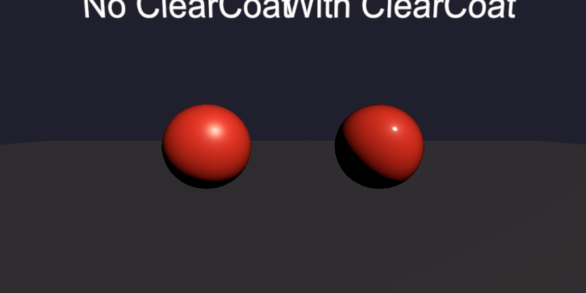

> 上一篇讲了 Flake 层的金属颗粒与珠光效果。这篇轮到 ClearCoat 层，主要介绍一下清漆的罩光与镜面反射。

真实车漆的"亮"，不是把色漆的 Smoothness 拧到 1。亮油在色漆外面：清漆罩光、反射环境，底下的色漆和颗粒透过这层亮油被看见。没有清漆层，高光是散的、蒙的；有了它，才出现一层锐、薄、可拉环境的镜面。色漆的高光比较散，清漆的高光比较锐利，两层叠在一起，才有真实车漆的光照层次。车漆的高级感主要靠这层亮油。



# 示意代码

```hlsl
// 1. 清漆参数定义
_CoatIntensity("CoatIntensity", Range(0, 1)) = 0.8
_CoatSmoothness("CoatSmoothness", Range(0, 1)) = 0.9

// 2. 片元中写入 SurfaceData
#ifdef _CLEARCOAT
    CoatMask = _CoatIntensity;
    CoatSmoothness = _CoatSmoothness * EdgeSmoothness; // 乘 AO.a 做局部衰减
#endif

// 3. 交给 URP 光照函数
surfaceData.clearCoatMask       = saturate(CoatMask);
surfaceData.clearCoatSmoothness = saturate(CoatSmoothness);
```

# 流程说明

**1. 清漆参数**

清漆层就两个旋钮：`_CoatIntensity` 控制罩光覆盖强度，`_CoatSmoothness` 控制镜面锐度。不像 Base 层有 Metallic、Smoothness、EdgeColor 一堆参数，清漆的参数很简单。`clearCoatMask` 是覆盖率，1 表示这片完整喷了清漆，0 表示没喷，中间值按比例混合两种状态。它不是物理厚度，实时管线不模拟厚度带来的吸收。

**2. 写入 SurfaceData**

在片元着色器里通过 `_CLEARCOAT` 开关控制。打开后，把 `_CoatIntensity` 赋给 `clearCoatMask`，把 `_CoatSmoothness` 乘上 EdgeSmoothness 后赋给 `clearCoatSmoothness`。EdgeSmoothness 取自 AO 贴图的 alpha 通道，作用是让边缝凹槽这些地方的清漆高光弱一些，不会整车亮得发油。

**3. 交给 URP 光照函数**

清漆的高光为什么是锐的？光从空气（折射率约 1.0）进清漆（树脂约 1.5），在交界面上有一部分直接被反射走。这部分反射率随视角变化，URP 用 Schlick 近似的简化版 `F = 0.04 + 0.96 × (1 − N·V)⁴`：正视时只有约 4% 被弹走，视线越贴近表面反射越多，掠射方向趋近 100%。这也是车漆边缘总有一圈亮边的重要成因之一。

其余的光穿过清漆到达色漆（basecoat），被色漆反射后再穿回来。严格来说进出各乘一次透射率，但实时渲染用单次加权混合，这是 glTF clearcoat 规范为能量守恒规定的做法。被清漆挡掉的是色漆的全部反射（漫反射＋镜面一起变暗），所以有清漆的车漆斜着看颜色更深、更沉，产生"润"的感觉。

最终的高光 = 清漆直接反射（白、锐、薄）＋ 打折后的色漆反射（带颜色、散）。清漆对环境反射也一样起作用，URP 里清漆的镜面感很大程度来自环境反射的叠加。

# 参数说明

```
//注意取值范围
_CoatIntensity("CoatIntensity", Range(0, 1)) = 0.8
_CoatSmoothness("CoatSmoothness", Range(0, 1)) = 0.9
```

| 参数 | 管什么 | 调小的视觉 | 调大的视觉 |
|------|--------|-----------|-----------|
| `_CoatIntensity` | 罩光覆盖强度 | 清漆层几乎看不见，高光散、蒙 | 罩光感强，但深色车容易发白膜 |
| `_CoatSmoothness` | 镜面锐度 | 高光发软，像半哑光清漆 | 高光锐利，像刚打完蜡的镜面 |

`_CoatSmoothness` 管的是清漆微表面的粗糙程度，不是强度。清漆镜面的强度由固定的菲涅尔项决定，Smoothness 只影响高光的锐与糊。

# 结语

清漆层就两个参数，比 Base 和 Flake 都简单。效果调参关键要把色漆和清漆的光滑度分开，色漆低散、清漆高锐，别拧成一层。觉得车不够亮，优先抬 CoatSmoothness，不是拧色漆。清漆开起来之后，环境反射会更明显，远景薄高光也更容易闪，那是清漆做对了才暴露的下一层问题。下一篇专门谈反射与抗锯齿。