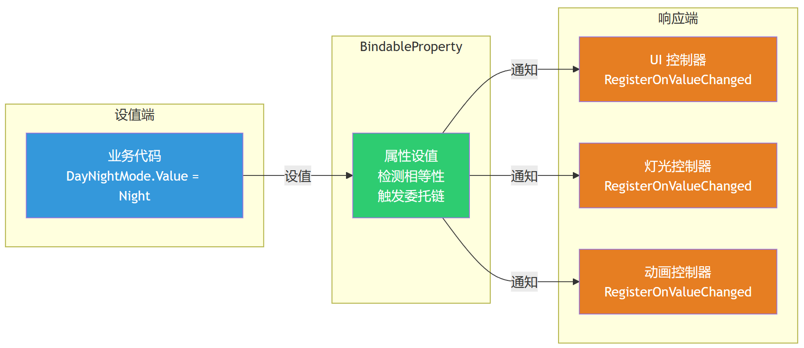

> 我们在开发的过程中，最典型的场景是：收到一个信号，关联一个值的变化，这个值变了，关联特定的零部件的动画。这种场景，如果我们每个信号都去注册一个事件，当收到了信号我们就抛出这个事件是可以的。但还有没有更方便的，至少用起来感觉更爽的方法？

有的，在框架的开发过程中，可以使用一套基于特定变量进行绑定，绑定之后自带一个可注册的委托的机制。它的名字就是： `BindableProperty<T>`，一个很轻量但很有用的类，承担着一旦值变化，自动通知所有注册者的职责。在不少框架中都能看到它的存在，我们也一直延用它。

---

# 设计实现

## 如果我不用它？

如果不用它，强耦合的话，可能是这么写：

```csharp
private DayNightMode _mode;
public DayNightMode Mode
{
    get => _mode;
    set
    {
        if (_mode == value) return;
        _mode = value;
        RefreshUI();          // 手动调
        UpdateSceneLight();   // 手动调
        NotifyAnimations();   // 手动调
    }
}
```

问题是：`Mode` 变化后到底要通知谁，谁写 setter 谁知道。如果后面加了一个还需要响应模式变化的模块，就要回来改这个 setter。每加一个响应者，就多一行代码。多人协作时就是灾难。

## 当我有了它！

`BindableProperty<T>` 的做法是：**值变化时只通知"谁关心它"，不关心"谁需要它"**。设值的人只管设值，不用管谁会响应。

它是观察者模式的典型体现，同时，它也是 MVVM 的基础设施。



---

## BindableProperty 代码

```csharp
// 以下为示意代码
public class BindableProperty<T>
{
    private T _value = default(T);

    public T Value
    {
        get => _value;
        set
        {
            if (object.Equals(_value, value)) return;   // 检测相等性
            _value = value;
            Apply();                                     // 触发通知
        }
    }

    public void Apply()
    {
        _onValueChangedEvent?.Invoke(_value);
    }

    private event Action<T> _onValueChangedEvent = null;

    public IUnregister RegisterOnValueChanged(Action<T> onValueChanged)
    {
        _onValueChangedEvent += onValueChanged;
        return new Subscription<T>()
        {
            Source = this,
            Callback = onValueChanged
        };
    }

    public void UnRegisterOnValueChanged(Action<T> onValueChanged)
    {
        _onValueChangedEvent -= onValueChanged;
    }
}
```

- `setter`  **检测相等性**。`object.Equals(_value, value)` 在值没变时直接返回，不触发回调。避免重复设值时的无效通知。
- `Apply()` **提供强制触发**。委托可以在类的外部去触发。
- `RegisterOnValueChanged` **返回** `IUnregister`**。这个返回值是一个 `Subscription<T>`，持有了 `BindableProperty` 和 `Action<T>` 的引用，调用 `Unregister()` 自动退订。这个设计让调用方不需要记住具体的 `BindableProperty` 实例，只需要持有 `IUnregister` 引用，在 `OnDestroy` 时调 `Unregister()` 即可。

```csharp
// 注销辅助类
public class Subscription<T> : IUnregister
{
    public BindableProperty<T> Source { get; set; }
    public Action<T> Callback { get; set; }

    public void Unregister()
    {
        Source.UnRegisterOnValueChanged(Callback);
        Source = null;
        Callback = null;
    }
}
```

---

# 使用方式

`BindableProperty<T>` 的使用一般分两步。第一步，在 Model 里定义属性：

```csharp
// 以下为示意代码
public class AppModel
{
    public BindableProperty<DayNightMode> DayNightMode = new BindableProperty<DayNightMode>()
    {
        Value = DayNightMode.Day
    };

    public BindableProperty<bool> AppIsPause = new BindableProperty<bool>()
    {
        Value = false
    };
}
```

第二步，在关心这个值的控制器里注册回调：

```csharp
// 以下为示意代码
public abstract class BaseDayNightController : MonoBehaviour
{
    private void Awake()
    {
        var appModel = GetComponent<AppModel>();

        // 初始化时先按当前值刷新一次
        OnCurrentDayNightModeChanged(appModel.DayNightMode.Value);

        // 注册值变化回调
        appModel.DayNightMode.RegisterOnValueChanged(OnCurrentDayNightModeChanged);
    }

    private void OnCurrentDayNightModeChanged(DayNightMode dayNightMode)
    {
        switch (dayNightMode)
        {
            case DayNightMode.Day:
                ChangeToDayMode();
                break;
            case DayNightMode.Night:
                ChangeToNightMode();
                break;
        }
    }

    protected virtual void OnDestroy()
    {
        // 销毁时退订，避免内存泄漏
        var appModel = GetComponent<AppModel>();
        if (appModel != null)
            appModel.DayNightMode.UnRegisterOnValueChanged(OnCurrentDayNightModeChanged);
    }
}
```

`Awake` 时先调一次 `OnCurrentDayNightModeChanged(appModel.DayNightMode.Value)`，再用 `RegisterOnValueChanged` 注册后续变化。先调一次，控制器就不会停在默认值上，而是立即按当前值初始化一次。

---

## 结语

可以这么说，所有在 数据（Model层）和视图（View）之间构成了逻辑关系的地方，都可以使用 `BindableProperty<T>`: 门的状态/开合度，当前系统语言，当前的相机状态等等。它把"值变化后通知谁"这件事从设值的地方抽离出来，构成了"数据驱动"的起点。