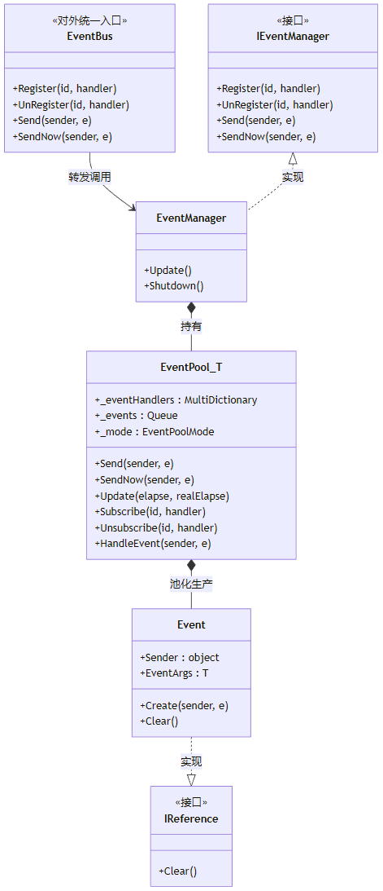

> 在应用开发中，各个实例化的服务和控制器都需要向其他对象发送消息，或是接收其他对象的消息。所以事件机制几乎是所有开发框架的标配。

使用事件机制就是为了让不同的业务模块之间尽量解耦。做一个广播站的播音员，让想收听信息的方方面面自行收听，而不去做一个邮递员，不会将一封封电报送到每家每户。

最典型的场景是日夜模式一旦变了，牵涉到很多改变，比如UI 要换图，车模要换材质，场景要换后处理效果。如果要统一被日夜模式的管理器管理，那么每增加一项需要变化的内容，都需要到管理器里面去声明和写逻辑，这就很不轻松。

本文讲框架里的 `EventPool<T>`，它是"只关心事件"的总线。事件源只管发，关心的人只管收，双方不直接引用。

# 数据流



# UML类图


- 其他业务模块只接触 `EventBus`，它是一个静态入口，把 `Register / Send` 转发给 `EventManager`。
- `EventManager` 实现了 `IEventManager` 接口，内部持有 `EventPool<BaseEventArgs>`。
- `EventPool` 管事件队列和 Handler 链表。
- `Event` 是可池化的事件节点。

# EventBus

业务模块用事件系统，通过静态类 `EventBus`。它暴露四个方法：

```csharp
// 以下为示意代码
public static class EventBus
{
    public static void Register(int id, EventHandler<BaseEventArgs> handler);
    public static void UnRegister(int id, EventHandler<BaseEventArgs> handler);
    public static void Send(object sender, BaseEventArgs e);     // 线程安全，延迟派发
    public static void SendNow(object sender, BaseEventArgs e);   // 立即派发，非线程安全
}
```
- `Register` 订阅事件，`UnRegister` 退订，`Send` 发事件（延迟到下一帧派发），`SendNow` 发事件（立即派发）。
- `EventBus` 把所有调用转发给 `EventManager`。

# EventManager

`EventManager` 是 `IEventManager` 的实现，维护 `EventPool<BaseEventArgs>`

```csharp
// 以下为示意代码
internal sealed class EventManager : IEventManager
{
    private readonly EventPool<BaseEventArgs> _eventPool;

    public EventManager()
    {
        _eventPool = new EventPool<BaseEventArgs>(
            EventPoolMode.AllowNoHandler | EventPoolMode.AllowMultiHandler);
    }

    public void Update(float elapse, float realElapse)
    {
        _eventPool.Update(elapse, realElapse);   // 每帧消费事件队列
    }
}
```
- `EventManager` 构造时创建 `EventPool` 实例并指定模式，每帧 Update 时委托 `EventPool` 消费队列。`Shutdown` 时清理所有 Handler 和事件。

> EventPoolMode 是事件模式的枚举：必须有且只有一个 Handler；允许没有 Handler；允许1个ID多个Handler；允许Handler重复。

# EventPool

`EventPool<T>` 是事件系统的核心。它的职责是解决怎么存 Handler、怎么发事件、怎么遍历 Handler 执行回调这三个主要问题。

```
- public sealed class EventPool<T> where T : BaseEventArgs
{
    private readonly Dictionary<int, EventHandler<T>> _eventHandlers;  // 按 id 存的 handler 链表
    private readonly Queue<Event> _events;                                  // 延迟派发的事件队列
    private readonly EventPoolMode _eventPoolMode;                          // 行为模式
}
```

## 订阅

根据事件模式，针对字典做操作 Add 操作：

```csharp
// 以下为示意代码
public void Subscribe(int id, EventHandler<T> handler)
{
    if (!_eventHandlers.Contains(id))
        _eventHandlers.Add(id, handler);                          // 首次：新建链表
    else if ((_eventPoolMode & EventPoolMode.AllowDuplicateHandler) == 0
             && Check(id, handler))
        throw new Exception("not allow duplicate handler");       // 查重
    else if ((_eventPoolMode & EventPoolMode.AllowMultiHandler) == 0)
        throw new Exception("not allow multi handler");           // 查多
    else
        _eventHandlers.Add(id, handler);                          // 追加
}
```

先查这一个 ID 里有没有重复的 handler，再看允不允许挂多个，最后才追加到链表。

注销就是按 id 从链表里删掉对应 handler。

## 发事件

事件系统提供两种派发方式，区别在**是否走队列、是否线程安全**：

```csharp
// 以下为示意代码
public void Send(object sender, T e)
{
    var node = Event.Create(sender, e);
    lock (_events) { _events.Enqueue(node); }   // 入队，不阻塞
}

public void SendNow(object sender, T e)
{
    HandleEvent(sender, e);                     // 立即派发
}
```

`Send()` 是线程安全的，不管哪个线程调用，只把事件创建为 Event 入队列，然后由主线程的 `Update` 统一消费。

`SendNow()` 不走队列直接派发，不是线程安全的，调用方必须在主线程。

`Update` 每帧在主线程把队列里的节点逐一 `Dequeue`，然后`HandleEvent`、最后释放归还这个 Event。由此做到这一帧送入的事件，下一帧派发完毕。

## HandleEvent

目的就是把链表里面的EventHandler都触发一遍，但是要规避对原链表的改变，也同时规避被它的临时改动影响，所以先把原链表里的 Handler 委托引用**全部复制**到一份临时链表，再遍历临时链表执行。这样回调里不管怎么增删原链表，当前这轮遍历都不受影响。

```csharp
// 以下为示意代码
private void HandleEvent(object sender, T e)
{
    if (!_eventHandlers.TryGetValue(e.Id, out var range)) return;

    // 第一步：把原链表里的 handler 委托引用全部复制到临时链表
    var cache = new LinkedList<EventHandler<T>>();
    var current = range.First;
    while (current != null && current != range.Terminal)
    {
        _cachedNodes[e] = current.Next != range.Terminal ? current.Next : null;
        cache.AddLast(current.Value);
        current = _cachedNodes[e];
    }

    // 第二步：遍历临时链表执行回调
    foreach (var handler in cache)
        handler(sender, e);

    cache.Clear();
    _cachedNodes.Remove(e);
}
```

---

# Event

`Event` 是 `EventPool` 内部的一个私有类，包含 `Sender` 和 `EventArgs` 两个字段。它实现了从引用池借 Event 对象从而达到创建的目的：

```csharp
// 以下为示意代码
private sealed class Event : IReference
{
    public object Sender;
    public T EventArgs;

    public static Event Create(object sender, T e)
    {
        var node = ReferencePool.Acquire<Event>();
        node.Sender = sender;
        node.EventArgs = e;
        return node;
    }

    public void Clear()
    {
        Sender = null;
        EventArgs = null;
    }
}
```

`Send` 时 `Create` 借出，`Update` 派发完后 `Release` 归还。这里复用的正是之前引用池那篇讲的 `IReference` 。

---

# 使用方式

事件的完整使用流程分三步。第一步定义事件参数类：

```csharp
// 以下为示意代码
public class DayNightModeChangedEvent : BaseEventArgs
{
    public DayNightMode Mode;

    public static DayNightModeChangedEvent Create(DayNightMode m)
    {
        var e = ReferencePool.Acquire<DayNightModeChangedEvent>();
        e.Mode = m; 
        return e;
    }
}
```

第二步，发送方抛事件：`EventBus.Send(this, DayNightModeChangedEvent.Create(DayNightMode.Night))`（要立即生效就用 `SendNow`）。

第三步，接收方注册：`EventBus.Register(OnDayNightModeChanged.Id, OnDayNightModeChanged)`，回调里 `as` 转回具体事件类型取数据；销毁时 `EventBus.UnRegister(OnDayNightModeChanged.Id, OnDayNightModeChanged)` 退订，防内存泄漏。

---

# 结语

这个事件机制是参考了一些开发框架之后，后来用于项目交付中的。然而，事件订阅的机制，有时候也不是那么方便。因为人多项目多了之后，它是有可能有一些失控的情况。

比如：不同的同事接了相同的信号，因此创建了相同的事件，导致事件代码冗余，逻辑代码中混淆/歧义。比如：非事件的原始发明者，在遇到逻辑目的上有重合的时候，主动去调用这个事件，但是他并不知道这个事件的所有接收者都干了什么，导致不合适地调用自己不足够了解的事件。

所以在交付中使用事件机制，建议是所有BaseEventArgs的派生类都在一个路径下统一管理，定期复盘。然后事件的响应应该有明确的日志反馈，方便去发现一个事件触发了多少东西。