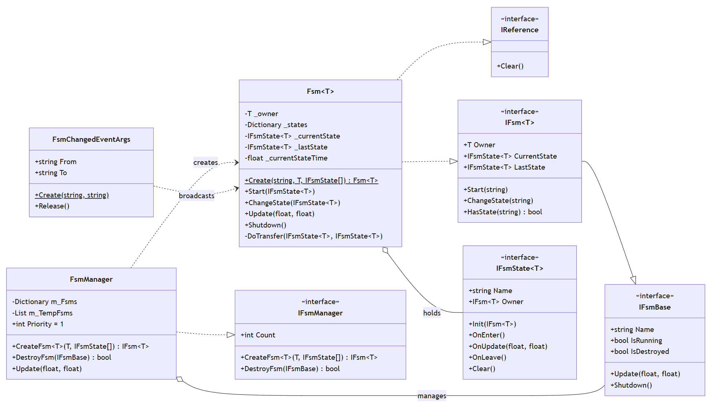
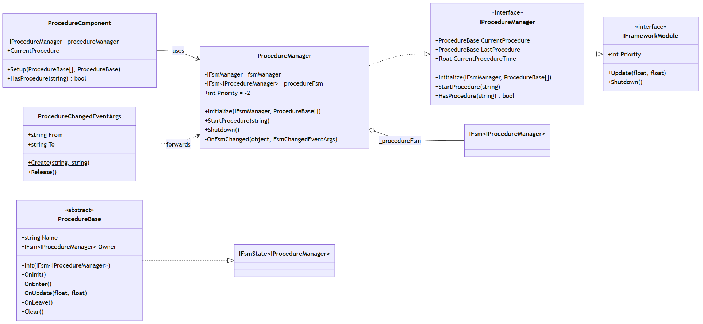
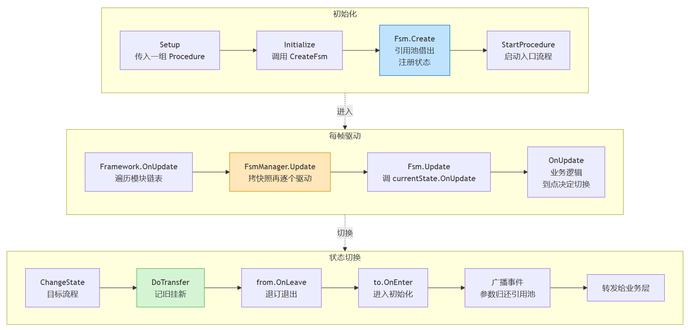

> 状态机，几乎是每个和3D应用开发框架都必有的。因为在咱们应用从理念上，是功能聚合的，是场景分页的。这个模式天然形成了状态的概念，我们依据状态去填充归拢相关项，并将每一个集合抽象成状态管理起来。它们有了生命周期，有了切换以及其中的细节管理。

本文讲框架里的状态机 `Fsm<T>` 和建立在它之上的流程管理系统 `Procedure`。

前者解决的问题是：状态怎么定义、怎么集中驱动和切换；后者解决的是：拿状态机去编排一个应用从启动到各个业务的全局流程。

---

# 简述

`Fsm<T>` 是一个泛型类，`T` 是"持有者"类型。咱们不需要一台抽象的状态机，必然是带着某一种业务需求，这里称之为 `T`，让它去注入到一台状态机，成为灵魂。比如`Fsm<IProcedureManager>`、`Fsm<SceneStateManager>`、`Fsm<CameraManager>`。每指定一个 `T`，就相当于你利用了 `Fsm` 这个状态机模具，浇铸出一台具体的状态机。

所以 `Fsm` 提供注册状态、集中驱动、切换这三件事的能力，但具体管什么状态、什么时候跳转、跳转后执行什么动作，全看 `T` 是谁。

`Procedure` 就是这个模具浇出来的一个具体产品，作为一个可被宽泛理解的 Scene/Map 内的子业务流程的管理工具。`ProcedureManager` 这个管理器，内部维护一台 `Fsm<IProcedureManager>`状态机，它做的事都是**"流程"**这个特定业务语义需要的：`Initialize`（建 Fsm + 订阅事件）、`StartProcedure`（启动入口流程）、`OnFsmChanged`（转发成 `ProcedureChangedEventArgs`）。

代码示意：

```csharp
public void Initialize(IFsmManager fsmManager, params ProcedureBase[] procedures)
{
    _fsmManager = fsmManager;
    // 用模具浇铸一台具体的流程状态机
    _procedureFsm = _fsmManager.CreateFsm(this, procedures);
    _procedureFsm.OnFsmChanged += OnFsmChanged;   // 把 Fsm 的切换转成流程切换事件
}
```

需要补充下这里的`ProcedureBase` 的代码，它是一个状态的描述，本质上是一个可挂载的业务组件，其本身也是一个可被实现的抽象类：

```csharp
public abstract class ProcedureBase : MonoBehaviour, IFsmState<IProcedureManager>
{
    public void Init(ProcedureOwner procedureOwner)
    {
        Owner = procedureOwner;
        OnInit();        // 初始化钩子
    }
    public virtual void OnInit() { }
    public virtual void OnEnter() { }
    public virtual void OnUpdate(float elapseSeconds, float realElapseSeconds) { }
    public virtual void OnLeave() { }
    public virtual void Clear() { }
}
```

> 当然，如果你想在其他业务语义中构建一台状态机，比如相机动画状态机，你也可以去创建`CameraAnimStateBase`（定义一些进入，更新和离开之类的接口），然后用一个`CameraStateManager`去维护一台 `Fsm<CameraAnimStateBase>`状态机。当相机要驱动动画的时候，直接让Fsm去跳转状态，由每个继承了 `CameraAnimStateBase` 的具体的类，去执行上一个相机状态退出，下一个状态进入所需要做的具体操作。

# UML 类图

## Fsm 



- `IFsmBase` 是非泛型基接口（给 `FsmManager` 统一管理用）`IFsm<T>` 泛型继承它并加业务语义。
- `Fsm<T>` 同时实现 `IFsm<T>` 和 `IReference`（可池化），内部聚合了一组 `IFsmState<T>`。
- `FsmManager` 管理 `IFsmBase` 字典，负责创建和集中驱动。

## Procedure 



- `ProcedureBase` 实现 `IFsmState<IProcedureManager>`，流程本质是状态。
- `ProcedureManager` 聚合 `IFsm<IProcedureManager>`，管理器内部持有一台状态机。
- `IProcedureManager` 继承 `IFrameworkModule`，这里理解为它被当做框架的一个会被装载或卸载的模块来使用的。

# 使用流程



- 初始化阶段从 `Setup` 到 `StartProcedure` 完成注册和启动
- 之后每帧由 `Framework.OnUpdate` 驱动 `FsmManager`，再驱动到具体 `Fsm` 和当前状态。
- 状态切换时走 `DoTransfer` 执行进出周期函数的回调，并广播事件。

# Fsm

## 状态

状态通过接口 `IFsmState<T>` 定义，声明清楚生命周期函数：

```csharp
public interface IFsmState<T> where T : class
{
    public string Name { get; }                        // 状态的名字
    public void Init(IFsm<T> fsm);                     // 注册进 Fsm 时初始化一次
    public IFsm<T> Owner { get; set; }                 // 反向持有状态机引用
    public void OnEnter();                             // 进入状态
    public void OnUpdate(float elapse, float realElapse); // 每帧轮询
    public void OnLeave();                             // 离开状态
    public void Clear();                               // Fsm 销毁时清理
}
```

- `Init` 只在创建时跑一次。
- `OnEnter/OnUpdate/OnLeave` 是运行时反复进出场的循环。

## 集中驱动

状态机引擎采用**集中式驱动**。`FsmManager` 每帧把注册的所有 Fsm 逐个调 `fsm.Update`；`Fsm.Update` 内部再调当前状态的 `OnUpdate`。外部业务不需要关心其中的细节。

```csharp
public void Update(float elapseSeconds, float realElapseSeconds)
{
    m_TempFsms.Clear();
    foreach (var fsm in m_Fsms) m_TempFsms.Add(fsm.Value);  // 先拷贝，规避遍历中修改

    foreach (IFsmBase fsm in m_TempFsms)
    {
        if (fsm.IsDestroyed) continue;
        fsm.Update(elapseSeconds, realElapseSeconds);       // 统一驱动
    }
}
```

## 切换与池化

切换是 Fsm 的核心动作，示意函数`DoTransfer` 执行它，其主要职责是记录上次状态、挂上新状态，然后旧的 `OnLeave`、新的 `OnEnter`，最后广播一个 `FsmChanged` 事件。

```csharp
private void DoTransfer(IFsmState<T> from, IFsmState<T> to)
{
    _lastState = from;
    _currentState = to;

    if (from != null) from.OnLeave();   // 旧状态离场
    to.OnEnter();                       // 新状态进场

    if (_onFsmChanged != null && from != null)
    {
        var args = FsmChangedEventArgs.Create(from.Name, to.Name);
        _onFsmChanged(this, args);      // 广播切换
        args.Release();                 // 事件参数归还引用池
    }
}
```

`Fsm<T>` 在创建的时候，是可以用引用池的，它实现了 `IReference`：

```csharp
// 以下为示意代码
public static Fsm<T> Create(string name, T owner, params IFsmState<T>[] states)
{
    Fsm<T> fsm = ReferencePool.Acquire<Fsm<T>>();  // 借
    // ... 注册状态、绑定 Owner
    return fsm;
}

public void Shutdown()
{
    ReferencePool.Release(this);  // 还
}
```

# Procedure

Procedure这块就不展示代码了，代码太多，读起来也挺累。基于上面的 UML 简单说下其中关系：

`ProcedureManager` 是框架内部的一个模块，它被设计成纯 C# 类并不是一个 `MonoBehaviour`，业务代码不直接拿它来用，而是需要一个能在场景中，帮着去收集`ProcedureBase[]`，交给框架级`ProcedureManager`的一个类。

于是就有了叫 `ProcedureComponent` 的组件，它是挂载在场景上的 `MonoBehaviour`，充当业务层和 `ProcedureManager` 之间的桥梁。

`ProcedureComponent` 暴露一个 `Setup` 方法，业务方调这个方法就能完成流程的注册和启动。

`Setup` 第一步调 `Initialize`，把一组 `ProcedureBase` 传给 `ProcedureManager`，后者内部用 `FsmManager.CreateFsm` 造出一台流程状态机；第二步调 `StartProcedure`，指定入口流程并启动。

> 在这里可以总结说，`ProcedureManager` 是厨师负责做菜；`ProcedureComponent` 是服务员。

`ProcedureManager` 还会去订阅底层 Fsm 的 `OnFsmChanged` 事件，每次状态机切换时，把事件广播出去。这样业务层感知到的是"流程变了"，而不会是底层的"Fsm 切了"，更贴合业务层的理解。

# 结语

有限状态机的设计我最早是在 UnityGameFramework 看到的，后来在座舱HMI项目交付过程中，同事们使用上了它，作为一个重要的模块。当时，3D车模桌面这个应用中，就会去分载入状态、车控状态、充电状态、场景模式状态 * N。每一个状态都涉及要管理场景中的物体的显示隐藏和动画。

下一篇计划分享在框架中的 Module 的概念，也就是 `FsmManager`、`ProcedureManager` 这些模块是怎么抽象，组织，驱动的。