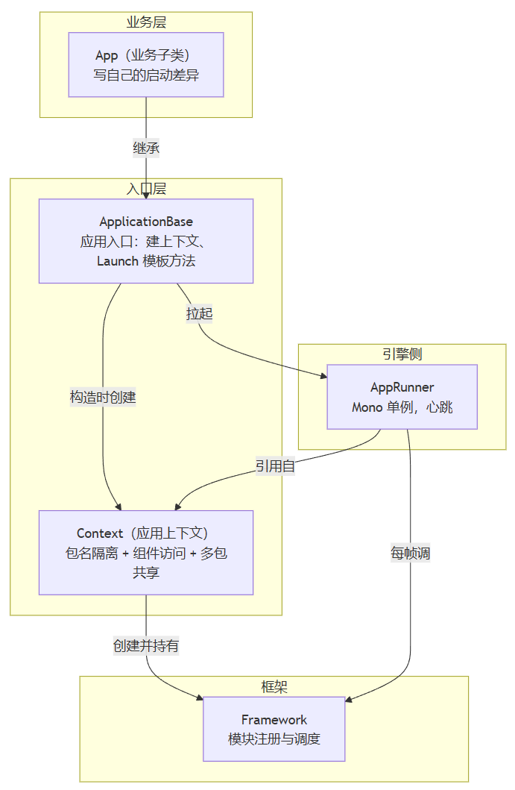
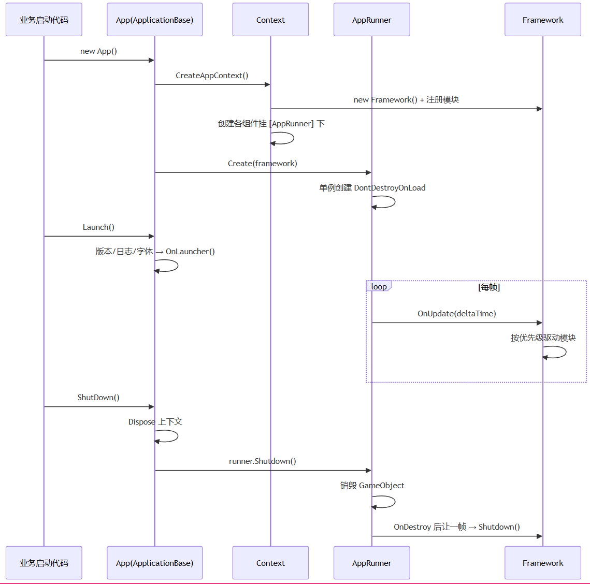

> 承接上一篇结语所说的入口，这篇就把这个入口分享一下。这套软件开发框架的底层大多都是纯C#类，在引擎中使用，就需要有一个脚本能承担链接引擎的生命周期，并带动整个框架开始初始化的角色，这说的就是这个入口的设计。

# 入口要考虑什么

将应用框架接入 3D 引擎运行时，入口层需要解决一些具体问题：

**1. 生命周期适配**

框架模块为纯 C# 类，不继承 `MonoBehaviour`/`AActor`。引擎的帧循环回调（Update等）框架模块无法直接接收。入口层必须提供一个生命周期桥接器，将引擎的帧回调、加载回调、销毁回调转换为框架模块可订阅的事件或接口调用，使纯 C# 模块能够参与引擎主循环。

**2. 全局存活**

应用有场景切换的可能，若关键的模块挂载在物体上，场景卸载时该模块不能随之销毁，如果销毁，框架可能进入停滞/异常状态。所以入口层必须将这类组件置于跨场景存活的根节点上，不受场景加载与卸载的影响。

**3. 依赖获取的便利**

业务代码在各处都需要访问事件总线、网络模块、UI 管理器等公共服务。如果依赖通过参数逐层传递或全局服务获取，代码耦合度高且难以测试。入口层应提供统一的依赖注入机制，使业务代码在需要时能直接获取模块引用，无需手动传递或全局查找。

**4. 启动流程标准化**

应用启动阶段包含版本初始化、日志配置、工具注册、多语言加载、语言设置等公共步骤。这些步骤具有普遍性，但每个应用的具体配置不同。入口层需要将公共启动流程标准化，允许各应用在统一流程框架内注入差异化设置。

# 设计角色



- **Context（应用上下文）**：一个应用在框架里的身份证。持有包名、持有框架实例、提供所有组件的访问接口。它还负责创建子上下文，实现多应用隔离。
- **ApplicationBase（应用入口基类）**：把一个应用怎么启动固化成模板方法，业务子类只重写差异点。
- **AppRunner（引擎心跳）**：一个 `MonoBehaviour` 单例，框架的心跳源，把每帧时间交给框架。

业务侧用法：

```csharp
var app = new App();   // 构造完成时，上下文、框架、心跳已全部就位
app.Launch();          // 公共启动流程 + 业务差异
```

# Context

`Context` 是应用的身份，也是组件的总成，它解决的是：**多应用怎么隔离又共享**。参考了 Android 的 Context：包名、应用上下文、创建子包上下文，再加十几个组件访问器。

业务代码拿到一个 `Context`，就能访问所有公共服务，通过上下文对象统一入口，既方便又可测试。共享与隔离的分界能通过构造函数代码看出：

```csharp
public abstract class Context : IDisposable
{
    public abstract Framework Framework { get; }      // 框架实例
    public abstract string GetPackageName();           // 包名
    public abstract Context GetApplicationContext();   // 应用上下文
    public abstract Context CreatePackageContext(string packageName);  // 子包上下文

    public abstract UIComponent UI { get; }            // 下面全是组件访问器
    public abstract EventComponent Event { get; }
    public abstract NetworkComponent Net { get; }
    // ... 其余组件同理
}
```

具体的实现类 `ContextImpl`，用包名做业务隔离，管理框架实例和组件。业务代码只依赖 `Context` 抽象类。

```csharp
private ContextImpl(ContextImpl container, string packageName)
{
    _packageName = packageName;

    if (container != null)
    {
        // 子包上下文：共享父级的一切，只换包名
        _framework = container.Framework;
        _event = container.Event;
        // ... 其余组件全部引用父级的
        return;
    }

    // 应用上下文：真正创建框架和所有组件
    _framework = new Framework();
    _event = GetOrCreateManager<EventComponent>();
    _fsm = GetOrCreateManager<FsmComponent>();
    // ... 其余组件同理
}
```

组件本身是 `MonoBehaviour`，创建时统一挂到 `[AppRunner]` 节点下并设置 `DontDestroyOnLoad`。

# ApplicationBase

入口基类在构造的时候，就需要包括 `Context` 和 `AppRunner`，它要把一个应用怎么启动固化，比如构造时把组件拉起来、提供 Launch 模板方法留出差异。

```csharp
public class ApplicationBase
{
    private AppRunner _runner = null;
    private int _mainThreadId;         // 主线程 ID，跨线程调度要用

    public ApplicationBase()
    {
        _mainThreadId = Thread.CurrentThread.ManagedThreadId;

        ContextImpl appContext = ContextImpl.CreateAppContext();  // 建上下文（内含建框架）
        this.AttachContext(appContext);

        _runner = AppRunner.Create(appContext.Framework);  // 构造完成即拉起心跳
    }

    public void Launch()
    {
        InitVersionHelper();                    // 版本号助手
        LoadDefaultTextSettings();              // 文本字体设置
        OnLauncher();                       // 留差异，业务子类重写
    }

    protected virtual void OnLauncher() { }    // 业务差异
}
```

业务子类 `App` 重写 `OnLauncher`，补上自己的初始化：日志级别、工具、语言设置，然后注册事件。

# AppRunner

前两个角色都是纯 C# 类，引擎的每帧回调，无法直接触达它们。`AppRunner` 就是为了补上这一环：

```csharp
// 以下为示意代码
[MonoSingletonPath("[AppRunner]")]                // 指定节点路径
public class AppRunner : MonoSingleton<AppRunner>
{
    private Framework Framework { get; set; }

    private void Update()
    {
        Framework.OnUpdate(Time.deltaTime, Time.unscaledDeltaTime);
    }

    protected override void OnDestroy()
    {
        base.OnDestroy();
        Release();
    }

    private async void Release()
    {
        await Task.Yield();                       // 让一帧再清理
        Framework.Shutdown();
    }

    public static AppRunner Create(Framework framework)
    {
        AppRunner.Instance.Framework = framework;      // 首次访问触发单例创建
        return AppRunner.Instance;
    }
}
```

首次访问 `Instance` 时按 `[MonoSingletonPath]` 指定的路径找节点，找不到就创建并 `DontDestroyOnLoad`。

`OnDestroy` 的 `Release` 里`await Task.Yield()` 之后才调框架 `Shutdown()`，让出一帧，等引擎把这轮销毁跑完，再做框架级的清理。

# 运作时序



整个生命周期里，业务代码只出现在三个位置：`new App()`、`Launch()`、以及 `OnLauncher` 里的差异逻辑。其余全是框架在接驳。

# 结语

入口设计的本质，是在引擎和框架两种生命周期之间修一条可靠的路。

回头看这个设计，复杂的部分在"谁拥有谁"的关系，`ApplicationBase` 拥有 `Context` 和 `Runner`，`Context` 拥有 `Framework`（真正创建框架和组件），`Runner` 只引用 `Framework` 不拥有它。

这样就做到了子包共享 `Framework` 和组件，不共享启动流程。场景切换过程中，`AppRunner`不会消失，始终在带动 `Framework`。