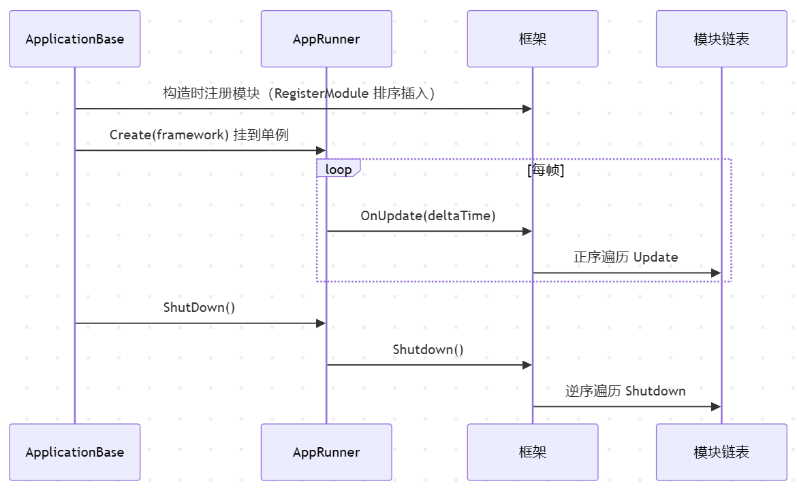

> 模块是一套框架中核心业务能力的集合，在软件开发框架中的模块，在设计上会体现框架所服务业务的特点，并最终体现在接口定义上。

一个应用里有很多要每帧跑的功能：事件分发、网络通信、状态机驱动、资源加载、UI、流程……而且关键的是这里得有先后顺序，事件总线得优先派发完，状态机继而切换，流程才能拿到就绪的数据。

每个模块不能各自为政，自己管自己的 `Update`。时序如果乱了就会出问题，需要一个统一的东西来管理这些功能，定义它们的接口、决定它们的顺序、统一它们的生命周期。这个东西就是框架的模块体系。





# IFrameworkModule：模块的接口

 `IFrameworkModule` 接口定义了优先级、轮询和关闭三个属性/方法：

```csharp
public interface IFrameworkModule
{
    int Priority { get; }                              // 优先级，大的排前面
    void Update(float elapse, float realElapse);       // 每帧轮询
    void Shutdown();                                    // 关闭清理
}
```

- `Priority` 决定了注册时在模块链表里的位置，以及关闭时以什么顺序被清理。
- `Update` 是每帧要做的事，`Shutdown` 是应用退出时要做的清理。

框架里已有的模块和它们的优先级可供参考：


| 模块                  | Priority | 职责    |
| ------------------- | -------- | ----- |
| `EventManager`      | 7        | 事件分发  |
| `ObjectPoolManager` | 6        | 对象池   |
| `FsmManager`        | 1        | 状态机驱动 |
| `NetworkManager`    | 0        | 网络通信  |
| `ResourceManager`   | 0        | 资源加载  |
| `UIManager`         | 0        | UI 管理 |
| `ProcedureManager`  | -2       | 流程编排  |


优先级高的模块先注册、先轮询、后关闭。比如 `EventManager`（7）最先跑，保证事件队列在别的模块用到之前已经被消费；`ProcedureManager`（-2）排在后面，等别的模块都准备好了再驱动流程。

# RegisterModule

模块注册的核心逻辑在框架入口的 `RegisterModule` 方法里。它做的事是：遍历已有的模块链表，找到第一个优先级比新模块低的节点，插在它前面。如果遍历完都没找到，就插到链表末尾。

```csharp
public void RegisterModule(IFrameworkModule module)
{
    LinkedListNode<IFrameworkModule> current = _frameworkModules.First;
    while (current != null)
    {
        if (module.Priority > current.Value.Priority)
            break;                          // 找到位置，停
        current = current.Next;
    }

    if (current != null)
        _frameworkModules.AddBefore(current, module);  // 插在它前面
    else
        _frameworkModules.AddLast(module);             // 优先级最低，放末尾
}
```

# GetModule

GetModule 方法采用懒加载策略，先在链表里找类型匹配的模块，找到了直接返回，没找到就用反射创建一个实例，注册进链表，再返回。

```csharp
// 以下为示意代码
public TModule GetModule<TModule>() where TModule : IFrameworkModule
{
    var type = typeof(TModule);

    // 先找已注册的
    foreach (var module in _frameworkModules)
    {
        if (module.GetType() == type)
            return (TModule)module;
    }

    // 没找到，反射创建并注册
    TModule moduleImpl = (TModule)Activator.CreateInstance(type);
    RegisterModule(moduleImpl);
    return moduleImpl;
}
```

# OnUpdate：正序遍历

每帧就是遍历链表，从头到尾逐个调 `Update`，从头到尾就是从高优先级到低优先级：

```csharp
// 以下为示意代码
public void OnUpdate(float elapseSeconds, float realElapseSeconds)
{
    for (var current = _frameworkModules.First; current != null; current = current.Next)
    {
        current.Value.Update(elapseSeconds, realElapseSeconds);
    }
}
```

# Shutdown：逆序清理

关闭时反过来，从链表尾部往前遍历：

# AppRunner

开发框架中的模块，在设计上不与引擎耦合，独立地抽象业务形态，因此都是纯 C# 类，不继承 `MonoBehaviour`或是 `UActorComponent` 。它们没有 `Update`的机制，因此需要有人每帧去调用它们，过往项目中它被命名为 `AppRunner`。是一个 `Singleton`，挂在场景/关卡里一个的 `GameObject`/`AActor` 上。它的 `Update` 就是整个框架的心脏，把引擎的 `Update`/`Loop` 传给框架，由框架统一驱动所有模块：

```csharp
// 示意代码(Unity)
private void Update()
{
    Framework.OnUpdate(Time.deltaTime,
    Time.unscaledDeltaTime);
}
```

# 完整链路


# 结语

使用**优先级排序**结合链表去控制模块运行时序的机制，可以让每个模块只关心自己的接口实现、注册调用，不需要碰任何已有代码。这种**声明意图，交由机制编排**的思路，在需要确定顺序的场合都适用。

