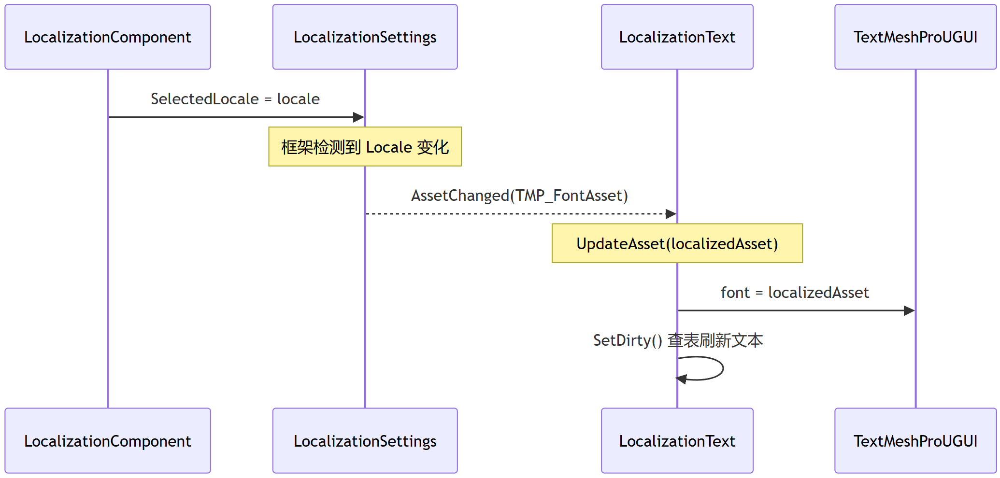
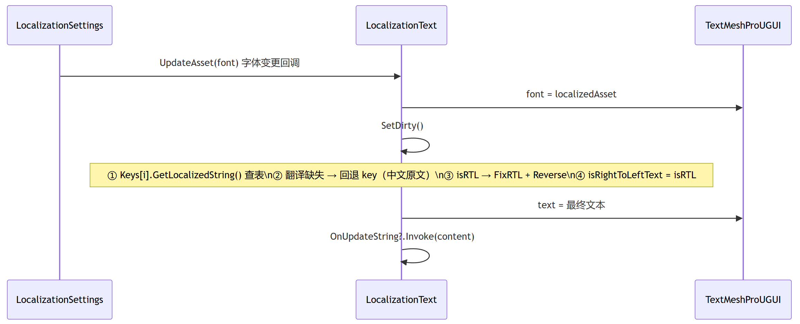
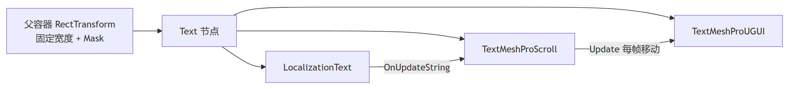
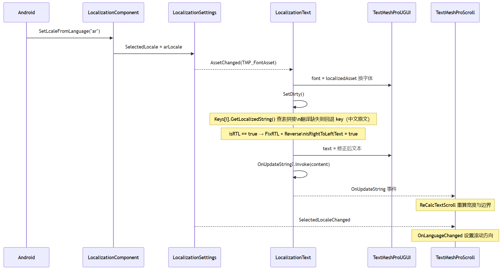

> Once the string tables are ready and we have the language information in hand and are about to switch the UI, the natural question to consider is: what exactly do we need to switch?

This article shares how the text in the string table becomes the correct characters on screen. After a Locale switch signal arrives, the UI has to face the following three tasks:

- **Swap fonts**: different languages need different font assets. Arabic and Thai, for example, use different font files, and both differ from Chinese.
- **Translate text**: look up the string table to get the current Locale's translation, and perform string concatenation, RTL layout, and so on as required.
- **Layout adaptation**: translated text changes in length; handle overflow when it exceeds the container: wrapping, truncation, or marquee scrolling.

---

## 1. The Mapping Tables

To have both text-swapping and font-swapping capabilities when developing with Unity, I chose to create two tables in Localization: one for text translation (`StringTableCollection`), one for fonts (`AssetTableCollection`).


| Table                   | Type                    | Contents                                                 |
| ----------------------- | ----------------------- | -------------------------------------------------------- |
| Text translation table  | `StringTableCollection` | One `StringTable` per Locale, storing translated text    |
| Font table              | `AssetTableCollection`  | One `AssetTable` per Locale, storing the font asset `TMP_FontAsset` |
| Other asset tables      | `AssetTableCollection`  | See the analysis below                                   |


> I once wondered whether it was necessary to create more **language-to-asset mapping tables** — ones used, after switching to a different language, to swap out the UI prefabs under the UI manager that need adjusting. For example:
>
> - The home page card layout may need to load prefabs of a different design depending on the language.
> - For right-to-left languages, buttons laid out from left to right need to be re-laid out from right to left.
> - In some language markets, the concept of "pet" is expressed with a cat rather than a dog, which means swapping images and models.

For cases like the above — where a different language means different assets and a different overall layout — it is indeed necessary to configure more language-to-asset mapping tables according to the business. But in past projects, I haven't done that.

The main reason: under a platform-based development framework, **vehicle model + application** is a meta-project, so the required design effects can be configured directly within one meta-project. For example, this vehicle model is the domestic China version and needs no translation; that model is right-hand drive, so you only configure right-aligned card prefabs; or a model is sold in Europe and the design only requires showing a cat, with no differentiation across the ten-odd European countries — then I simply deploy it in that vehicle model's project.

So my thinking is: if there is a vehicle model whose HMI presentation differences go all the way down to every country it serves, and those differences are systematic (for example, the relationship between language and font), to the point where relying only on switch or if statements would only make maintenance harder — that is when this **third kind of language-to-asset mapping table** becomes necessary to set up.

## 2. Swapping Fonts

Different languages need different font assets, because the target characters contained in a font asset must match the language. Use the wrong font, and what shows up on screen is tofu boxes or blanks.

### 2.1 The Trigger Chain for Font Switching



It is driven automatically by Unity Localization's `LocalizedAssetBehaviour` event mechanism. `LocalizationText` inherits from `LocalizedAssetEvent<TMP_FontAsset, LocalizedTmpFont, UnityEvent<TMP_FontAsset>>`. In `Awake`, `LocalizationText` binds the font the attached UI should match via `AssetReference.SetReference("TMPFontAssetTable", "Font")`. When `SelectedLocale` changes, the framework loads the current Locale's `"Font"` entry from the font table, raises the `AssetChanged` event, and invokes the `UpdateAsset` callback.

```csharp
// The following is illustrative code.
protected override void UpdateAsset(TMP_FontAsset localizedAsset)
{
    if (localizedAsset)
        Debug.Log($"Font changed {name} font={localizedAsset.name}");
    else
        Debug.LogWarning($"Missing font Local:{transform.name} Root:{transform.root.name}");

    _tmpComponent.font = localizedAsset;  // swap the font
    SetDirty();                           // refresh the text (after a font swap, the mesh must be regenerated)
}
```

---

## 2. Translating Text: LocalizationText

This project has only one localization text component: `LocalizationText`, attached on `TextMeshProUGUI` (a `[RequireComponent]` relationship). It handles three jobs at once: **font switching, text table lookup, and RTL layout**.

### 2.1 The Trigger Chain for Text Refreshing



A Locale change triggers `UpdateAsset`, which calls `SetDirty()` after swapping the font. `SetDirty()` is the heart of text refresh — table lookup, fallback, RTL detection, and setting the text all happen here:

```csharp
// The following is illustrative code
private void SetDirty()
{
    string content = "";
    for (int i = 0; i < Keys.Count; i++)
    {
        string translated = Keys[i].GetLocalizedString();
        if (translated.StartsWith("No translation found for"))
            translated = Keys[i].TableEntryReference.Key;  // fall back to the key (the Chinese source text)
        content += $"{_lstPrefixString[i]}{translated}";
    }

    Locale locale = LocalizationSettings.SelectedLocale;
    bool isRTL = locale != null
        && (locale.Formatter.ToString() == "ar" || locale.Formatter.ToString() == "he-IL");
    _tmpComponent.isRightToLeftText = isRTL;
    _tmpComponent.text = isRTL ? GetFixedText(content) : content;

    OnUpdateString?.Invoke(content);
}
```

**Fallback strategy**: when a translation is missing, fall back to `TableEntryReference.Key`. Since the StringTable's key is the Chinese text itself ("Chinese text as key"), the fallback result is the original Chinese — users see Chinese instead of an error.

**Zero configuration at startup**: if the `Keys` list is empty, `Awake()` automatically uses the text TMP currently displays (usually Chinese) as the key. In most single-key scenarios, developers don't need any manual configuration — the component sets up its own key and just works.

**Multi-key concatenation**: if a Text needs to display a combination of several independent translation entries (say, "Front: On" — here "Front" and "On" would each be independent entries), you can put multiple keys in the `Keys` list and the separator before each key in `_lstPrefixString`; `SetDirty()` then looks up each entry one by one while iterating and concatenates as `prefix + translated`.

```csharp
locText.SetKeyStart();
locText.SetKeyAppend("前部");
locText.SetKeyAppend("开启", "：");  // a colon before the second key
locText.SetKeyEnd();                  // triggers SetDirty()
```

### 2.2 RTL Layout

Arabic and Hebrew are written right-to-left (RTL). You can't simply reverse the string — you need to handle three things: glyph joining, ligatures, and bidirectional text. This project uses the open-source plugin RTLTMPro, whose core is `RTLSupport.FixRTL()`, completing glyph correction and direction reordering before the text is handed to TMP.

I plan to write a separate article with a detailed analysis of this ordered processing flow.

---

## 3. Text Overflow and Layout Adaptation

The change in text length after translation is one of localization's biggest headaches. What Chinese expresses in two characters may take four words in German, or six in Arabic.

### 3.1 Word Wrapping

Wrapping is a common way to handle overflow. Unity's TMP provides two independent dimensions: `enableWordWrapping` (whether to wrap) and `overflowMode` (overflow, truncation).

### 3.2 Truncation

When the UI doesn't allow wrapping, just set `overflowMode = Truncate` (truncate directly) — this is TMP's standard option.

### 3.3 Dynamic Font Size

For less critical text — such as the tip blurb on some buttons — design may allow this approach, and the way to do it is TMP's Auto Size feature.

### 3.3 Dynamic Width

When multiple UI elements share one row, you may face a left-to-right horizontal arrangement where the design constrains only the spacing between Items, not each Item's own width. After translation, "not closed" becomes "Not Closed", so the Item has to widen to fit; "closed" becomes "Closed", so the Item can be narrower.

Unity's answer is the `ContentSizeFitter` + `HorizontalLayoutGroup` combination:

- `ContentSizeFitter`: set `HorizontalFit` to `PreferredSize`, so the RectTransform is as wide as the text is long
- `HorizontalLayoutGroup`: set only `spacing`, and don't check the width part of `Control Child Size`; that way each child Item's width is determined by its own `ContentSizeFitter`, and the Layout Group is only responsible for horizontal arrangement by spacing.

In this mode, when text length changes after a Locale switch, `ContentSizeFitter` automatically expands/shrinks the width, and the Layout Group re-arranges automatically.

### 3.4 Marquee Scrolling

When text can neither wrap nor be truncated (the user must see the full content), marquee scrolling is the last resort. This project implements it with a `TextMeshProScroll` component, attached to the Text node that has `LocalizationText` + `TextMeshProUGUI`, working with the parent node's Mask to clip the visible area.



**Core design**: each frame, shift its own `anchoredPosition` leftward at a fixed speed; upon reaching the boundary, jump back to the start, forming a looping scroll.

**Scroll check**: in the `Start()` function, compare `TextMeshProUGUI.preferredWidth` with the parent container's `rect.width`; enable scrolling only if the text is wider.

**Per-frame scrolling**: in the `Update()` function, move `anchoredPosition` by `speed` (say, 40 px/s). LTR moves left, RTL moves right — the reading start of RTL text is on the right, so the scroll direction is reversed as well.

```csharp
// The following is illustrative code
void Update()
{
    if (!_isScroll) return;

    if (_isRightOrder == false)  // LTR: scroll left
    {
        m_Rect.anchoredPosition += Vector2.left * speed * Time.deltaTime;
        if (m_Rect.anchoredPosition.x < _fDestiX)       // reached the left boundary
            m_Rect.anchoredPosition = new Vector2(       // jump back to the right side
                m_StartX + _fMaxX, m_Rect.anchoredPosition.y);
    }
    else  // RTL: scroll right
    {
        m_Rect.anchoredPosition -= Vector2.left * speed * Time.deltaTime;
        if (m_Rect.anchoredPosition.x > _fMaxX)          // reached the right boundary
            m_Rect.anchoredPosition = new Vector2(       // jump back to the left side
                m_StartX - _fMaxX, m_Rect.anchoredPosition.y);
    }
}
```

---

## 4. Refresh Chain Summary



---

## 5. How Unreal Does It

Since I've only delivered localization on Unity, the Unreal part isn't covered here. The following Unreal approaches are only at the experimentation stage for me:

**Font swapping**: Unreal stuffs the fonts of all languages into one **Composite Font** and routes character by character according to Unicode ranges and Culture filters. The engine handles cross-font switching itself; the cost is rather fiddly configuration.

**Text translation**: the .locres is Unreal's translation resource file — one folder per Culture, containing the .locres file. An `FText` internally holds Namespace + Key + Source String triple data. When the Culture is switched, the engine loads the corresponding Culture's .locres file, and the `FTextHistory` stored inside the `FText` takes the Namespace + Key to look up the translation in the newly loaded .locres.

**Layout adaptation**: Unreal's UMG is rather bare-bones. Setting plugins aside, it is nowhere near as comprehensive as UGUI's TMP in Unity; the effects described earlier either rely on nested panels or require hand-rolling the logic yourself.

---

## Closing Words

Localization is quite a tedious business. Sometimes Weblate has updated a translation, development lags one Daily build behind, and QA files a bug; sometimes the UI is complex enough that it's hard to think through every adaptation scenario, resulting in abnormally overlapping text, text outside the display area, or shrunken fonts. These fiddly issues all take time to communicate and handle. **So in the solution design, help wherever you can, and save a step wherever possible.**


&nbsp;
