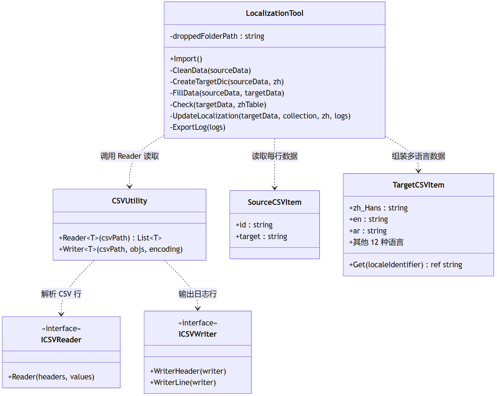

> 上一篇文章讲了获取Locale的方式，在真正进入本地化具体的操作之前，我们还缺一样东西——文言表。在之前的项目中，产品主导文言翻译工作的协作：各应用的研发将待翻译条目整合到表格文件，产品整合所有待翻译模块和项目层面的变更信息。通过Weblate平台进行文言的存储、释放、翻译、变更工作。研发从Weblate上下载对应车型项目、对应应用的文言翻译表。

拿到这样的一份或多份CSV文件，我们需要把它导入到我们的编辑器中，作为一个运行时可访问的资产存在。

---

## 一、CSV 导表工具

### 1.1 文件的样子

翻译平台交付的单个App的成果，在导出之后是一个文件夹：

- 文件夹内按语言命名，如 `zh_Hans.csv`、`en.csv`、`nb_NO.csv`、`he_IL.csv` 等
- 每个文件两列：`id`（翻译条目的唯一标识）、`target`（该语言的翻译文本）
- 简体中文文件为必需（因为它是当前这套工具使用下，所有语言的对齐基准）

比如：

```
id,target
card_full_title,车况
hvac_temp_unit,温度单位
```

### 1.2 两个角色

- **CSVUtility**：纯数据层，不依赖引擎存在，负责 CSV 文件的通用读写。它定义了 `ICSVReader` / `ICSVWriter` 两个泛型接口，任何需要读写 CSV 的编辑器工具都可以复用它。
- **LocalizationTool**：编辑器的操作面板层，负责将 CSV 数据写入比如 Unity Localization 的 `StringTableCollection`。它依赖 `CSVUtility` 做文件解析，而它自身负责解析后的数据怎么转成引擎资产。

因此`CSVUtility` 是"怎么读"的抽象，`LocalizationTool` 是"怎么写"的具体逻辑。



`ICSVReader`：CSV 首行被解析为一个字典 `Dictionary<string, 列号>`（以 `#` 开头的列会被跳过），后续每行实例化一个泛型对象，通过调用 `Reader(headers, values)` 让对象自己从字符串数组中按列名取值。不同结构的 CSV 只需实现一个 `Reader` 方法即可被解析。

```csharp
// 以下为示意代码。
public class SourceCSVItem : ICSVReader
{
    public string id;
    public string target;

    public void Reader(Dictionary<string, int> headers, string[] values)
    {
        id = values[headers["id"]];
        target = values[headers["target"]];
    }
}
```

`ICSVWriter`：适用于在读取了CSV文件之后，为了输出数据变更日志时使用。

### 1.3 导入流程

`LocalizationTool` 是一个 `EditorWindow`，菜单路径可以自己定义。

操作方式：将包含 CSV 的文件夹拖入窗口，点击"导入"。

**导入方式**：在之前的Unity开发过程中，`Import` 函数不会扫描文件夹里有哪些 CSV，而是遍历 `StringTableCollection` 中已注册的 `StringTable`，按 `LocaleIdentifier.Code` 拼接 `{code}.csv` 路径来读取。如果某个语言的 CSV 文件缺失，`CSVUtility.Reader` 会抛异常。

流程分为六步：


| 步骤  | 方法                   | 做什么                                   |
| --- | -------------------- | ------------------------------------- |
| 1   | `CleanData`          | 清理 CSV 中 `target == "\"\""` 的空数据行     |
| 2   | `CreateTargetDic`    | 以简体中文表为键，创建 `{id → TargetCSVItem}` 字典 |
| 3   | `FillData`           | 将其他语言的 CSV 数据填充到对应 `TargetCSVItem` 字段 |
| 4   | `Check`              | 比对已有条目与新 CSV 简体中文集合的差异（仅 Warning）     |
| 5   | `UpdateLocalization` | 增量写入 StringTable                      |
| 6   | `ExportLog`          | 将变更日志导出为桌面上的 CSV 文件                   |


核心设计：**以简体中文为主表**。

文件处理阶段`CreateTargetDic` 用 zh_Hans.csv中所有的id值去建字典，`FillData` 是遇到其他语言有而简体中文这张表没有的 id，直接抛异常。这一步先保证输入的数据是对齐的。

但是，在写入引擎内Localization的StringTable 时要按**中文文本**对齐。这样的话，UI组件初始化时直接拿自己当前显示的中文文本当 key 去查表，不需要配任何东西。这相当于把"配 key"的工作量省了。

```csharp
// 以下为示意代码
private void Import()
{
    var collection = LocalizationEditorSettings.GetStringTableCollection("LanguageTable");
    var sourceData = new Dictionary<LocaleIdentifier, List<SourceCSVItem>>();

    // 遍历已注册的 StringTable，按 Locale 拼接 CSV 路径并读取
    foreach (var stringTable in collection.StringTables)
    {
        string code = stringTable.LocaleIdentifier.Code;
        code = AdaptFileName(code); // 下划线/连字符映射
        string csvPath = $"{droppedFolderPath}/{code}.csv";
        sourceData[stringTable.LocaleIdentifier] = CSVUtility.Reader<SourceCSVItem>(csvPath);
    }

    var targetData = CreateTargetDic(sourceData, zhLocale);  // 以简体中文为键
    FillData(sourceData, targetData);                         // 填充其他语言
    Check(targetData, (StringTable)collection.GetTable(zhLocale));
    UpdateLocalization(targetData, collection, zhLocale, logs);
    ExportLog(logs);

    // 标记并保存
    collection.StringTables.ForEach(t => EditorUtility.SetDirty(t));
    AssetDatabase.SaveAssets();
}
```

---

## 二、表数据录入

### 2.1 从 CSV 到 Unity

Unity Localization Package 在设计上分三层结构：


| 层级       | 类                                          | 职责                                                              | 本工程用法                                                                                 |
| -------- | ------------------------------------------ | --------------------------------------------------------------- | ------------------------------------------------------------------------------------- |
| **配置层**  | `LocalizationSettings`                     | 管理可用 Locale 列表、当前选中 Locale、Startup Behavior                     | 存储为 `Localization Settings.asset`，注册了 15 个 Locale                                     |
| **数据层**  | `StringTableCollection` → `StringTable`    | 每个 Locale 对应一张 `StringTable`，内部是 `{key → StringTableEntry}` 的字典 | 集合名 `"LanguageTable"`，15 张表分别如 `LanguageTable_zh-Hans.asset`、`LanguageTable_en.asset` |
| **运行时层** | `LocalizedString` / `LocalizedStringTable` | 持有对表和条目的引用，Locale 切换时自动获取最新翻译                                   | `LocalizationText` 用 `Keys[i].GetLocalizedString()` 取值                                |


`LocalizationTool` 写入时操作的 API 链路：

1. **获取集合**：`LocalizationEditorSettings.GetStringTableCollection("LanguageTable")` ——拿到包含 15 张 `StringTable` 的集合
2. **遍历表**：`collection.StringTables` 每张表对应一个 Locale
3. **查条目**：`stringTable.GetEntry(key)` 检查 key 是否已存在
4. **写条目**：`stringTable.AddEntry(key, value)` 新增或覆写一条数据
5. **持久化**：`EditorUtility.SetDirty` + `AssetDatabase.SaveAssets()` 标记资产并存储

```csharp
// 以下为示意代码
foreach (var item in targetData)
{
    foreach (var stringTable in collection.StringTables)
    {
        var key = item.Value.Get(zhLocale);  // 简体中文文本作为 StringTable 的 key
        var value = item.Value.Get(stringTable.LocaleIdentifier);
        var entry = stringTable.GetEntry(key);

        if (entry == null)
            stringTable.AddEntry(key, value);  // 新增
        else if (entry.Value != value)
            stringTable.AddEntry(key, value);  // 更新（覆写）
        // entry 存在且 value 相同 → 跳过
    }
}
```

运行时，`LocalizationText` 通过 `Keys[i].GetLocalizedString()` 从当前 Locale 的 `StringTable` 中取翻译。对于阿拉伯语和希伯来语，`LocalizationText` 还需要先做 RTL 字形重排，这部分另写文章介绍。

这里 StringTable 的 key 是简体中文文本本身，而非翻译平台上的 `id` 字段。用中文做key的好处上面有提到，就是因为UI组件初始化的值是中文，而非id，所以这样省事，但是如果你设计的多语言响应UI是有id这个概念的，那就不必要用中文。只是我遇到的id的风格是不统一的，有数字编号的，有纯英文，这是因为初期做文言翻译需求录入的时候没有约束导致的历史遗留问题。

### 2.2 从 CSV 到 Unreal

Unreal的Localization Dashboard 自带文言导入导出，可以将所有 `FText` 文本导出为`.csv`，翻译完成后重新导入，是引擎内置的完整工作流。但它的前提是先有存在于脚本或蓝图中的文本。因此就只能先 Gather、再 Export、翻译后 Import。

但对于已有翻译团队交付平台，需要**从外部 CSV 直接导入翻译**，就需要关注DataTable这个通用的结构化数据导入方式：Unreal 的 `UDataTable` 原生支持从 CSV/JSON 导入结构化数据，引擎自动解析为基于 `FTableRowBase` 的行记录，运行时通过 `FDataTableRowHandle` 查表。Unreal 将导入和运行时查表都内置了。

---

## 结语

数据从此开始，已经从表格文件汇入到了开发工具中，作为一个资产存在。然而，导表这个需求，不仅仅是文言翻译，对于车型部件配置、UI 配置、信号配置也可以通过表格控制。但如果只是把 xlsx 文件转成 json 文件放到引擎里面使用，其实我觉得以这行的开发复杂度来看显得有点绕，如果要做基于数据表格的管理，那做成桌面端文件到引擎端资产的转换更有意义。

