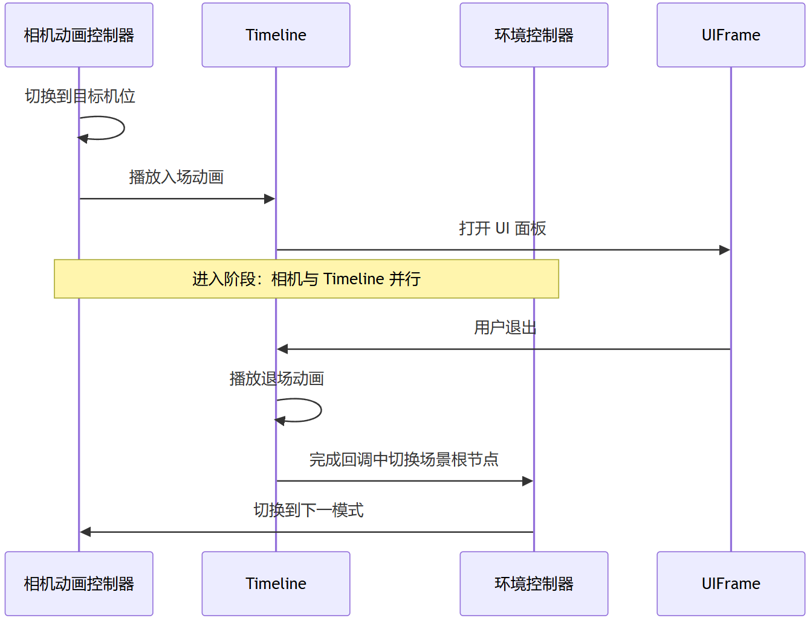

> When designing a smart cockpit HMI, **why build an app in 3D rather than 2D?** Beyond the two key points—**dynamic, lifelike visuals** and **real-time continuous interaction**—designers, **in order to fully exploit 3D's advantages**, will never pass up the one-take shot. It is a key interaction-design technique for the **"immersive experience"**.

Architecturally, the one-take shot is a global "**transition animation**" capability. In terms of presentation, it is a scheme of virtual camera moves and frame cross-dissolves. It is the visual scheduling mechanism, spanning app modules, that the whole HMI system builds in pursuit of ultimate immersion.

> From a development perspective, implementing the one-take shot means facing two situations at once: **in-app** and **cross-app**. I habitually use the Android APK as the boundary between the two. That is, if you use service-oriented rendering, and one 3D rendering service process produces multiple view surfaces serving different Android app processes, I consider that cross-app rather than in-app one-take—even if only one 3D scene is running there.

You may have already experienced this in some production vehicles: jumping from the car-model launcher to the AC page, the camera slowly moves from in front of the hood to the side-rear, the AC control panels fade in, and the launcher scene objects fade out. That's the typical in-app one-take effect.

So it is a continuous transition between different business modules (four doors and two lids, AC, seats, scene modes...) within the same engine scene (level) and the same APK.

---

## 1. Deciding Which Businesses to Merge

The advantage of the in-app one-take comes from: no Activity switches, no Surface lifecycle switches, and the virtual camera and scene environment cooperating within the same frame. Once you go cross-app, those advantages are gone, and you additionally have to deal with cross-process communication and Surface lifecycle synchronization—thorny problems. So my view is: **as long as it doesn't conflict with the overall layering/split-screen plan, whatever can be merged into one app should not go cross-app.**

But other factors will still influence how much 3D business you pack into one app. So the first question the one-take shot raises is: which features should be merged into the same app? Ignoring multi-view capability (for the reasons, see the quoted paragraph above), here is a decision framework:

- Functional exclusivity: if launching one retracts the other, they're mutually exclusive. If the two apps are NOT mutually exclusive, they can't be merged. For example, the virtual AI avatar is not mutually exclusive with any other 3D app.
- Display mode: are the definitions consistent—full-screen/half-screen, and split-screen support or not? If one is full-screen and the other half-screen, or one must support split-screen while the other doesn't, they can't be merged either. For example, the car-model launcher vs. half-screen seat/AC controls.
- Business type: are the businesses related? If unrelated—say you ship a game—it probably won't be merged with vehicle-control 3D business. But that case is rare, because there's always a way to create relations between different 3D businesses. If the businesses are related—for instance, the car-model launcher can control the four doors and two lids—then it's a control-type app, and you can consider merging it with control types like AC, seats, and lights.
- Architecture trade-offs: even if all three checks above allow a merge, it still has to go through system-architecture review. Many factors may come into play here; essentially it's a trade-off between the stability gained from separating apps and the experience gained from merging them. 

> 1. The car-model launcher, vehicle settings, AC, and seats are strongly related businesses. But architecture may ask: if merged, **will it lengthen boot/startup time**? If not merged, how severe is the **instant pressure of switching between apps**?
> 2. The car-model launcher and driving SR have business continuity and could also merge. Architecture may ask: the car-model launcher will never have a small-window mode, but driving SR may well raise a **small-window mode** requirement—can they still merge? Is it realistic for the launcher's UI dev team and the SR navigation team to co-develop one Android project?
> 3. The right half of the **vehicle-settings UI** animations also uses 3D engine rendering, and there are 3D one-take designs across vehicle control, energy management, lights, driving, and sound. Architecture might say: 3D occupies a small frame here, native Android 2D animation can express it too, and the experience difference is negligible. Given that the vehicle-settings app requires wake-up within 500 ms, not only will it not merge—even dropping the 3D engine rendering is possible.

## 2. Common App-Combination Patterns

Ignoring multi-view, the following module-merging schemes can serve as reference:


| App combination | Reason to merge |
| ------------------------- | ------------------------------ |
| **Car-model launcher + digital car wrap + scene modes** | Scenario-based structure, an entertainment-leaning launcher positioning. A merge that emphasizes large-scene expression needs. |
| **Car-model launcher + vehicle settings + seats + AC** | Vehicle-control business consolidation |
| **Car-model launcher + driving SR** | The integrated driving-idling-parking philosophy |
| **Driving SR + navigation** | 3D navigation business consolidation |


**Typical camera positions**:


| Page state | Visual intent |
| ---- | ------------------------ |
| Default launcher | View the hood from the front + orbitable |
| AC page | View the center console from the side-rear; requires a two-segment path |
| Ambient lights | Reuse the AC waypoint |
| Sound | Overhead view of the interior |
| Suspension adjustment | Zoom in to the front half of the body |
| Scene modes | Viewpoint design varies by mode; e.g. car-wash mode uses a straight side-oblique angle |


## 3. In-App Implementation

### 3.1 Camera Movement Module

The technical core of the in-app one-take is **camera changes**.

For the camera management module, refer to my earlier articles:

- Building Unity Camera Animation with an Adobe After Effects Mindset: The Camera Movement Module in 3D HMI Practice
- 3D HMI Fidelity: From Motion-Curve Formulas to Assets

Mentioning the plugin option again here, i.e. Unity's Cinemachine:

- Cinemachine's Brain has blending built in; the different Virtual Cameras you set up can transition automatically. Our earlier approach was to switch by enabling/disabling Virtual Cameras through Timeline. However, control-logic issues can sometimes make virtual cameras—or other logic—fight over the camera, producing jitter. At that point you can't rely entirely on automatic blending: either reconsider when to disable automatic blending, or drive the blend manually.
- If the CinemachineBrain is set to ManualUpdate, then during scene switches (scene loading/unloading), if the ManualUpdate call is skipped or mistimed, the camera will "skip frames" or "freeze". So during scene switching, make sure the Brain's ManualUpdate is still invoked normally. Watch out for coroutine wait-a-frame logic that misses the update.

### 3.2 Environment Control Module

The naturalness of the camera move doesn't come only from the camera's Lerp animation—**the environment/scene objects must switch in sync with the lens**. Otherwise the camera has arrived and the old scene is still there, breaking the illusion.

So our method is to manage this with a unified environment controller + Timeline:

- Enable/disable scene root nodes by target state name (e.g. car-model-launcher scene root / car-wash-mode scene root / rest-mode scene root)
- Control day/night light intensity, and toggle RenderFeatures.
- **You can set up a transition mask (a black or white highlight image)** and sync it with other objects' disappearance and appearance in the Timeline by changing its alpha.



**Example: car-wash mode**

```
Enter:
  Switch the camera to the car-wash position
  → Play the Timeline entry animation, including scene-object SetActive calls and the mask
  → Open the 2D UI panel

Exit (switch to another mode):
  Stop the Timeline → play the exit
  → Exit-complete callback:
       Enable the car-model launcher main scene root
       Disable the car-wash-mode scene root
       Turn off effects
       Fade out the mask
  → Switch the mode state
```

---

## 4. Caveats

The most troublesome part of one-take switching is: **interruption**. On the interaction-design side, to convey how fluid and responsive one-take scene switching is, they may require that any switching action can be interrupted, and that the next state switch executes immediately.

> My suggestions here:
>
> 1. Design a player class dedicated to Timelines, managing the priority between Timeline segments and the control of the playback lifecycle. In particular, implement the judgment of whether the currently playing task can be interrupted.
> 2. Design every transition to be as fast as possible; I suggest finishing within 2 seconds.
> 3. Whenever a transition is interrupted, it should first play the scene-exit animation segment, and the first frame of that segment hides the mode-specific objects.
> 4. For scenes that are genuinely hard to interrupt and keep showing glitches, try making them non-interruptible: only after the entry animation finishes does our state-machine manager push the next state, letting the scene exit.
> 5. Building on point 4: besides the ability to cache state commands, the state machine must also be able to skip multiple intermediate states and jump straight to the latest one. Avoid the situation where 10 states arrive at once and our transitions still play their animations one by one.

---

## Closing Thoughts

The in-app one-take is the **simplest** form of the one-take shot. Having said that, it has some drawbacks of its own, for example:

1. All pages/scenes pile into the same Scene; memory and loading pressure is high, and it takes more effort to manage.
2. The more businesses you merge, the more scene-switching logic and camera-position states are involved, and the higher the maintenance cost. (This is relative to some cross-app one-take schemes.)

Even so, it already spares you many "outside the tech stack" problems that cross-app one-take forces you to face, and developers can devote their main energy to the business's internal issues.

The next article discusses **cross-app one-take transitions**
