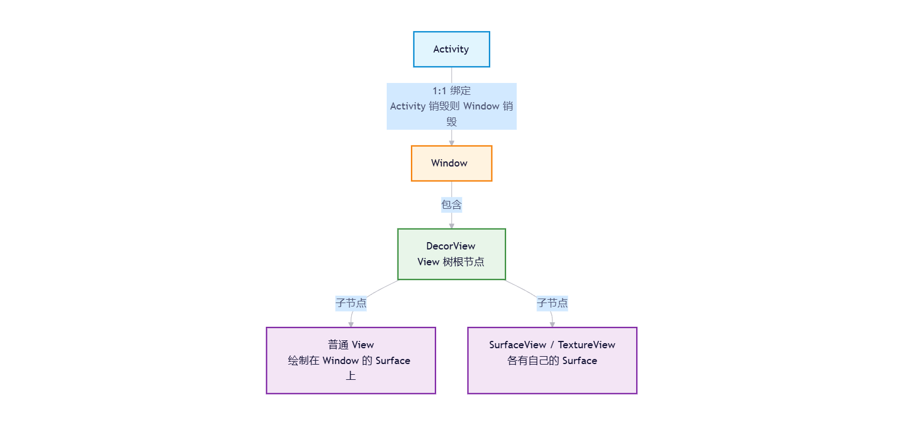
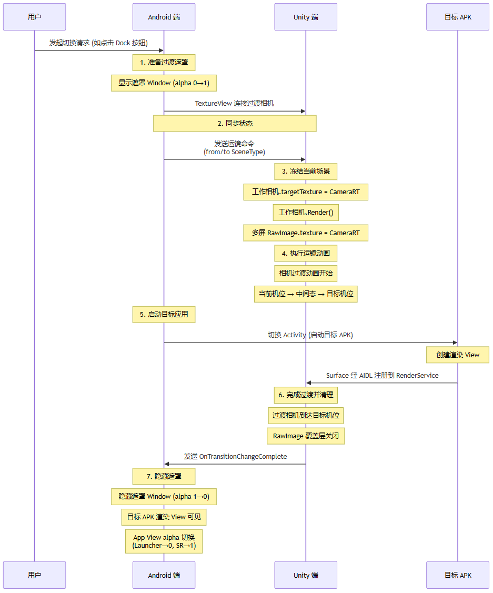

> The previous article, [One Continuous Shot Within a 3D HMI App: From Design Decisions to Implementation](https://mp.weixin.qq.com/s/tewpLjb4j5wHd0abxQr4Hw), covered what a one-continuous-shot transition is and what it means for it to stay inside one app versus cross apps, and then focused on the **in-app** case with my business understanding and technical approach. But as I said before, the in-app case is the easy one. In today's HMI designs, we're very likely to face the cross-app version of the one-continuous-shot requirement.

When the car-model launcher, the driving SR, and the navigation map belong to different Android APKs — all of them being, or having, full-screen forms — how do you make the picture "look" continuous when the user taps them in the Dock and the transition kicks in?

---

## 1. Background

### 1.1 Three Key Classes

The relationship among the three Android classes **Activity, Window, and Surface** is key to designing the one-continuous-shot solution later on.

**Activity**: an Android APK with a UI contains at least one Activity, which manages the lifecycle (onCreate/onResume/onPause/onDestroy). But an Activity being "alive" doesn't mean its picture is "visible" — a paused Activity still lives in memory, but its view may already be covered by another Activity.

**Window**: an Activity automatically gets an associated Window at creation — the visual container for the picture. The Window doesn't render by itself; it hosts a View tree filled in by your layouts. Windows are managed centrally by `WindowManagerService` for Z-order and stacking.

**Surface**: the picture is ultimately drawn onto a Surface. A Surface is a pixel buffer (BufferQueue underneath), and SurfaceFlinger composites the Surfaces of all Windows and sends the result to the display. **Whoever holds the Surface has the power to output a picture.**

**Relationship diagram:**

### 1.2 The Special Surfaces

**Ordinary Views share the Window's Surface; SurfaceView and TextureView each own an independent Surface.** Even though "independent", they are still governed by the lifecycle: when the Activity is destroyed the Window is destroyed, and the SurfaceView's Surface and the TextureView's SurfaceTexture go with it.

- **SurfaceView**: its independent Surface gets its own compositing layer in SurfaceFlinger, so the picture takes a completely separate compositing path. The upside is good raw rendering performance; the price is that it can't do alpha animation, scaling, or rotation, and can't be embedded in the View hierarchy for stacking control.
- **TextureView**: the independent Surface's content is consumed as an OpenGL texture and pasted back into the Window's rendering pipeline, so it behaves like an ordinary View. It costs one extra texture-upload step. You can use View-level alpha animation to cover the switching gap, and the SurfaceTexture callbacks let you precisely control when the Surface is created and destroyed.

### 1.3 Keeping Both Surfaces Alive?

A natural idea: with service-based rendering, App A and App B both hand their Surfaces to the same RenderService; at switch time the Service merely changes the render target from Surface A to Surface B — seamless, right?

**The problem with this idea is that the Surface's lifecycle is not under your control.**

Surfaces live and die with the Activity. When App A switches to App B, A's TextureView is removed along with its Window and the SurfaceTexture fires `onSurfaceTextureDestroyed` — the Surface is gone. B's TextureView only fires `onSurfaceTextureAvailable` after its Window is created — only then does a Surface exist. This gap is enforced by the Android framework; the application layer can't precisely intervene.

The RenderService stays alive and the engine keeps rendering, but the rendered result must be written into the Surface's BufferQueue. Surface A is already destroyed and Surface B doesn't exist yet — so the frame the engine renders gets cut off from display.

> Switching APKs means switching between different Activities, and the essence of an Activity switch is the breaking and rebuilding of Window and Surface lifecycles.
>
> So I'd argue that the key question for the cross-app one-continuous-shot is **how the picture joins up during the switch** — that is, **frame continuity**. Whether or not you have service-based rendering + multi-view capability.

---

## 2. Approach 1: Without Service-Based Rendering

Two independent APKs, with either a single 3D engine instance or two independent 3D engine instances — either way, their EGL contexts are fully isolated. Under these conditions, I don't believe "pixel-level continuity" is possible. The best you can do is **approximate frame continuity**.

The approach: App A pulls the camera up to some far view, freezes the frame, and takes a screenshot; once the other app comes up, it displays that screenshot and gradually fades it out. Essentially this isn't a true one-continuous-shot — it's a visually designed transition mask.

But it still has value: it's the **workable option** when service-based rendering isn't there to back you up, and in specific scenarios (dual launchers: car-model launcher ↔ navigation launcher) the result is acceptable.

### A Typical Implementation: Dual-Launcher Switching

**3D launcher → navigation launcher**:

1. The Android side captures a screenshot of the navigation SurfaceView (`SurfaceControl.captureLayers` or `PixelCopy`), grabbing the pixels navigation is currently rendering.
2. The screenshot is blurred and pasted onto the transition mask (`TransitionView`). Navigation is in the background at this point, and the screenshot plays the role of a **blurred preview of the destination** — letting the user sense roughly what the place they're heading to looks like.
3. A transition command is sent to the 3D runtime; the 3D side's virtual camera animates up to the far view.
4. The transition mask's alpha goes 0→1 (about 700 ms), gradually covering the 3D picture. What the user sees is the far-view scene and car morphing into a blurred "navigation ghost" that emerges.
5. The real navigation TaskView cuts in, and the transition mask fades out with alpha 1→0.

**Navigation launcher → 3D launcher (animateTo3D)**:

1. Capture the navigation SurfaceView's current frame again.
2. Set the blurred screenshot on the transition mask, alpha 0→1. This time the screenshot plays the role of a **blurred exit curtain**: the blurred navigation picture covers the real navigation, and 3D cuts in behind the curtain (gets launched).
3. A return command is sent to the 3D side; the 3D virtual camera animates back to the joining viewpoint.
4. The 3D TaskView cuts in, and the transition mask fades out with alpha 1→0.

> The two launchers are embedded in the host `MainActivity` as remote Tasks, managed through `SharedTaskView`. During switching, the Task's Surface leash is moved from one View to another via `SurfaceControl.Transaction`'s `reparent`, combined with `setAlpha` animations for the visual transition. What keeps "changing parents" here is that navigation screenshot — and switching containers this way doesn't go black.

The advantage of this approach is that the one-continuous-shot visual effect stays fairly decoupled — each side manages its own part, and the picture join doesn't need to be very precise. The disadvantage is exactly there too: if the content on the two sides differs too much, the sense of a continuous shot falls apart and the transition feels disjointed.

---

## 3. Approach 2: Service-Based Rendering + Multi-View

With service-based rendering and multi-view capability, App A gets one view, App B gets one view, and a separately maintained Window is another view — each view being one virtual camera inside the same rendering service.

We can (and perhaps must) use the same camera management configuration across different scenes/levels. For Unity, that means the two Scenes use the same set of Cinemachine VirtualCamera prefab combinations. Doing so guarantees the camera animation logic is consistent across the different apps, which further guarantees the pictures can genuinely join up.

1. **RT on the Unity side**: in multi-display scenarios (instrument cluster, CSD, etc.), first render the current picture to a RenderTexture; each display's RawImage shows this RT, and the transition camera (described below) moves smoothly behind the RT. That way, during the Activity-switch gap, even though the Surface is cut, the RT persists and the multi-display picture isn't interrupted.
2. **Transition camera**: set up a dedicated virtual camera whose rendering output goes to a separate Display, whose Surface is held by an Android-side mask Window. The mask Window is a full-screen standalone window, Z-ordered above all apps, holding a TextureView that receives the transition camera's picture and covers the Activity-switching gap.
3. **Timing coordination**: when the switch starts, Unity freezes the current picture into the RT and the camera starts its move; Android switches the Activity; once the new Surface connects, the camera has already reached the target position; the RT is turned off and the new app's picture fades in. What the user sees throughout: the current picture freezes → the 3D camera animation stays visible the whole time → the new app's picture fades in — a true one-continuous-shot.

> The mask Window needs SystemUI's cooperation, involving system-signature permissions and cross-process communication — an ordinary app can't do it alone. If your project has no system-level cooperation capability, this approach simply can't land.

---

## Closing Thoughts

Writing articles probably can't deliver the complete how-to — a lot of the detail inevitably gets lost. At best, it provides a way of thinking and a direction. Implementing any of these solutions involved countless adjustments and bug fixes along the way. Some things I experienced firsthand; some problems got solved before I even noticed them. So in the next article I'll try to recall some of the problems I once ran into, to fill in some of what's missing here.
