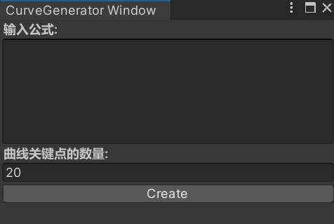
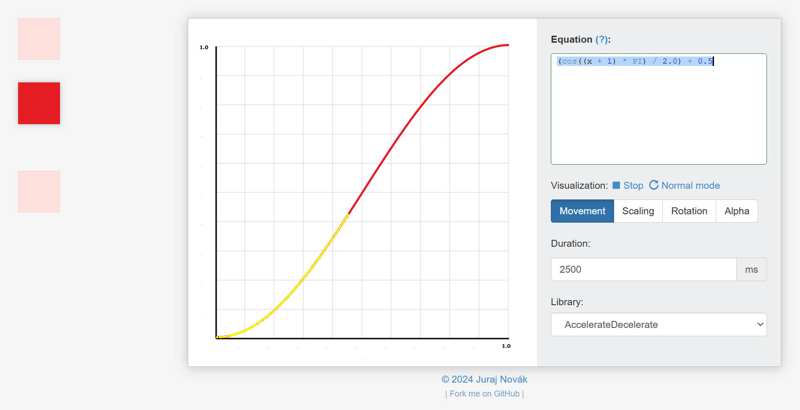
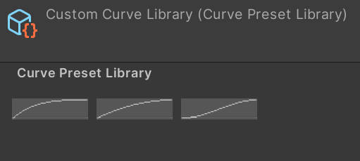

> 上一篇介绍了以Adobe After Effects的镜头参数作为相机动画模块设计基础的思路。文中提到，镜头动画中的各项参数都可以配置起止点、配置动画时长和变化曲线。
>
> 对于曲线，我原以为Dotween插件的那么几款肯定是够用的了，后来才发觉是我对动效节奏的感受细腻度不够。

---

## 1. 由来

相机动画中，动效节奏靠 AnimationCurve 控制。在Unity中，我们能很方便地获取到各种经典的曲线：Linear、EaseIn、EaseOut、EaseInOut 等。

在项目中，HMI动效对于镜头运动常有“先快后慢”的节奏需求。即使我们使用easeOutExpo这种已经非常偏向“先快后慢”的曲线，动效美术依然觉得镜头最后停下的那一刻感觉不对：开头不够快，定格前的舒缓感也不足。而这整个过程加起来就1000ms（800-1200）。

此时，美术会拿出一套公式，并要求按照这套公式还原。那么从工程中找预设曲线可能既费时又可能找不到，所以才会有想做一个能直接输入公式，输出curve资产的工具。


---

## 2. 方案：公式 → AnimationCurve

### 2.1 工具入口

在 Unity 菜单栏：`Assets → Create → xxx / Curve`，调出专用编辑器窗口。

窗口里只有两个输入框：

- **公式文本**：一行或多行 JS 语法的数学表达式
- **关键点数量**：采样精度（默认20）

点击 `Create`，曲线生成完毕，直接写入项目资产。



### 2.2 输入与输出


| 输入    | 说明                                 | 示例                    |
| ----- | ---------------------------------- | --------------------- |
| 公式文本  | JS 语法的数学表达式，自变量为 `x`（代表时间进度 [0,1]） | `x * x * (3 - 2 * x)` |
| 关键点数量 | 在 [0,1] 区间等距采样N个点，默认20             | `20`                  |


| 输出             | 说明                                 |
| -------------- | ---------------------------------- |
| AnimationCurve | 生成后自动写入 Custom Curve Library.asset |


---

## 3. 技术实现

### 3.1 核心思路：采样 + Jint

Unity 的 AnimationCurve 本质上是一组关键帧（Keyframe）。给定公式 `f(x)`，在 x ∈ [0, 1] 上等距取 N 个点，把 `(x, f(x))` 作为 key 加进 curve，就得到了离散化的曲线资产。

关键在于**公式解析**，我们在编辑器工具里集成了一个 JS 解释器（Jint），输入的公式字符串直接作为 JS 代码执行，自变量 `x` 由程序注入。

### 3.2 公式解析流程

以下为示意代码：

```csharp
// 公式解析核心
public static AnimationCurve GenerateFromFormula(string formula, int sampleCount)
{
    AnimationCurve curve = new AnimationCurve();
    string jsCode = PrependMathNamespace(formula);
    Engine interpreter = new Engine();
    for (int i = 0; i <= sampleCount; i++)
    {
        float t = i * (1f / sampleCount);        // x ∈ [0, 1]
        float y = interpreter
            .SetValue("x", t)
            .Evaluate(jsCode)
            .ToObject()
            .ToSingle();
        curve.AddKey(t, y);
    }
    return curve;
}

// 数学函数名补全（cos → Math.cos）
private static string PrependMathNamespace(string str)
{
    string[] mathFuncs = { "E","LN10","LN2","LOG2E","LOG10E","PI","SQRT1_2","SQRT2",
        "abs","acos","acosh","asin","asinh","atan","atanh","atan2","cbrt","ceil",
        "clz32","cos","cosh","exp","expm1","floor","fround","hypot","imul","log",
        "log1p","log10","log2","max","min","pow","random","round","sign","sin",
        "sinh","sqrt","tan","tanh","trunc" };
    foreach (var m in mathFuncs)
        str = Regex.Replace(str, $@"\b{m}\b", $"Math.{m}", RegexOptions.IgnoreCase);
    return str;
}
```

### 3.3 编辑器窗口：菜单入口 + 写入资产

以下为示意代码：

```csharp
public class CurveGeneratorWindow : EditorWindow
{
    private string _formulaText = "";
    private int _keyCount = 20;
    private const string _libraryPath = "Assets/.../Custom Curve Library.curves";

    [MenuItem("Assets/Create/xxx/Curve")]
    public static void ShowWindow()
        => GetWindow<CurveGeneratorWindow>("Curve Generator");

    private void OnGUI()
    {
        GUILayout.Label("输入公式:", EditorStyles.boldLabel);
        _formulaText = EditorGUILayout.TextArea(_formulaText, GUILayout.Height(100));

        GUILayout.Label("曲线关键点数量:", EditorStyles.boldLabel);
        _keyCount = EditorGUILayout.IntField(_keyCount);

        if (GUILayout.Button("Create"))
        {
            AnimationCurve curve = CurveTool.GenerateFromFormula(_formulaText, _keyCount);
            if (curve != null)
                SaveToLibrary(curve);
            Close();
        }
    }

    // 写入预设库资产的 SerializedObject
    private void SaveToLibrary(AnimationCurve curve)
    {
        AssetDatabase.Refresh();
        var lib = AssetDatabase.LoadAssetAtPath<UnityEngine.Object>(_libraryPath);
        var so = new SerializedObject(lib);
        var presets = so.FindProperty("m_Presets");
        int idx = presets.arraySize;
        presets.InsertArrayElementAtIndex(idx);
        var item = presets.GetArrayElementAtIndex(idx);
        item.FindPropertyRelative("m_Name").stringValue = "";
        item.FindPropertyRelative("m_Curve").animationCurveValue = curve;
        so.ApplyModifiedProperties();
        AssetDatabase.SaveAssets();
        AssetDatabase.Refresh();
    }
}
```

### 3.4 典型公式与曲线形态对照

工具内置了一份数学函数白名单，自动把 `sin`、`cos`、`PI` 等补成 `Math.sin`、`Math.cos`、`Math.PI`。

> 参考网站 [inloop/interpolator](https://inloop.github.io/interpolator/)：可在此验证公式对应的曲线形态，工具支持的公式语法与之完全兼容。



---

## 4. 集成

工具代码以 **Editor 脚本**存在，打包时不会进入 Runtime。依赖：

- `Jint.dll`（JS 解释器，.NET 下直接引用）
- Unity 内置的 `AnimationCurve` 和 `SerializedObject` API

上面代码中已经写明：目标资产写入路径为 `Assets/.../Custom Curve Library.curves`，这是一个包含多组 curve preset 的资产文件，运行时被 `AECameraAnimationCurve` 引用。



---

## 5. 结语

通过 JS 解释器实时解析公式 + 等距采样构建关键帧，我们把美术给的公式变成了可用的 Unity 曲线资产，而不用再去找最接近的预设曲线。

配合上一篇的 AE 思维的相机动效模块，美术可以在外部工具里调好曲线公式，工程这边直接复制粘贴参数，整个HMI动效的还原工作几乎不需要来回返工。