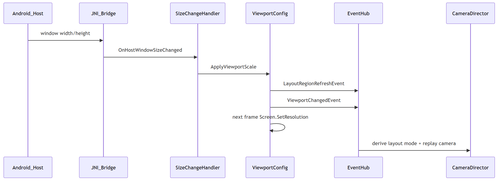

> 从2022年及之前，HMI的设计方案中能见到大量的卡片设计元素，当3D HMI逐渐进入设计概念中之后，卡片化、小窗模式也在3D HMI应用上逐步做了尝试。如今，服务化渲染已经满足了几乎所有卡片化、区域化使用的需求，因此本文会以在此之上的分屏需求切入，梳理系统窗口层与3D渲染层如何协同。

当前 HMI 桌面设计理念有一种是：**中控屏不再只跑一个全屏应用**。Launcher 卡片、地图、媒体与 3D 车模/智驾画面在同一物理屏上动态分配宽度。对用户是**一屏多用**；对 3D 开发则意味着渲染区域会在运行时变化分辨率。

## 一、分屏模式

工程上通常是三种布局模式：


| **模式名**       | **宽度比例阈值** | **常见分辨率举例** |
| ------------- | ---------- | ----------- |
| 全屏            | > 0.9      | 1920×1200   |
| 约七分屏（非严格 2/3） | > 0.5      | 1272×1200   |
| 三分屏           | ≤ 0.5      | 642×1200    |


在三种分辨率下，咱们无法共用同一套镜头的FOV、镜头的推拉以及 UI 的对齐方式，甚至是手势灵敏度也不同。**分屏在业务逻辑上，不仅是变化 UI 布局的需求，而是渲染、相机、手势、环境特效的整合问题。**

---

## 二、3D 侧的实现

### 2.1 信号触发

这块没有什么特别的，Android 应用识别到调整 3D 容器窗口大小时，经 JNI/Socket 把新的 `width` / `height` 传过来。3D 侧收到后计算宽度占比，再驱动图形模块刷新：

```csharp
// 示意代码
void OnHostWindowSizeChanged(int newWidth, int newHeight)
{
    int physicalWidth = _graphicsConfig.PhysicalScreenWidth;
    float widthRatio = (float)newWidth / physicalWidth;

    _graphicsConfig.ApplyViewportScale(widthRatio, 1f);
}
```

> `physicalWidth` 为物理屏宽
>
> `widthRatio` 是用来后续推导全屏 / 七分屏 / 三分屏的依据。

### 2.2 刷新分辨率并触发事件

创建一个图形配置模块（`ViewportConfig`），承担三件事：

1. 更新内部分辨率与缩放比；
2. **广播事件：布局有变**，让相机管理器、UI管理器、手势管理器等订阅方同步去变化；
3. **延迟一帧再调用** `Screen.SetResolution`，避免与 Android Surface 的 resize 同帧出问题。

> 同帧内 Android Surface 尺寸变更与 Unity RenderTexture 可能重建存在竞态；业务若立即读 `Screen.width` 可能仍是旧值。先发事件、下一帧再 `SetResolution`，是让相机/UI 先按新比例调整逻辑，再改像素尺寸。

这里代码没有意义，给一张步骤图：



### 2.3 布局模式与区域位置

**宽占比转模式枚举：**由相机管理器（`CameraManager`）根据 ratio 转为枚举


| 宽度占比阈值 | 布局模式 | 镜头推拉偏移         |
| ------ | ---- | -------------- |
| > 0.9  | 全屏   | 0              |
| > 0.5  | 约七分屏 | 0              |
| ≤ 0.5  | 三分屏  | -30（窄窗下镜头推拉补偿） |


**获取3D的偏移位置（左 / 右 / 全屏）**通过 Android 侧的信号获知：

```csharp
// 0 = 全屏, 1 = 3D 在左侧, 2 = 3D 在右侧
int region = _hostBridge.QueryLayoutRegion();
_sceneState.LayoutRegion = (LayoutRegion)region;
```

### 2.4 触发业务联动


| 子模块     | 做什么                                                                                          |
| ------- | -------------------------------------------------------------------------------------------- |
| 车模镜头    | 1. 根据分屏模式和分屏位置来调整推拉摇移的镜头参数。 2. 驱动分屏之后的镜头动画。                                                  |
| 手势缩放/旋转 | 1. 窄屏缩小 zoom 范围。 2. 滑动速率按 1/3 或 1/7 衰减。 3. 分辨率变化后重算 `PixelsPerInch`                          |
| UI 布局   | 1. 修改Canvas的`CanvasScaler` 。 2. 手动修改不能简单缩放的UI的关键节点，去匹配合适的位移/尺寸。                              |
| 环境渲染    | 1. 三分屏关闭反射，因为开了几乎没效果上的体验 2. 三分屏切 MSAA，其他是TAA，理由同上 3. 部分后处理延迟数帧再开启，这些后处理需要帧画面的稳定才能保证后处理之后不闪屏。 |
| 场景过渡    | 对于部分场景，切换时需要用到全屏遮罩做过渡，不然有穿帮画面。                                                               |


> 设计特点：通过比例阈值 Ratio（0.9 / 0.5）与 Android 实际像素解耦，枚举和事件的设计让后续业务变更只需关心抽象。

---

## 三、Android 侧

### 3.1 Window / Fragment 结构

Unity 通常嵌入安卓 App 的 Fragment：**FrameLayout 容器 + SurfaceView**。安卓 App 改变分屏布局时，改的是容器的尺寸与位置；Unity 通过 JNI 消息感知新宽高。

```java
// 示意：Unity 容器 Fragment
public class RenderHostFragment extends Fragment {
    private SurfaceView mRenderSurface;
    private FrameLayout mContainer;

    @Override
    public View onCreateView(LayoutInflater inflater, ViewGroup parent, Bundle state) {
        mContainer = (FrameLayout) inflater.inflate(R.layout.render_host, parent, false);
        mRenderSurface = new SurfaceView(getActivity());
        mContainer.addView(mRenderSurface);
        mRenderSurface.getHolder().setFormat(PixelFormat.TRANSLUCENT);
        return mContainer;
    }
}
```

### 3.2 SurfaceView 的特性与分屏代价


| 维度   | SurfaceView（车机 3D 常见选型）        |
| ---- | ------------------------------ |
| 合成   | 独立 Surface，在普通 View 之下         |
| 尺寸变化 | Buffer 常需重建，易闪屏/黑帧             |
| 透明度  | 可设 TRANSLUCENT，仍受 Surface 机制约束 |


选 SurfaceView 的代价： 分屏 resize 必须配合遮罩过渡，因为 Buffer 重建无法零感知。核心逻辑是先遮罩 → 改 3D 容器 View 尺寸/位置 → 等 Unity 首帧有效 → 撤遮罩。遮罩可以是与桌面背景一致的 Bitmap/View，或是与3D应用相关的模糊图片，以此来减少割裂感。

### 3.3 Resize窗口过程中能不黑屏吗？

我曾经在Unite见过官方的Demo，用手指拖拽分屏窗口进行窗口大小变化的时候，3D的画面是连续的，是活着的。由于我没有落地过，以下都是我对方案的推测:

- 依赖 URAS 服务化渲染能力。
- 对于Android应用侧，关心的是 TextureVIew的变化，而这是系统原生就支持它跟随 Matrix 变换而实时缩放的。
- 对于3D侧，可能是两种处理方式：
  - 如果交互上允许，渲染画面不变，那就固定原始分辨率给到安卓View
  - 如果交互要求跟随窗口做裁切，那么就动态改变camera的viewport，分辨率还是不变。
  - 当窗口拖动结束之后，我可能还是会根据当前窗口设计一步：重设分辨率的操作，但这一步，要测试是否会闪黑，据说Textureview不会。

---

## 四、典型问题：分屏过程中窗口黑屏

> Unity 在 Android 上**始终**有一个 `Display.displays[0]`（即 `Display.main`），车模桌面只有一块 SurfaceView 、这个问题的项目中，只用 index=0。
>
> Unity 在 Android 上把尺寸拆成两层：
>
> `systemWidth/Height` 是 Surface 绑定的系统尺寸
>
> `renderingWidth/Height` 是 GPU 实际渲染的 framebuffer 尺寸
>
> `Screen.SetResolution` 主要更新 `Screen.*` 和部分上层状态
>
> `Display.SetRenderingResolution` 才是移动端用的，直接改 GPU 渲染分辨率的路径。

### 现象

从全屏切入七分屏，渲染区域 **全黑**。

### 排查

打日志发现：`Screen.SetResolution` 已调用，但 `Display.main.renderingWidth/Height` **未更新**。

### **根因**

Android 嵌入式场景下，`Screen.SetResolution` 与 `Display.renderingWidth/Height` **走两条路径***。*

只调前者不够，还需** `Display.SetRenderingResolution(0, w, h)` 同步 GPU 渲染目标（index=0 即主 Display，Android 上不可省略）。

### 修复

在刷新渲染目标时，**Screen 与 Display 应配合使用**（示意代码）：

```csharp
IEnumerator ApplyResolutionNextFrame()
{
    yield return null;

    int w = (int)(_baseWidth * _viewportScaleX);
    int h = (int)(_baseHeight * _viewportScaleY);

    Screen.SetResolution(w, h, true);
    ApplyDisplayRenderSize(0, w, h);  // index=0 主 Display，Android 上不可省略

    _eventHub.Publish(new ViewportChangedEvent(w, h));
}

void ApplyDisplayRenderSize(int displayIndex, int width, int height)
{
    var display = Display.displays[displayIndex];
    display.Activate();
    display.SetRenderingResolution(width, height);

    Debug.Log($"rendering={display.renderingWidth}x{display.renderingHeight}, " +
              $"system={display.systemWidth}x{display.systemHeight}");
}
```

---

## 结语

Unity 在 Android 上的 Screen.SetResolution 和 Display.SetRenderingResolution，名字很像，但其实这种 API 的相似性和差异的隐秘性，有时是工程上的时间黑洞。一个黑屏bug单下来，你要打日志、分析、反复验证，最后发现只是 API 的调用错误/遗漏。这些时间本该用来做更有价值的事。

