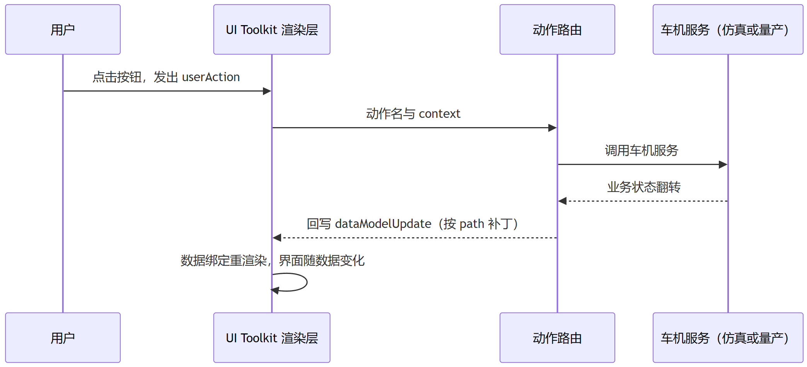
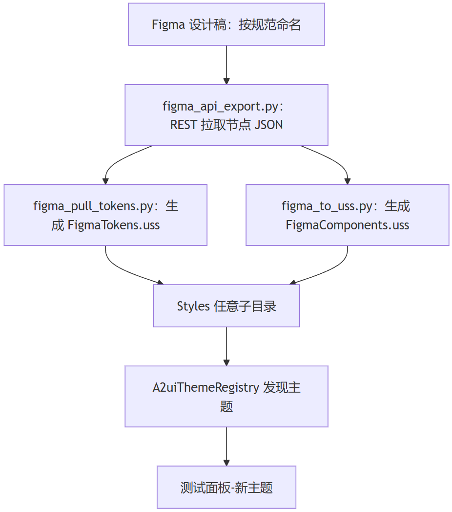
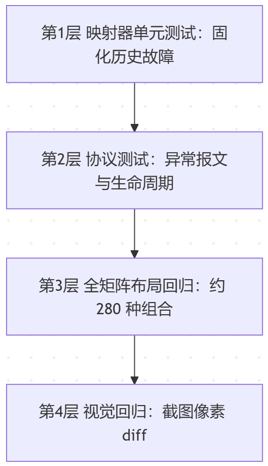

> **Key takeaways in this article**
>
> - Repository: [https://github.com/SamXiaBing/a2ui-unity-toolkit](https://github.com/SamXiaBing/a2ui-unity-toolkit)
>
> - A comparison of technical routes for GenUI on the head unit, and the trade-offs of native component mapping.
> - The pipeline design of the A2UI rendering flow.
> - An automated pipeline from Figma design files to USS themes.
> - The regression-testing capability included in the open-source repository.

## Why Does A2UI Need a Unity Renderer?

Generative UI (GenUI) means an AI Agent describes the interface structure in natural language, and the client renders it in real time. The A2UI protocol proposed by Google uses JSONL as its message format, defining standard specifications for component descriptions, hierarchical relationships, data binding, and action callbacks. The official renderers cover Angular, Flutter, Lit, and other web and mobile frameworks, and the community has added a Compose renderer.

In cockpit 3D HMI development on the head unit, the UI runs inside a 3D engine environment (such as Tuanjie), with the rendering layer being the engine's own UI canvas system (such as UI Toolkit). The existing A2UI ecosystem lacks an implementation for this.

The implementation described in this article maps the A2UI protocol directly onto Unity UI Toolkit native components. The JSONL packets output by the Agent are validated, transformed, and mapped, then rendered as native components — no HTML, no WebView, no pixel streaming.

The project supports both protocol v0.8 and v0.9, theme switching, automatic Figma-to-theme conversion, and automated regression testing across all themes × all samples. The open-source material includes 23 C# code files, 18 Python toolchain scripts, 21 component types, 3 built-in themes, and 56 samples. The repository is open-sourced under the MIT license.

## Thinking Through the Technical Routes

To implement AI-driven cockpit GenUI, there are several comparable technical routes.

### **The WebView Plugin Route**

Render the UI with the web tech stack; the Agent outputs HTML or web-like descriptions. The advantage is low implementation cost and a mature ecosystem. But Unity can't render HTML/CSS directly — you must rely on third-party plugins like Vuplex 3D WebView, going through an off-screen texture path composited with 3D content, which adds one extra pixel copy per frame — a significant performance price. And in a vehicle 3D HMI project, the adaptation cost isn't low either.

### **The Compose Bridge Route**

Pass Android Compose's drawing instructions to Unity for API-level mapping and final rendering. The advantage is reusing the Android ecosystem, and the declarative paradigm naturally fits GenUI's structural descriptions. But it requires modifying Android Framework code — the risk and difficulty are rather high — and once you're bound to Compose, the 3D side's technical options become constrained.

### **The Native Component (UITK) Mapping Route**

Treat the model output as a structured protocol and map it directly onto Unity's native UI Toolkit components. UI Toolkit's declarative styling system aligns with the web design system at the semantic level: it has Flex layout capability, and USS's property naming, selector mechanism, and variable system are all highly similar to CSS. This means the design side's Figma design system and the frontend side's styles can be converted directly into USS themes through an automated pipeline, rather than rewriting a set of visual assets from scratch. On top of that, performance is fully controllable. The cost is that you must implement the protocol-to-component mapping layer yourself.

## Core Challenges

Choosing the native component mapping route means solving technical problems in three areas.

**Adapting the rendering host to the protocol.** UI Toolkit's layout, styling system, and component set differ from the Web/Android ecosystems. Flex layout behavior, scrolling mechanics, and transform properties all have inconsistencies; the mapping layer must adapt to these one by one, ensuring the interface semantics described by the protocol render correctly on the 3D engine side.

**Multi-version protocol compatibility.** A2UI v0.8 and v0.9 differ in packet structure: v0.8 uses nested component descriptions with types expressed as nested keys; v0.9 uses a flat component array where children reference IDs directly. Compatibility requires an internal data layer providing a JSONL conversion intermediate model, decoupled from the version, so that the mapping layer needs no changes when the protocol upgrades.

**Engineering the visual assets.** The visual quality of generative UI depends on the theme system, not on the model output. Building an extensible, verifiable theme pipeline that can auto-convert from design files is the key factor determining the system's usability — not the architecture itself.

## System Architecture

The JSONL packet processing flow has seven stages:

*[Figures omitted; see the original WeChat article]*


### Data-Driven Mode

User operations don't modify the interface directly; they go through action routing into the vehicle services, and after the services write data back, the interface updates automatically with the data:



### Protocol Compatibility

**v0.8 packet** (nested):

```
{
  "surfaceId": "demo",
  "column": {
    "children": [
      {
        "text": {
          "text": "有点热，调到 22 度",
          "variant": "h4"
        }
      },
      {
        "button": {
          "text": "确认",
          "action": "confirm"
        }
      }
    ]
  }
}
```

**v0.9 packet** (flat):

```
{"version":"v0.9","createSurface":{"surfaceId":"demo","catalogId":".../standard_catalog_definition.json"}}
{"version":"v0.9","updateComponents":{"surfaceId":"demo","components":[
  {"id":"root","component":"Column","children":["title","b1"]},
  {"id":"title","component":"Text","text":"有点热，调到 22 度","variant":"h4"},
  {"id":"b1","component":"Button","text":"确认","action":"confirm"}
]}}
```

In v0.8, the component type is embedded in the key, and the structure is a recursive tree;

In v0.9, the component type lives in the component field, and the structure is a flat array + children referencing IDs, requiring an extra step to reconstruct the tree.

The normalized internal data model (both versions converge to the same form):

```
{
  "surfaceId": "demo",
  "rootId": "root",
  "components": {
    "root":  { "type": "Column", "children": ["title", "b1"], "props": {} },
    "title": { "type": "Text",   "children": [],             "props": { "text": "有点热，调到 22 度", "variant": "h4" } },
    "b1":    { "type": "Button", "children": [],             "props": { "text": "确认", "action": "confirm" } }
  }
}
```

1. Type unification: the key and the component field are unified into a type field
2. Structure unification: recursive trees and flat arrays are both expanded into an id → component dictionary + children ID references
3. Property unification: properties scattered across layers are all gathered into props; the mapping layer only deals with props

### Safety and Defenses

Agent output is untrusted input, so a safety baseline is required. The main defenses include:

- **Render depth limit**: capped at 50 levels; beyond that, nested content renders as a placeholder, avoiding stack overflow
- **Structure validation**: malformed packets are rejected outright, keeping the previous frame — no white screen
- **Unknown component degradation**: undefined components render as placeholder cards; never crash, never drop the whole frame
- **URL whitelist**: only http(s) and resources:// protocols allowed, blocking file:// injection
- **Single-line error location**: parse failures point to the specific line number, with clear errors — no silent discarding

> The cockpit scenario also adds driving-safety validation. Driving state is determined by gear and vehicle speed; while driving, complex or highly interactive components such as Tabs, Modal, List, MultipleChoice, Video, and DateTimeInput get intercepted. This is optional and adjustable.

## The Theme Module

The visual quality of generative UI is not determined by the model but by the quality of the design assets in the theme system. At the start of this project, the pipeline worked end to end but the visual quality was inadequate — the root cause was a lack of theme assets.

### Choosing the Design Baseline

This system uses sinanata's unity-ui-toolkit-design-system as the design baseline. That design system contains 15 USS files and 120 SVG icons, with a complete art-direction system. Its design language is plain and flat — no shadows, no gradients — matching the engine's capabilities. The visual quality comes from art direction and token discipline, not engine effects.

### Theme Mechanics and Extension

The theme system uses a semantic token architecture: component code never hard-codes color values but uses variable names instead. When you switch themes, only the variable values change — component code stays untouched.

Architecturally, it splits into:

1. The semantic variable layer: stores the values of all style variables.
2. The theme class layer: wraps the variables into a CSS class; each theme corresponds to one class.
3. The component layer: all components reference only semantic variables; components are theme-agnostic.


> When self-testing, if you want to add a new theme, just place a FigmaTokens.uss file in any subdirectory of Styles — the registry will discover it automatically, and the theme dropdowns in the test panel and the scene host will gain the new option automatically.

### Figma Conversion

The Figma-side pipeline implements automatic conversion from design files to USS themes.



Figma design files need to follow the "alias / component:variant" naming convention. The converter reads the nodes' real properties directly, extracting four categories of information:

- Semantic colors: color values extracted from nodes named with semantic aliases
- Font-size scale: font sizes extracted from text nodes at each level, generating a complete font-size system
- Padding: padding values extracted from component nodes
- Corner radius: radius values extracted from container nodes

The extraction results are then generated into a USS theme file. To verify consistency between the Figma design file and the 3D engine's actual rendering, a cross-renderer calibration tool is included so you can compare them yourself.

## Engine Compatibility

UI Toolkit differs from standard CSS in many layout and styling behaviors — the main hidden cost during development. The project has documented 30+ tested compatibility entries (based on Tuanjie 2022.3.55t4), from small ones — CSS variable fallback syntax being silently dropped, flex's default shrink behavior being the opposite of the standard — to big ones — adding a transform crashing outright, the scrollbar taking up 24 extra pixels of height, dynamically adding a class causing an out-of-bounds crash, and even font loading being unstable at times. The code makes defensive efforts against all of these pitfalls, which already reduces the debugging cost of rendering-layer changes.

> Details are in docs/[engine-compat-tuanjie.md](http://engine-compat-tuanjie.md)

## The Regression Testing System

The typical risk of this kind of generative UI is that a change can break multiple screens at once, and manual verification is expensive. So I wrote automated regression tests, hoping to catch some of these problems.



## **Limitations**

- Video and audio playback are currently informational placeholders;
- Date input is an ISO string input field;
- Modal lacks a mask and focus trapping
- Long lists have no virtualization — currently full rendering, so performance degrades when there's too much data.
- The Slider drag handle isn't theme-connected yet — a known issue where the engine's selector fails to match.
- More theme testing is needed to surface hidden problems in the mapping layer.

## Trying It Out and Contributing

> Clone the repository, open it with Tuanjie or Unity, and after pressing Play, open the test-send panel of A2UISchemeA, pick a sample, and send it. You can also simulate an Agent stream by executing a Python command
>
> - Repository: [https://github.com/SamXiaBing/a2ui-unity-toolkit](https://github.com/SamXiaBing/a2ui-unity-toolkit)
>
> Before modifying the code, I recommend taking a look at docs/[engine-compat-tuanjie.md](http://engine-compat-tuanjie.md) — it contains the list of pitfalls hit earlier.
>
> If you've run into new compatibility pitfalls, want to add a new theme, or have component needs for cockpit scenarios, issues are welcome.
