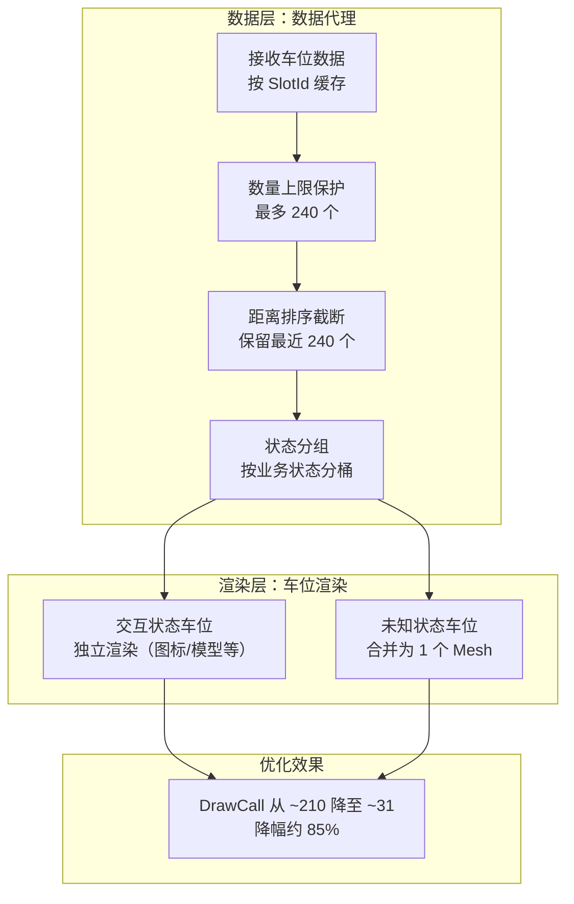


> 在座舱3D HMI项目里，LP（Local Parking）巡航是比较考验性能的场景。有一天用户反馈："LP巡航过程中进入AVP导航状态，SR界面突然异常卡顿，帧率掉得厉害，停车场越大卡得越狠。"
>
> 一开始我以为是谁把shader写坏了，或者哪段逻辑死循环了。结果用Profiler一抓，问题出在最"笨"的地方：**车位框一个一个独立渲染，DrawCall直接爆了**。

这篇文章讲讲这个问题的根因、两阶段优化方案（数量上限 + 按状态分组合批），以及落地过程中的几个坑。优化做完，同样场景下DrawCall降低了85%左右。

整体优化方案架构一览：



---

# 一、问题表现

AVP（代客泊车）导航状态下，SR界面需要渲染停车场里的**车位框**，一个车位一个四边形线框，通过Mesh渲染。看着没啥技术含量，但量一大就出事：

- AVP导航状态下SR界面帧率显著降低，掉到抖动的程度；
- 车位框数量越多越严重，大型停车场特别明显；
- 优化前车位框数量**没有任何上限**，实际场景可以到几百个。

两个 Jira 单子正好记录了这事：

| 类型 | 单内容 | 时间 |
|------|--------|------|
| Bug | LP巡航过程中SR界面异常卡顿 | 2025-11-10 |
| 需求 | AVP和泊车场性能优化-短期方案 | 2025-11-06 |

一个先修 Bug 止血，一个直接立项做优化，两条线并行走，最后落在同一个方案上。

---

# 二、根因分析：每个车位框单独渲染

用 Frame Debugger 抓了一帧，车位框相关的 DrawCall 列表一眼望不到头。往下追数据流，问题出在**数据结构和渲染对象的映射关系**上。

## 2.1 一条 "1个车位 → 1个渲染对象 → 1次DrawCall" 的链路

当时的处理流程是这样一条链：


数据本身没错，问题在于**每个车位框都成了独立的渲染对象**，独立的 Mesh、独立的 MeshRenderer。车位框内部渲染结构里，原来的渲染数据结构如下：

```csharp
// 源码路径：Assets/Scripts/MapEngine/MapRender/Data/AVP/AVPMapSlotData.cs
// 优化前：一个渲染数据里只有"一个车位"
public class AVPMapSlotData : RenderData
{
    public MapSlotType Data { get; set; }   // 单个车位数据
    public override long ID => Data.SlotIDSeN;   // ID = 车位ID
}
```

GetAvpSlotsData 里也是一车位一渲染数据地创建：

```csharp
// 源码路径：Assets/Scripts/MapEngine/DataProxy/AVP/AVP3DMapProxy.cs
// 优化前：每个车位一个独立的渲染数据
foreach (var cache in _slotDataCache.Values)
{
    AVPMapSlotData mapSlotData = AVPMapSlotData.Create(cache.Get());
    container.Add(mapSlotData);   // 1 个车位 = 1 个 DrawCall
}
```

## 2.2 DrawCall 与车位框数量的线性关系

于是数字就变成了这样：

| 车位框数量 | 车位框Mesh DrawCall | P图标等附加 DrawCall | 其他元素 | 总DrawCall（估算） |
|-----------|-------------------|---------------------|---------|-------------------|
| 50 | 50 | ~50 | ~50 | ~150 |
| 100 | 100 | ~100 | ~100 | ~300 |
| 200 | 200 | ~200 | ~200 | ~600 |
| 500 | 500 | ~500 | ~500 | ~1500 |

## 2.3 为什么 DrawCall 高会导致卡

很多新手会觉得"GPU 才是在意渲染的单位"，但其实**DrawCall 的瓶颈往往在 CPU**：

1. 每个 DrawCall，CPU 都要准备渲染状态（材质、Shader 参数、变换矩阵），然后提交给 GPU。车载平台的 GPU 预算有限，DrawCall 一多 CPU 就成了瓶颈，帧率直接掉下来。
2. 每个车位框独立 Mesh，等于每次渲染都要单独提交顶点缓冲。
3. 不同状态的车位框还挂在不同的材质/纹理上（比如 P 图标的日夜模式切换），又多了渲染状态切换的开销。
4. 没有数量上限保护，最坏情况无法兜底。

## 2.4 车位框的"状态"决定了优化空间

车位框不是铁板一块，`AvpSlotStatus` 枚举里分了几种业务状态：

| 状态值 | 业务含义 | 视觉附加元素 |
|--------|---------|-------------|
| 0 | DESTINATION 目的地车位 | 蓝色高亮 + 终点扎标 |
| 1 | PARK 可泊车位 | P图标（导航态彩色/非导航态灰色）|
| 2 | UNKNOWN 未知状态 | 纯线框，啥交互都没有 |
| 3 | GROUNDLOCK 地锁车位 | 地锁模型 |
| 4 | PARKSTOP 轮挡车位 | 轮挡模型 |
| 5 | CHARGING 充电车位 | 车位编号显示 |

关键是：**UNKNOWN（未知车位）数量最大，往往占绝大多数**，而且它们只有一个线框、没有任何交互元素的普通环境物件，这正是"合批"的最佳对象。

---

# 三、方案设计：先截断，再合批

方案分两个阶段，一治标，二治本：

1. **阶段一（短期止血）**：数量上限保护，车位框最多 240 个、道路面最多 1900 个顶点。
2. **阶段二（架构合批）**：相同状态的车位合并 Mesh 渲染，UNKNOWN 状态所有车位合并成一个 DrawCall。

整个方案的定位：

```
AVP3DMapProxy（数据代理）
  ├─ 数量上限：MaxMapSlotCount = 240
  ├─ 路面顶点上限：MaxRoadSurfacePoint = 1900
  ├─ 距离排序：超过上限保留最近的240个
  ├─ 状态分组：ProcessSlotData() → _slotMap
  │      ├─ DESTINATION / PARK / GROUNDLOCK ... → 独立渲染（保交互）
  │      └─ UNKNOWN → 合并为一个渲染对象
  │
  └─ AVPSlotLayer.UpdateContent()
        → AVPSlotObject.FillData()
              → AVPSlotController.OnUpdate()
                    → TwoPathToMeshCall.AddPath() × N  合并所有线框
                    → TwoPathToMeshCall.SetMesh()      提交同一个 Mesh
```

## 为什么选"手动 Mesh 合并"，而不是其他合批方案？

| 方案 | 适用场景 | 本案例合不合适 |
|------|---------|--------------|
| 静态合批 | 永不移动的物体 | ❌ 车位框随车辆移动，每帧都要更新 |
| 动态合批 | 小网格（<300顶点）、顶点格式一致 | ⚠️ 有数量/顶点限制，不放心 |
| GPU Instancing | 相同的 Mesh + 材质 | ⚠️ 车位框尺寸、朝向各不相同 |
| **手动 Mesh 合并** | 精确控制，想怎么分就怎么分 | ✅ 本案例采用 |

车位框形状不统一（长短边、开口方向各不相同），Instancing 不直接适用；动态因素又排除掉静态合批。**手动合并**可以精确认：哪些状态合、哪些状态独立，都由代码说了算，是最灵活的路子。

---

# 四、实现细节

## 4.1 第一阶段：数量上限 + 顶点上限

先给车位框加一个硬上限。相关的两个常量一眼看懂：

```csharp
// 源码路径：Assets/Scripts/MapEngine/DataProxy/AVP/AVP3DMapProxy.cs
private const int MaxMapSlotCount = 240;        // 车位框最多渲染 240 个
private const int MaxRoadSurfacePoint = 1900;   // 道路面最多 1900 个顶点
```

**车位框超过 240 个怎么办？** 按"离车最近优先"排序，只留最近 240 个：

```csharp
// 源码路径：Assets/Scripts/MapEngine/DataProxy/AVP/AVP3DMapProxy.cs
public void GetAvpSlotsData()
{
    lock (_slotDataCache)
    {
        _slotMap.Clear();
        if (_slotDataCache.Count > MaxMapSlotCount)
        {
            var result = new List<SlotInfo>();
            foreach (var cache in _slotDataCache.Values)
                result.Add(cache.Get());

            // 数量超了：按距离排序 + 截断，只保留最近的 240 个车位框
            SimpleMapSlotSorter.SortSlotsInPlace(result);
            foreach (var item in result)
                ProcessSlotData(item);
        }
        else
        {
            foreach (var item in _slotDataCache.Values)
                ProcessSlotData(item.Get());
        }
        // ... 后面按分组创建渲染数据
    }
}
```

排序的比较器很朴素，拿车位框第一个点与车辆位置（即原点）的距离比大小：

```csharp
public static class SlotSorter
{
    // 按车位框第一个点与车辆的距离排序，近的在前
    private static readonly Comparison<SlotInfo> DistanceComparison = (x, y) =>
        Vector3.Distance(x.SlotPoints[0].GetWorldPosition(), Vector3.zero)
            .CompareTo(Vector3.Distance(y.SlotPoints[0].GetWorldPosition(), Vector3.zero));

    /// 原地排序 + 截断（性能最好，推荐直接改原 List）
    public static void SortSlotsInPlace(List<SlotInfo> slots, int maxCount = 240)
    {
        if (slots == null || slots.Count <= 1) return;
        slots.Sort(DistanceComparison);
        if (slots.Count > maxCount)
            slots.RemoveRange(maxCount, slots.Count - maxCount);   // 保留最近的240个
    }
}
```

选 240 这个值也是权衡过的：常规车位在 SR 视角下 240 个线框足够覆盖可见区域；就算全部独立渲染，240 个 DrawCall 也还在可接受范围，先保下限，把"最坏情况"钉死。

**道路面顶点保护**是另一个维度：停车场面积大，路面多边形顶点数会顶着填充率和顶点处理。超过 1900 直接放弃渲染：

```csharp
// 源码路径：Assets/Scripts/MapEngine/DataProxy/AVP/AVP3DMapProxy.cs
private bool IsOverloadData()
{
    int totalRoadSurfacePoints = 0;
    foreach (var road in _roadSurfaceData)
        if (road.AreaPoints != null)
            totalRoadSurfacePoints += road.AreaPoints.Count;
    // 累计顶点 >= 1900 视为超载，不渲染道路面
    return totalRoadSurfacePoints >= MaxRoadSurfacePoint;
}

public IRenderData GetAvpRoadSurfaceData()
{
    if (IsOverloadData())
        return null;  // 超载直接不画，保帧率
    // ... 正常创建道路面渲染数据
}
```

这里有个取舍值得注意：**道路面宁可"整体不显示"也不冒险让它拖垮帧率**。车位框还能靠 240 个兜底，道路面没有"最近N个"的概念，那就干脆截到顶点数。

## 4.2 第二阶段：按状态分组合批

### 步骤一：状态分组，ProcessSlotData

先给每个车位打上"状态标签"，扔进对应的分组桶：

```csharp
// 源码路径：Assets/Scripts/MapEngine/DataProxy/AVP/AVP3DMapProxy.cs
private Dictionary<int, List<SlotInfo>> _slotMap = new Dictionary<int, List<SlotInfo>>();

private void ProcessSlotData(SlotInfo item)
{
    SlotStatus status = SlotStatus.SLOT_STATUS_UNKNOWN;
    if (目的地Id == item.SlotID)                    // 目的地
        status = SlotStatus.SLOT_STATUS_DESTINATION;
    else if (item.SlotStatus == 1)                  // 可泊车位
        status = SlotStatus.SLOT_STATUS_PARK;
    else if (item.SlotStatus == 6 || item.SlotStatus == 9)  // 地锁车位
        status = SlotStatus.SLOT_STATUS_GROUNDLOCK;
    else if (item.BlockPoints.Count > 0)            // 轮挡
        status = SlotStatus.SLOT_STATUS_PARKSTOP;
    else if (item.IsChargingSlot == 1)             // 充电车位
        status = SlotStatus.SLOT_STATUS_CHARGING;
    // 其余一律归 UNKNOWN

    if (!_slotMap.TryGetValue((int)status, out var list))
    {
        list = new List<SlotInfo>();
        _slotMap.Add((int)status, list);
    }
    list.Add(item);
}
```

### 步骤二：按状态决定渲染策略（GetAvpSlotsData）

核心逻辑就一段，**UNKNOWN 整组合并，其他状态单个给**：

```csharp
// 源码路径：Assets/Scripts/MapEngine/DataProxy/AVP/AVP3DMapProxy.cs
foreach (var item in _slotMap)
{
    // 非 UNKNOWN：需要 P 图标 / 地锁 / 轮挡 / 可点交互 → 保持独立渲染
    if (item.Key is not (int)SlotStatus.SLOT_STATUS_UNKNOWN)
    {
        foreach (var slot in item.Value)
        {
            List<SlotInfo> _slotTemp = new List<SlotInfo>(1) { slot };
            AVPMapSlotData mapSlotData = AVPMapSlotData.Create(_slotTemp, item.Key);
            container.Add(mapSlotData);
        }
    }
    else // UNKNOWN：整组合并成一个渲染数据 → 只占 1 个 DrawCall
    {
        AVPMapSlotData mapSlotData = AVPMapSlotData.Create(item.Value, item.Key);
        container.Add(mapSlotData);
    }
}
```

就是这么朴素：**交互状态的车位框数量本来就少，独立渲染也不贵；UNKNOWN 数量巨大，是 DrawCall 的大头，反而没有任何交互需求，合批零损失。**

### 步骤三：数据结构改改，从"单"变"组"

合批的前提是渲染数据能装 **一组** 车位。于是 `AVPMapSlotData` 从单一路升级成一对多：

```csharp
// 源码路径：Assets/Scripts/MapEngine/MapRender/Data/AVP/AVPMapSlotData.cs
// 优化前
public class AVPMapSlotData : RenderData
{
    public MapSlotType Data { get; set; }       // 单个车位
    public override long ID => Data.SlotIDSeN;
}

// 优化后
public class AVPMapSlotData : RenderData
{
    public List<MapSlotType> Data { get; set; }   // 车位列表，合批的载体
    public int _mapSlotStatus = -1;               // 所在的分组状态

    public override long ID => Data.Count > 0 ? Data[0].SlotIDSeN : -1;

    public static AVPMapSlotData Create(List<MapSlotType> slotInfo, int type)
    {
        var ret = ReferencePool.Acquire<AVPMapSlotData>();  // 引用池复用，避免GC
        ret.Data = slotInfo;
        ret._mapSlotStatus = type;
        return ret;
    }
}
```

### 步骤四：TwoPathToMeshCall，多个线框合并到一个Mesh

数据结构准备好了，然后是渲染端：**AVPSlotController 不再为单车位建 Mesh，而是把整组的线框路径全部塞进 `TwoPathToMeshCall` 合并成一个共享 Mesh**：

```csharp
// 源码路径：Assets/Scripts/MapEngine/MapRender/Object/AVP/AVPSlotController.cs
private TwoPathToMeshCall _mapslotCall = new TwoPathToMeshCall();  // 多路径Mesh合并工具
private List<Vector3> _temp1 = new List<Vector3>(2);   // 每条边的临时容器
private List<Vector3> _temp2 = new List<Vector3>(2);

public void OnUpdate()
{
    var slotInfo = Parent.Data.Data;   // 注意：现在是"一组车位"了
    if (slotInfo.Count <= 0) return;

    _mapslotCall.Clear();
    _mapslotCall.NeedAlignment = false;

    // 每个车位由两条边组成（四边形、另两边重合），依次加入 MeshCall
    foreach (var slot in slotInfo)
    {
        _temp1.Clear();
        _temp2.Clear();
        Vector3 p0 = slot.SlotPoints[0].GetWorldPosition();
        Vector3 p1 = slot.SlotPoints[1].GetWorldPosition();
        Vector3 p2 = slot.SlotPoints[2].GetWorldPosition();
        Vector3 p3 = slot.SlotPoints[3].GetWorldPosition();

        // 根据"开口是否在短边"决定取哪两条边线
        if (IsOpenOnShortEdge(slot.SlotPoints))
        {
            _temp1.Add(p1); _temp1.Add(p2);
            _temp2.Add(p0); _temp2.Add(p3);
        }
        else
        {
            _temp1.Add(p0); _temp1.Add(p1);
            _temp2.Add(p3); _temp2.Add(p2);
        }
        _mapslotCall.AddPath(_temp1, _temp2);   // 所有车位都进同一个调用
    }

    _mapslotCall.SetMesh(MeshFilter.sharedMesh);  // 合并结果写入同一个共享 Mesh
    _mapslotCall.Post();                          // 提交 Mesh 数据
    ...
}
```

`TwoPathToMeshCall` 的 API 很直接：
- `AddPath(line1, line2)`：加入一组路径对（一个车位的两条边线）；
- `SetMesh(mesh)`：把所有已加的路径合并生成到同一个 Mesh；
- `Post()`：提交 Mesh Data。

于是十几个、几十个 UNKNOWN 车位，最终都长在**同一个 MeshRenderer 上**，GPU 只用画一次。

### 步骤五：AVPSlotObject 适配"一组车位"

对象侧也要跟着变，只对需要交互的状态做初始化，UNKNOWN 直接跳过：

```csharp
// 源码路径：Assets/Scripts/MapEngine/MapRender/Object/AVP/AVPSlotObject.cs
public override void FillData(IRenderData data)
{
    base.FillData(data);
    if (data != null)
    {
        Data = data as AVPMapSlotData;

        // 非 UNKNOWN 状态：需要计算开口方向、初始化交互元素（P图标/地锁按钮等）
        if (Data._mapSlotStatus != (int)SlotStatus.SLOT_STATUS_UNKNOWN
            && Data.Data.Count > 0)
        {
            float distance01 = Vector3.Distance(pos0, pos1);
            float distance03 = Vector3.Distance(pos0, pos3);
            OpenInLongSide = distance01 > distance03;
            _slotController?.Init(this);   // 只拿第一个车位做交互
        }
        // UNKNOWN（整组合批的那个）：不需要交互，直接渲染线框 Mesh
    }
}
```

### 步骤六：碰撞器也要"看状态"

合批后的小组 Mesh 是不做碰撞器的，反正又没人点它：

```csharp
// 源码路径：Assets/Scripts/MapEngine/MapRender/Object/AVP/AVPSlotController.cs
// 优化前：每个车位都挂 MeshCollider
// 优化后：只有需要交互的状态才设置碰撞器
if (Parent.Data._mapSlotStatus != (int)SlotStatus.SLOT_STATUS_UNKNOWN)
    Collider.sharedMesh = MeshFilter.sharedMesh;
// UNKNOWN 跳过了，省一大块碰撞器开销
```

---

# 五、效果对比

以一台中型停车场为例：200 个车位框，其中 180 个 UNKNOWN、20 个 PARK，看看两个阶段的效果：

| 场景 | UNKNOWN DrawCall | PARK DrawCall | 其他 | 总 DrawCall |
|------|-----------------|---------------|------|------------|
| 优化前 | 180 | 20 | ~10 | **~210** |
| 阶段一（数量上限） | ≤240（还在线性增长） | ≤240 | ~10 | ≤~250（最坏截断） |
| 阶段二（合批） | **1** | 20 | ~10 | **~31** |

**DrawCall 从 ~210 降到 ~31，降幅约 85%。**

再看关键指标侧面：

| 参数 | 优化前 | 优化后 |
|------|--------|--------|
| 车位框数量上限 | 无限制（可达数百个） | 240 个 |
| 道路面顶点上限 | 无 | 1900 个 |
| UNKNOWN 车位框 DrawCall | N | 1 |
| 交互功能（P图标/地锁） | 保持 | 保持（独立渲染） |
| 200 框场景总 DrawCall | ~210 | ~31 |

---

# 六、几个踏过的坑

### 坑1：初期"全量合批"的诱惑

看到合批收益大，一开始会想把所有状态都给合批了。踩了一脚之后发现不行，**PARK 车位需要 P 图标，点车位要弹交互，地锁要点击降地锁**。全量合批后这些交互元素全废了：要么挂在同一个合批物体上没法单独响应，要么每次状态变化要重建整块可用的 Mesh。

复盘：**合批只能合"无交互、同视觉"的元素**。交互元素独立渲染的成本，本质是给功能保命。所以最终策略是"只合批量最大的 UNKNOWN"。

### 坑2：缓存与状态切换的顺序坑

优化过程中顺手踩到过一个雷：**目的地选择状态下，车位缓存要先清空**。如果不清，选择目的地切到导航态时可能出现"状态插值"，车位框闪烁啊、位置跳变啊之类看起来像 bug 的画面。代码里专门留了一句：

```csharp
// 目的地选择时把缓存清空，否则切到导航态会出现状态插值
if (_avpInfoModel.AVPStage.Value == AVPStageSeN.SetDestination)
{
    _slotDataCache.Clear();
    return;
}
```

优化合批的时候顺手看清了这个顺序问题，这类"数据和状态机耦合"的坑，在 HMI 这种高刷新场景里特别容易放大。

### 坑3：合批 Mesh 的更新成本

合批的 Mesh **每次更新都要整体重建**（`Clear → AddPath×N → SetMesh → Post`）。停车场里车一动，所有车位框位置都变，整个合批 Mesh 就得重来一遍。所以：

- 只有 UNKNOWN 合批，它的更新逻辑只有线框，成本可控；
- 240 的上限同时限制了合批 Mesh 的顶点规模（单个 Mesh 顶点数有上限，旧设备 65000 一条线，别一次合完）；
- 数据到达时批量更新，不在 Update 里逐车位驱动。

### 坑4：TwoPathToMeshCall 是"黑盒"

`TwoPathToMeshCall` 这个方法类不在工程源码里，大概率编译在引擎/框架的 DLL 中。我们只能从用法推断功能：`AddPath → SetMesh → Post`，一个支持多组线/多边形合并的 Mesh 工具。**合批方案能不能落地，前提是框架里得有一个趁手的"Mesh 合并"工具**，选框架或者写方案时，这是先要确认的能力。

---

# 七、技术启示（挑重点）

1. **先治标再治本**。上限截断先保底线（240/1900），再上合批拿大收益，风险可控，顺序很重要。
2. **合批三要素**：相同材质、相同 Shader、可合并的 Mesh（顶点格式相同）。UNKNOWN 车位之所以能合批，就是因为它从头到尾就那一种状态、一种材质、一个线框结构。
3. **交互分界 = 合批分界**。"这个元素要不要玩家/用户单独摸？"是合不合批的第一问。不能合的就独立，不要硬合。
4. **数据结构的弹性**：`AVPMapSlotData` 从"单个"改成"列表"，是这次合批改动的最小但最关键的一步。设计渲染数据结构时，哪怕初期用不到，也要留出装"一组"的余地。

---

# 结语

这个案例的价值在思路本身：**先识别瓶颈在哪（CPU 提交的 DrawCall 数量），再判断哪些元素可以批量（同材质无交互），最后用框架里最顺手的能力去落地（Mesh 合并）**。

回看整件事，最值得记住的是那个忽略了很久的默认假设："一个车位一个 GameObject"看起来天经地义，但它恰恰是性能问题的温床。**每次做渲染结构设计，都值得多问一句"这些东西能不能合并着画"。**

> 踩坑归踩坑，思路要沉淀。这个案例也再次验证了一件事：性能优化的第一步永远是**看清 DrawCall/帧率数据**，凭感觉猜 bug 是最浪费时间的做法。

AVP 车位框这块还有不少可继续挖的方向：比如 PARK 状态车位框的 Instancing 化、合批 Mesh 按视距做 LOD 分级等，都是后话。下篇文章见。

