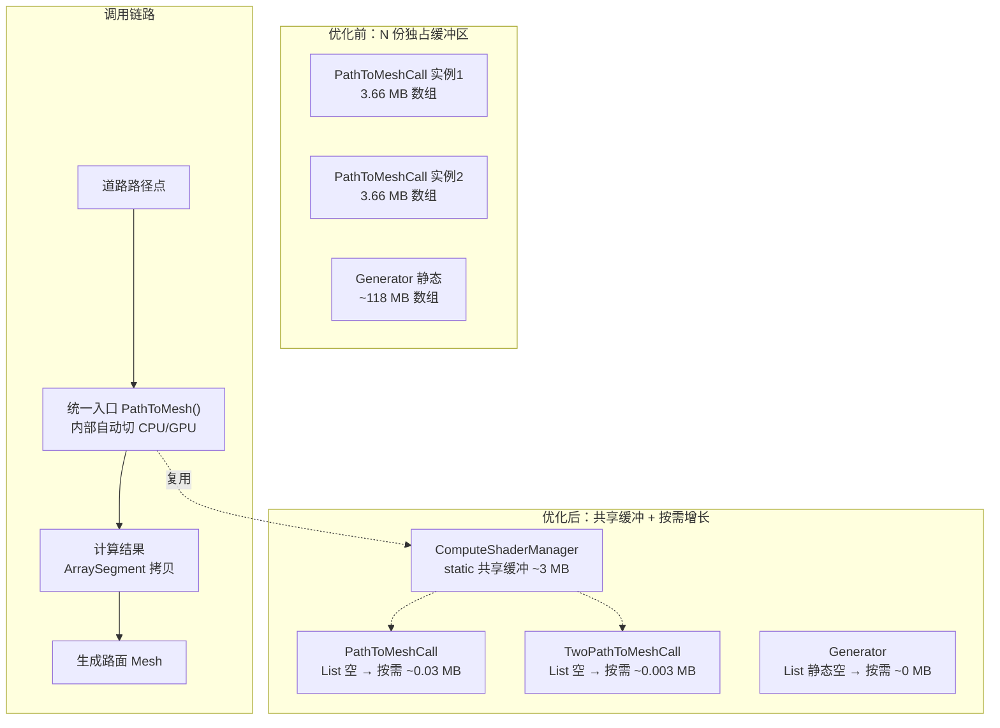


> 之前写《座舱3D HMI性能：高频消息GC优化——零分配热路径》的时候，咱们把"每帧流动的数据"给优化干净了，今天换个战场：**"一次性预分配的大块内存"**。这类问题有个特点：它不卡帧，不报错，就是安安静静地趴在你的托管堆里，等你的应用在低内存车机上被系统盯上。

> 真实的场景是这样的：地图渲染框架里，每一条道路都要把一串路径点"拉丝"成有宽度的路面网格。你画一条几公里长的路，可能只需要几百个顶点，但为了让这条路"无论多长都能画"，代码在最开始就按**理论最大值**给每个地块和每条道路预分配了一大片缓冲区，单这几块加起来，托管堆上就趴着 **100 多 MB** 的"死内存"。在 8295 这类内存不算宽裕的车机平台上，导航一开、道路一变，随时可能把应用推上 OOM 的悬崖。

> 更要命的是，内存优化做完了，又牵出一个"隐藏款"Bug：道路在急转弯、近 U-turn 处冒出一根根尖刺。查到最后发现，这是切线方向计算在小转角下退化成零向量导致的几何瑕疵，CPU 和 GPU 两套网格生成逻辑同时中招。

今天这篇按老规矩拆：问题表现 → 根因分析（3 个根因 + 代码证据）→ 方案设计 → 实现细节 → 效果对比 → 技术启示 → 结语。核心亮点四个：**① 每次构建分配新顶点缓冲区 ② ComputeShaderManager 内存未复用 ③ 急转弯切线方向退化导致尖刺 ④ CPU/GPU 双版本网格生成的一致性**。

---

# 问题表现

先还原现场。导航场景里，大地图由一堆可滚动加载的地块组成，每个地块里的每一条道路都要构建成一张带宽度的路面 Mesh：

```text
道路网格构建频率: 每次地图更新/道路切换
单条道路路径点: 通常 100~500 个（极限值被定为 49152）
Mesh 引用对象: PathToMeshCall / TwoPathToMeshCall 多实例并存
```

挂着 Profiler 扫一轮内存，随手就能看到这样的分配：

- `Generator` 类静态缓冲区一次预分配 **~104 MB**（顶点 80 MB + 索引 24 MB），类首次被访问就一次性扔进 Large Object Heap（LOH），永不释放
- 每条道路一个 `PathToMeshCall` 实例，独立持有 **~3.66 MB** 的数组（顶点 1.87 MB + 索引 1.13 MB + 路径点 0.66 MB）
- `TwoPathToMeshCall`（双线道路，比如路中带隔离带的那种）每实例 **~4.31 MB**
- N 条道路 = N 份完整的缓冲区，内存随道路**线性上涨**

真机（8295 平台）表现：

- 导航地图加载后，应用常驻内存莫名多出 100+ MB，内存水位线压力大
- 地图上道路刷新（路径规划变化、地块加载）时，多次大块分配触发 GC 停顿，画面"咯噔"一下
- 极端场景下（多条道路同时构建 + 其他模块也在 Build），逼近系统内存红线，有 OOM 风险

用 Profiler 切到"内存分配"视图，结论直白：**大头全部来自网格构建的预分配缓冲区，业务数据本身占比极低**。你花了 100 MB 预分配，最后只用了不到 1%，这种"招呼都不打一声的铺张"是最亏的。

# 根因分析

把网格构建链路从头捋一遍，总结出三个根因：

1. **PathToMeshCall / TwoPathToMeshCall 每个实例独立预分配大数组**：构造即按 MaxPoint 全职拿
2. **Generator 静态缓冲区按 1M 预分配 + ComputeShaderManager 内存未复用**：全局最大的浪费点
3. **急转弯处切线方向计算退化为零**：方向向量塌缩导致网格尖刺

## 根因一：PathToMeshCall / TwoPathToMeshCall 每实例独立预分配大数组

道路网格生成器在**构造时**就按照 `GeneratorDefine.MaxPoint`（= 8192 × 6 = 49152）把顶点缓冲区和三角形索引缓冲区一次性分配完：

```csharp
// 源码路径：Assets/Scripts/Map/PathToMeshCall.cs（示意代码，优化前）
public class PathToMeshCall
{
    // 每个实例独立预分配 MaxPoint = 49152 个顶点的数组
    private Vertex_PNTT[] _verticesBuffer = new Vertex_PNTT[GeneratorDefine.MaxPoint];     // 1.87 MB
    private int[] _trianglesBuffer = new int[GeneratorDefine.MaxPoint * 6];                // 1.13 MB

    // List 也按最大容量预分配
    private List<PointData> _pathBuffer = new List<PointData>(GeneratorDefine.MaxPoint / 2); // 0.66 MB

    // CPU 计算器也是每实例持有
    private readonly PathToMeshCpu _pathToMeshCpu = new PathToMeshCpu();
}
```

```csharp
// 源码路径：Assets/Scripts/Map/TwoPathToMeshCall.cs（示意代码，优化前）
public class TwoPathToMeshCall
{
    private Vertex_PNTT[] _verticesBuffer = new Vertex_PNTT[GeneratorDefine.MaxPoint];     // 1.87 MB
    private int[] _trianglesBuffer = new int[GeneratorDefine.MaxPoint * 6];                // 1.13 MB
    private List<PointData> _pointDataBuffer = new List<PointData>(GeneratorDefine.MaxPoint); // 1.31 MB

    private TwoPathToMeshCpu _twoPathToMeshCpu = new TwoPathToMeshCpu();
}
```

分析一下这样做的问题：

1. **预分配量远超实际需求**：`MaxPoint = 49152` 对应上限约 49152 个路径点，而单条道路通常只有几十到几百个点，**预分配量是实际使用量的 50~500 倍**。
2. **每实例独立持有**：场景里 N 条道路 = N 份完整缓冲区，内存随道路数量线性增长，顶点数据结构和它配套的缓冲区完全沦为"配重"。
3. **数组无法收缩**：用固定大小数组 `Vertex_PNTT[]`，无论实际用多少顶点，内存都按 MaxPoint 分配，且**无法收缩**。

## 根因二：Generator 静态缓冲区按 1M 预分配，ComputeShaderManager 不背锅却也不管

`Generator` 类的静态方法 `GenerateMesh` 是更大的雷，直接按 `BUFFER_SIZE = 1024 × 1024` 预分配顶点和三角形缓冲区，**这是全项目最严重的内存浪费点**：

```csharp
// 源码路径：Assets/Scripts/Map/Generator.cs（示意代码，优化前）
public static partial class Generator
{
    private const int BUFFER_SIZE = 1024 * 1024;   // = 1,048,576

    // 静态预分配：1M × 2 × 40 字节 = 80 MB !!!
    private static Vertex_PNTT[] vertexBuffer = new Vertex_PNTT[BUFFER_SIZE * 2];

    // 静态预分配：1M × 6 × 4 字节 = 24 MB !!!
    private static int[] trianglesBuffer = new int[BUFFER_SIZE * 6];

    private static List<PathInfo> _pathInfos = new List<PathInfo>(1);
    private static List<PointData> _pathBufferTemp = new List<PointData>(BUFFER_SIZE / 2);

    public static void GenerateMesh(Config config, MeshData.PNTT data, bool isClosePath = false)
    {
        // ...
        int count = ComputeShaderManager.PathToMeshComputer.Dispatch(
            _pathBufferTemp, _pathInfos, vertexBuffer, trianglesBuffer, isClosePath);
        // ...
    }
}
```

这块的账本特别扎心：

| 缓冲区 | 公式 | 字节数 | 约合 |
|--------|------|--------|------|
| `vertexBuffer` | 1,048,576 × 2 × 40 | 83,886,080 | **80 MB** |
| `trianglesBuffer` | 1,048,576 × 6 × 4 | 25,165,824 | **24 MB** |
| `_pathBufferTemp` capacity | 524,288 × 28 | 14,680,064 | **14 MB** |
| **合计** | | | **~118 MB** |

> 这 118 MB 在类首次访问时一次性砸进托管堆（LOH），且永不释放，哪怕只画一条 100 个顶点的路。

再看一眼"缓冲区复用"的责任方。优化前的 `ComputeShaderManager` 只暴露了 `PathToMeshComputer` 和 `TwoPathToMeshComputer` 的实例属性，**不做任何缓冲区管理**：

```csharp
// 源码路径：Assets/Scripts/Map/ComputeShaderManager.cs（示意代码，优化前）
public class ComputeShaderManager : MonoBehaviour
{
    private PathToMeshComputer _pathToMeshComputer;
    private TwoPathToMeshComputer _twoPathToMeshComputer;
    private bool _initialized;

    public static PathToMeshComputer PathToMeshComputer
    {
        get { return _instance._pathToMeshComputer; }
    }

    public static TwoPathToMeshComputer TwoPathToMeshComputer
    {
        get { return _instance._twoPathToMeshComputer; }
    }
}
```

每个 `Call` 类各自调用 `Dispatch()` 并传入**自己的** `_verticesBuffer` / `_trianglesBuffer`，缓冲区完全不互用，明明大家干的是同一件事，却各养各的固定资产。

## 根因三：急转弯处切线方向计算退化为零导致尖刺

内存问题解决完,渲染又冒出新毛病：道路在急转弯（转角 > 90°）和近 U-turn 处出现**超出路面宽度的尖刺状三角形**，180° 折返处路面甚至塌缩成一条线后又突然展开成尖针。

根因在 `PathToMeshCpu` 和 `PathToMeshComputer.compute` 计算每个路径点切线方向（direction）时用的**原版弦公式**：

```csharp
// 源码路径：Assets/Scripts/Map/PathToMeshCpu.cs（示意代码，优化前）
private void ProcessPath(int x, int y)
{
    // ...获取 current, next, previous 位置...

    // 原版弦公式：current - previous + next - current = next - previous
    Vector3 direction = (current - previous + next - current).normalized;

    PathToMeshComputer.PointData newPointData = _pointBuffer[currentIndex];
    newPointData.direction = direction;
    _pointBuffer[currentIndex] = newPointData;
}
```

```hlsl
// 源码路径：Assets/Shaders/PathToMeshComputer.compute（示意代码，优化前）
void ProcessPath(uint3 id, uint3 groupId)
{
    // ...获取 current, next, previous 位置...

    // 原版弦公式 — HLSL 版本
    float3 direction = normalize(current - previous + next - current);

    pointDataBuffer[currentIndex].direction = direction;
}
```

这个公式展开后等价于 `direction = normalize(next - previous)`，前后点之间的**弦方向**。两个退化场景：

### 场景 1：近 U-turn（180° 折返）：方向塌缩为零

```
路径点:      ... → A → B → C → ...
                       ↑
                  B 是折返点，A 和 C 几乎重合

previous = A, current = B, next = C
next - previous ≈ C - A ≈ 0（因为 A ≈ C）

direction = normalize(≈0) → 零向量或 NaN
```

后续网格生成里：

```csharp
Vector3 offset = Vector3.Cross(new Vector3(0, 1, 0), current.direction) * pathInfo.pathWidth;
// direction 为零 → offset 为零 → 左右顶点全部重合在 current.position
// 路面宽度塌缩为 0 → 尖针
```

### 2：急转弯（> 90° 但 < 180°）：cross-section 躺倒

即使 direction 不为零，在转角大于 90° 时，弦方向（前后两点的连线方向）会偏向**垂直于路径方向**。此时：

```csharp
// offset = Cross(up, direction) * pathWidth
// 当 direction 偏向垂直路径时，Cross(up, direction) 偏向沿路径方向
// → 路面横截面“躺倒”在路径方向上
// → 在急弯外侧产生超出正常宽度的尖刺三角形
```

**影响范围**：CPU 版本和 GPU 版本**同时中招**，因为两套代码用了同一个公式。实际表现：匝道汇入、掉头区域、急弯道路段出现明显的尖刺状路面。

# 方案设计

三条线同时推进：**① 缓冲区按需分配 + ② 共享复用 + ③ 切线方向自适应**。

## 核心思路

把"按最大上限预分配、人人独占"改成"**全局共享一份 + List 按需增长 + 计算入口统一**"，再给切线方向加一套"转角感知"的自适应策略：



三个关键设计决策：

| 设计决策 | 选择 | 理由 |
|----------|------|------|
| 大数组 → List 按需增长 | List 空初始，实际 Add 多少占多少 | 移除 LOH 常驻，利用率 ~100% |
| 每实例独占 → 静态共享 | 缓冲上移到 `ComputeShaderManager` 静态共享一份 | 多道路场景内存从 3N MB 降为 3 MB |
| CPU/GPU 双路径 → 统一入口 | `PathToMesh()` 自动按 `GPUComputeLimit` 分流 | 调用方无需关心，Buffer 复用一处落点 |

# 实现细节

## 方案一：PathToMeshCall / TwoPathToMeshCall 预分配改按需

### 1.1 固定数组 → 空 List

每个 Call 实例不再独立预分配 MaxPoint 大小的数组，改用空 List，**实际数据由 ComputeShaderManager 的共享静态数组填充后通过 `ArraySegment` 拷入**。

```csharp
// 源码路径：Assets/Scripts/Map/PathToMeshCall.cs（示意代码，优化后）
public class PathToMeshCall
{
    // 空 List — 初始 0 字节，按实际使用增长
    private List<Vertex_PNTT> _verticesBuffer = new List<Vertex_PNTT>();
    private List<int> _trianglesBuffer = new List<int>();

    // 容量从 MaxPoint/2（24576）降到 1024
    private List<PointData> _pathBuffer = new List<PointData>(1024);

    // CPU 计算器已移除，上移至 ComputeShaderManager 统一管理

    public void Post()
    {
        // 统一调用 ComputeShaderManager.PathToMesh()，内部决定 CPU/GPU
        // 缓冲区通过 ref 传入，由共享静态数组填充
        ComputeShaderManager.PathToMesh(
            _pathBuffer, _pathInfoBuffer,
            ref _verticesBuffer, ref _trianglesBuffer, _isClosePath);
        // ...
    }
}
```

```csharp
// 源码路径：Assets/Scripts/Map/TwoPathToMeshCall.cs（示意代码，优化后）
public class TwoPathToMeshCall
{
    private List<Vertex_PNTT> _verticesBuffer = new List<Vertex_PNTT>();   // 空
    private List<int> _trianglesBuffer = new List<int>();                 // 空
    private List<PointData> _pointDataBuffer = new List<PointData>(128);   // 从 49152 降到 128

    public void Post()
    {
        ComputeShaderManager.TwoPathToMesh(
            _pointDataBuffer, _layoutBuffer,
            ref _verticesBuffer, ref _trianglesBuffer);
        // ...
    }
}
```

### 1.2 List 初始容量收缩

第一轮改完后发现 List 初始容量仍然过于嚣张，第二轮再砍：

```csharp
// PathToMeshCall.cs
- private List<SizeData> _pathBuffer = new List<SizeData>(GeneratorDefine.MaxPoint / 2);  // 24576 → 0.66 MB
+ private List<SizeData> _pathBuffer = new List<SizeData>(1024);                           // 1024 → 0.027 MB

// TwoPathToMeshCall.cs
- private List<SizeData> _pointDataBuffer = new List<SizeData>(GeneratorDefine.MaxPoint); // 49152 → 1.31 MB
+ private List<SizeData> _pointDataBuffer = new List<SizeData>(128);                        // 128 → 0.003 MB
```

> **设计决策**：单条道路路径点通常 100~500 个，预分配 1024（PathToMesh）或 128（TwoPathToMesh）已覆盖绝大多数场景；超出时 List 自动扩容，偶发一次 `Array.Resize`，可以接受，不会崩。

### 1.3 Generator 静态大数组 → List

```csharp
// 源码路径：Assets/Scripts/Map/Generator.cs（示意代码，优化前后对比）
// ========== 优化前 ==========
private const int BUFFER_SIZE = 1024 * 1024;
private static Vertex_PNTT[] vertexBuffer = new Vertex_PNTT[BUFFER_SIZE * 2];   // 80 MB !!
private static int[] trianglesBuffer = new int[BUFFER_SIZE * 6];                // 24 MB !!

int count = ComputeShaderManager.PathToMeshComputer.Dispatch(
    _pathBufferTemp, _pathInfos, vertexBuffer, trianglesBuffer, isClosePath);

// ========== 优化后 ==========
private static List<Vertex_PNTT> vertexBuffer = new List<Vertex_PNTT>();       // 0 → 按需
private static List<int> trianglesBuffer = new List<int>();                     // 0 → 按需

int count = ComputeShaderManager.PathToMesh(
    _pathBufferTemp, _pathInfos, ref vertexBuffer, ref trianglesBuffer, isClosePath);
```

**104 MB 静态预分配直接清零**。`_pathBufferTemp` 仍保留 `BUFFER_SIZE / 2` 的 capacity（该 List 存储路径点数据），capacity 本身不算实际占用，直到 Add 才真正分配，内存压力大幅缓解。

## 方案二：ComputeShaderManager 统一缓冲区管理

### 2.1 共享静态数组 + 统一入口

原先分散在各 Call 实例中的大数组集中到 `ComputeShaderManager`，作为 **static 共享缓冲区**，所有 Call 实例共用一份；CPU 计算器也从各个 Call 类移入 Manager 单例化：

```csharp
// 源码路径：Assets/Scripts/Map/ComputeShaderManager.cs（示意代码，优化后）
public class ComputeShaderManager : MonoBehaviour
{
    private static ComputeShaderManager _instance;

    // GPU 计算器
    private PathToMeshComputer _pathToMeshComputer;
    private TwoPathToMeshComputer _twoPathToMeshComputer;

    // CPU 计算器（从各 Call 类移入此处，全局唯一）
    private PathToMeshCpu _pathToMeshCpu;
    private TwoPathToMeshCpu _twoPathToMeshCpu;

    // ★ 共享静态缓冲区 — 全局唯一一份，所有调用复用
    private static Vertex_PNTT[] _verticesBuffer = new Vertex_PNTT[GeneratorDefine.MaxPoint];  // 1.87 MB
    private static int[] _trianglesBuffer = new int[GeneratorDefine.MaxPoint * 6];              // 1.13 MB

    private void Awake()
    {
        _instance = this;
        // ...Initialize GPU computeShaders...
        _pathToMeshCpu = new PathToMeshCpu();
        _twoPathToMeshCpu = new TwoPathToMeshCpu();
    }

    // ★ 统一入口 — 内部决定 CPU/GPU，结果通过 ArraySegment 拷入调用方 List
    public static int PathToMesh(
        List<PointData> pointBuffer,
        List<PathInfo> pathInfo,
        ref List<Vertex_PNTT> vertices,
        ref List<int> triangles,
        bool isClosePath = false)
    {
        int count;
        if (pointBuffer.Count > GeneratorDefine.GPUComputeLimit || GeneratorDefine.ForcedGPU)
        {
            // GPU 路径：写入共享 _verticesBuffer / _trianglesBuffer
            count = _instance._pathToMeshComputer.Dispatch(
                pointBuffer, pathInfo, _verticesBuffer, _trianglesBuffer, isClosePath);
        }
        else
        {
            // CPU 路径：同样写入共享缓冲
            count = _instance._pathToMeshCpu.Dispatch(
                pointBuffer, pathInfo, _verticesBuffer, _trianglesBuffer, isClosePath);
        }

        // 将共享数组的有效部分拷入调用方的 List
        vertices.Clear();
        triangles.Clear();

        int verticesCount = 0;
        foreach (var info in pathInfo)
            verticesCount += (int)info.count;
        int vertexCount = verticesCount * 2;
        int triangleCount = verticesCount * 6 - pathInfo.Count * 6;

        vertices.AddRange(new ArraySegment<Vertex_PNTT>(_verticesBuffer, 0, vertexCount));
        triangles.AddRange(new ArraySegment<int>(_trianglesBuffer, 0, triangleCount));

        return count;
    }

    // TwoPathToMesh 同理
    public static int TwoPathToMesh(
        List<TwoPointData> pointData,
        List<LayoutInfo> layout,
        ref List<Vertex_PNTT> vertices,
        ref List<int> triangles,
        bool isClosePath = false)
    {
        // ...与 PathToMesh 结构一致...
    }
}
```

### 2.2 设计要点

| 设计决策 | 说明 |
|----------|------|
| **static 共享缓冲** | `_verticesBuffer` / `_trianglesBuffer` 全局仅一份（~3 MB），所有 Call 实例复用 |
| **CPU/GPU 路径统一入口** | `PathToMesh()` 内部根据 `pointBuffer.Count > GPUComputeLimit` 自动选择 CPU 或 GPU 计算，调用方无感知 |
| **CPU 计算器单例化** | `PathToMeshCpu` / `TwoPathToMeshCpu` 从每实例移入 Manager，全局唯一 |
| **ArraySegment 拷贝** | 共享数组计算完成后，通过 `ArraySegment<T>` 把有效部分拷入调用方 List，避免暴露内部数组 |
| **ref List 传参** | 调用方通过 `ref` 传自己的 List，方法内 Clear + AddRange 填充，无返回值依赖 |

> **共享的前提条件**：缓冲区使用是**串行**的，同一时刻只有一个 Call 在执行 Post()。车载导航的网格构建是逐条道路进行的，天然满足。

## 方案三：急转弯切线方向策略改进：入射方向封口

### 3.1 新策略：分段决策

**核心思路**：根据转角大小选择不同的切线计算策略：
- **转角 ≤ 90°（缓弯）**：使用平分线（miter join），保持干净的宽路
- **转角 > 90°（急弯 / 近 U-turn / 端点）**：使用入射方向 d1N 做封口（cap），cross-section 保持垂直于路径

```csharp
// 源码路径：Assets/Scripts/Map/PathToMeshCpu.cs（示意代码，优化后）
private void ProcessPath(int x, int y)
{
    // ...获取 current, next, previous 位置...

    // ★ 新策略：分离入射/出射方向，按转角自适应决策
    Vector3 d1 = current - previous; d1.y = 0;             // 入射方向（抹平 Y）
    Vector3 d2 = next - current;     d2.y = 0;              // 出射方向（抹平 Y）
    float d1L = d1.magnitude;
    float d2L = d2.magnitude;
    Vector3 d1N = d1L > 1e-12f ? d1 / d1L : Vector3.zero;   // 单位入射方向
    Vector3 d2N = d2L > 1e-12f ? d2 / d2L : Vector3.zero;   // 单位出射方向
    Vector3 bisector = d1N + d2N;                            // 平分线

    Vector3 direction;
    if (bisector.sqrMagnitude > 1e-8f && Vector3.Dot(d1N, d2N) >= 0f)
    {
        // 缓弯（转角 ≤ 90°）：平分线 miter
        direction = bisector.normalized;
    }
    else
    {
        // 急弯（转角 > 90°）/ 近 U-turn / 端点：入射方向封口
        direction = d1L > 1e-12f ? d1N : d2N;
    }

    PointData newPointData = _pointBuffer[currentIndex];
    newPointData.direction = direction;
    _pointBuffer[currentIndex] = newPointData;
}
```

GPU 版本（`PathToMeshComputer.compute`）逻辑**逐行镜像**：

```hlsl
// 源码路径：Assets/Shaders/PathToMeshComputer.compute（示意代码，优化后）
void ProcessPath(uint3 id, uint3 groupId)
{
    // ...获取 current, next, previous 位置...

    // ★ 与 CPU 版本完全一致的逻辑（HLSL 语法）
    float3 d1 = current - previous; d1.y = 0.0;
    float3 d2 = next - current;     d2.y = 0.0;
    float d1L = length(d1);
    float d2L = length(d2);
    float3 d1N = d1L > 1e-12 ? d1 / d1L : (float3)0;
    float3 d2N = d2L > 1e-12 ? d2 / d2L : (float3)0;
    float3 bisector = d1N + d2N;
    float bL = length(bisector);

    float3 direction;
    if (bL > 1e-8 && dot(d1N, d2N) >= 0.0)
    {
        // 缓弯：平分线 miter
        direction = bisector / bL;
    }
    else
    {
        // 急弯/近 U-turn/端点：入射方向封口
        direction = d1L > 1e-12 ? d1N : d2N;
    }

    pointDataBuffer[currentIndex].direction = direction;
}
```

### 3.2 前后对比

| 维度 | 优化前 | 优化后 |
|------|--------|--------|
| **公式** | `normalize(next - previous)` | 分离 d1/d2，按 `dot(d1N, d2N) ≥ 0` 分段决策 |
| **近 U-turn** | direction → 0，offset 塌缩为尖针 | fallback 到入射方向 d1N，封口不尖刺 |
| **急弯 > 90°** | bisector 偏向垂直路径，cross-section 躺倒 | 入封口，使 cross-section 保持垂直 |
| **缓弯 ≤ 90°** | 弦方向（非精确平分线） | 精确单位平分线 miter，路宽更均匀 |
| **零长度边** | normalize(0) → NaN | `d1L > 1e-12` 守卫，fallback 到另一方向 |
| **Y 分量** | 未抹平 | `d1.y = 0; d2.y = 0;` 投影到 XZ 平面 |

### 3.3 关键阈值

| 阈值 | 含义 |
|------|------|
| `1e-12f` | 方向向量长度下限，防止 normalize 零向量 |
| `1e-8f` | bisector 长度下限，判断平分线是否有效 |
| `dot(d1N, d2N) >= 0` | 转角 ≤ 90° 判定。dot ≥ 0 指入射/出方向夹角 ≤ 90° |

> **底层原理**：`dot(d1N, d2N) = cos(θ)`，θ 是入射与出射方向的夹角。`dot ≥ 0` 即 θ ≤ 90°，缓弯走 miter；`dot < 0` 即 θ > 90°，急弯走封口。这跟 2D 矢量图形的 join 策略一脉相承：小转角用 miter join（尖角连接）、大转角用 bevel join（斜切连接）。

# 效果对比

| 维度 | 优化前 | 优化后 | 降幅 |
|------|--------|--------|------|
| Generator 静态缓冲 | ~104 MB | ~0 MB（按需） | **100%** |
| 每个 PathToMeshCall 实例 | ~3.66 MB | ~0.027 MB | **99.3%** |
| 每个 TwoPathToMeshCall 实例 | ~4.31 MB | ~0.003 MB | **99.9%** |
| ComputeShaderManager 共享缓冲 | 0（分散在各实例） | ~3 MB（全局唯一） | 集中管理 |
| **总托管堆预分配** | **~112 MB+** | **~3 MB** | **~97%** |
| 急转弯/近 U-turn 路面 | 尖刺、塌缩 | 平滑 | 修复 |

# 技术启示

## 一、动态 Mesh 的内存管理最佳实践

1. **别按理论最大值预分配缓冲区**，除非确实需要零分配延迟。本案例中高频调用，但单次缓冲区可达 MB 级，选 List 更合理：

```
优化前:  Generator 预分配 102 MB → 实际使用 < 1 MB → 利用率 < 1%
优化后:  List 按需增长 → 初始 0 → 实际使用量即分配量 → 利用率 ~100%
```

2. **缓冲区共享优于实例独占**，前提是使用串行（同一时刻只有一个调用者）。
3. **`ArraySegment<T>` 是安全的数据切片**：零拷贝视图 + `List.AddRange(ArraySegment<T>)` 按需扩容拷贝，不暴露内部数组。
4. **List 初始容量要看统计分布**，取 P95/P99，别取上限：单路 100~500 点，1024 覆盖 P99；超额偶发一次 `Array.Resize` 可接受。

## 二、ComputeShader 在车载平台的使用注意

- **`GPUComputeLimit = 1024`**：少量顶点走 CPU 更快，省掉 GPU 数据上载/索引回读延迟
- **`ForcedGPU` 开关**：专给调试和兼容用（某些车机 GPU 不支持 ComputeShader）
- **CPU fallback 是必须的**：不能假设所有车载 GPU 都支持 ComputeShader
- **GPU ComputeBuffer 提前分配**：GPU 端 Buffer 创建/销毁开销大，适合一次性预分配；GPU 显存不计入托管堆、不触发 GC，但 `SetData`/`GetData` 有 PCIe 传输开销，顶点少的时候不值得走 GPU

## 三、CPU/GPU 双版本网格生成的一致性保障

本项目同一条算法同时维护 CPU（C#）和 GPU（HLSL）两套实现，必须完全一致：

| 维度 | CPU (C#) | GPU (HLSL) |
|------|----------|------------|
| 数据结构 | `struct PointData` | `struct PointData`（字段顺序一致） |
| 循环 | `for (int x = 0; x < info.count; x++)` | `[numthreads(16,1,1)]` + `id.x` |
| 向量类型 | `Vector3` | `float3` |
| 归一化 | `.normalized` | `normalize()` |
| 点积 | `Vector3.Dot()` | `dot()` |
| 长度 | `.magnitude` | `length()` |

保障手段：算法逻辑完全镜像、阈值常量统一（`1e-12f` / `1e-8f` / `dot >= 0`）、结构体定义镜像、**同一 commit 同时改两端**（同时动了 `PathToMeshCpu.cs` 和 `.compute`）。

调试建议：`GeneratorDefine.ForcedGPU = true` 强制走 GPU 路径对比结果；`GPUComputeLimit = 0` 全部走 GPU；**CI 里加一个 CPU/GPU 一致性校验**（对比 vertex/triangle 数据），防止后续改动把两套算法改岔。

## 四、Bug 案例：内存优化后"冒"出来的尖刺

这条值得单独讲。**内存优化本身是正确的，但优化完成后跑回归测试，马上在匝道、掉头区发现了尖刺**，这个 Bug 其实一直在，只是之前被"大缓冲区掩盖"（视觉上网格顶点太多、尖刺被淹没），一旦按需分配、网格顶点数变准，尖刺立刻显形。

这类"优化后暴露旧 Bug"的体验给咱们一条经验：**做内存/性能优化时要配套做一轮回归渲染验证**，因为分配方式变了，渲染结果可能跟着变，很多时候你以为只动内存，实际上把"表现层bug"也翻出来了。

# 结语

这次优化一步步把动态 Mesh 构建的内存分配从"~112 MB 静态预分配"打到"~3 MB 共享 + 按需"（~97% 下降），并顺手修复了急转弯处网格尖刺的几何瑕疵。方法论沉淀成三条：

- **分配看分布，复用看串行**：高频缓存预分配看 P95 而非上限，低频大缓冲共享优先
- **统一管入口**：CPU/GPU 双路径封装成一个方法，缓冲复用、分流逻辑只在一处
- **双版本必须同 commit 改**：CPU/GPU 双实现，任何逻辑变更必须两端同步，加 CI 一致性校验

对座舱 3D HMI 来说，内存不像帧率那么直观，但它决定的往往是"能不能活着跑完一次导航"，稳定的内存水位，比瞬时低帧更说明问题。

下一篇预告：这次共享缓冲区能成立的前提是"串行使用"，如果哪天地图更新改成并行，缓冲区的竞争和线程安全要怎么设计？咱们下周一聊。