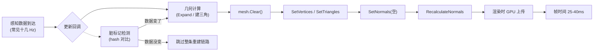

> 上一篇讲了材质实例化导致的泄漏问题。这篇说另一类性能开销：车道线 mesh 每次数据到达都全量重建，数据没变，CPU 白干。

---



# 问题表现

测试反馈：

> "帧率一直在 20fps 左右，不掉也不涨，但就是上不去。Profiler 里看也是每帧都高，没有哪一帧特别慢，就是整体都慢。"

# CPU Usage

打开 Profiler 数据，帧时间曲线的形态：

- 几乎每帧都在 25-40ms 区间，没有尖刺，呈现平整的高基线。
- 没有明显的 GC.Collect。

这说明 CPU 在持续做大量计算，不是临时分配的问题。

在 CPU Usage 展开视图中按 Self ms 降序排列，排在前面的节点：

*[配图见公众号原文]*

| 节点 | Self ms | 说明 |
|------|---------|------|
| 几何计算（Expand、建三角等） | 5-10 | 生成顶点和三角形数据 |
| `Mesh.SetVertices` | 3-8 | 托管到 Native 的数据拷贝 |
| `Mesh.SetTriangles` | 2-4 | 设置三角形索引 |
| `Mesh.RecalculateNormals` | 2-4 | 计算法线 |

这些加起来占了每帧十几到二十几毫秒。25-40ms 是整帧时间，包含渲染和其他系统开销，车道线重建链路（几何计算 + Mesh API）是主要模块。车道线段数越多，开销越大，跟段数大致成正比。

`SetNormals` 没有出现在热点里。调用虽发生，但传的是空数组，没有提供有效法线数据，开销可忽略。

# 数据流的节奏

先搞清楚数据到达的频率。车道线更新不是每渲染帧都跑，而是由感知数据回调驱动，频率以某次测试来看大约十几 Hz。当帧率掉到 20fps 左右时，感知回调几乎每次渲染帧都来一次，看起来像"每帧都在重建"，但本质是两种频率撞在了一起。如果感知频率降到 10Hz，就会隔帧触发。

搞清楚这个节奏，才能判断脏标记的收益边界：数据不变时跳过重建，能省下回调触发的完整链路。数据变化时仍然要重建，但至少不白干。

# 完整链路

感知数据到达后，经过两段代码完成车道线 mesh 的更新。

**第一段：创建几何数据。**

```csharp
// 示意代码
void OnDataArrived(Vector3[] points, float width, float unit) {
    RebuildSegment(points, width, unit);  // 每次回调都重建，没有变化检测
}

void RebuildSegment(Vector3[] points, float width, float unit) {
    mesh.Clear();   // 第一次 Clear
    var data = BuildRibbon(points, width, unit);  // Expand、建三角、算 UV
    ApplyToMesh(data, mesh);
}
```

**第二段：把数据写入 Mesh 实例。**

```csharp
// 示意代码
void ApplyToMesh(RibbonData data, Mesh mesh) {
    mesh.Clear();           // 第二次 Clear（双重 Clear）
    mesh.SetVertices(data.vertices);
    mesh.SetUVs(0, data.uvs);
    mesh.SetTriangles(data.triangles, 0);
    mesh.SetNormals(data.normals);     // normals 是空数组，调用但不做有效写入
    mesh.RecalculateNormals();         // 这才是法线来源
}
```

两段代码加在一起，每次数据到达都依次执行：几何计算 → `Clear`（两次）→ 全套 `Set*` → `RecalculateNormals`。几何计算（Expand、建三角）是 CPU 大头；`Set*` 把数据从托管推到 Native 侧；`RecalculateNormals` 再扫描一遍三角形算法线。

这里容易误判法线的关系。`BuildRibbon` 只生成 `vertices` 和 `triangles`，不生成法线。`RibbonData.normals` 默认是空数组，传给 `SetNormals` 相当于没有写入有效法线。真正给 Mesh 提供法线的是后面的 `RecalculateNormals`。

所以问题的核心是：每次数据到达都走一遍完整的几何计算 + `Clear` + 全套 `Set*`，即使数据跟上一次回调完全一样。数据没变，白干。

同一回调里还可能改了颜色和动画 offset。如果 mesh 重建跳过了，但颜色和 offset 的更新逻辑还在，不能直接把整段 Update 短路。脏标记只管 mesh 部分。

# 改法

两件事。

**第一，做脏标记，在几何计算之前短路。** 顶点序列算个 hash，没变就跳过整条重建链路：

```csharp
// 示意代码
private int _lastHash = 0;

void UpdateLine(Vector3[] points, float width, float unit) {
    int hash = ComputeHash(points, width, unit);
    if (hash == _lastHash) return;   // 数据没变，跳过整条重建链路

    _lastHash = hash;
    mesh.Clear();
    var data = BuildRibbon(points, width, unit);
    ApplyToMesh(data, mesh);
}
```

脏标记必须挂在几何计算之前。如果只包住 `ApplyToMesh`，几何计算的 CPU 开销（Expand、建三角）仍然会跑。hash 要覆盖所有影响 mesh 生成的参数：顶点坐标、宽度、unit（UV 周期）。如果感知数据带浮点噪声，可以先量化再 hash，否则 hash 几乎永不命中，脏标记等于没做。

**第二，平面 Mesh 用常数法线，跳过 `RecalculateNormals`。** 车道线用的是 Unlit 着色器，不依赖光照法线，因此可以用常数 `Vector3.up` 替代 `RecalculateNormals` 的结果。在 `BuildRibbon` 的出口预先填好法线数组，`ApplyToMesh` 里就不再需要 `RecalculateNormals`。

改完在 Profiler 里验证：`RecalculateNormals` 的热点消失了，`SetNormals` 的热点出现了。替换后是常数赋值，开销远小于 `RecalculateNormals` 的三角形扫描。

常数法线只适用于不依赖光照法线的材质（Unlit）。如果着色器用了法线贴图、反射、光照计算，仍然需要正确的法线。

# 验证方法

改前改后同一路段各录一份 Profiler 数据，看两件事：

1. **Mesh 相关节点的 Self ms 是否下降**。数据不变时，脏标记跳过重建，`SetVertices` / `SetTriangles` / `RecalculateNormals` 应该降到接近 0。
2. **平均帧时间是否下降**。脏标记跳过的重建越多，基线越低。

*[配图见公众号原文]*

# 同类问题

### 频繁 `new Mesh()`

`new Mesh()` 之后赋值给 `MeshFilter.mesh` 会触发新实例创建。应该复用 Mesh 实例，用 `SetVertices` 直接更新已有数据。`MeshFilter.mesh` 和 `sharedMesh` 的区别要留意——前者会克隆实例，后者返回共享引用。

### 不必要的 `RecalculateBounds`

现代 Unity 的 `SetVertices` 默认会自动更新 bounds，不需要显式调用。如果代码里手动调了 `RecalculateBounds`，可以去掉。

# 结语

`mesh.Clear()` 加全套 `Set*` 写法简单粗暴，每次数据到达都完整重建，数据没变也在白干。热路径上给每个重建加一个"数据变了没"的判断，没变就跳过。脏标记挂在几何计算之前，常数法线替换 Recalculate，两项加起来，基线就下来了。