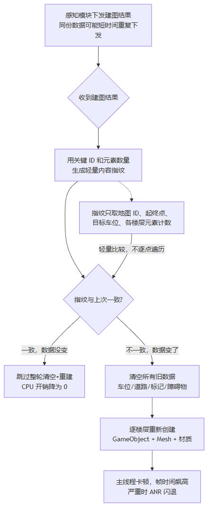

> Within the scope of 3D HMI performance and stability, this article shares a relatively small point — a fairly basic one, relatively speaking: in situations where you need to create meshes (Mesh), if you run into CPU-heavy performance problems, a selective mesh creation scheme is one option worth adding.

# The symptom

Tester feedback:

> "After memory parking finishes mapping and before the mapping result is displayed, the screen stutters abnormally for a long stretch, and CPU usage also spikes past 100%."

# CPU Usage

Open the Profiler data and look at the frame time curve. The hitch occurs exactly when the mapping result arrives. During the hitch, frame time shoots past 100ms, then slowly recovers.

Expand the CPU Usage Hierarchy view, sort by Self ms, and the stacks of the hitching frames look roughly like this:

- `GameObject.Instantiate` — creating large numbers of new objects
- `MeshRenderer.SetMaterial` / `Material`-related — assigning materials
- `GraphicsMesh.CreateLinePerformance` — creating road-line meshes
- `HPARoadController`, `HPAParkingSpaceController`, `HPARoadMarkController`, etc. — each module doing Clear + rebuild

These stacks share one notable feature: **they all show up in the same frame**. All the HPA mapping-related modules — parking spaces, roads, pillars, speed bumps, and so on — do their clear + rebuild in the same frame.

# Root cause analysis

The root cause is actually fairly obvious: it comes from the process of displaying the mapping result.

Specifically, HPA mapping results are huge: a complete `ParkingInfo` contains multiple floors, each floor with parking spaces, roads, road markings, obstacles, plus the trajectory start/end points and the target parking space. When `HandleHPAMap` receives the data, it first clears all the old data, then rebuilds floor by floor.

But cross-referencing the Profiler with logcat reveals this isn't a single rebuild — two or three arrive in a row within a short window. Each rebuild takes half a second to a second, and the screen freezes.

Why would the same data arrive multiple times in quick succession? Apparently the smart-driving side worries that large data transfers might fail, so the mapping result is sent repeatedly a few times. The MapId is identical every time, and at the time there was no other field to tell the 3D side whether the data had changed or whether an update was mandatory.

# The solution

Since the interface data doesn't provide an identifier directly, we have to compute one for ourselves. So we add a lightweight fingerprint comparison on the data: if the data hasn't changed, skip it outright — it never enters the processing pipeline.

```csharp
// Illustrative code
public void HandleHPAMap(string id, ParkingInfo parkingInfo) {
    string fingerprint = ComputeParkingMapFingerprint(mapIdKey, parkingInfo);

    // Matches the in-flight fingerprint; ignore the duplicate packet
    if (mapBuildCoroutine != null && fingerprint == inFlightMapFingerprint)
        return;

    // Matches the fingerprint of the last processed map; skip the rebuild
    if (fingerprint == lastMapFingerprint)
        return;

    InternalHandleHPAMap(mapIdKey, parkingInfo, fingerprint);
}
```

The fingerprint here is essentially a string assembled from the key values that capture data changes. In this scenario, I used the mapping result's mapId + the trajectory start/end coordinates + the counts of parking spaces, roads, and other elements:

```csharp
// Illustrative code
string ComputeParkingMapFingerprint(string mapIdKey, ParkingInfo info) {
    sb.Append("map:").Append(mapIdKey);
 // start/end points
 sb.Append("trace:")
.Append(traceStart.Lat).Append(",").Append(traceStart.Lon).Append("-")
.Append(traceEnd.Lat).Append(",").Append(traceEnd.Lon);
    // target parking space ID
    sb.Append("tp:").Append(targetParkingId); 
    // element counts per floor
    foreach (var floor in floors) {
        sb.Append(floor.id).Append(",ps:").Append(parkingSpaceCount)
          .Append(",rd:").Append(roadCount)
          .Append(",mk:").Append(markCount);
    }
    return sb.ToString();
}
```

To decide whether the mapping result changed, "map ID, start/end points, target parking space, per-floor element counts" is generally enough — no need to compare vertex coordinates point by point.



> One thing to note: compute the fingerprint before creating the mapping-result objects, not after. Otherwise, in an extreme case, the first build hasn't finished executing and the fingerprint hasn't even been generated yet when the second copy of the mapping data already arrives — and if the second parse starts at that point, there's no fingerprint to let you skip it.

# Extension — the drivable area

The same idea is also applied to drivable area (FreeSpace) rendering, especially when the data source is the checkerboard type. `DrivableAreaRenderer` performs change detection as soon as data arrives:

```csharp
bool HasDataChanged(byte[] newData) {
    if (lastData == null || lastData.Length != newData.Length)
        return true;

    // Compare first/last bytes first for a quick check
    if (lastData[0] != newData[0] ||
        lastData[lastData.Length - 1] != newData[lastData.Length - 1])
        return true;

    // Sampled comparison: take 32 evenly spaced points; return on the first difference
    int length = newData.Length;
    int step = length / 32;
    for (int i = step; i < length; i += step)
        if (lastData[i] != newData[i])
            return true;

    // Sampling passed; do a full comparison of the remainder
    for (int i = 0; i < length; i++)
        if (lastData[i] != newData[i])
            return true;

    return false;
```

`HasDataChanged` first compares the first/last bytes for a quick check, then confirms with sampled + full comparison.

# Closing thoughts

A rise in CPU isn't always a sign of badly written code — sometimes it's simply that the vertex computation workload at that moment is too heavy.

The skip-the-rebuild approach above may not suit things like the road lines, other vehicles, and other perception objects drawn during SR driving, because those objects change constantly while driving. That scenario, however, faces its own high-CPU performance challenge — so the next article will share how to handle that case.
