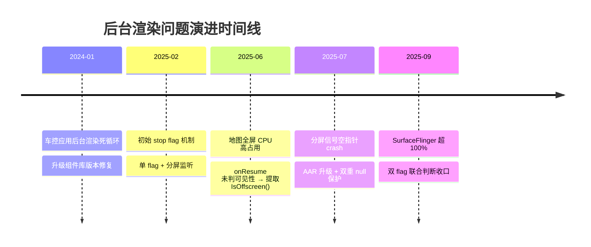
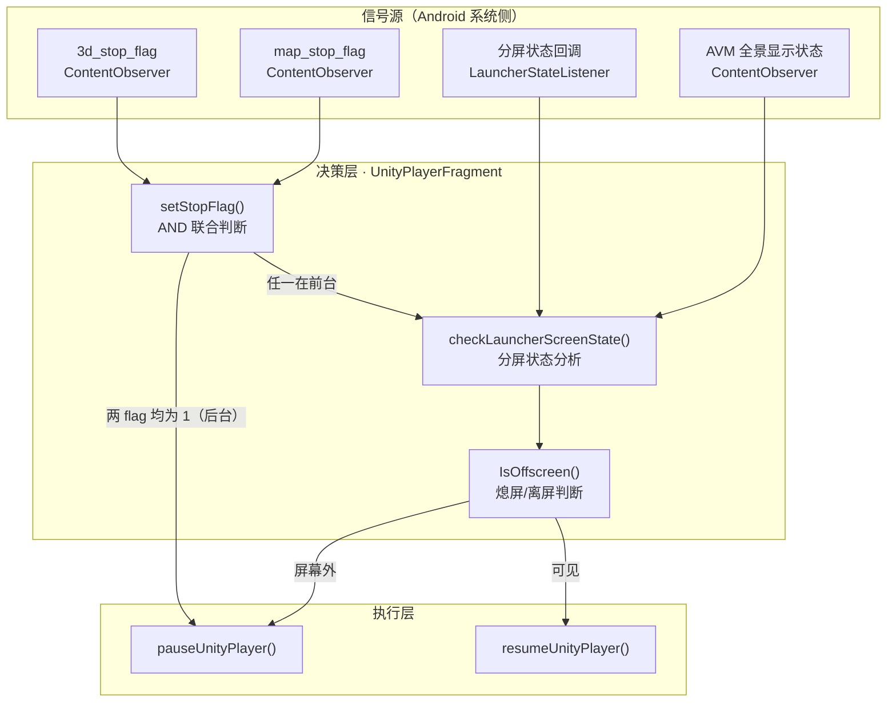


> 上一篇聊的是《黑屏 · binder 清理与锁竞争》，讲"画面出不来的问题"。这篇换个角度，聊"画面看不见了，但还在偷偷干活"的问题：后台渲染。
>
> 在车载 3D HMI 交付里，后台渲染几乎都是带头号的性能坑：
> - 地图全屏把 3D 盖得严严实实，`launcher3d` 进程的 CPU 还稳定吃掉 **30%**；
> - 打开、关闭一个应用，SurfaceFlinger 的 CPU 占用直接冲到 **100% 以上**，整个系统卡成动画片；
> - 更离谱的是，一个分屏信号的空指针，引发 app crash → 重启 → 再 crash 的无限循环，把 QNX 侧的进程数直接拉爆，连 hub 进程都被连带抬高。
>
> 这些问题的根子都指向同一件事：**3D 已经不可见了，渲染线程却还在不停地绘帧**。这篇就把这几个 Bug 串起来，复盘"后台渲染控制"从被动挨打到主动防御的全过程。

---

# 核心亮点（先划重点）

1. **onResume ≠ 可见**：车载多窗口环境下，"Activity 回到前台"和"3D 真的可见"是两码事。地图全屏时 `onResume()` 照常触发，3D 却在地图底下傻跑，CPU 30%。
2. **stop flag 多状态联合检查**：单 flag 管不住"地图在前台、3D 在后台"这类场景；`launcherStopFlag + mapStopFlag` 走 **AND 语义**联合判断，两个都在后台才直接暂停。
3. **IsOffscreen() 熄屏/离屏检测**：把"3D 在不在屏幕外"提取成独立方法，`onResume()` 先问一句"我在屏幕外吗"，在屏幕外就不 resume。
4. **双重 null 保护**：分屏回调参数判空 + Kotlin 侧先取引用再判空，堵死 crash → 重启 → crash 的循环，QNX 进程暴增随之消失。

---

# 一、问题表现：四个 Bug，一条主线

先上一张总览表，把四个问题一次摆清楚：

| Bug | 现象 | 量化数据 | 影响 |
|------|------|---------|------|
| ① 地图全屏后台占用 | 地图覆盖后 3D 仍在绘帧 | `launcher3d` 进程 CPU 持续 **≈30%** | 每次进地图全屏必现，直到切回 3D 才降 |
| ② 开关应用卡顿 | 打开/关闭其他应用时整系统卡顿 | SurfaceFlinger 进程 CPU **超过 100%** | 高频开关应用场景，全系统流畅度受损 |
| ③ 分屏信号空指针 | 分屏切换时偶发 crash | crash→重启循环，**QNX 进程暴增**，hub 进程被拉高 | 严重时 QNX 侧 hub 服务异常 |
| ④ 车控后台绘帧 | 车控应用在后台不停 render | SurfaceFlinger CPU 占比偏高 | 车控大量依赖组件库，后台能耗失控 |

## 时间线：这不是一蹴而就的 Bug，是一路打怪升级



大家可以感受一下这个节奏：**先补一把"后台就在 root"的 flag，发现 flag 太粗；再补"可见性判断"，发现分屏信号会崩；修完崩，又发现一个 flag 不够用**。每一轮都是上一轮方案的场景遗漏逼出来的。后面我会把这四层演进完整拆开。

---

# 二、根因分析：为什么后台还在渲染？

## 根因一：onResume ≠ 可见（Bug ①）

**问题描述**：地图全屏时，`launcher3d` 持续占约 30% CPU。用户从其他应用返回 Launcher 时系统触发 `onResume()`，但此时 3D 实际被地图全屏盖在屏幕外。

**代码证据（修复前）**：

```java
// 源码路径：launcher3d/src/main/java/com/vehicle/unity/UnityPlayerFragment.java（修复前）
@Override
public void onResume() {
    Log.e(TAG, "----onResume()----");
    super.onResume();
    // 直接 resume，根本不判断 3D 是否在屏幕外
    resumeUnityPlayer();
}
```

**问题本质**：`onResume()` 是 Fragment 生命周期回调，Activity 从后台回前台就会触发。但在车载多窗口场景下，"Activity 回前台" ≠ "3D Fragment 可见"。地图全屏时 Launcher Activity 可能还活着，3D Fragment 的 `onResume()` 被触发，可 3D 早就被地图压到屏幕下面了，于是一个看不见的 3D，堂堂正正地把 CPU 吃掉了 30%。

## 根因二：单 flag 判断漏洞（Bug ②）

**另一个 bug**：开关应用时 SurfaceFlinger 超过 100%。初始 stop flag 机制只用了单个 `launcherSRStopFlag`。

**代码证据**（初始 commit，逻辑本身就有点拧巴）：

```java
// 源码路径：launcher3d/src/main/java/com/vehicle/unity/UnityPlayerFragment.java（初始版本）
private int launcherSRStopFlag;   // 只有一个 flag

private void setLauncherStopFlag(int stopFlag) {
    if (launcherSRStopFlag == stopFlag) return;
    launcherSRStopFlag = stopFlag;

    // flag=0（前台）时去查分屏，flag=1（后台）时直接 pause
    if (launcherSRStopFlag == 0) {
        checkLauncherScreenState();    // 可能 resume，也可能 pause
    } else {
        pauseUnityPlayer();
    }
}
```

这里有两个致命盲区：

- **缺 `map_stop_flag`**：地图全屏时系统把 `3d_stop_flag` 置 1，但地图自身的 `map_stop_flag` 没纳入判断。3D 停了，可地图还在前台渲，两个渲染线程同时往 SurfaceFlinger 提交帧 → SurfaceFlinger 负载飙升。
- **场景无法区分**：单 flag 分不清"3D 后台 + 地图前台"和"3D 后台 + 地图后台"。前者不该停地图（3D 该 resume 到分屏），后者才应该全停。

## 根因三：分屏信号空指针 → crash 循环（Bug ③）

**另一个问题**：`launcher3d` crash，QNX 下该进程数量暴增，连带 hub 进程被拉高。

**代码证据**（修复前）：

```java
// 源码路径：launcher3d/src/main/java/com/vehicle/unity/UnityPlayerFragment.java（修复前）
LauncherStateManager.getInstance().setLauncherStateListener(splitScreenState -> {
    this.splitScreenState = splitScreenState;
    // 直接访问，未判空 → splitScreenState 为 null 时 NPE
    if (splitScreenState.getFullyLauncherTaskType() == 0 || ...)
        pauseUnityPlayer();
    ...
});
```

**问题本质**：分屏状态是 `LauncherStateListener`（一个 AAR 库）通过回调投递的。库在初始化阶段或状态切换的间隙，回调里传的 `splitScreenState` 可能是 null；我们这边不做防御直接 `.getFullyLauncherTaskType()`，当场 NPE crash。crash 后系统拉起进程，起来又走到同一段路又崩……循环往复，QNX 侧的进程数量就像滚雪球一样暴增，负责托管/监控子进程的 hub 进程也被连坐拉高。

## 根因四：组件库后台死循环（Bug ④）

**Bug 描述**：车控应用在后台时仍不停 render 绘帧，SurfaceFlinger CPU 占比偏高。

**代码证据**（`framework/versions.gradle` 的版本升级记录）：

```java
// 源码路径：framework/versions.gradle
// 修复前：组件库版本
"vehicle-8295-version" : "2023.12.14.12",
// 修复后：组件库 bugfix 版本
"vehicle-8295-version" : "2024.01.04.01",
```

**问题本质**：8295 平台组件库内部存在死循环逻辑：车控应用大量使用组件库的 UI 控件，每个控件实例都挂渲染回调；应用切入后台后这些回调没被移除，形成"无效渲染 → SurfaceFlinger 合成 → CPU 占用"的恶性循环。commit 里的 root cause 写得很直白：*组件库内出现死循环，车控内大量使用*，solution 是 *组件库内去除非必要的后台渲染*。

---

# 三、方案设计：后台渲染控制架构

## 3.1 核心思路

一句话概括：**让"3D 不可见"和"停止渲染"之间建立一条可靠、防抖、多信号融合的控制链路**。

三个信号源一起喂决策：

1. **stop flag**：`Settings.Secure` 里的 `3d_stop_flag`（3D 是否后台）、`map_stop_flag`（地图是否后台），负责"应用级"的前后台状态；
2. **分屏状态**：Launcher 分屏回调里的 `fullyLauncherTaskType` / `topLeftTaskType` / `bottomRightTaskType`，负责"窗口级"的可见性；
3. **AVM 全景状态**：另一路 ContentObserver，负责特殊功能界面（如全景影像）的覆盖判断。

## 3.2 渲染控制架构图（mermaid）



## 3.3 stop flag 联合判断矩阵

| `launcherStopFlag` | `mapStopFlag` | 判断结果 |
|:---:|:---:|---|
| 0（3D 前台） | 0（地图前台） | `checkLauncherScreenState()` 分屏再判断 |
| 0（3D 前台） | 1（地图后台） | `checkLauncherScreenState()` 分屏再判断 |
| 1（3D 后台） | 0（地图前台） | `checkLauncherScreenState()` 分屏再判断 |
| 1（3D 后台） | 1（地图后台） | `pauseUnityPlayer()` **直接暂停** |

**矩阵设计要点**：这是个典型的 **AND 语义**。只有 3D 和地图都标记为后台时才确定性地暂停；只要有一方在前台，就把判断权交给分屏状态（因为 3D 可能正出现在分屏的某一边，此时不该停）。这样避免了单 flag"一刀切"的误判，也回避了竞态中间态的歧义。

---

# 四、实现细节

## 4.1 stop flag 演进：从单 flag 到双 flag AND 联合

**初始版（单 flag）**只在 `3d_stop_flag` 变化时改变自身行为，问题前面已经分析过。**修复版**引入 `mapStopFlag`，把两个 flag 一起拉进 `setStopFlag()`：

```java
// 源码路径：launcher3d/src/main/java/com/vehicle/unity/UnityPlayerFragment.java（修复版）
private int launcherStopFlag = 0;   // 3D 后台 flag（0=前台, 1=后台）
private int mapStopFlag = 0;        // 地图后台 flag（0=前台, 1=后台）

private void setStopFlag(int stopFlag, int mapStopFlag) {
    if (launcherStopFlag != stopFlag)
        launcherStopFlag = stopFlag;
    if (this.mapStopFlag != mapStopFlag)
        this.mapStopFlag = mapStopFlag;

    // AND 联合判断：两个 flag 都为 1 才真正暂停
    boolean isStop = launcherStopFlag == 1 && this.mapStopFlag == 1;

    if (isStop) {
        pauseUnityPlayer();          // 3D 和地图都在后台 → 直接 pause
    } else {
        checkLauncherScreenState();  // 至少一个在前台 → 交给分屏状态判断
    }
}
```

两个 flag 各自挂独立的 ContentObserver，互不阻塞：

```java
// 监听 3D 后台 flag
launcherStopObserver = new ContentObserver(mHandler) {
    @Override
    public void onChange(boolean selfChange) {
        int stopFlag = Settings.Secure.getInt(
                Utils.getApp().getContentResolver(), "3d_stop_flag", 0);
        // 这里还会做一些业务副作用（退出场景编辑、收起侧边栏），省略
        int mapStopFlag = Settings.Secure.getInt(
                Utils.getApp().getContentResolver(), "map_stop_flag", 0);
        setStopFlag(stopFlag, mapStopFlag);   // 两个 flag 都读到再统一判断
    }
};

// 监听地图后台 flag（结构一致，省略重复代码）
mapStopObserver = new ContentObserver(mHandler) { ... };

Utils.getApp().getContentResolver().registerContentObserver(
        Settings.Secure.getUriFor("3d_stop_flag"),  true, launcherStopObserver);
Utils.getApp().getContentResolver().registerContentObserver(
        Settings.Secure.getUriFor("map_stop_flag"), true, mapStopObserver);
```

为什么要用 `Settings.Secure` 而不走 Binder？这种"简单的状态标记"跨进程场景，`Settings.Secure` 天然适合：系统 SettingProvider 帮你解决了多进程读写 + 变化通知，比自建 Binder 服务的成本低一个数量级。前面的文章讲过 binder 有锁竞争的坑，这里能用系统机制就尽量别自己造轮子。

## 4.2 IsOffscreen()：把"熄屏/离屏判断"抽成公共方法

Bug ① 的教训是：resume 之前必须先回答"3D 现在到底可不可见"。于是把分屏判断逻辑从 `checkLauncherScreenState()` 提取成独立方法 `IsOffscreen()`，供 `onResume()` 复用：

```java
// 源码路径：launcher3d/src/main/java/com/vehicle/unity/UnityPlayerFragment.java
// 熄屏/离屏检测：返回 true 表示 3D 不在可见区域，应当暂停
private boolean IsOffscreen() {
    // ① 两 flag 都后台（地图也在后台）→ 离屏，直接暂停
    if (this.mapStopFlag == 1 && this.launcherStopFlag == 1) {
        return true;
    }
    // ② 全屏场景：只有 3D 全屏（=1）才不暂停，地图/壁纸全屏都是离屏
    if (fullyLauncherTaskType != -1) {
        return fullyLauncherTaskType != 1;
    }
    // ③ 分屏场景：3D 在任一分屏区域都算可见
    return !(topLeftTaskType == 1 || bottomRightTaskType == 1);
}

@Override
public void onResume() {
    super.onResume();
    if (IsOffscreen()) {
        Log.w(TAG, "onResume, but 3D is offscreen, skip resume");
        return;              // 屏幕外 → 不恢复渲染
    }
    resumeUnityPlayer();     // 屏幕内 → 正常恢复
}
```

这个方法的妙处在于**分层决策**：先做 O(1) 的 flag 快速判定（大多数情况一下就出结果），再做分屏状态的详细分析，逻辑清晰又不纠缠。

同步修了初始化默认值的坑：状态变量必须显式初始化成"前台安全态"，不然启动瞬间可能误判成离屏而停掉渲染，或者误判成可见而在后台猛跑：

```java
// 修复前：默认 -1 表示"非全屏"，容易误判
private int fullyLauncherTaskType = -1;
private int topLeftTaskType = -1;

// 修复后：默认值 = 3D 在前台的保守状态
private int launcherStopFlag = 0;          // 默认前台
private int fullyLauncherTaskType = 1;     // 默认 3D 全屏（可见）
private int topLeftTaskType = 1;           // 默认 3D 在上层
```

## 4.3 双重 null 保护：Java 侧 + BridgeCallback 侧

Bug ③ 的修复分两层，把"N-P-E"两个字从路径上抹掉：

**第一层：Java 侧（UnityPlayerFragment），回调参数先判空**：

```java
// 源码路径：launcher3d/src/main/java/com/vehicle/unity/UnityPlayerFragment.java（修复后）
LauncherStateManager.getInstance().setLauncherStateListener(splitScreenState -> {
    if (splitScreenState == null) {
        Log.w(TAG, "addLauncherStopFlagListener: splitScreenState is null");
        return;                       // 直接丢弃，绝不 crash
    }
    mHandler.post(() -> setSplitScreenState(splitScreenState));  // 切回主线程处理
});
```

**第二层：Bridge 回调（Kotlin），链式调用拆成"先取引用再判空"**：

```kotlin
// 源码路径：launcher3d/src/main/java/com/vehicle/launcher/bridge/BridgeCallback.kt（修复后）
val state = LauncherStateManager.getInstance().screenSplitState
if (state == null) {
    Log.w(TAG, "screenSplitState is null")
    return@runOnUiThread
}
val isFullyLauncher = state.isFullyLauncher
val leftIsLauncher = state.topLeftTaskType == 1
val rightIsLauncher = state.bottomRightTaskType == 1
```

修复前是这样的刺眼写法，一行一个 NPE 机会：

```kotlin
// 修复前：链式调用 + 每次重新 getInstance()，null 时必崩
val fullyLauncher =
    LauncherStateManager.getInstance().screenSplitState.isFullyLauncher
```

顺带升级了状态库 AAR（`prebuilt/launcherstatelistener-release.aar`，29326 → 29130 bytes，移除了导致状态为空时仍回调的内部逻辑），从源头降低 null 概率。**双重防御**：源头上减少 null，调用侧兜住 null。

## 4.4 组件库兜底：升级版本，把死循环灭在库里

车控应用的问题没法用 Launcher 自己的 stop flag 解决，人家不用我们的 Fragment。这类"后台还在渲"的病根在组件库：控件实例挂的渲染回调，切后台时没移除，形成了死循环。

```gradle
// 源码路径：framework/versions.gradle
"vehicle-8295-version" : "2023.12.14.12"  // 旧版
"vehicle-8295-version" : "2024.01.04.01"  // 新版：组件库内去除非必要后台渲染
```

修复策略是**直接在组件库内部去非必要后台渲染逻辑**，靠版本升级把补丁带给所有依赖应用，一劳永逸。这里有个明显的取舍：

| 修复层 | 优点 | 缺点 |
|-------|------|------|
| 应用层（stop flag） | 精确控制单个应用 | 每个应用都要单独适配 |
| 组件库层（版本升级） | 所有应用自动获益 | 无法针对单个应用定制 |
| **两者结合** | 主应用精细控制 + 依赖库批量兜底 | 维护成本稍高 |

本项目最终就是**两者结合**：3D Launcher 靠 stop flag 精确控制，车控等应用靠组件库升级批量修复。

## 4.5 别忘了注销：ContentObserver 的对称管理

注册和注销永远成对出现，不然宿主 Fragment 销毁后观察者还挂着，轻则漏回收，重则收到过期事件触发异常渲染：

```java
// Fragment onDestroyView 时统一注销（省略判断逻辑）
private void removeStopFlagListener() {
    LauncherScreenStateManager.INSTANCE.removeScreenStateCallback(listener);
    if (launcherStopObserver != null) unregisterContentObserver(launcherStopObserver);
    if (mapStopObserver        != null) unregisterContentObserver(mapStopObserver);
    if (avmShowStatusObserver  != null) unregisterContentObserver(avmShowStatusObserver);
}
```

---

# 五、技术启示：后台渲染控制四层最佳实践

每次复盘都想沉淀点"放到下个项目还能用"的东西。这次我把它总结成四层：

## 第一层 · 认知层：onResume ≠ 可见，别拿手机思路套车机

手机上的 `onResume()` 基本等于"我可见了，可以渲染了"；但车载多窗口（分屏/地图全屏/壁纸覆盖）下，这个等式不成立。**凡是想在 Activity/Fragment 生命周期里控制渲染的，都必须先回答：我到底在不在屏幕上？**

```java
// 错误假设
@Override public void onResume() { super.onResume(); resumeUnityPlayer(); }

// 正确处理
@Override public void onResume() {
    super.onResume();
    if (IsOffscreen()) return;   // 先判可见性
    resumeUnityPlayer();
}
```

## 第二层 · 设计层：多信号 AND 语义，别拿单 flag 当万能药

单 flag 的局限：语义不完整、无法表达中间态、还容易逻辑反转。多 flag 联合判断的三个原则：

- **AND 语义**：所有相关 flag 都为后台才确定暂停；任一在前台就交给更细致的可见性判断；
- **分层判断**：先 O(1) flag 快判，再做分屏状态分析，快路径优先；
- **独立监听**：每个信号独立 ContentObserver，互不阻塞、按需并入统一决策入口。

| 信号来源 | 判断内容 | 实现 |
|---------|---------|------|
| `3d_stop_flag` | 3D 是否标记为后台 | Settings.Secure + ContentObserver |
| `map_stop_flag` | 地图是否标记为后台 | Settings.Secure + ContentObserver |
| `fullyLauncherTaskType` | 全屏时哪个 Task 在前 | LauncherStateListener 回调 |
| `topLeftTaskType` / `bottomRightTaskType` | 分屏上下半区分别是什么 | LauncherStateListener 回调 |

## 第三层 · 防御层：判空、默认值、注销，一个都不能少

- 所有回调参数一律判空，**不要信任任何第三方库的状态回调**；
- 链式调用拆成"先取引用、再判空、再使用"三步；
- 状态变量显式初始化为安全默认值（前台态），杜绝"默认值误判"；
- ContentObserver / 监听器注销与注册成对出现。

```kotlin
// 防御三连：取引用 → 判空 → 使用
val state = Listener.getInstance().screenSplitState
if (state == null) return
val x = state.isFullyLauncher
```

## 第四层 · 架构层：应用层精准控制 + 依赖层批量兜底

后台渲染问题的修复位置，决定了你能覆盖多少面：

- **应用层**（Launcher 自己）：stop flag + IsOffscreen() 精准控制，把"不可见的自己被渲染"挡在门外；
- **依赖层**（组件库）：把"渲染回调未移除/死循环"从源头修掉，版本升级全量受益；
- **系统层观测**：SurfaceFlinger CPU、`launcher3d` CPU、QNX 进程数，三块仪表盘兜底监控异常。

三管齐下，靠单一手段永远堵不住"后台渲染"这种多来源问题。

---

# 结语

回看这四个 Bug，其实是一场认知升级：

- 第一回合，我们以为"前台跑、后台停"就够了（单 flag）；
- 第二回合，发现可见性才是本质（IsOffscreen）；
- 第三回合，发现状态回调本身不可信（null 保护）；
- 第四回合，发现根本问题是"渲染责任没分层"（组件库 + 应用层）。

**后台渲染控制的本质，是把"状态可见性"变成"渲染开关"之间的一道严谨判决：多信号交叉验证、AND 语义收口、防御式兜底。** 没有这个判决，3D 就会在最不该跑的地方拼命跑，CPU 悄悄烧掉、SurfaceFlinger 被塞满、甚至把系统进程拖垮。

最后送一句踩坑心得：性能问题排查时，**"看不见它还能不能分清它是死是活"**，先问一句"它在不在屏幕上"，往往比扎进 Profiler 里调帧率更快定位。屏幕都看不见了，先停帧，再谈优化。

（性能数据：CPU 30%、SurfaceFlinger >100%、QNX 进程暴增均来自案发时实测；文中代码已按工艺脱敏，仅保留技术骨架。）