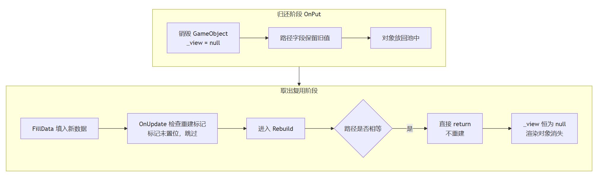

> 之前写了引用池可能存在的漏洞，这篇针对对象池的内存控制问题，分享由它引起的内存控制问题。

在SR的性能打磨之路上，面对感知目标有时会很多，过个路口又突然变得很少。在这种生成物数量剧烈变化的情景下，为了少让 GC 触发，我们把业务中的生成物对象都用上了对象池。但先后出现过两种异常：一个是内存升到1G以上未见回落，一个是场景里的感知物突然消失。

---

# 一、内存依然升高

SR 应用通过 UDP 高频接收 Android 端的消息，跑上几十分钟，内存一路爬升，稳定期也到了1G左右。这个数字明显不正常。

## 定位

消息解析入口：

```csharp
switch (kind[0])
{
    case '1':
        // ❌ 每条消息 new 一个，用完就丢给 GC
        packet = new IntMessage();
        packet.Decode(json.ToString());
        break;
    // case '2'、'3' 同样是 new DoubleMessage、new StringMessage
}
```

三种消息，全部都是直接 new。消息一来就 new 一个，用完丢给 GC。

## 根因

这里就是在消息处理上大意了，对象只生成，并没真的用上对象池。同类业务情况的正确做法是：

```csharp
var msg = MessagePool.Get<SomeMessage>();
msg.Decode(reader);
```

在一套工程里，存在两套写法，其中一套明显是不对的。这边十几甚至几十 Hz 的消息流，每秒产生成百上千个临时对象，内存就一路涨。

## 解法

给三个消息类各补一个工厂方法 Create() ，把取对象的操作交给对象池去完成：

```csharp
public static IntMessage Create()
{
    return MessagePool.Get<IntMessage>();
}
```

再把工程里所有 new 换掉。解析入口：

```csharp
case '1':
    packet = IntMessage.Create();   // ✅ 从池里取
    packet.Decode(json.ToString());
    break;
```

发送端同理：

```csharp
var msg = StringMessage.Create();
msg.Kind = kind;
msg.Payload = payload;
sender.Send(msg);
```

所以，要创建，就要想到对象池/引用池，只要代码里还有一处 new，就可能残留隐患。

---

# 二、感知物突然消失

## 现象

另一个报出来的问题是路试时的感知物突然不显示了，SR 界面还可见一些卡顿。

## 定位

翻提交记录，出问题的版本正好是接对象池的那次。查回收的逻辑代码：

```csharp
public override void OnPut()
{
    foreach (var binder in _binders)
    {
        binder.Put(Data);
    }
    // 新增：回收时把 GameObject 还给工厂
    if (_gameObject != null)
    {
        Context.GetPrefabPool().Dispose(_gameObject);
        _gameObject = null;
    }
    base.OnPut();
}
```

这么写的初衷是 GameObject 属于比较重的对象，那么归还时就顺手还掉，但只做了归还，没对下次要重建做任何交代。

## 根因

重建这个方法，带一个跳过判断：

```csharp
private void Rebuild()
{
    string prefabPath = Context.GetStyleSystem().GetStyle(StyleName).PrefabPath;

    // ❌ 路径没变就跳过，不看对象还在不在
    if (_prefabPath == prefabPath)
    {
        return;
    }
    // ... 创建 GameObject、挂接数据绑定器
}
```

对象池提供 OnGet 与 OnPut 两个生命周期钩子。Rebuild 不属于对象池取出阶段，取出阶段仅将新目标的名字写入数据对象。

GameObject 的构建时机位于使用阶段。OnUpdate 中检测到构建需求时，调用 Rebuild 完成 GameObject 实例化与挂接。该机制中，对象池取出这个动作仅保证数据对象可用，渲染实体的构建依赖后续检测条件触发。

因此，从对象池取出对象不代表渲染实体已就绪，两者之间存在构建判断环节。



## 解法

归还的时候，销毁必须配上重建标记，顺手清掉旧路径：

```csharp
public override void OnPut()
{
    foreach (var binder in _binders)
    {
        binder.Put(Data);
    }
    if (_gameObject != null)
    {
        Context.GetPrefabPool().Dispose(_gameObject);
        _gameObject = null;
    }
    NeedRebuild = true;    // ✅ 销毁配重建标记
    _prefabPath = null;    // ✅ 清旧路径，防复用误判
    base.OnPut();
}
```

复用侧，跳过条件补全：

```csharp
// ✅ 路径没变，且对象还在，才允许跳过
if (_prefabPath == prefabPath && _view != null)
{
    return;
}
```

归还时做的任何销毁，都要在取出侧找到它对应的代码进行比较。

---

# 结语

对象池的生命周期要同时考虑取、还两个环节，在复用条件上需要思考的不只是资源资产层面的相等，还要思考资源渲染、状态层面的变化。