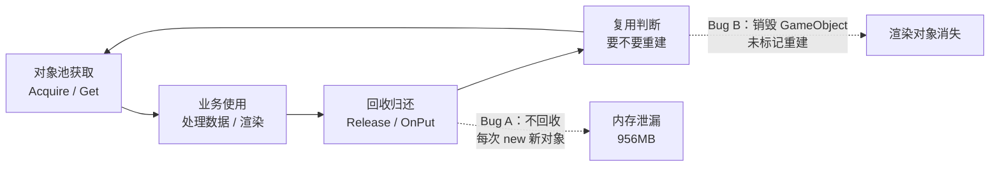


---

> 做3D HMI的，谁还没被对象池坑过呢？对象池的初衷很简单：对象用完别丢，放回池里，下次用的时候直接捞，省掉 new 的开销和 GC 压力。
>
> 但“放回池里”这四个字，说起来轻飘飘，做起来全是坑。
>
> 这次要聊的两个线上Bug，一个回收太宽松，该回收的不回收，内存一路涨到 **956MB**；另一个回收太激进，连 GameObject 一起回收销毁了，结果渲染对象**直接消失**。
>
> 一左一右，恰好把“回收策略的度”这两个极端都踩了个遍。

---

# 对象池的“两个极端”

先给个全景。两个 Bug 可以精炼成一张表：

| 维度 | Bug A：回收太宽松 | Bug B：回收太激进 |
|------|-------------------|-------------------|
| 场景 | UDP 高频消息解析 | 感知物 3D 渲染对象管理 |
| 回收动作 | 不回收，每次 `new` 新对象 | 回收时连 GameObject 一起销毁 |
| 复用动作 | 无（从不复用） | 复用时跳过重建（`_gameObject` 已为 null） |
| 副作用 | 内存持续增长，**956MB** | 渲染对象永久消失，界面卡顿 |
| 修复方向 | 引入 `PacketPool.Get<T>()` 复用 | 标记 `NeedRebuildMesh` + 补全条件判断 |

两个 Bug 的根源其实是同一个：**对象池的“回收条件”设计不当**。一个是不该收的没收，直接不收；另一个是收的时候没收对，把该留的也销毁了。别急，一个个来看。



---

# 一、回收太宽松：数据一条条 leak，内存一步步涨

## 1.1 现象：内存持续增长至 956MB

当时那个项目里，SR 自动驾驶应用通过 UDP 协议高频接收来自 Android 端的消息，Int、Double、String 三种类型，频率几十 Hz 起跳。跑上几十分钟，任务管理器里内存一路爬升，稳定期直接顶到 **956MB** 往上，对于一个消息解析链路来说，明显不正常。

## 1.2 根因：每次解析都 `new` 一个新对象

先定位到消息解析入口，`JsonProtocol.JsonToClass()`：

```csharp
// 源码路径：Assets/Scripts/Network/JsonProtocol.cs
// 以下为示意代码

private IPacket JsonToClass(string str)
{
    try
    {
        int index = str.IndexOf('&');
        if (index == -1) return null;

        ReadOnlySpan<char> strSpan = str.AsSpan();
        ReadOnlySpan<char> msgType = strSpan.Slice(0, index);
        ReadOnlySpan<char> json = strSpan.Slice(index + 1);

        IPacket packet = null;
        switch (msgType[0])
        {
            case '1':
                // ❌ 每次都 new 一个新对象，不从对象池获取
                packet = new Msg_FromDevice_Int();
                packet.Deserialize(json.ToString());
                break;
            case '2':
                // ❌ 每次都 new
                packet = new Msg_FromDevice_Double();
                packet.Deserialize(json.ToString());
                break;
            case '3':
                // ❌ 每次都 new
                packet = new Msg_ToDevice_String();
                packet.Deserialize(json.ToString());
                break;
        }
        return packet;
    }
    catch (System.Exception e)
    {
        Log.ErrorFormat("TAG", "出现解析异常：" + e);
        return null;
    }
}
```

看到了吧，三种消息类型，全部 `new`。消息一到，new 一个对象；消息用完，对象丢掉等 GC 回收。

## 1.3 深层问题：`Clear()` 是空的，`Create()` 也不存在

再往下看消息类的定义：

```csharp
// 源码路径：Assets/Scripts/Network/UdpPacket.cs
// 以下为示意代码

public class Msg_FromDevice_Int : IPacket
{
    public int ID;
    public int Zone;
    public int param;

    public int MessageId => 1;
    public int PacketLen { get; }

    public void Deserialize(object data) { /* ... */ }
    public byte[] Serialize() { /* ... */ }

    // ❌ Clear() 是空的，什么也不清理
    public void Clear()
    {
    }

    // ❌ 没有 Create() 方法，没有走对象池
}
```

三个问题点叠在一起：

| 问题点 | 说明 |
|--------|------|
| **不使用对象池** | 每条 UDP 消息都 `new`，完全绕过已有的 `PacketPool` |
| **Clear() 为空** | 就算对象回收进池，`Clear()` 也不做清理，数据残留 |
| **高频触发** | SR 场景 UDP 消息频率高（几十 Hz），每秒创建大量临时对象 |

对照一下，同项目另一套协议模块 `Protocol.cs` 里，正确写法是这样的：

```csharp
// ✅ 正确做法：已有代码中的正确示例
SomeObject packet = PacketPool.Get<SomeObject>();
packet.Deserialize(reader);
```

**对象池就在那里，有人用，有人不用。** 用与不用的差距，就是内存 956MB 和内存平稳的差距。

## 1.4 根因一句话

问题本质：**对象池在回收的时候，没有判断条件**，更准确说，压根没有从池里取的入口，回收自然无从谈起。对象只增不减，内存只涨不跌，一直撑到系统扛不住。

---

# 二、回收太激进：连 GameObject 都回收了，渲染对象消失

## 2.1 现象：感知物渲染对象不见了

这个 Bug 出在另一个项目的 SR 渲染模块。感知物（车、障碍物等）的 3D 渲染由 `ModelObject` 管理，感知目标一多一少，对象就要动态创建、回收。

某个版本合入后，线上开始反馈：**场景里的感知物渲染对象突然不显示了**，而且伴随 SR 界面卡顿。

## 2.2 代码：引入对象池后，回收时把 GameObject 也一起销毁了

先看改版前的 `OnPut()`：

```csharp
// 源码路径：Assets/Scripts/Map/MapRender/Render/Model/ModelObject.cs
// 以下为示意代码（修改前）

public class ModelObject : MapObjectBase
{
    private List<AbstractModifier> _modifiers = new List<AbstractModifier>();
    private GameObject _gameObject;
    private bool NeedRebuildMesh;

    // ❌ 修改前：不销毁 GameObject，只清理 modifier 数据
    public override void OnPut()
    {
        foreach (var modifier in _modifiers)
        {
            modifier.Put(Data);
        }
        base.OnPut();
    }
}
```

阶段一引入对象池时，“顺手”在 `OnPut()` 里加上了 GameObject 的销毁：

```csharp
// 源码路径：Assets/Scripts/Map/MapRender/Render/Model/ModelObject.cs
// 以下为示意代码（阶段一，引入 Bug）

public override void OnPut()
{
    foreach (var modifier in _modifiers)
    {
        modifier.Put(Data);
    }
    // ✅ 新增：回收时通过工厂销毁 GameObject
    if (_gameObject != null)
    {
        Context.GetGameObjectFactory().Dispose(_gameObject);
        _gameObject = null;
    }
    base.OnPut();
    // ❌ 忘了标记 NeedRebuildMesh = true
}
```

逻辑初衷没错：回收时把 GameObject 还回去，释放资源。但**只做了“销毁”，没做“下次要重建”的标记**。

## 2.3 复用时为什么跳过重建？

再看 `Rebuild()` 的判断条件：

```csharp
// 源码路径：Assets/Scripts/Map/MapRender/Render/Model/ModelObject.cs
// 以下为示意代码（阶段一）

private void Rebuild()
{
    Style style = Context.GetStyleSystem().GetStyle(StyleName);
    string prefabPath = style.PrefabPath;

    // ❌ 只比较 prefabPath，不检查 _gameObject 是否为 null
    if (_prefabPath == prefabPath)
    {
        return;   // 路径没变 → 跳过重建
    }
    _prefabPath = prefabPath;

    // 创建 GameObject
    var prefab = Context.GetGameObjectFactory().Create(prefabPath);
    prefab.transform.SetParent(this.Node);
    _gameObject = prefab;
}
```

完整链路：

```
OnPut() 触发
→ Dispose(_gameObject), _gameObject = null
→ 未标记 NeedRebuildMesh，_prefabPath 仍保留旧值
→ base.OnPut() 放回池

从池中取出复用
→ FillData() 设置新 Data、StyleName
→ 检查 NeedRebuildMesh（false）→ 不触发整套重建
→ 即使触发 Rebuild()，_prefabPath == prefabPath → return
→ _gameObject 永远为 null → 渲染对象消失
```

**根源是 `Rebuild()` 判断条件不完整**，只看路径变没变，不看 `_gameObject` 还在不在。路径没变就认为是“构建好的”，但对象其实已经回收销毁了。

---

# 三、根因对比：一分不收，一分乱收

把两个 Bug 放一起看，脉络很清晰：

| 维度 | Bug A：回收太宽松 | Bug B：回收太激进 |
|------|-------------------|-------------------|
| 回收策略 | 从不回收（全 `new`） | 过度回收（连 GameObject 一起销毁） |
| 回收条件 | 无（根本没有池入口） | 条件不完整（销毁未配重建标记） |
| 后果 | 内存 956MB 泄漏 | 渲染对象消失 + 卡顿 |
| 修复方向 | 引入 `PacketPool.Get` 复用 | 标记重建 + 补全判断条件 |
| 对应教训 | 创建必须走对象池 | 回收必须“销毁 + 重建标记”配对 |

抛开工具有差异，两条链路是一个问题的两个面：

```
Bug A（太宽松）：new 对象 → 使用 → 丢弃 → GC → 内存堆积 956MB
                        └ 对象池形同虚设，池子没人用

Bug B（太激进）：对象销毁 → Destroy GameObject → 不标重建
                                                 ↓
                        复用跳过 Rebuild → _gameObject = null
                                                 ↓
                            渲染对象永久消失
```

**共同根源：对象池的“回收条件”设计不当。**
- Bug A：不该不收的没收（数据缓存不释放）
- Bug B：该留的也收了（GameObject 销毁没配重建标记）

---

# 四、解决方案：两个方向的纠偏

## 4.1 修 Bug A：给消息类补上 `Create()` 工厂方法

三个消息类各加一个 `Create()` 静态方法，内部走 `PacketPool`：

```csharp
// 源码路径：Assets/Scripts/Network/UdpPacket.cs
// 以下为示意代码（修改后）

public class Msg_FromDevice_Int : IPacket
{
    public int ID;
    public int Zone;
    public int param;

    // ... 原有成员

    // ✅ 新增：通过对象池获取对象，避免每次 new
    public static Msg_FromDevice_Int Create()
    {
        return PacketPool.Get<Msg_FromDevice_Int>();
    }
}
```

再把所有 `new` 调用替换为 `Create()`：

```csharp
// 源码路径：Assets/Scripts/Network/JsonProtocol.cs
// 以下为示意代码（修改后）

case '1':
    packet = Msg_FromDevice_Int.Create();      // ✅ 从池取
    packet.Deserialize(json.ToString());
    break;
case '2':
    packet = Msg_FromDevice_Double.Create();   // ✅
    packet.Deserialize(json.ToString());
    break;
case '3':
    packet = Msg_ToDevice_String.Create();     // ✅
    packet.Deserialize(json.ToString());
    break;
```

发送端同样替换：

```csharp
// 源码路径：Assets/Scripts/Network/UdpClient.cs
// 以下为示意代码（修改后）

Msg_ToDevice_String msg = Msg_ToDevice_String.Create();  // ✅
msg.msgType = msgTypes;
msg.param = parames;
_channel.Send(msg);
```

**核心点：回收对象要有入口，所有创建路径都必须走池。** 只要有一处还在 `new`，池子就形同虚设。

## 4.2 修 Bug B：标记重建 + 条件补全

经过阶段一、阶段二两轮修复，最终形态：

```csharp
// 源码路径：Assets/Scripts/Map/MapRender/Render/Model/ModelObject.cs
// 以下为示意代码（最终）

public override void OnPut()
{
    foreach (var modifier in _modifiers)
    {
        modifier.Put(Data);
    }

    if (_gameObject != null)
    {
        Context.GetGameObjectFactory().Dispose(_gameObject);
        _gameObject = null;
    }

    // ✅ 关键：标记下次需要重建
    NeedRebuildMesh = true;
    // ✅ 清空 prefab 路径，避免复用误判
    _prefabPath = null;

    base.OnPut();
}

private void Rebuild()
{
    Style style = Context.GetStyleSystem().GetStyle(StyleName);
    if (style == null || string.IsNullOrEmpty(style.PrefabPath))
    {
        return;
    }
    string prefabPath = style.PrefabPath;

    // ✅ 条件补全：路径匹配 + 对象非空，才跳过重建
    if (_prefabPath == prefabPath && _gameObject != null)
    {
        return;
    }

    if (_gameObject != null)
    {
        Context.GetGameObjectFactory().Dispose(_gameObject);
        _gameObject = null;
    }
    _prefabPath = prefabPath;

    var prefab = Context.GetGameObjectFactory().Create(prefabPath);
    if (prefab == null)
    {
        // 创建失败，清空路径以便下次重试
        _prefabPath = null;
        return;
    }

    prefab.transform.SetParent(this.Node);
    _gameObject = prefab;

    _modifiers.Clear();
    _gameObject.GetComponents<AbstractModifier>(_modifiers);
    foreach (AbstractModifier modifier in _modifiers)
    {
        modifier.AttachContext(Context);
    }
}
```

三处关键改动：

1. `OnPut()` 加 `NeedRebuildMesh = true`，复用必须重建
2. `OnPut()` 清空 `_prefabPath`，避免路径匹配误判"已构建"
3. `Rebuild()` 条件补全 `_prefabPath == prefabPath && _gameObject != null`，对象没了必须重建

阶段一上线的 Bug 给大家提了个醒：分阶段修复要验证中间态，收进池的同时把重建标记也补上。

---

# 五、对象池设计三大原则

这两个 Bug 沉淀下来，正好是对象池生命周期的三大原则。

## 原则一：回收彻底，`Clear()` 必须真正清理

```csharp
// ❌ 反模式：Clear() 为空，数据残留
public void Clear()
{
}

// ✅ 正确：清掉所有业务字段
public void Clear()
{
    ID = 0;
    Zone = 0;
    param = 0;
}
```

对象池里的对象是复用的，不清理干净，上一次的数据就会污染下一次的使用。

## 原则二：分类回收，数据对象和渲染对象的回收不能一概而论

对象池里有两类对象：

- **数据对象**（如 `Msg_FromDevice_Int`）：纯数据容器，回收时清 `Clear()` 即可
- **渲染对象**（如 `ModelObject`）：绑定 GameObject、纹器等重资源，回收时销毁 GameObject，但必须配对“重建标记”

```csharp
public override void OnPut()
{
    ClearData();              // 1. 清理业务数据
    DisposeGameObject();      // 2. 销毁重资源
    NeedRebuild = true;       // 3. 标记需要重建（关键）
    _prefabPath = null;       // 4. 清空路径
    base.OnPut();
}
```

## 原则三：复用判断，条件必须完整

复用判断“要不要重建”必须覆盖所有边界：

```csharp
// ❌ 只检查路径匹配，漏了对象是否为空
if (_prefabPath == prefabPath)
{
    return;
}

// ✅ 同时检查路径 + 对象非空
if (_prefabPath == prefabPath && _gameObject != null)
{
    return;
}
```

加上强制重建开关会更稳：

```csharp
if (_prefabPath == prefabPath
    && _gameObject != null
    && !NeedForceRebuild)
{
    return;
}
```

---

# 小结：对象池设计检查清单

三大原则合起来就是一张清单：

| 原则 | 检查点 | 对应 Bug |
|------|--------|----------|
| 用对 | 创建/复用统一走池，杜绝裸 `new` | Bug A：内存 956MB |
| 收对 | 数据对象 vs 渲染对象分开处理 | Bug B：渲染对象消失 |
| 判准 | 复用条件覆盖边界，销毁配重建标记 | Bug B |

---

# 结语

对象池用了只是第一步，真正决定好坏的是**回收的度**：

太宽松，对象不回收，内存涨到 956MB，GC 频繁，帧率波动。
太激进，连 GameObject 一起销毁，渲染对象消失，比内存问题更难排查。

**这条线的平衡点，就是三句话：该回收的收干净，该保留的打标记，判断条件不偷懒。**

写代码容易，把握“度”难。对象池既是新手村佣兵，也是老手翻车的坑。希望这两个 Bug，能让咱们下次写 `OnPut` 前多犹豫三秒。

---

*本文基于真实线上 Bug 复盘，代码已脱敏（类名通用化、路径简化），性能数据（内存阈值 956MB）保留。*