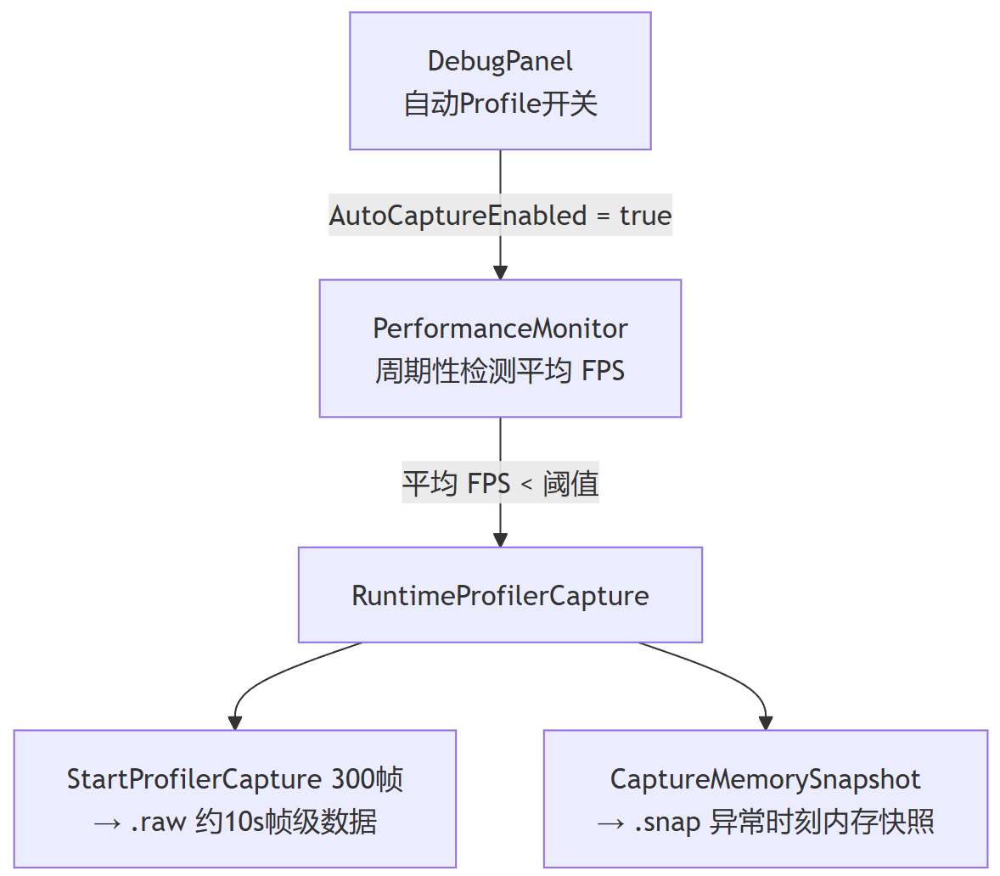

> 在做3D HMI软件交付的项目时，性能稳定性这块的问题，有一种问题是：运行过程中帧率突然下降，交互感觉有一定的不跟手或是顿挫感。如果测试人员没有相关的工作规范约束，可能此时我们开发人员能看到的就只有 logcat 日志。然而仅靠 logcat 日志大概率是“猜”不到原因的。

因此我们会希望能在发生了性能下降问题的时刻主动去抓取更加“引擎友好”的性能数据。本文的方案是：**检测到帧率低于阈值时，自动触发 Unity Profiler API，同时抓取** `.raw` **帧数据与** `.snap` **内存快照**。有了这样的机制和工具，可以直接回 Editor 依赖相关 Performance 工具分析此类问题，不过前提是 Development 模式/阶段。

---

# 方案总览



核心思路：**平时低开销轮询，帧率异常时一次性把证据落下来**。

---

# 方案实现

## 1. 检测

- 创建一个`PerformanceMonitor` 类，在调试模式启动时实例化，默认参数：


| 参数             | 默认值 | 含义              |
| -------------- | --- | --------------- |
| `fpsThreshold` | 24  | 平均 FPS 低于此值触发采集 |
| `interval`     | 2   | 检测帧率的间隔，单位秒     |
| `cooldown`     | 10  | 两次采集的最小间隔，单位秒   |


示意代码：

```csharp
void CheckPerformance()
{
    if (averageFps < fpsThreshold)
    {
        string reason = $"低帧率={Mathf.RoundToInt(averageFps)}fps";
        CapturePData(reason);
    }
}
```

- 推荐添加**内存超阈值**的判断，作为辅助触发条件

```
// 获取当前内存使用情况（MB）
#if !UNITY_EDITOR
        float currentMemory = Android JNI 实例.GetCurrentAppMemoryMB();
#else
        float currentMemory = UnityEngine.Profiling.Profiler.GetTotalAllocatedMemoryLong() / (1024f * 1024f);
#endif

if (currentMemory > memoryThresholdMB)
{
    string reason = $"内存过高={Mathf.RoundToInt(currentMemory)}MB";
    CapturePData(reason);
}
```

## 2. 抓取

帧率/内存异常时，**同时启动两项采集**。

```csharp
public void CapturePData(string reason = "性能异常")
{
#if DEVELOPMENT_BUILD
    maxFrames = 300; //采 300 帧
    captureFrameIndex = 0;
    isCapturing = true;

    // 启用Profiler区域
    Profiler.SetAreaEnabled(ProfilerArea.CPU, true);
    Profiler.SetAreaEnabled(ProfilerArea.GPU, true);
    Profiler.SetAreaEnabled(ProfilerArea.Memory, true);
    Profiler.SetAreaEnabled(ProfilerArea.Rendering, true);
    Profiler.SetAreaEnabled(ProfilerArea.Audio, true);
    Profiler.SetAreaEnabled(ProfilerArea.Video, true);
    Profiler.SetAreaEnabled(ProfilerArea.Physics, true);
    Profiler.SetAreaEnabled(ProfilerArea.Physics2D, true);
    Profiler.SetAreaEnabled(ProfilerArea.NetworkMessages, true);
    Profiler.SetAreaEnabled(ProfilerArea.NetworkOperations, true);

    // 设置日志文件
    string fileName = $"profiler_{DateTime.Now:yyyyMMdd_HHmmss}.raw";
    string fullPath = Path.Combine(profilerFilePath, fileName);
    
    Profiler.logFile = fullPath;
    Profiler.enableBinaryLog = true;
    Profiler.enableAllocationCallstacks = true;
    Profiler.enabled = true;

    Debug.Log($"开始捕获性能数据: {fullPath}");

    //-------------------------- 内存 -----------------------------//
    string fileName = $"memory_{DateTime.Now:yyyyMMdd_HHmmss}.snap";
    string fullPath = Path.Combine(memoryFilePath, fileName);

    try
    {
        // 捕获内存快照，包含所有数据类型
        MemoryProfiler.TakeSnapshot(
            fullPath,
            OnMemorySnapshotFinished,
            OnMemorySnapshotProgress,
            CaptureFlags.ManagedObjects | 
            CaptureFlags.NativeObjects | 
            CaptureFlags.NativeAllocations | 
            CaptureFlags.NativeAllocationSites | 
            CaptureFlags.NativeStackTraces
        );
        
        Debug.Log($"开始捕获内存: {fullPath}");
    }
    catch (Exception e)
    {
        Debug.LogError($"捕获内存快照失败: {e.Message}");
    }
#endif
}
```

### 停止抓取

帧数累加到上限后自动停止。

```csharp
    void Update()
    {
        // 处理Profiler帧捕获
        if (isCapturing)
        {
            captureFrameCount++;
            if (captureFrameCount >= maxCaptureFrames)
            {
                StopProfilerCapture();
            }
        }
    }
```

---

# 回 Editor 分析

生成的两份文件，可以在 Editor 中查看：

- `.raw` 对应 Unity 的 Window → Analysis → Profiler → Load。用来定位哪一帧慢、哪个函数拖累性能、GC的频率。
- `.snap` 对应 Window → Analysis → Memory Profiler → Import，用来看占用内存的对象。

详细的分析过程计划在下周一补充。

---

# 注意事项

**开启时机：**这套工具在实际使用的时候，是在复现性能问题场景之后，使用操控面板打开自动记录功能之后，再自动触发性能数据抓取的，

> 这么做的主要原因是方案当前的缺点是，可能因为帧率抖动，或者是在部分应用切换的场合，被动帧率下降到阈值以下，而导致误触发。

---

# 结语

分析性能稳定性的问题，对工具和数据有一定的依赖。这也是这一类问题解决起来很慢的原因，即缺乏匹配这类问题的运行时的完整数据抓取能力。同时，这种能力还需要嵌入到测试的工作流，不然就都得自己去抓。