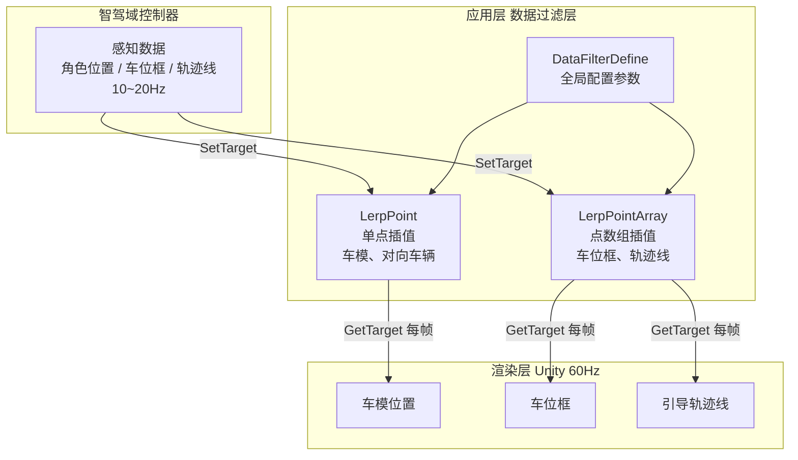


> 做 SR 环视渲染的时候，最让人头疼的是"数据明明在变，画面却在抖"：车模跳一下、车位框闪一下、引导轨迹抽一下帧，用户不会去怪智驾，只会觉得 3D 做得不行。
>
> 这次分享的是咱们跟"感知数据帧率不稳定"搏斗了 7 个月的一段经历：车模闪现、SR 卡顿、车位框闪烁、减速动效抽帧，7 个 Bug 指向同一个答案：**给感知数据加一个独立的插帧与防抖层**。

---

# 一、问题表现：7 个 Bug，一个共性

先说结论：这套问题的外在表现五花八门，但本质都是"感知数据帧率不稳定 + 直接拿来用"。

梳理一下这 7 个月的 7 个 Bug：

| # | 问题 | 场景 | 直观表现 |
|---|------|------|----------|
| 1 | 自动泊车丢帧 | 泊车 | 车模位置不连贯，进入车位后直接闪现一帧 |
| 2 | APA 行车 SR 不流畅 | 行车 | SR 元素（对向车辆）明显卡顿感 |
| 3 | SR 卡片卡顿 | 路测 | 调整插帧算法后出现新的不流畅 |
| 4 | 快速行驶对向车道车辆卡顿 | 高速行驶 | 对向车辆"拖动后追"，滞后感明显 |
| 5 | 泊车车位框闪烁 | AVP切APA | 两个车位中间闪一下，车位框"飞"入 |
| 6 | 泊车 SR 卡顿 | 泊车 | 感知物频繁创建销毁，画面抖 + GC 压力 |
| 7 | NPZ 减速动效抽帧 | 高速NZP减速 | 减速线渲染一顿一顿，像抽帧 |

**7 个 Bug，横跨泊车/行车/高速三个场景，却共享同一个技术矛盾：**

```
感知数据流（智驾域控）           渲染数据流（Unity 引擎）
   10~20 Hz                        60 Hz
   ───●───────●───────●──→        ─●─●─●─●─●─●─●─●─●─●─●─●─→
      帧1     帧2     帧3             需要在帧1和帧2之间"补帧"
```

感知数据帧率只有渲染帧率的 1/3 ~ 1/6。直接拿感知数据去驱动渲染对象，结果就是：两次感知数据之间对象"定住"，收到新数据瞬间"跳过去"。人眼对位置突变特别敏感，一跳就是一个 Bug。

---

# 二、根因分析：四个根因，同源问题

## 2.1 根因一：感知数据帧率不稳定导致位置跳动

最本质的根因。10~20Hz 的感知数据直接驱动 60Hz 的渲染，帧间无过渡，位置必然跳变。

修复前的代码很简单：拿到数据直接用：

```csharp
// 源码路径：Assets/Scripts/SR/DataFilter/LerpPoint.cs（修复前）
// 以下为示意代码，展示"无插帧"的直接赋值路径
target = perceptionData;   // 感知数据直接赋值
transform.position = target; // 渲染对象直接跟随
```

视觉上就是：对象静止一小段（等下一个感知帧），然后"嘣"地跳到新位置。

## 2.2 根因二：车位框起始点未更新导致闪烁

这个是挺隐蔽的一个坑。泊车场景里，车位框经常会"从无到有"（比如 AVP 切 APA、或者车开进识别区）。

`LerpPointArray` 内部有 `_start`（当前渲染位置）和 `_end`（感知目标位置）两组数据。车位从有到无再出现时，**`_start` 里残留的还是上一次车位的旧位置**。新数据一来，插值算法会从"旧位置"滑向"新位置"，视觉上车位框"飞"出来，就是闪烁。

```
车位消失 → _start 残留旧位置（未清空）
    ↓
车位重新出现 → 新 _end 到达
    ↓
插值从旧 _start → 新 _end 过渡 → 车位框"飞"入 → 闪烁
```

## 2.3 根因三：轨迹点位数量变化导致抽帧

NZP 减速动效渲染依赖轨迹点位数组。智驾下发的点位数量会动态变化，比如转弯时从 15 个点变 12 个点。点位数量一变，线段渲染的帧间隔就不均匀，表现出来就是"抽帧"。

还有一层：起点（起始点）由感知数据第一个点动态算出来：

```csharp
// 源码路径：Assets/Scripts/SR/Proxy/PlanningTrajectoryProxy.cs（修复前）
// 起始点位置依赖智驾数据动态计算
lineStartPointDefault.z = point0.z - (point0.x - lineStartPointDefault.x) * tan;
m_LinePoints[0] = lineStartPointDefault;   // point0 一跳，起始点跟着跳
```

`point0` 是智驾返回的第一个轨迹点，它每帧跳动，起始点的 z 值也跳动 → 线段起点来回抖 → 减速动效"跳帧"。

## 2.4 根因四：感知物 ID 不唯一 → 不敢开防抖

这条最有意思，它说明光有插帧算法还不够，防抖能不能安全开启，取决于上游数据质量。

泊车场景里，智驾识别到的周围车辆/障碍物 ID 不唯一：同一辆车在不同帧可能被分配不同 ID。ID 一变，渲染层就认为"旧车销毁、新车创建"，于是频繁 Instantiate/Destroy。

开启防抖后更糟：旧 ID 的对象还在插值过渡中，新 ID 对象已经创建，两边数据对不上，画面更乱。所以早期方案是**进入泊车就关掉防抖**，结果防抖一关，渲染对象直接跟着感知数据跳，反而更卡。

```
感知物ID不唯一
    ├── 渲染层频繁创建/销毁 GameObjects → GC 压力 + 画面闪烁
    └── 插值器实例匹配不上 → 无法安全开启防抖 → 直接跳动卡顿
```

## 2.5 根因全景

```
感知数据帧率不稳定（10~20Hz vs 60Hz）
    ├─ 直接使用感知数据 → 位置跳动（根因一）
    │      └─ 解法：LerpPoint / LerpPointArray 插帧
    ├─ 车位可见性切换 → _start 残留旧点 → 闪烁（根因二）
    │      └─ 解法：SyncStartToEndPosition() 重置起点
    ├─ 轨迹点位数量/起点跳动 → 抽帧/闪烁（根因三）
    │      └─ 解法：固定起点 + 补齐固定长度点位
    └─ 感知物ID不唯一 → 不敢开防抖 → 卡顿（根因四）
           └─ 解法：智驾修ID唯一性 + 应用开启防抖
```

四个根因指向同一个核心矛盾：**低帧率、不稳定、不可靠的感知数据，需要一个应用层的"数据过滤层"来兜底。**

---

# 三、方案设计：独立的数据过滤层

## 3.1 核心思路

不把插值逻辑散落在各个渲染对象里，而是抽象成独立的数据过滤层：

```
智驾感知数据（10~20Hz）
    ↓ SetTarget（目标数据入口）
┌────────────────────────┐
│  数据过滤层  DataFilter │
│  · 插帧（时间维度）     │
│  · 防抖（距离门限）     │
│  · 生命周期重置         │
└────────────────────────┘
    ↓ GetTarget（每帧取渲染位）
渲染层（60Hz）：车模 / SR元素 / 车位框 / 轨迹线
```

把插值器（插值器）的 `SetTarget`（接收数据）和 `GetTarget`（每帧取数据）拆开，渲染层完全不知道感知数据长什么样，只关心"每帧调用 GetTarget 拿最新渲染位置"。

## 3.2 两个层次的插值工具

| 类 | 数据结构 | 典型场景 |
|----|----------|----------|
| `LerpPoint` | 单点插值（`_start/_end` 都是 Vector） | 车模位置、对向车道车辆 |
| `LerpPointArray` | 点数组插值（`_start/_end` 都是 List\<Vector3\>） | 车位框顶点、轨迹线 |

`LerpPointArray` 比 `LerpPoint` 多一层防护：**数据量一致性检查**。感知轨迹点位数量会动态变化，数量对不上时跳过插值、直接使用目标数据，避免索引越界或点位错位。

## 3.3 整体架构



---

# 四、实现细节

## 4.1 LerpPointArray：点数组插值算法

这是核心。以 `LerpPointArray` 为例，讲透插帧原理：

```csharp
// 源码路径：Assets/Scripts/SR/DataFilter/LerpPointArray.cs（最终版本）
public class LerpPointArray
{
    private List<Vector3> _start = new List<Vector3>();  // 当前渲染位置（插值中间值）
    private List<Vector3> _end = new List<Vector3>();     // 感知数据目标位置
    private float _timeElapsed;
    public float MaxLerpDistance { get; set; } = DataFilterDefine.MaxLerpDistance;

    // SetTarget：接收感知数据，只负责"记账"
    public void SetTarget(List<Vector3> target)
    {
        _end.Clear();
        _end.AddRange(target);
        _timeElapsed = 0;

        // 数量不一致 → 直接整体刷新，避免索引越界
        if (_start.Count != _end.Count)
        {
            _start.Clear();
            _start.AddRange(target);
        }
    }

    // GetTarget：每帧调用，负责所有判断与插值计算
    public void GetTarget(ref List<Vector3> result)
    {
        result.Clear();
        var start = _start[0];
        var end = _end[0];
        float distance = Vector3.Distance(start, end);

        // 防抖关闭 / 数量不一致 / 距离太小 / 距离太大 → 直接跳转
        if (!DataFilterDefine.EnablePrediction
            || _start.Count != _end.Count
            || distance <= DataFilterDefine.MinLerpDistance
            || distance > MaxLerpDistance)
        {
            result.AddRange(_end);
            _start.Clear();
            _start.AddRange(_end);
            return;
        }

        // 正常插值：在 LerpTime 时间内平滑过渡
        _timeElapsed += Time.deltaTime;
        float t = Mathf.Clamp01(_timeElapsed / DataFilterDefine.LerpTime);

        for (int i = 0; i < _end.Count; i++)
        {
            var newPoint = Vector3.Lerp(_start[i], _end[i], t);
            _start[i] = newPoint;   // 起始点逐帧更新 → 连续插值
        }

        result.AddRange(_start);
    }
}
```

### 插帧原理：目标点 → 当前位置 → 每帧逼近

用大白话讲：

1. **SetTarget**：感知数据下车，记为"目标点 `_end`"，同时清零计时器。
2. **GetTarget**：每帧渲染前调用，算一个插值进度 `t = timeElapsed / LerpTime`（0→1）。
3. **Vector3.Lerp(start, end, t)**：从当前位置向目标位置走 `t` 比例。
4. **`_start[i] = newPoint`**：把插值结果写回 `_start`，作为下一帧的起点，这样每帧都在"当前位置 → 目标位置"之间继续走，视觉上就是平滑移动，没有跳变。

`LerpTime = 0.2f` 时，感知帧期间会生成约 12 个插值帧，把 10Hz 的数据"补"成接近 60Hz 的渲染效果：

```
感知帧率:  ●─────────●─────────●─────────●  (10Hz)
插帧后:    ●○ ○ ○ ○●○ ○ ○ ○●○ ○ ○ ○●○  (60Hz，○为插值帧)
```

**为什么距离判断拆进 GetTarget？** 这是第一次重构（Bug #3）的关键。最初距离判断放在 SetTarget 里，只在"数据到达那一刻"判断一次。但数据到达后、下一帧渲染前，`_start` 已经被插值推进了一段，距离早就变了。把判断挪到 GetTarget，每帧基于"最新 `_start` 状态"实时判断，距离门限才是真的。

## 4.2 LerpPoint：单点防抖逻辑与职责重构

单点防抖（车模、对向车辆）逻辑和数组版一个道理，但重构过程很有代表性。**重构前距离判断和插值逻辑耦合在 SetTarget/GetTarget 两处**：

```csharp
// 源码路径：Assets/Scripts/SR/DataFilter/LerpPoint.cs（重构前）
public void SetTarget(Vector3 target)
{
    _end = target;
    _timeElapsed = 0;

    // 距离判断做在 SetTarget，问题：GetTarget 时距离可能已变
    float distance = Vector3.Distance(_start, _end);
    if (distance > DataFilterDefine.MaxLerpDistance
        || distance <= DataFilterDefine.MinLerpDistance
        || _start == Vector3.zero)
    {
        _start = target;   // 直接跳到目标
    }
}

public Vector3 GetTarget()
{
    if (!DataFilterDefine.EnablePrediction)
    {
        return _end;      // ❌ 防抖关闭时未同步 _start，下次插值仍从旧点开始
    }
    ...
}
```

重构后：

```csharp
// 源码路径：Assets/Scripts/SR/DataFilter/LerpPoint.cs（重构后）
public void SetTarget(Vector3 target)
{
    _end = target;
    _timeElapsed = 0;
    // SetTarget 不再做距离判断，统一交给 GetTarget 每帧判断
}

public Vector3 GetTarget()
{
    // 防抖关闭 → 直接返回，同时同步 _start（避免下次从旧点开始）
    if (!DataFilterDefine.EnablePrediction)
    {
        _start = _end;
        return _start;
    }

    // 首帧初始化：无历史数据，直接落到目标
    if (_start == Vector3.zero)
    {
        _start = _end;
        return _start;
    }

    float distance = Vector3.Distance(_start, _end);

    // 距离过大 → 数据异常跳变，直接跳转（避免长时间"滑行"）
    if (distance > DataFilterDefine.MaxLerpDistance)
    {
        _start = _end;
        return _start;
    }

    // 距离过小 → 微抖，直接跳转（避免无意义的插值延迟）
    if (distance <= DataFilterDefine.MinLerpDistance)
    {
        _start = _end;
        return _start;
    }

    // 正常范围 → Lerp 平滑过渡
    _timeElapsed += Time.deltaTime;
    float t = Mathf.Clamp01(_timeElapsed / DataFilterDefine.LerpTime);
    _start = Vector3.Lerp(_start, _end, t);
    return _start;
}
```

**重构前后对比**：

| 对比项 | 重构前 | 重构后 |
|--------|--------|--------|
| 距离判断位置 | SetTarget（到达时判断一次） | GetTarget（每帧实时判断） |
| 防抖关闭时 `_start` 同步 | ❌ 未更新，下次插值从旧点开始 | ✅ `_start = _end` |
| 首帧处理 | 混合在 SetTarget 里 | GetTarget 独立判断 |
| MaxLerpDistance 检查 | SetTarget 时 | GetTarget 中且返回前同步 `_start` |
| 职责边界 | 两个方法耦合错误 | 职责分离：SetTarget 只收数据，GetTarget 统一管插值 |

这个重构的设计思想：**SetTarget 是数据入口，GetTarget 是状态机**。所有"要不要插值"的决策都基于"当前渲染位置"，只有 GetTarget 时才真正知道当前位置。

## 4.3 LerpTime：为什么这个参数最敏感

`LerpTime` 是最敏感的参数，它直接决定"过渡时间"：

| 值 | 效果 | 问题 |
|----|------|------|
| 0.1f | 过渡极快，接近直接跳转 | 几乎没有平滑效果 |
| **0.2f（最终值）** | 过渡较快，平滑且响应及时 | ✅ 平衡点 |
| 0.3f | 过渡平滑，运动连贯 | 快速行驶时有"滞后感"（Bug #4） |
| 0.5f | 过渡很慢，非常平滑 | 明显滞后，不适合高速场景 |

**演进历程**（7 个月里的反复）：

```
0.2f（初版）
  ↓  Bug #3（SR卡片卡顿）：调整插帧算法后想提高取值频率 → 0.3f
     ↓  Bug #4（快速行驶卡顿）：0.3f 目标"接不住"，滞后明显 → 调回 0.2f
0.2f（最终）
```

为什么 0.2f 是个平衡点？

- 感知帧率约 10~20Hz，帧间隔 50~100ms；
- `LerpTime = 0.2f` 约等于"两帧感知数据的间隔"；
- 太大（0.3f+）：对象还在上一段过渡里，新目标又来了，跟不上，滞后感强，**快速行驶场景尤其明显**，对向车道车辆一眨眼就过去了，0.3f 的延迟被放大；
- 太小（0.1f）：过渡一帧就到位，平滑效果消失。

所以：**LerpTime 要和感知数据帧间隔匹配**，追求"两条感知帧之间刚好补完一次过渡"。

## 4.4 车位框从无到有：SyncStartToEndPosition()

根因二是 `_start` 残留旧数据。解法是**在车位从无到有时，主动把起点同步成终点，跳过这次插值过渡**：

```csharp
// 源码路径：Assets/Scripts/SR/DataFilter/LerpPointArray.cs
// 新增方法：车位从无到有显示时调用
public void SyncStartToEndPosition()
{
    _start.Clear();
    _start.AddRange(_end);  // 起始位置 = 目标位置，跳过插值
}
```

调用时机：AVP 切 APA，或车位框第一次显示时，先调 `SyncStartToEndPosition()`，保证首个可见帧车位框直接出现在正确位置，避免从旧位置"飞"过来。

```
车位隐藏 → 车位出现（有→无→有）
    ↓
调用 SyncStartToEndPosition()
    ↓
_start = _end（跳过插值过渡，正确显示）
    ↓
后续帧正常插值（_start 已对齐当前车位）
```

## 4.5 轨迹点补齐 + 固定起点：治"抽帧"

轨迹线渲染的"抽帧"问题，两个动作：

**① 起点从感知数据改为固定值**，不再跟随 `point0` 跳动：

```csharp
// 源码路径：Assets/Scripts/SR/Proxy/PlanningTrajectoryProxy.cs（修复后）
// NZP引导线和减速线起始点替换成车头下方默认位置
Vector3 startPoint = new Vector3(1.4f, 0, 0);  // 固定起始点（车头下方中间）
m_LinePoints[0] = startPoint;
```

**② 前面补固定数目的点，让数组长度恒定**：

```csharp
int addPtLen = 5;  // 前置补齐点位数量
// 在轨迹前方补齐固定点位，使数组长度恒定
Vector3 dir = (point0 - point1).normalized;
Vector3 step = dir * 2;
for (int i = 0; i < addPtLen; i++)
{
    m_LinePointsExt.Add(localRootPos + step * (addPtLen - i));
}
```

起点固定 + 长度恒定，双保险消除抽帧：起点不再跳，点位数量不再变，渲染动画帧间隔也就均匀了。

## 4.6 泊车防抖开关：智驾侧配合才能开

刚才说过根因四。早期方案是"进入泊车关闭防抖"：

```csharp
// 源码路径：Assets/Scripts/SR/Layer/ApaSlotLayer.cs（修复前）
private void OnApaParkStateChanged(bool isEnterPark)
{
    // 进入泊车关闭防抖（因感知点ID不唯一，防抖会导致匹配混乱）
    this.SendCommand(EnablePredictionCommand.Create(!isEnterPark));
    ...
}
```

后面智驾侧把感知物 ID 修复成唯一后，这条开关就没必要关了：

```csharp
// 源码路径：Assets/Scripts/SR/Layer/ApaSlotLayer.cs（修复后）
private void OnApaParkStateChanged(bool isEnterPark)
{
    // 已从智驾侧解决感知点ID唯一性，泊车保持防抖开启，不再关闭
    // this.SendCommand(EnablePredictionCommand.Create(!isEnterPark)); // 注释掉
    ...
}
```

**教训：** 防抖插值优化不是应用层单方面能完成的。**ID 不唯一时开防抖，画面会更乱**，这是数据一致性问题，跟算法无关。要么上游先保证 ID 唯一，要么就只能在 ID 稳定场景开防抖。这个 Bug 咱们等了 4 个月智驾侧修复，才把这行注释掉。

---

# 五、参数配置（DataFilterDefine）

所有插值参数收敛在一个静态配置里，方便逐个调优：

```csharp
// 源码路径：Assets/Scripts/SR/DataFilter/Define/DataFilterDefine.cs
public static class DataFilterDefine
{
    public static bool EnablePrediction = true;            // 全局防抖总开关
    public static bool EnableSlotPrediction = true;        // 车位防抖开关（Bug #1 新增）

    public static float MaxLerpDistance = 10000f;  // 最大插值距离：超过直接跳转（防大跳变滑行）
    public static float MinLerpDistance = 10f;     // 最小插值距离：小于直接跳转（防微抖）
    public static float LerpTime = 0.2f;           // 插值过渡时间（秒）：0.2 → 0.3 → 0.2
}
```

| 参数 | 作用 | 调优历程 |
|------|------|----------|
| `EnablePrediction` | 全局防抖总开关 | 始终开启；泊车时曾短暂关闭后恢复 |
| `EnableSlotPrediction` | 车位防抖开关 | Bug #1（自动泊车丢帧）新增 |
| `MaxLerpDistance` | 防止大跳变时长时间滑行 | 10000f，基本不限制 |
| `MinLerpDistance` | 防止微距抖动 | 10f，小于 10 直接跳过 |
| `LerpTime` | 插值过渡时长（秒） | **0.2 → 0.3 → 0.2**（最终 0.2f） |

---

# 六、效果对比

| 维度 | 优化前 | 优化后 |
|------|--------|--------|
| 车模位置 | 两个感知帧之间静止，收到新数据突然跳变 | Lerp 平滑过渡，无跳变无闪现（Bug #1 ✅） |
| SR 元素（对向车辆） | 卡顿、滞后 | 200ms 内平滑过渡，快速行驶追得上前车（Bug #2/4 ✅） |
| 车位框 | "飞"入、两大车位中间闪烁 | 从无到有直接落位，无飞入（Bug #5 ✅） |
| 减速动效 | 起始点跳动 + 长度变化 → 抽帧 | 起点固定 + 长度恒定 → 均匀渲染（Bug #7 ✅） |
| 泊车状态 SR | ID 不唯一 → 频繁创建销毁 → 卡顿 | ID 唯一 + 防抖常开 → 平滑（Bug #6 ✅） |
| 感知帧率→帧率 | 10~20Hz 直接驱动 | LerpTime 0.2s 补到 ~60Hz 视觉效果 |

**量化视角**：感知数据 10Hz → 插值后 60Hz，中间 5 帧由算法生成；`LerpTime=0.2f` 在每个感知帧间生成约 12 个插值帧；`MaxLerpDistance=10000f` 只拦截数据异常，不误伤正常运动；`MinLerpDistance=10f` 过滤微抖。7 个 Bug 全部关闭，7 个月内持续迭代。

---

# 七、注意事项

## 7.1 插帧不是万能的

| 问题类型 | 插帧能否解决 | 说明 |
|----------|-------------|------|
| 帧率不匹配 | ✅ | Lerp 在感知帧间生成过渡帧 |
| 数据丢帧 | ⚠️ 部分 | 能平滑，但无法恢复丢失的信息 |
| 数据跳变 | ❌ | 距离过大直接跳转，不插值 |
| ID 不唯一 | ❌ | 需要上游保证 ID 唯一性 |
| 点数变化 | ⚠️ 部分 | 跳过插值，会有轻微跳变 |
| 起点跳动 | ❌ | 需固定起点（如 PlanningTrajectoryProxy） |

### 7.2 插值有延迟成本

```
感知数据到达 → Lerp过渡开始 → LerpTime 后到目标
                                  ↑
                    渲染对象滞后于实际位置 ~LerpTime
```

因此：

- **低速泊车**：可用较大 LerpTime（0.3~0.5f）追求平滑；
- **高速行驶**：必须调小 LerpTime（0.1~0.2f）换响应，Bug #4（快速行驶对向车道车辆卡顿）就是血泪教训。

### 7.3 必须解耦设计

插帧逻辑收敛在 `LerpPoint/LerpPointArray` 里，和"感知数据接收"、"渲染逻辑"彻底解耦。这样才能做到：单独调优参数不影响业务、新增渲染对象只换一个插值器、切换参数只改 `DataFilterDefine`。这 7 个月里能快速迭代，靠的就是这个解耦。

---

# 结语

回头看这 7 个月的 7 个 Bug，核心就一句话：**感知数据是"信号的原料"，不是"渲染的燃料"。** 渲染层用数据前，必须先过一道"过滤层"：时间上补间、空间上过滤、生命周期上重置、一致性上校验。

这个案例还有两个延伸价值值得反复体会：

- **插值算法要独立调参**：LerpTime 从 0.2 → 0.3 → 0.2 的反复，不是算法不行，是参数要和具体场景匹配；
- **跨模块问题要协同**：ID 不唯一这个问题，只有智驾侧真正修复后才能安全开防抖，单方面改动只会更糟。

性能稳定性的本质，是**在数据不可靠的现实中，用一套系统性的机制保证视觉上的可靠**。插帧防抖可能只是其中的一层，但它验证了那句话：问题能不能解决，取决于你把"数据边界"定义得有多清楚。

（下一篇，想跟大家聊聊这套数据过滤层在 **3D 渲染线程调度** 上的延伸：当感知数据来的频率比渲染还快时，怎么避免插值器被打满。）