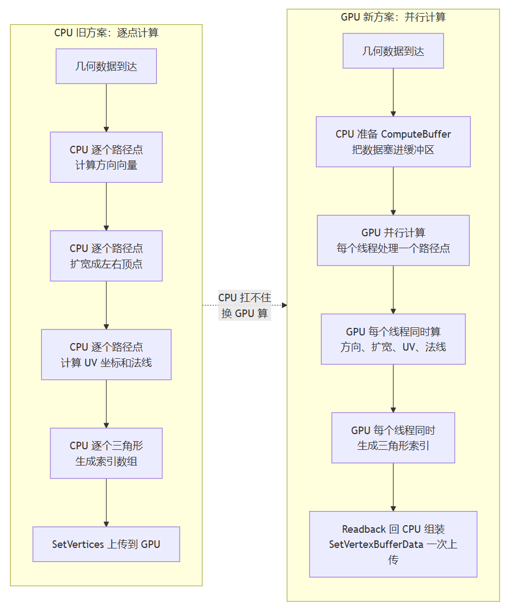

> 上一篇讲了HPA建图场景下通过指纹跳过重复重建的思路，但在SR行车过程中遇到的感知物，比如车道线、他车、道路线等，是用不了的。因为行车过程中这些物体总是在变的，不可能也没有意义去不断的SetDirty。

# 问题表现

测试反馈：

> "SR 行车过程中，到了复杂的十字路口，在左转的过程中，帧率多次明显掉下来。"

# CPU Usage

Profiler 数据表现出来的是明显的尖刺，展开Hierarchy 视图，耗时排在前面的节点有：`Mesh.SetVertices` ，`Mesh.SetTriangles` ，`Mesh.RecalculateNormals` 。但是并不是绝对的高耗时，由于十字路口复杂，同时也伴随大量的对象池操作以及GameObject.Instantiate。

这个场景的过程中，车道、可行驶区域会在短时间内突然变多变广。同时，数据每帧都在变，无论是数据抖动还是周围事物的变化，都会导致网格肯定是要重建的。那怎么办？既然 CPU 算不过来，那就换 GPU 来处理 —— Compute Shader。



---

# 解决方案

## 第一种：位图网格 → 渲染纹理

可行驶区域（FreeSpace）的数据是位图网格时，每个 bit 代表一个方格的可行驶状态。数据量比较固定，但变化频率高。CPU 处理的方式是逐字节解析位图，生成 RenderTexture。每帧都做一遍，CPU 开销不小。所以我们就会把这一步搬到 GPU：

```csharp
// 示意代码
void ProcessWithComputeShader(byte[] freeSpaceData, int width, int length) {
    uint[] uintData = ConvertByteArrayToUIntArray(freeSpaceData);
    computeBuffer.SetData(uintData);

    shader.SetBuffer(kernel, "_RawDataBuffer", computeBuffer);
    shader.SetTexture(kernel, "_OutputTexture", drivableTexture);

    int threadGroupsX = Mathf.CeilToInt(width / 8.0f);
    int threadGroupsY = Mathf.CeilToInt(height / 8.0f);
    shader.Dispatch(kernel, threadGroupsX, threadGroupsY, 1);
}
```

GPU 上的 Shader 核心里，每个线程处理一个像素点：

```hlsl
// 示意代码
[numthreads(8, 8, 1)]
void ProcessDrivableArea(uint3 id : SV_DispatchThreadID) {
    uint bitIndex = id.y * _TotalWidthGrids + id.x;
    uint uintIndex = bitIndex / 32;
    uint bitOffset = bitIndex % 32;

    uint packed = _RawDataBuffer[uintIndex];
    bool isDrivable = (packed >> bitOffset) & 1;

    float4 color = isDrivable ? float4(0, 1, 0, 0.3) : float4(0, 0, 0, 0);
    color.a *= EdgeFade(id.x, id.y);
    _OutputTexture[id.xy] = color;
}
```

CPU 只做数据准备和调度，实际的像素级计算交给 GPU 并行处理。`numthreads(8,8,1)` 意味着每个线程组处理 64 个像素，一张 200x200 的位图约需要 625 个线程组。相比 CPU 逐像素处理，速度提升明显。

## 第二种：多边形顶点 → Mesh

道路面、车道线这类几何数据，是多边形顶点，或者是一根中心线加上宽度。可行驶区域也有的方案中会给到多边形顶点数组让你画而非位图数据（不过我觉得这个方案并不好）。CPU 处理的方式是逐点算方向、扩宽、建三角、算 UV。点多段多的时候，CPU 开销叠加。这里的几何生成也可以交给 GPU：

**GPU 侧：ComputeShader 内核**

```hlsl
// 示意代码
// 输入数据结构：每个路径点的位置和方向
struct PointData {
    float3 position;    // 路径点坐标
    float3 direction;   // 前进方向（由 CPU 预计算或 GPU 前缀和算出）
    float length;       // 当前分段长度
    float distance;     // 到起点的累计距离，用于 UV 的 V 坐标
};

// 输出数据结构：一个顶点包含位置、法线、两套 UV
struct VertexOutput {
    float3 position;
    float3 normal;
    float2 uv0;   // 第一套 UV：x 标记左右边(0/1)，y 是沿路径的距离
    float2 uv1;   // 第二套 UV：归一化的路径进度 0~1
};

// 每个线程组 16 个线程，每个线程处理一个路径点
[numthreads(16, 1, 1)]
void CSMain(uint3 id : SV_DispatchThreadID) {
    uint i = id.x;

    // 从输入缓冲区读取当前路径点
    PointData pt = pointDataBuffer[i];

    // 用叉乘算出左右方向：cross(up, direction) 给出垂直于前进方向的右侧向量
    // 左右各偏移 pathWidth，生成条带的两个边界顶点
    float3 rightOffset = cross(float3(0,1,0), pt.direction) * pathWidth;
    float3 left  = pt.position - rightOffset;
    float3 right = pt.position + rightOffset;

    // 写入两个顶点：左顶点 UV.x = 0，右顶点 UV.x = 1
    // UV.y 用累计距离，让纹理沿路径方向流动
    vertexBuffer[i * 2]     = {left,  float3(0,1,0), float2(0, pt.distance), float2(0, pt.distance / totalLength)};
    vertexBuffer[i * 2 + 1] = {right, float3(0,1,0), float2(1, pt.distance), float2(1, pt.distance / totalLength)};

    // 生成三角形索引：每段两个三角形，组成一个四边形面片
    // 左顶点在 i*2，右顶点在 i*2+1，下一段的左右顶点在 (i+1)*2 和 (i+1)*2+1
    trianglesBuffer[i * 6]     = i * 2;       // 三角形1: 左、右、下一段左
    trianglesBuffer[i * 6 + 1] = i * 2 + 1;   // 
    trianglesBuffer[i * 6 + 2] = i * 2 + 2;   // 
    trianglesBuffer[i * 6 + 3] = i * 2 + 1;   // 三角形2: 右、下一段左、下一段右
    trianglesBuffer[i * 6 + 4] = i * 2 + 2;   //
    trianglesBuffer[i * 6 + 5] = i * 2 + 3;   //
}
```

**C# 侧：调用这个 ComputeShader**

ComputeShader 写好之后，C# 侧需要：把数据塞进 GPU 缓冲区、调度计算、把结果读回来组装 Mesh。

```csharp
// 示意代码
// 1. 初始化：创建缓冲区，绑定到 ComputeShader 的内核
void Initialize(ComputeShader shader) {
    int kernel = shader.FindKernel("CSMain");
    pointDataBuffer = new ComputeBuffer(MAX_POINTS, System.Runtime.InteropServices.Marshal.SizeOf(typeof(PointData)));
    vertexBuffer    = new ComputeBuffer(MAX_POINTS * 2, typeof(VertexOutput));
    trianglesBuffer = new ComputeBuffer(MAX_POINTS * 6, typeof(int));

    shader.SetBuffer(kernel, "pointDataBuffer", pointDataBuffer);
    shader.SetBuffer(kernel, "vertexBuffer", vertexBuffer);
    shader.SetBuffer(kernel, "trianglesBuffer", trianglesBuffer);
}

// 2. 提交：把路径点数据上传，调度 GPU 计算，回读结果
void Dispatch(List<Vector3> path, float width, Mesh mesh) {
    // 准备输入数据：逐点算方向和累计距离
    PointData[] points = PreparePathData(path, width);
    pointDataBuffer.SetData(points);

    // 调度：每 16 个点一个线程组
    int threadGroups = Mathf.CeilToInt(path.Count / 16.0f);
    shader.SetInt("pathWidth", ...);
    shader.Dispatch(kernel, threadGroups, 1, 1);

    // 回读 GPU 计算结果
    VertexOutput[] vertices = new VertexOutput[path.Count * 2];
    int[] triangles = new int[path.Count * 6];
    vertexBuffer.GetData(vertices);
    trianglesBuffer.GetData(triangles);

    // 组装 Unity Mesh
    mesh.SetVertexBufferParams(vertices.Length, layout);
    mesh.SetVertexBufferData(vertices);
    mesh.SetTriangles(triangles, 0);
    mesh.RecalculateBounds();
}

// 3. 高层调用：业务代码只需要收集路径点，剩下的交给框架
void UpdateLaneMesh(List<Vector3> centerLine, float width, Mesh mesh) {
    pathToMeshComputer.Dispatch(centerLine, width, mesh);
}
```

CPU 把路径点数据塞进 `ComputeBuffer`。剩下的方向计算、扩宽、UV 赋值、三角形索引生成，全部由 GPU 并行完成。`[numthreads(16,1,1)]` 意味着 16 个路径点可以同时处理，100 个点只要 7 个线程组。相比 CPU 逐点 `SetVertices` 再 `SetTriangles`，减少了多次拷贝。

# 结语

Compute Shader提供了一个很好的桥梁，帮助CPU去转移一定的负担给到GPU，在软件团队的智驾类交付的框架搭建阶段，就可以从开发框架层面，把Compute Shader 嵌入进来，让三维绘制的基础方法都走这条路。这样的话，之后可能不至于会在遇到每个性能问题的时候，都去专门写一套Compute Shader去处理而造成冗余和重复劳动。