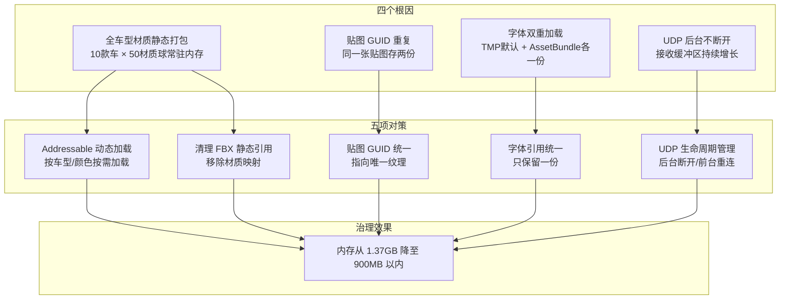
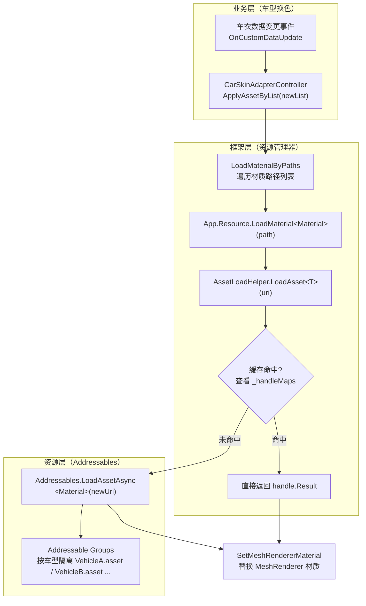

# 座舱3D HMI性能：数字车衣Addressable动态加载

> 之前写了《座舱3D HMI性能：LINQ 热路径分配与 GC 周期性尖刺》，聊的是"每一帧偷偷摸摸多分配几个对象"带来的 GC 尖刺。但那种属于"慢性病"，这次的问题更猛：内存直接爆了。
>
> 一次例行内存排查，发现我们的渲染子进程已经吃掉了 **1.37G 内存**，而期望上限是 900M，超了将近 52%。更吓人的是，应用一进后台，这个数字还在涨，完全没有停下来的意思。再这么下去，OOM 崩掉只是时间问题。
>
> 一番追查下来，发现根因出在资源"堆放方式"上：**全车型车衣材质静态打包、同一张贴图存在两个 GUID、字体加载了两份、UDP 后台一直在线**，四个问题叠在一起，把内存顶爆了。
>
> 后续我们用"数字车衣 Addressable 动态加载"这个大手术解决了它。本文按排查顺序展开：**问题表现 → 根因分析 → 方案设计 → 实现细节 → 变更规模 → 踩坑复盘**。

整体治理方案架构一览：



---

# 一、问题表现：内存 1.37G，目标 900MB

先摆数据，直观感受一下问题的严重程度：

| 观测项 | 数值 | 说明 |
|--------|------|------|
| 进程内存占用 | 1.37GB | 预期上限 900MB，超出约 470MB |
| 超出比例 | ~52% | 内存超限的边际已经很危险 |
| 触发场景 | 数字车衣/全景影像 | 车模车漆、内饰、轮毂换色 |
| 后台表现 | 持续增长 | 进后台不降反涨，疑似资源泄漏 |
| 连带风险 | OOM / 卡顿 | 长期后台运行后系统可能杀进程 |

这里先解释一下"数字车衣"是啥：就是用户在车机里给 3D 车模**换颜色、换皮肤**，车漆色、车顶漆、内饰皮、轮毂漆、翼子板、格栅，都支持多套配置。听起来挺炫的，对吧？问题就出在这些"皮肤资源"的加载方式上。

当时我们做了一个资源审计，发现四条线索同时存在：

1. **全车型车衣材质全部静态打包**：10 款车型、每款几十个材质球，全都随着 Prefab 静态常驻内存；
2. **同一张贴图存在两个 GUID**：同样的闪烁车漆贴图，因为多次导入产生不同 GUID，成了两个独立资源各存一份；
3. **字体加载了两次**：TextMeshPro 默认配置加载一份字体，AssetBundle 里又打了一份，两份字体纹理同时常驻；
4. **UDP 子进程后台不主动断开**：应用进后台，UDP 通道照常收数据，内存线性增长。

四条线都有明确的 Jira 单，最后合成了一次大整改：**内存与资源治理（Addressable 动态加载）**。

---

# 二、根因分析：内存被谁吃掉了

## 2.1 根因一：全车型数字车衣材质"静态全家桶"

这是内存超限的**主力源头**。

数字车衣的每款车型都有一堆材质类型：

- `CarPaint`（车漆材质）：含 `_BaseColor`、`_FlakeMap`（闪烁车漆贴图）、`_OcclusionMap`（AO 贴图）等
- `CarRoofPaint`（车顶漆材质）
- `CarInner`（内饰材质，分高配/低配版本）
- `CarWheelCarpaint`（轮毂漆材质）
- `FenderSkirt`（翼子板漆材质）
- `CarGrille`（格栅材质）

在改造之前，这些材质全部通过**静态引用**挂在 Prefab 上。车控制器（脱敏后叫 `CarSkinAdapterController`）里有一个 `references` 字段，Editor 面板上手工把所有车型所有颜色的材质球拖进去：

```csharp
// 源码路径：Assets/Scripts/Vehicle/CarSkin/CarSkinAdapterController.cs
// 以下为改造前残留代码（已删除），展示"静态全家桶"的加载方式

// public List<UnityEngine.Object> references;
// 编辑器面板里把所有材质球拖进这个 List，不管当前车型是不是你
// 所有车型 · 所有颜色 · 所有部位，全部随 Prefab 一起加载常驻内存

// 改造前的加载逻辑其实就是"从 List 里按名字查"：
// private void LoadAsset<T>(string name, Action<T> callback) where T : UnityEngine.Object
// {
//     var asset = references.FirstOrDefault(x => x.name == name);
//     callback?.Invoke(asset as T);
// }
```

编辑器侧也配套了这个"拖拽面板"：

```csharp
// 源码路径：Assets/Editor/CarSkinAdapterControllerEditor.cs（改造前，已删除）
// private SerializedProperty referencesProperty;
// referencesProperty = serializedObject.FindProperty("references");
// EditorGUILayout.PropertyField(referencesProperty, new GUIContent("资源引用"), true);
```

这套"静态全家桶"最初只有几款车时还能忍，可车型从几款一路加到 **10 款**：

- 每款车 40~60 个材质球（有的车型甚至到 60+）
- 每个材质球又引用 2~3 张大纹理（`_FlakeMap`、`_OcclusionMap`）
- 算下来：**10 款车 × 50 材质球 × 2-3 贴图 ≈ 一千多张纹理同时常驻内存**

而用户同一时刻**只看一款车的"一种颜色"**，也就是说，绝大多数纹理加载进内存后就再也没有用过，纯粹是"占着茅坑不拉屎"。

### FBX 侧也在静态引用材质

再往资源文件里挖，`VehicleA.fbx.meta` 这类 FBX 的 `.meta` 文件里还带着一长串**内嵌材质映射**，模型加载时这些材质会跟着 FBX 默认实例化：

```yaml
# 源码路径：Assets/Vehicle/VehicleXX.fbx.meta（改造前，已删除的映射示例）
- first:
    type: UnityEngine:Material
    name: InteriorStandard       # 内饰标准版
  second: {fileID: 2100000, guid: faaeab2f134208e4b957ec99e86b955b, type: 2}
- first:
    type: UnityEngine:Material
    name: InteriorComfort       # 内饰舒适版
  second: {fileID: 2100000, guid: d6fd2b328e2664c7c8cc4c1c14fc151e, type: 2}
```

一个 FBX 就挂 7 个材质映射。这等于每个车型的网格都被"绑死"了 7 个静态材质，Addressable 再想按需，FBX 这一层还会把材质拉回来。

> 小结：静态打包的根源是"**引用关系写死在资源里**"，无论用户看没看，都一次性全加载。车型一多，内存线性膨胀。

## 2.2 根因二：同一张贴图，两个 GUID

这是排查时一个挺有意思的发现。

某两种车漆（黑、棕）下，`CarPaint` 材质里引用的 `_FlakeMap`（闪烁漆贴图），在**两套目录结构**里分别存了一份内容完全相同的贴图，但导入了两次、GUID 不一样：

```
路径A: .../Materials/Dynamic/CarPaint/CarPaint_XXXX.mat
       _FlakeMap → guid: 72fedaf9e77d3414b9f5b9078a6cf052

实际唯一正确引用应为:
       _FlakeMap → guid: cc287b52fd407b6469aef19826a45274
```

材质文件 `.mat` 的 diff 长这样：

```yaml
# 源码路径：Assets/Vehicle/.../CarPaint/（材质 .mat，GUID 统一前后）
# 统一前：引用"内容相同但 GUID 不同"的另一份副本
- _FlakeMap:
    m_Texture: {fileID: 2800000, guid: 72fedaf9e77d3414b9f5b9078a6cf052, type: 3}

# 统一后：所有材质都指向同一份贴图
+ _FlakeMap:
    m_Texture: {fileID: 2800000, guid: cc287b52fd407b6469aef19826a45274, type: 3}
```

**Unity 认 GUID 不认内容**，GUID 不同，就被当作两个独立纹理资源，各自加载一份到内存。两张内容一模一样的贴图，白白多占一份纹理内存。

这个场景一共 10 个材质文件受影响，分布在 "Dynamic" 和 "Static" 两套目录里。

## 2.3 根因三：字体到处加载了两次

字体冗余是个很容易忽略的问题。TMP（TextMeshPro）组件的默认配置会加载一份默认字体；同时 AssetBundle 里又打了另一份字体资源。两份字体资源在内存中同时存在，各占一份纹理。

受影响的是 3 个 Prefab（APASlot、AutoSafe、AutoSafeSR），光是 `APASlot.prefab` 就改了 469 行，大量 TMP 组件的 Font 引用被统一。

> 字体看起来小，但它是一张整图/图集，常驻内存挺可观，而且"多份"这个问题在 Profiler 里长得不明显，很容易忽略。

## 2.4 根因四：UDP 后台子进程不主动断开

最后是"后台持续增长"的元凶。

我们的 3D HMI 跑在独立子进程里，通过 UDP 与外部数据源通信。翻代码时发现，`OnApplicationPause` 早早就写了，但里面**啥也没干**：

```csharp
// 源码路径：Assets/Scripts/Network/SocketClient.cs（改造前）
private void OnApplicationPause(bool pause)
{
    Debug.Log("SocketClient OnApplicationPause  pause= " + pause);
    // ⚠️ 没有任何处理！UDP 连接不关闭，数据照收不误
}
```

后台时：

1. UDP 数据通道继续收包 → 接收缓冲区持续增长；
2. 数据到达 → 不断 new 消息对象 → GC 压力增大、堆内存增加；
3. 时间一长，子进程内存**线性上涨**，直到系统宰掉它。

# 三、方案设计：地址化按需加载，逐项对症

## 3.1 五大对策

针对四个根因，方案可以拆成五件事：

| 根因 | 对策 | 落点 |
|------|------|------|
| 材质静态打包 | 全车型车衣材质改为 Addressable 动态加载 | 控制器 + 地址化配置 |
| 静态引用残留在 FBX/Prefab | 清理 .meta 材质映射 + 移除 Prefab 静态引用 | 资源层 |
| 贴图 GUID 重复 | 统一引用到唯一贴图 | 材质资源层 |
| 字体双重加载 | TMP 统一引用一份字体 | 资源层 |
| UDP 后台在线 | `OnApplicationPause` 断开/重连 | 网络层 |

## 3.2 数字车衣动态加载架构

核心变革：**从"静态拖拽全家桶"改成"按车型/按颜色/按需地址加载"**。

- 每个车型一个独立的 Addressable Group（材质资源按车型隔离）；
- 材质地址规范化：`{车型}/Materials/{材质类型}/{材质名}`；
- 用户切换车型/颜色时，才去加载对应那几张贴图，用完可释放；
- 一切走统一的资源加载封装，App.Resource → `AssetLoadHelper` → Addressables。



整个链路的核心思想一句话：**业务侧只关心"路径"，加载细节全部下沉给框架层**。这样业务代码不感知 Addressable 的存在，将来换加载方式也不动业务。

## 3.3 Addressable vs Resources：为什么选 Addressable

很多人问过，"直接放 Resources 不行吗？"这里给一张对比表说明我们的选择：

| 维度 | Resources | Addressables | 本项目选择 |
|------|-----------|--------------|------------|
| 内存控制 | 目录下全量加载 | 单资源按需加载/卸载 | ✅ Addressable |
| 包体大小 | 全量打进主力包 | 分组按需打包 | ✅ Addressable |
| 加载粒度 | 目录级 | 单资源级 | ✅ |
| 运行时切换 | 要手写管理 | 地址化 + handle 管理 | ✅ |
| 资源管理 | 硬引用，难卸载 | 引用计数、可释放 | ✅ |
| 编辑器集成 | 目录扫描 | Group/Label 视觉化 | ✅ |

对多车型这种"资源大、只用到小部分"的场景，Addressable 的分组与按需释放能力几乎是必须的。

---

# 四、实现细节：一帧内存怎么省出来

## 4.1 控制器适配：从"拖字段"到"按路径查字典"

改造的核心在 `CarSkinAdapterController`（脱敏后名称）。它做了三件事：**收集位置索引、按路径加载、按版本匹配替换**。

### 1. 收集：材质类型 → 渲染器位置

第一次进入时，把所有 MeshRenderer 里"材质名含该类型"的 slot 建立索引：

```csharp
// 源码路径：Assets/Scripts/Vehicle/CarSkin/CarSkinAdapterController.cs（示意代码）
// 为每种材质类型（CarPaint / CarInner / ...）记录它在哪些渲染器的第几个材质槽
private void CollectMaterialsByPaths(List<string> paths, MeshRenderer[] renderers)
{
    foreach (var path in paths)
    {
        // 从材质路径里提取类型，如 "CarPaint_DigitalRed" → "CarPaint"
        var materialType = path.Split('/').Last().Split('_')[0];
        if (_materialPosDic.ContainsKey(materialType)) continue;

        var list = new List<MaterialPos>();
        foreach (var renderer in renderers)
        {
            var mats = renderer.sharedMaterials;
            for (int i = 0; i < mats.Length; i++)
            {
                // 把"材质名包含该类型"的槽位记下来，后面按路径替换
                if (mats[i] != null && mats[i].name.Contains(materialType))
                    list.Add(new MaterialPos { index = i, renderer = renderer });
            }
        }
        _materialPosDic[materialType] = list;
    }
}
```

### 2. 换色时：路径 → 动态加载 → 替换

```csharp
// 源码路径：Assets/Scripts/Vehicle/CarSkin/CarSkinAdapterController.cs（示意代码）
private void LoadMaterialByPaths(List<string> paths)
{
    foreach (string path in paths)
    {
        var materialName = path.Split('/').Last();        // "CarPaint_DIT"
        var materialType = materialName.Split('_')[0];    // "CarPaint"
        var version     = GetMatVersion(materialName);    // 高低配版本

        if (_materialPosDic.TryGetValue(materialType, out var positions))
        {
            // 关键：通过 Addressable 路径加载，而非静态引用
            var mat = App.Resource.LoadAsset<Material>(path);
            SetMeshRendererMaterial(positions, version, mat);
        }
    }
}
```

### 3. 版本匹配：避免"高低配互换"

车衣里有高配/低配同部位材质，`GetMatVersion` 保证**同版本才能替换**，否则一个低配内饰换成高配材质就出错了：

```csharp
// 只有同版本能互相替换：CarInner_Dark_H 只能换 CarInner_Grey_H，不能换 _L
private string GetMatVersion(string materialName)
{
    var s = materialName.Replace(" (Instance)", "");
    return s.Contains(s_Version) ? s.Split('_').Last() : string.Empty;
}
```

## 4.2 `AssetLoadHelper`：统一加载管道 + Handle 缓存

所有材质加载都汇到 `AssetLoadHelper`（保留类名），它做了三件事：**缓存命中、路径重定向、异步转同步**：

```csharp
// 源码路径：Assets/Framework/Resource/AssetLoadHelper.cs（示意代码）
public T LoadAsset<T>(string uri) where T : UnityEngine.Object
{
    // 1. 命中缓存：同一资源不重复加载（Addressable 的 handle 也缓存）
    if (_handleMaps.TryGetValue(uri, out AsyncOperationHandle handle))
        return (T)handle.Result;

    // 2. 地址校验/重定向（支持文件移动后的旧地址回退）
    string newUri = GetValidUri(uri);

    // 3. 走 Addressables 异步加载，WaitForCompletion 转同步返回
    handle = Addressables.LoadAssetAsync<T>(newUri);
    _handleMaps.Add(uri, handle);
    handle.WaitForCompletion();

    return (T)handle.Result;
}
```

三个设计点值得解释：

- **Handle 缓存**：同一路径多次加载不再重复触发 Addressables，切换颜色来回切也不会反复 IO；
- **地址重定向**：资源搬家后，旧地址能回退到新地址，兼容性好；
- **`WaitForCompletion`**：换色是"点了立刻要看效果"的交互，同步等待比异步回调更简单可控（车机端交互确认度高）。

## 4.3 剔除静态引用残留

动态化不是"加了 Addressable 就完事"，还要把资源层残留的静态引用清干净：

- **移除 Prefab/FBX 上的静态引用**：控制器删掉 `references` 字段和编辑器面板；
- **清 FBX 的材质映射**：把 `.fbx.meta` 里的 7 个内嵌材质引用删除，导出网格时不再连带材质；
- **资源目录重组**：材质从 `Resources(AssetBundle)/Materials` 迁到普通 `Materials` 目录，避免被 Resources 全量打包边缘影响。

## 4.4 UDP 后台断连/重连

`OnApplicationPause` 补上真正逻辑：

```csharp
// 源码路径：Assets/Scripts/Network/SocketManager.cs（改造后）
public string Address
{
    get
    {
        string remotePort = "62999";
        var config = $"{_localAddress}:{remotePort}:{_localPort}";
#if UNITY_EDITOR
        config = $"127.0.0.1:{remotePort}:{_localPort}";
#endif
        return config;
    }
}

private void OnApplicationPause(bool pause)
{
    Debug.Log("SocketManager OnApplicationPause " + pause);
    if (pause)
    {
        _udpChannel.Disconnect();     // 后台：断开连接，停止收包
    }
    else
    {
        _udpChannel.Connect(Address); // 前台：重新建立连接
    }
}
```

这样无论后台多久，UDP 不再持续向内存"投毒"。

## 4.5 贴图/字体去重

- **贴图**：把 10 个 `.mat` 里的 `_FlakeMap` GUID 统一到同一张纹理；
- **字体**：把 3 个 Prefab 里 TMP 组件的 Font 引用统一为同一份资源，移除 AB 里多打的字体。

---

# 五、变更规模：739 个文件的大手术

这次改动的规模，能直观说明"从静态到动态"迁移的成本有多高：

| 提交 | 涉及范围 | 文件数 | 增/删行 | 说明 |
|------|----------|--------|---------|------|
| 首批 | 先行车型（一招鲜测试） | 130 | +525 / -566 | 用一款车验证 Addressable 链路 |
| 全量 | 全车型（10 款） | 739 | **+1988 / -795** | 车型 Group 配置、目录重组、材质迁移、FBX 清理 |
| 配套 | 贴图去重 | 10 | +350 / -346 | FlakeMap 统一 GUID |
| 配套 | 字体去重 | 3 | +280 / -205 | 字体引用统一 |
| 配套 | UDP 后台 | 2 | +29 / -17 | 断开/重连 |
| **合计** | | **884** | **+3172 / -1922** | |

**739 个文件、近 2000 行新增**，这就是"静态架构用久了要还的债"。如果车型增长前就考虑动态加载，这些代价完全可以避免。

---

# 六、踩坑与复盘（Bug 案例）

## Bug 案例 1：地址重定向带来的"首次黑材质"

改造上线后，某些车型第一次切色发现模型是黑的。排查发现：材质路径 Old 地址和 Group 地址对不上，`GetValidUri` 重定向时旧地址先命中了缓存但指向了旧目录的材质。

**教训**：地址迁移后，旧目录别立刻删，重定向写好后先跑一遍"全量地址自检"，确认每个资源地址都能命中新 Group 里的资源。

## Bug 案例 2：如果缓存命中不可靠，会出现"换色后几帧闪回旧色"

`_handleMaps` 缓存的是 handle，如果材质在外部被覆盖/被 `Release`，缓存仍指向旧对象。**解法**：对"可被替换"的材质做版本号校验（`version` 字段），缓存的材质与当前配置版本不符时强制重新加载。

## Bug 案例 3：贴图 GUID 去重后的"引用丢失"

把 `.mat` 的 GUID 统一后，Asset 目录里若旧贴图没有对应 `.meta` 或路径被移动，容易出现"该 map 引用缺失"的 mesh 变白。

**注意**：去重时先做引用扫描（asset dependency 检查），确认无其他引用后再删除旧副本；目录移动与 GUID 替换分开提交，便于回滚。

## Bug 案例 4：后台 UDP 断开后，重连时机不对会丢数据

UDP 断连时缓冲里还有未处理的数据，一旦立即清空/重连，会造成消息丢（比如车衣切换指令丢失，表现为没反应）。

**注意**：断连时把 pending 数据排空后再断开；重连成功后发送一次"重连握手"，让数据源重新推送全量状态（而不是增量）。

---

# 结语

这次"数字车衣 Addressable 动态加载"的改造，最终把内存从 1.37GB 压回到了预期之内（**低于 900MB 目标**），而且是**四管齐下**：

1. 全车型材质静态打包 → 改按需地址化加载；
2. 贴图 GUID 重复 → 统一到单引用；
3. 字体双重加载 → 统一一份；
4. UDP 后台常驻 → 生命周期内断开重连。

这背后的规律值得沉淀：

- **内存问题的根子，往往在"资源加载出来的方式"**，某段代码多分配几个对象只是表层；
- **Addressable 不是银弹**，它需要一整套配套：地址规范、handle 缓存、版本匹配、引用清理；
- **大改造要分车型试点再铺开**，先一个新车型跑通闭环，再全车型复制，控制风险和体量。

如果你的车机工程也越来越多车型/皮肤，早点把"按需加载 + 分车型 Group + 统一加载管道"当设计约束，不要当作优化手段。你会在迭代到几十款车型时感谢今天的自己。

好，这篇就到这。下一篇想聊聊怎么把"资源冗余检测"做成自动化工具（扫描同内容不同 GUID、字体重复引用、Addressable 组诡异），欢迎评论区给点方向。