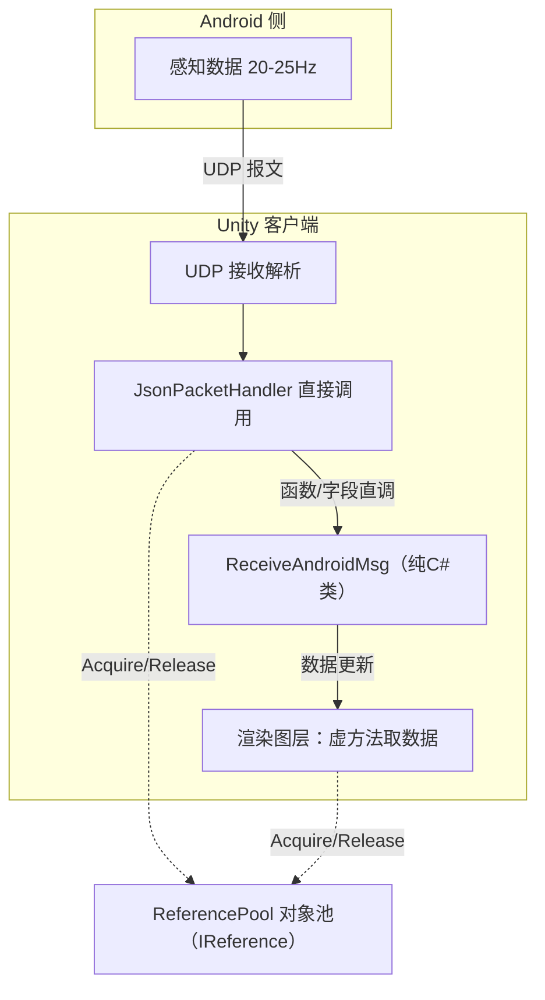


> 之前写《座舱3D HMI性能：LINQ 热路径分配与 GC 周期性尖刺》的时候，咱们把"每帧遍历渲染管线"上的 GC 分配捋了一遍。今天这条链路更狠：SR（周围环境感知）数据以 **20-25Hz** 的频率持续打到 Unity 端，每秒要处理 100-200+ 次消息，而每一条消息的处理路径（Packet 创建、事件转发、字符串日志、数组拷贝）都在偷偷往托管堆里塞对象。

> 结果就是：GC 尖刺把目标 30fps 的帧率打到 10-15fps，地图一卡一卡，SR 感知物体偶尔跳帧，跑久了内存碎片化，GC 停顿越来越长。在真车上，这种"飘忽不定"的卡顿比偶发黑屏还劝退。

今天这篇，把这条 UDP 消息处理链路从"随机高频 GC"走到"零分配热路径"的完整过程拆开：问题表现 → 根因分析 → 方案设计 → 实现细节（5 个方案逐一对代码）→ 效果 → 踩坑。核心就一句话：**高频消息处理的路径，必须以"零托管堆分配"为标准**。

---

# 问题表现

先还原现场。SR 数据到达节奏非常规律：

```text
SR 数据更新频率: 20-25 Hz
每轮消息类型: 3 种（Int / Float / String 信号） + SR感知物体 + 高精地图数据
每秒消息处理次数: 20-25 × (3 + SR + Map) ≈ 100-200+ 次/秒
```

真机（高通 8295 平台）上的表现：

- 目标帧率 30fps，SR 数据一推起来，帧率掉到 10-15fps
- GC.Collect 触发时主线程明显停顿，地图拖动、SR 物体更新"抽"一下
- 感知物体（车辆、行人、水马）渲染位置偶尔跳一格，上一帧数据没消化完，下一帧又到了
- 长时间跑下来内存碎片化加剧，GC 停顿时间肉眼可见地变长

当时用 Profiler 抓了一轮分配快照，结论直白：**每秒堆分配 120-150 次对象**，且这些分配全部落在消息处理热路径上。

# 根因分析

把链路从头捋一遍，总结出三个根因：

1. **Packet 对象不复用**：每条消息 new 一个包，外加事件系统再 new 一个 Event
2. **字符串拼接**：调试日志 `$"..."` 插值 + 协议日志每条消息构建
3. **数据拷贝**：临时数组 + AddRange、字段初始化即分配、URL 路由字符串解析

## 根因一：Packet 未复用，每条消息 new

UDP 消息到达后，`JsonPacketHandler.Handle()` 对每条消息都通过构造函数 `new` 一个 Packet 对象。20-25Hz 下每秒 60-75 个对象进托管堆，而这只是第一步，当年的架构还多绕了一层"事件系统"，Event 对象也是 new 的：

```csharp
// 源码路径：Assets/Scripts/Network/ReceiveAndroidMsg/Base/SCPacket.cs（示意代码，优化前）
public class FunctionIntData : SCPacketBase
{
    public int Function;
    public int Zone;
    public int Param;

    // 构造函数直接 new，每次消息到达都分配
    public FunctionIntData(int function, int zone, int param)
    {
        Function = function;
        Zone = zone;
        Param = param;
    }
}
```

调用方（优化前通过事件系统传递）：

```csharp
// 源码路径：Assets/Scripts/Network/JsonPacketHandler.cs（示意代码，优化前）
_sender.SendEvent(SetFunctionIntValueEvent.Create(
    intPacket.ID, intPacket.Zone, intPacket.param));
```

事件对象同样是 new 的。虽然 Event 类实现了 `ReferencePool` 复用，但整条链路：**事件创建 → 事件派发 → 接收类收到 Event → 再次 new FunctionIntData 入队 → Update 中 Dequeue 消费**，一次消息产生了 2 个对象分配（Event + Packet），外加一个 `ConcurrentQueue` 的扩容分配和锁开销。更别提还有个 `AndroidMsgController` 的 MonoBehaviour 中间层，`AddComponent` 动态挂载，白养一套组件生命周期。

GC 影响链路长这样：

```
UDP消息到达
  → JsonPacketHandler.Handle()
    → new FunctionIntData(...) / new FunctionFloatData(...) / new InteractionMsgData(...)
      → 进入 ConcurrentQueue（堆分配 + 队列扩容分配）
        → Update() 中 Dequeue → 处理后丢弃 → 等待GC回收
```

每秒 20-25 轮 × 3 种消息 × 2 层对象 = **120-150 次堆分配/秒**，这还没算字符串和数组。

## 根因二：字符串拼接的"隐形杀手"

20-25Hz 的频率下，"打日志"这种平时无感的操作成了头号地主。

**2a. ParkingModel 里的 `$"..."` 插值**，每次特征状态更新都拼一大段调试日志：

```csharp
// 源码路径：Assets/Scripts/Model/ParkingModel.cs（示意代码，优化前）
MapLogger.Debug(GetType().Name,
    $"ParkingState:{e.featureState.parkingStateSeN},RecommendSlotID:{e.featureState.recommendSlotID} " +
    $"ParkingMode:{e.featureState.availableSlotModeSeN}, SelectedSlotId:{SelectedSlotId}, " +
    $"AvailableSlotsID:{JsonConvert.SerializeObject(AvailableSlotsID.Value)}," +
    $"parkingStatusSeN:{e.featureState.parkingStatusSeN}, recommendDirectionSeN: {e.featureState.recommendDirectionSeN}," +
    $"{debugMessage}");
```

`$"..."` 在编译期生成 `string.Format()` 调用，每段产生新 String；多段 `+` 拼接又产生中间字符串；`JsonConvert.SerializeObject()` 直接造一个 JSON 的字符串；循环里还有 `debugMessage += $"{index}, "`，每次拼接都是新 String。一帧 5-8 个临时字符串就这么来了。

**2b. AbstractProto 的 StringBuilder 日志**，每个消息解析都构建日志，即使最终不输出，`.ToString()` 也一定会造一个 String：

```csharp
// 源码路径：Assets/Scripts/Network/Proto/AbstractProto.cs（示意代码，优化前）
private readonly StringBuilder messageBuilder = new StringBuilder();

public AbstractPacket Parse(byte[] buffer)
{
    messageBuilder.Clear();
    messageBuilder.Append("ApplyMessage id = ");
    messageBuilder.Append(messageId);
    messageBuilder.Append(" buffer.Length= ");
    messageBuilder.Append(buffer.Length);
    MapLogger.Debug(TAG, messageBuilder.ToString()); // ToString 产生新 String
}
```

**2c. 日志级别不当**：`MapLogger.Debug` 级别的日志在 Release 构建里**照样执行字符串构建**（"不输出"不等于"不构造"），20-25Hz × 多种消息 = 每秒 100+ 个纯浪费的 String。

## 根因三：数据拷贝产生的 GC

**3a. 临时数组 + AddRange 模式**：SR 数据反序列化大量使用"先 `new T[]` → 填满 → `AddRange` 到 List"的模板，数组用完就丢：

```csharp
// 源码路径：Assets/Scripts/Network/DataDifine.cs（示意代码，优化前）
geometryPointsSeN = new List<VehiclePoint>(pointSize);
if (pointSize > 0)
{
    VehiclePoint[] vehiclePoints = new VehiclePoint[pointSize];  // 临时数组分配
    for (int j = 0; j < pointSize; j++)
    {
        vehiclePoints[j] = reader.ReadStruct<VehiclePoint>();
    }
    geometryPointsSeN.AddRange(vehiclePoints); // AddRange 完数组再丢弃
}
```

这种模式在 **至少 8 处**数据结构里都有：停车线、道路标记、地图边界、导航线、人行道、车道线……每条 SR 消息包含多个这样的结构，一帧造出**数十个临时数组**，外加 `AddRange` 内部的枚举器分配。

**3b. List 字段初始化即分配又不复用**：`MapLaneInfo` 这类结构字段在类初始化时 `new List`，反序列化时又 Clear，然后又 new 新的替换，旧的没人用就等 GC 回收：

```csharp
// 源码路径：Assets/Scripts/Network/Proto/PacketDifine.cs（示意代码，优化前）
public List<VehiclePoint3D> LeftBoundarySeN = new List<VehiclePoint3D>(); // 初始化就分配

LeftBoundarySeN.Clear();
int LeftboundaryPointSize = reader.ReadInt();
if (LeftboundaryPointSize > 0)
{
    VehiclePoint3D[] vehiclePointsArray = new VehiclePoint3D[LeftboundaryPointSize];
    // 填充数组...
    LeftBoundarySeN.AddRange(vehiclePointsArray);
}
```

**3c. URL 路由解析的字符串 GC**：管线图层每次取数据都走 `DataAccessor.RequestRenderData(url)`，内部 `Router.Get(url)` 做字符串拆分（`Split`/`Substring`），每个 Layer 每帧都来一次。20-25Hz × 多个 Layer = 大量无意义的字符串分配，`Router` 对象也是临时创建：

```csharp
// 源码路径：Assets/Scripts/MapEngine/DataProxy/DataAccessor.cs（示意代码，优化前）
public IRenderData RequestRenderData(string url)
{
    Router router = Router.Get(url);  // URL 解析产生字符串分割 GC
    string host = router.Host;
    // ...
    return dataProxy.GetRenderData(router);
}
```

**3d. ObjectPoolManager 冗余字典查找**：`ContainsKey + Add` / `ContainsKey + 索引`，一次操作 2-3 次字典查找。不是直接的 GC 问题，但在 20-25Hz 高频对象池操作下纯属烧 CPU。

---

# 方案设计

## 核心思路

把热路径上的每一次"分配"都干掉：**对象只造一次，后续全是循环利用**。



5 把刀：① Packet 对象池复用（`SCPacketBase` 实现 IReference）② 字符串 GC 优化（StringBuilder 复用 / 日志降级）③ 数据拷贝优化（List.Capacity 预分配 / 延迟初始化）④ GC 时机控制（切后台时 GC）⑤ 去掉异步 GC（8295 平台 SGen 并发 GC 不稳定）。

## 分配源审计清单

这是咱们确认的"账本"。**热路径代码评审时把这张表贴旁边，逐条过**：

| 分配类型 | 检测方法 | 解决方案 |
|----------|----------|----------|
| `new` 对象 | 代码审查 / 分配快照 | 对象池（ReferencePool） |
| 字符串插值 `$"..."` | 搜索 `\$"` | StringBuilder 复用 |
| 字符串拼接 `+` | 代码审查 | StringBuilder.Append |
| 临时数组 `new T[]` | 代码审查 | List.Capacity 预分配 |
| `List.AddRange(array)` | 代码审查 | 直接 List.Add |
| Lambda 闭包捕获 | 代码审查 | 避免捕获循环局部变量 |
| `foreach` 枚举器 | 代码审查 | `for` 循环替代 |
| 装箱/拆箱 | IL 审查 | 泛型 / 避免值类型转 object |

# 实现细节

## 方案一：Packet 对象池化：`SCPacketBase` 实现 `IReference`

### 1.1 基类改造

消息包基类开始实现 `IReference`，交给 `ReferencePool` 管理：

```csharp
// 源码路径：Assets/Scripts/Network/ReceiveAndroidMsg/Base/SCPacketBase.cs（示意代码）
public class SCPacketBase : IReference
{
    public override string ToString()
    {
        return JsonConvert.SerializeObject(this);
    }

    // 对象池回收时清理（子类可继承）
    public virtual void Clear()
    {
    }
}
```

### 1.2 子类改用静态 Create + ReferencePool.Acquire

构造函数打包成静态工厂方法，从池里拿实例而不是 new：

```csharp
// 源码路径：Assets/Scripts/Network/ReceiveAndroidMsg/Base/SCPacket.cs（示意代码，优化后）
public class FunctionIntData : SCPacketBase
{
    public int Function;
    public int Zone;
    public int Param;

    public static FunctionIntData Create(int function, int zone, int param)
    {
        var result = ReferencePool.Acquire<FunctionIntData>(); // 从对象池取
        result.Function = function;
        result.Zone = zone;
        result.Param = param;
        return result;
    }
}
```

### 1.3 消除事件系统中间层，直接调用

优化前：`JsonPacketHandler` → 造 Event → 事件派发 → 队列 Enqueue → Update Dequeue。优化后：直接持有接收类引用，同步直调：

```csharp
// 源码路径：Assets/Scripts/CarCtrl/Network/JsonPacketHandler.cs（示意代码，优化后）
public void Handle(object sender, IPacket packet)
{
    int packetId = packet.MessageId;
    switch (packetId)
    {
        case 1:
            if (packet is UDP_Msg_FromAndroid_Int intPacket)
                _receiveAndroid.LoadFunctionIntData(
                    FunctionIntData.Create(intPacket.ID, intPacket.Zone, intPacket.param));
            break;
        case 2:
            if (packet is UDP_Msg_FromAndroid_Double floatPacket)
                _receiveAndroid.LoadFunctionFloatData(
                    FunctionFloatData.Create(floatPacket.ID, floatPacket.Zone, (float)floatPacket.param));
            break;
        case 3:
            if (packet is UDP_Msg_ToAndroid_String stringPacket)
                _receiveAndroid.LoadInteractionMsg(
                    InteractionMsgData.Create(stringPacket.msgType, stringPacket.param));
            break;
    }
}
```

### 1.4 接收类：MonoBehaviour → 纯C#类

优化前是 `MonoBehaviour` + `ConcurrentQueue` 轮询；优化后是纯 C# 类，消息直接同步处理：

```csharp
// 源码路径：Assets/Scripts/Net/ReceiveAndroidMsg/Base/AbstractReceiveAndroidMsg.cs（示意代码）
// 优化前：MonoBehaviour + 队列轮询（Awake 注册事件，Update Dequeue）
// 优化后：纯C#类，方法由 JsonPacketHandler 直接调用
public abstract class AbstractReceiveAndroidMsg : IController, ICanSendEvent
{
    public AbstractReceiveAndroidMsg()
    {
        _responseHandler = new ResponseHandler();
        _carLightModel = this.GetModel<CarLightModel>();
        // ...
    }

    public virtual void LoadFunctionIntData(FunctionIntData data) { ... }
    public virtual void LoadFunctionFloatData(FunctionFloatData data) { ... }
    public virtual void LoadInteractionMsg(InteractionMsgData data) { ... }
}
```

原 `AndroidMsgController` 这个 MonoBehaviour 中间层整个删除。

> **踩过的坑**：改成"直接调用"后，消息处理从"异步队列轮询"变成"同步回调"。如果 UDP 接收线程直接调处理逻辑，就必须保证处理逻辑线程安全。这里实际是接收线程中把消息转交给主线程处理链路，目前安全；如果哪天接收线程绕过调度直接更新渲染数据，锁和调度得重新设计。

## 方案二：字符串 GC 优化：StringBuilder 复用 + 日志管理

### 2.1 ParkingModel：实例复用 StringBuilder

```csharp
// 源码路径：Assets/Scripts/Model/ParkingModel.cs（示意代码，优化后）
// 类级别复用的 StringBuilder，预分配 256 容量，避免重复扩容
StringBuilder sb = new StringBuilder(256);

// 使用时 Clear + Append，不再拼接出多个中间 String
sb.Clear();
sb.Append("ParkingState:").Append(featureState.parkingStateSeN)
  .Append(",RecommendSlotID:").Append(featureState.recommendSlotID)
  .Append(",ParkingMode:").Append(featureState.slotMode)
  .Append(", SelectedSlotId:").Append(selectedSlotId)
  .Append(", AvailableSlots:");
if (AvailableSlotsID != null && AvailableSlotsID.Count > 0)
{
    sb.Append(string.Join(",", AvailableSlotsID)); // 一次性拼接，无中间串
}
MapLogger.Debug(GetType().Name, sb.ToString());
```

每帧只产生 **1 个** String（最终 ToString），而不是之前的 5-8 个。

### 2.2 协议日志：移除 StringBuilder，级别降级

优化前每条消息 `StringBuilder` 构建 + `ToString()` 1 个 String（每秒 100+）。优化是分两步提交的：

```csharp
// 源码路径：Assets/Scripts/Network/Proto/AbstractProto.cs（示意代码，优化过程）
// 第一步：移除 StringBuilder 字段，改用格式化调用
//Log.DebugFormat(TAG, "Parse message id: {0}, length:{1}", messageId, buffer.Length);

// 第二步：Debug 降级为 Verbose，Release 构建不执行字符串格式化
//Log.VerboseFormat(TAG, "Parse message id: {0}, length:{1}", messageId, buffer.Length);

// 最终：日志直接注释掉，热路径零字符串分配
```

这一步很多人会忽略：**Debug 级别进热路径上，Release 构建照样执行字符串格式化**，"不打印"和"不构造"是两码事。

## 方案三：数据拷贝 GC 优化

### 3.1 List.Capacity 预分配替代临时数组

不再建临时数组再 AddRange，直接复用已有 List，仅按需扩展容量后逐个 Add：

```csharp
// 源码路径：Assets/Scripts/Network/DataDifine.cs（示意代码，优化后）
GeometryPoints.Clear();
if (pointSize > 0)
{
    if (GeometryPoints.Capacity < pointSize)
        GeometryPoints.Capacity = pointSize;  // 仅在需要时扩展容量

    for (int k = 0; k < pointSize; k++)
    {
        var item = reader.ReadStruct<VehiclePoint>();
        GeometryPoints.Add(item); // 直接 Add，无中间数组
    }
}
```

停止线、道路标记等至少 8 处结构体全部套用该模式。

### 3.2 MapBoundary：延迟初始化 List

字段不再初始化即分配，反序列化时按需创建并带初始容量：

```csharp
// 源码路径：Assets/Scripts/Net/DataDifine.cs（示意代码，优化后）
public List<VehiclePoint3D> LeftBoundarySeN;  // 不再字段初始化 new
public List<VehiclePoint3D> RightBoundarySeN;
public List<VehiclePoint3D> AreaPointsSeN;

// 反序列化时按需创建
int LeftboundaryPointSize = reader.ReadInt();
if (LeftboundaryPointSize > 0)
{
    LeftBoundarySeN = new List<VehiclePoint3D>(LeftboundaryPointSize); // 带容量
    for (int k = 0; k < LeftboundaryPointSize; k++)
    {
        LeftBoundarySeN.Add(reader.ReadStruct<VehiclePoint3D>());
    }
}

// Clear 使用空值条件运算符，防止 NRE
public void Clear()
{
    LeftBoundarySeN?.Clear();
    RightBoundarySeN?.Clear();
    AreaPointsSeN?.Clear();
}
```

### 3.3 去除 URL 路由解析

优化前：`Layer.DataRoute (string) → DataAccessor.RequestRenderData(url) → Router.Get(url) → 字典查找 → proxy.GetRenderData(router)`，每一步都在做字符串工作。

优化后：Layer 直接持有对应 DataProxy 引用，虚方法取数据，URL 全去掉：

```csharp
// 源码路径：Assets/Scripts/MapEngine/Layer/DefaultLayer.cs（示意代码，优化后）
public class DefaultLayer : LayerBase
{
    // public string DataRoute { get; set; } // 已删除

    protected virtual IRenderData GetRenderData() { return null; }

    protected void UpdateContent()
    {
        DataContainer container = GetRenderData() as DataContainer;
        _tile.FillData(container);
        _tile.DoUpdate();
        container?.Release(); // 对象池回收
    }
}

// 具体图层直接持有 Proxy 引用
public class SRObjectLayer : DefaultLayer
{
    private SRObjectProxy _dataProxy;
    private SRObjectProxy SrDataProxy => _dataProxy ??= this.GetModel<SRObjectProxy>();

    protected override IRenderData GetRenderData() => SrDataProxy.GetRenderData() as DataContainer;
}
```

`DataAccessor.RequestRenderData(url)` 整个删除，FeatureStateProxy 也不再接收 Router 参数。**URL 字符串解析、Router 对象创建，全链路归零**。

### 3.4 ObjectPoolManager 单次查找

```csharp
// 源码路径：Assets/Scripts/Common/ObjectManager/ObjectPoolManager.cs（示意代码，优化后）
// 获取：TryAdd 一次查找替代 ContainsKey + Add 两次
_objectIdDict.TryAdd(obj.GetInstanceID(), prefabPool);

// 释放：TryGetValue 一次查找，替代 ContainsKey + 索引 + ContainsKey + 索引
if (!_objectIdDict.TryGetValue(prefab.GetInstanceID(), out var objectPool))
{
    Destroy(prefab);
    return;
}
_unActiveTransform.TryAdd(objectPool.PoolName, root);
objectPool.Release(prefab);
```

## 方案四：GC 时机控制：切后台时 GC

前面把"垃圾"从源头砍得差不多了，但 GC 总得留一个兜底。**关键洞察：车机用户通过物理按键切换 SR/导航/媒体界面时，有明确的"不可见窗口"**，把 GC 安排在这里，停顿完全无感。

```csharp
// 源码路径：Assets/Scripts/Memory/MemoryManager.cs（示意代码，优化后）
public class MemoryManager : MonoBehaviour
{
    public float ReferencePoolReleaseInterval = 120f;
    public int MaxReferencePoolCount = 500;
    public float MemoryGCInterval = 600f; // 10 分钟兜底一次

    void Start()
    {
        InvokeRepeating(nameof(ReleaseReferencePool),
            ReferencePoolReleaseInterval, ReferencePoolReleaseInterval);
        InvokeRepeating(nameof(ReleaseMemoryByTimer),
            MemoryGCInterval, MemoryGCInterval);
    }

    // 关键：只在用户不可见时 GC
    void OnApplicationPause(bool paused)
    {
        if (paused) TryReleaseMemory();
    }
    void OnApplicationFocus(bool hasFocus)
    {
        if (!hasFocus) TryReleaseMemory();
    }

    private void ReleaseMemoryRoutine()
    {
        Resources.UnloadUnusedAssets();
        System.GC.Collect();
        MapLogger.Debug(TAG, " Released memory at " + System.DateTime.Now);
        ResetMemoryGCTimer(); // GC 后重置定时器，从当前时刻重新计时
    }

    private void ResetMemoryGCTimer()
    {
        CancelInvoke(nameof(ReleaseMemoryByTimer));
        InvokeRepeating(nameof(ReleaseMemoryByTimer),
            MemoryGCInterval, MemoryGCInterval);
    }
}
```

| 触发条件 | 时机 | 说明 |
|----------|------|------|
| `OnApplicationPause(true)` | 用户切后台 | SR 不可见，GC 停顿无感知 |
| `OnApplicationFocus(false)` | 应用失去焦点 | 同上 |
| 定时器（600 秒） | 兜底 | 长时间运行后定期清理 |
| 运行时主动 GC | ❌ 不再执行 | 避免在 SR 数据处理期间停顿 |

**为什么 GC 后要重置定时器？**假如用户来回切换应用，每次切后台都触发了 GC；若不重置，600 秒定时器正好在用户正在用 SR 的时候"补一刀"，得不偿失。重置后定时 GC 总是从"最后一次 GC"重新计时，兜底永远不会落在用户活跃窗口。

## 方案五：去掉异步 GC 的决策（8295 平台）

最反直觉的一条：**别人都在加异步 GC 减少顿挫，咱们反而把它去掉了**（这个改动只改了一处工程设置）。

原因很明确：

1. **8295 平台特性限制**：高通 SA8295P（Cortex-A78AE + A55AE，8 核）的 Unity 后端是 Mono（非 IL2CPP），SGen 的并发 GC 模式在车机平台上**表现不稳定**，内存释放时机不可控，SR 数据处理到一半并发回收可能来抢内存。
2. **"不可控" vs "可控"**：异步 GC 想少停顿、但停顿点随机；不如把 GC 精确锁死在"用户在切后台"这个明确节点上。
3. **对象池化之后，热路径已无分配**：剩余 GC 压力本身很小，不需要异步 GC 去"托底平滑"。
4. 兜底：应用退出时统一清扫。

```csharp
// 源码路径：Assets/Scripts/Map/SR/Logic/DynamicDataManager.cs（示意代码，优化后）
private void OnApplicationQuit()
{
    Resources.UnloadUnusedAssets();
    GC.Collect();
    _udpChannel.Disconnect();
}
// 运行时不再主动 GC.Collect，仅在后台切换 / 退出时执行
```

# 效果

| 优化维度 | 优化前 | 优化后 | 提升 |
|----------|--------|--------|------|
| Packet 对象分配/秒 | 60-75 个 | ~0 个（对象池） | 100% |
| 事件对象分配/秒 | 60-75 个 | 0 个（直接调用） | 100% |
| 字符串分配/帧 | 5-10 个 | 0-1 个 | 80-100% |
| 临时数组/帧 | 8-15 个 | 0 个 | 100% |
| URL 解析/帧 | 5-10 次 | 0 次 | 100% |
| 堆分配峰值/秒 | 120-150 次 | 接近 0 | 99%+ |
| GC 触发时机 | 随机高频 | 切后台/兜底 | 完全可控 |
| 帧率 | 30fps → 10-15fps 波动 | 稳定 30fps | 恢复目标帧率 |

一句话：**GC 从"每秒百来次"变成"每 10 分钟兜底一次且永远发生在用户看不见的时候"**。

# 经验与 Bug 案例

1. **对象池的 Return 必须清理引用字段**。`SCPacketBase.Clear()` 要老老实实清引用类型字段（字符串、数组）。有一次只清了 int 没清字符串，结果这条消息里读到上一条的字符串残留，SR 物体渲染出怪点，排查半天才发现是对象池没清干净。**"Return 即恢复原状"是对象池第一铁律**。
2. **日志级别是零分配的隐形杀手**。Debug 级别在 Release 构建里照样构造字符串。要么降级到 Verbose 并用宏控制，要么直接注释，热路径上的日志一律按"不执行"标准管理。
3. **重构数据包装时注意 Clear 语义**。List 复用后 `Clear()` 要把引用字段也置空（延迟初始化场景），且用 `?.` 防 NRE，但别破坏既有字段。
4. **Capacity 预分配要克制**。`Capacity = pointSize` 只在不足时扩，别一次性分配大容量白占几百 KB 内存。交通灯对象池预创建从 20 减到 5（实际同时显示的量级），内存省一大半；对象池容量不是越大越好。
5. **ReferencePool.ClearAll() 后的首次 Acquire 会重新 new**。120 秒清理池、消息周期 40-50ms，周期差异大，清完立即降频消息时会产生小结分配，但预分配池可以吸收，无感知。**清理间隔要远大于消息周期**，这条经验写进了维护文档。
6. **"去掉异步 GC"要结合平台**。8295 这类车机 SoC 上，Mono/SGen 的并发模式不稳定，主动控制在切后台执行反而更可靠。**在车机环境，"确定性"比"吞吐"更值得**。

# 结语

这次优化把一条 UDP 消息链路从"每秒 120-150 次堆分配 + 随机 GC 尖刺"打成了"热路径零分配 + 切后台时分批 GC"。方法论最后沉淀成六个字：**识别、审计、复用、降级、改造、验证**，先识别热路径，逐行审计分配源（对照上面的审计清单），再对象池化、字符串优化、数据结构优化，最后用 Profiler 验证。

零分配不是目的，**"把 GC 从用户看不见的地方"变成确定性的、可计划的**才是。对座舱 3D HMI，稳定的帧率曲线比瞬时峰值更值钱。

下一篇预告一个方向：这条 UDP 链路从"接收 → 业务"变成纯 C# 直调后，跨线程与消息背压的另一面，如果也把双队列 + 背压机制搬进来会怎样？咱们下周一见。