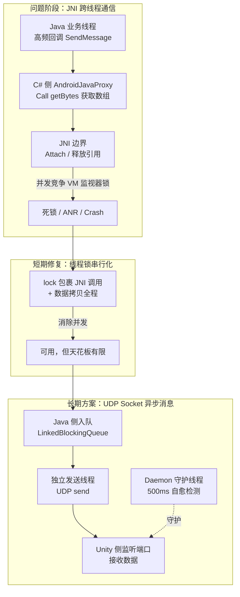
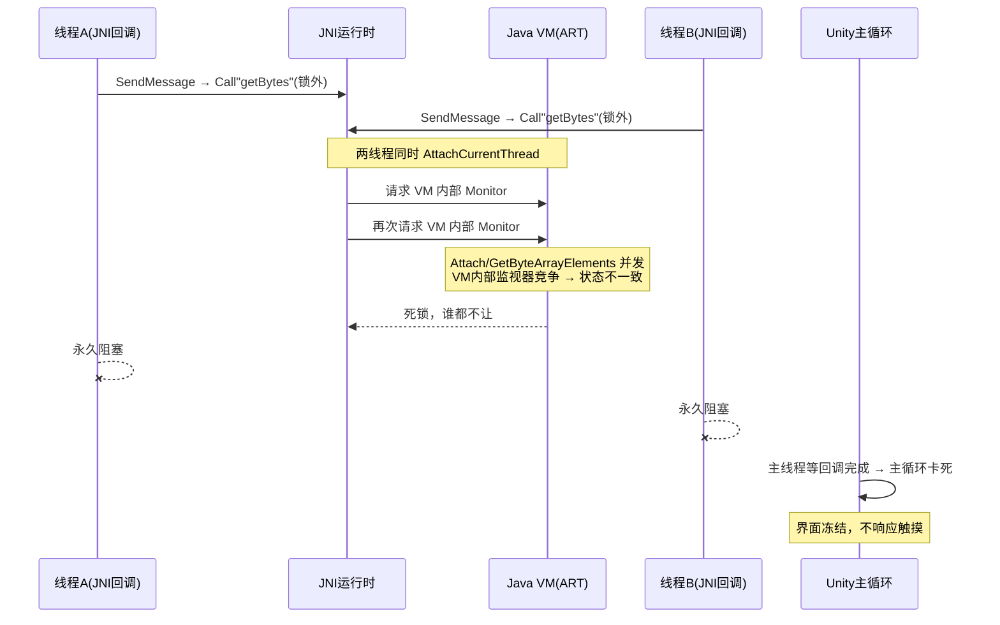
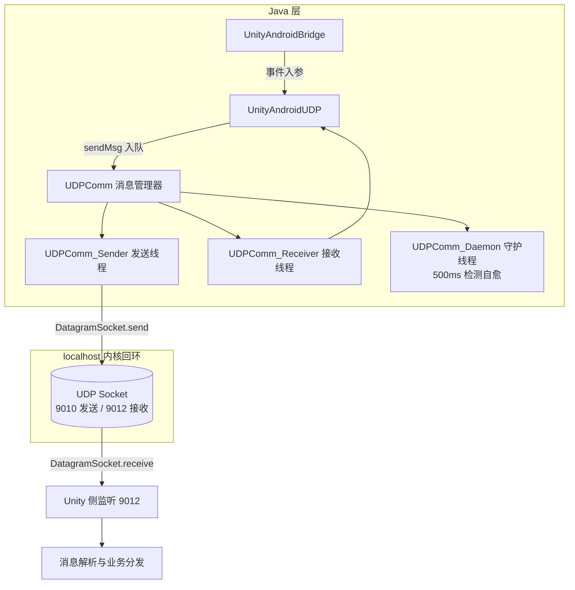

> 上一篇聊了黑屏，[《座舱3D HMI稳定性：黑屏 · binder清理与锁竞争》](https://mp.weixin.qq.com/) 讲的都是"锁竞争"惹的祸。这次咱们接着聊锁，但战场换到了 Unity C# 和 Android Java 之间的那座桥：JNI。
>
> 从两个 Bug 出发，讲清楚一个架构演化的故事：**JNI 死锁 → 线程锁短期修复 → JNI 迁移 UDP Socket（长期方案）**。

整体架构演化路径一览：



做 3D HMI 的都知道，Unity 引擎跑在 Android 上，业务数据从 Java 侧来。怎么把数据递给 Unity？最简单粗暴的就是 JNI。但恰恰是这个"简单"，埋下了后面一长串稳定性问题的雷。

咱们今天就从一个"偶发卡死"和一个"两次 ANR 直接 Crash"开始，把这颗雷拆开看。

---

# 问题表现

## 现象一：唤醒车辆，3D车模界面偶发卡死

用户在车上唤醒车辆，3D 车模界面初始化，界面**偶发卡死**：完全冻结、不响应触摸，持续无法恢复，只能重启应用或者等系统把它杀了重来。

这个场景挺典型的，恰恰是在**初始化阶段**，车控、空调、导航多个业务模块同时往 Unity 发消息，并发量不大不小，但刚好把雷踩爆了。

## 现象二：空调操作，两次 ANR 后直接 Crash

另一个更狠：用户操作空调（温度、风量、模式切换），Android 侧高频往 Unity 推状态变更消息。大量 JNI 通信并发执行，JNI 调用阻塞主线程，系统弹 ANR，一次、两次，然后系统杀了进程。

| 维度 | 现象一：界面卡死 | 现象二：ANR → Crash |
|------|------------------|----------------------|
| 触发场景 | 唤醒车辆，初始化阶段 | 空调高频操作 |
| 复现率 | 偶发 | 偶发（需大量JNI并发） |
| 并发量 | 中等 | 高 |
| 表现 | Unity主循环停滞，界面冻结 | Android主线程无响应，两次ANR后系统杀进程 |
| 直接原因 | JNI getBytes 并发死锁 | JNI 数组访问并发异常 |

两个 Bug，一个卡一个崩，看着毫不相干。但根因查下去，**是同一个架构缺陷的两副面孔**。

---

# 根因分析：C# 跨线程通过 JNI 获取 Java 数组，为什么死锁？

## 先看 JNI 通信在工程里长什么样

Unity 与 Android 之间的 JNI 通信分两条路：

- **C# → Java**：`AndroidJavaObject.Call()` 直接调 Java 方法（发数据）；
- **Java → C#**：通过 `AndroidJavaProxy` 回调，Java 侧调 C# 侧实现的接口方法（收数据）。

坏事就发生在**回收集这条路上**。C# 侧收到 Java 抛过来的 `AndroidJavaObject`，里面包着 Java 的 byte 数组，要 `Call<sbyte[]>("getBytes")` 把它取出来。

## 缺陷代码：JNI 调用在 lock 外面

修复之前，`UnityJniListener.SendMessage` 长这样：

```csharp
// 源码路径：Assets/Scripts/Network/Runtime/JNIChannel.AndroidListener.cs
// 以下为修复前（ff71f2ae^ 版本）示意代码
public class UnityJniListener : AndroidJavaProxy
{
    private const int BufferLength = 8192;
    private static object s_Locker = new object();
    private byte[] _receiveBuffer = new byte[BufferLength];

    [Preserve]
    public void SendMessage(AndroidJavaObject wrapper)
    {
        try
        {
            // ⚠️ JNI 调用在锁外！
            var bytes = wrapper.Call<sbyte[]>("getBytes");
            int length = bytes.Length;                 // 访问 Java 数组
            if (length > BufferLength)
                throw new Exception($"buffer is greater than {BufferLength}");

            lock (s_Locker)                            // ← 锁内只有数据拷贝
            {
                for (int i = 0; i < length; i++)
                    _receiveBuffer[i] = (byte)bytes[i];
                onReceive?.Invoke(_receiveBuffer, length);
            }
        }
        catch (Exception e) { _log.Error(e); }
        finally { wrapper.Dispose(); }
    }
}
```

一眼看过去，锁也加了，`_receiveBuffer` 的并发写也保护了，好像没啥问题？

**问题在于：锁保护了 C# 的共享数据，却没保护 JNI 调用本身。**

## 死锁机制：JNI 调用到底干了什么？

`wrapper.Call<sbyte[]>("getBytes")` 看起来像普通方法调用，实际上底层要过五关斩六将：

1. `AttachCurrentThread`，把当前线程附加到 Java VM（如果还没附加）；
2. `GetByteArrayElements`，拿 Java byte[] 的本地引用；
3. 数据拷贝，从 Java 堆拷到 C# 堆；
4. `ReleaseByteArrayElements`，释放本地引用；
5. `DetachCurrentThread`，分离线程。

**每一步都涉及 Java VM 内部的监视器锁（Monitor）**。`SendMessage` 是 Android 侧随便一个业务线程都能回调进来的方法，当两个线程同时执行第 2、4、5 步时，就可能撞上 VM 内部的锁竞争，然后，死锁。



**根因一句话**：`Call<sbyte[]>("getBytes")` 和 `bytes.Length` 都是通过 JNI 进 Java VM 操作堆上对象的，底层要跟 VM 抢监视器锁；C# 侧没有把这些调用串行化，两线程并发进去就死锁。

## 为什么 C# 的 lock 护不住 JVM？

这就是"跨语言边界"的坑：

```
C# 运行时 (Mono/IL2CPP)  ←→  JNI 边界  ←→  Java 运行时 (ART)
    ↑                                       ↑
 C# 线程锁                              Java VM 内部锁
 (lock / Monitor)                   (synchronized / Monitor)
```

C# 的 `lock` 保护不了 Java VM 内部的操作。就算 C# 侧加得再完美，JNI 调用进入 VM 后，还是可能撞上 VM 的监视器锁。**线程 A 持有 C# 锁等 JNI 返回，线程 B 在 JNI 里等 VM 锁，VM 又在等……全是等，谁先动谁输。**

## 第二个 Bug：同一根因的另一副面孔

空调场景大量 JNI 并发，`bytes.Length` 开始报"数组长度异常"。细看机制：

| 异常类型 | 触发条件 | 表现 |
|---------|---------|------|
| JNI 数组已释放 | 线程 A 把 wrapper dispose 了，线程 B 还在访问 bytes | 访问已释放的 Java 对象 |
| 数组引用不一致 | 并发 GetByteArrayElements 返回不一致引用 | 长度异常/越界 |
| VM 内部锁竞争 | 并发 AttachCurrentThread 冲突 | JNI 永久阻塞 → ANR |

```
空调大量操作
  → 频繁 JNI 发消息
  → 多线程并发进 SendMessage
  → 并发 getBytes / 并发 Dispose
  → JNI 内部竞争 → 线程阻塞
  → 阻塞扩散到主线程（主线程也在等回调）
  → 主线程无响应 > 5s → ANR（第1次）
  → 用户继续操作 → ANR（第2次）
  → 系统杀进程 → Crash
```

一个表现为"JNI getBytes 死锁"，一个表现为"JNI 数组异常"，**本质都是 JNI 调用缺少串行化保护**，不同并发压力下，死法不同而已。

---

# 短期修复：线程锁

定位到根因后，第一版修复很简单：**把 JNI 调用整个挪进 lock 里**。

## 修复：JNI 调用移入 lock 块

```csharp
// 源码路径：Assets/Scripts/Network/Runtime/JNIChannel.AndroidListener.cs
// 以下为修复后（ff71f2ae）示意代码
public void SendMessage(AndroidJavaObject wrapper)
{
    try
    {
        lock (s_Locker)                   // ← JNI 调用移入锁内
        {
            var bytes = wrapper.Call<sbyte[]>("getBytes");
            int length = bytes.Length;
            if (length > BufferLength)
                throw new Exception($"buffer is greater than {BufferLength}");

            for (int i = 0; i < length; i++)
                _receiveBuffer[i] = (byte)bytes[i];
            onReceive?.Invoke(_receiveBuffer, length);
        }
    }
    catch (Exception e) { _log.Error(e); }
    finally { wrapper.Dispose(); }
}
```

改动量：**+7 行 / -7 行**。核心逻辑是锁的覆盖范围从"仅数据拷贝"扩大到"JNI 调用 + 数据拷贝全程"，同一把锁串行化所有跨线程的 JNI 访问，堵上了并发进 VM 的路径。

| 维度 | 修复前 | 修复后 |
|------|--------|--------|
| JNI 调用位置 | lock 外 | lock 内 |
| 并发保护 | 仅数据拷贝 | JNI 调用 + 数据拷贝全程 |
| 死锁风险 | 高（并发 JNI） | 低（串行化） |
| 代码改动量 | - | +7 / -7 |

另一个 ANR 工单是直接升级共享模块包版本把这条修复带进去的（`0.13.9` → `1.1.240517`），思路完全一致。

## 后续强化：方法提取 + 错误处理

锁本身不是终点。到 2025 年底，这条回调链又重构过一次（`c35cddfb`），把逻辑拆成 `ProcessWrapper` 和 `DisposeWrapperSafe`，错误处理也硬化了：

```csharp
// 源码路径：Assets/Scripts/Network/Runtime/JNIChannel.AndroidListener.cs
// 当前版本（重构后）
[Preserve]
public void SendMessage(AndroidJavaObject wrapper)
{
    if (wrapper == null)                 // 空值前置检查
    {
        _log.Warning("SendMessage called with null wrapper");
        return;
    }
    try
    {
        ProcessWrapper(wrapper);
    }
    catch (Exception e) { _log.Error(e); }
    finally { DisposeWrapperSafe(wrapper); }   // Dispose 独立 try-catch
}

void ProcessWrapper(AndroidJavaObject w)
{
    lock (s_Locker)
    {
        var bytes = w.Call<sbyte[]>("getBytes");
        if (bytes == null || bytes.Length == 0)
        {
            _log.Warning("Received null or empty bytes from Java");
            return;
        }
        int length = bytes.Length;
        if (length > s_BufferLength)
        {
            // 超长消息直接丢弃，不再抛异常打断回调链
            _log.Warning($"received length {length} > buffer {s_BufferLength}, discarding message");
            return;
        }
        Buffer.BlockCopy(bytes, 0, _receiveBuffer, 0, length);  // 块拷贝替代逐字节
        if (length > 0)
        {
            _channel.Receive(_receiveBuffer, 0, length);
        }
    }
}
```

改进点整理一下：

- **超长消息丢弃 + Warning，不抛异常**，原来一条异常会打断回调链，现在优雅降级；
- **Dispose 独立封装**，防止 dispose 异常吞掉正常处理逻辑；
- **`Buffer.BlockCopy` 替代逐字节循环**，拷贝性能也顺手提了。

短期修复解决了三个 Bug 的燃眉之急。但是……锁的思路，天花板就放在那了。

---

# 长期方案：JNI → UDP Socket 架构改造

先说结论：**主工程在 2022 年就干完了这件事**（commit 5851cf4f，23 个文件、新增 964 行代码，提交信息写得明明白白："Unity android通信由JNI更换SokcetUDP方案 解决ANR和Crash问题"）。而共享模块里的 JNI 通道一直留到 2024 年还在缝缝补补，这就是"架构迁移不彻底"的典型恶果，后面细说。

## UDP 框架设计：两条路变一个环

先看整体结构，Android 侧发消息不再是"直接调 JNI"，而是**封装成消息丢进队列，由独立线程通过 localhost UDP 发送**；Unity 侧监听 UDP 端口收数据。JNI 调用直接清零：



其中 Java 侧是重头戏，四个组件各司其职。

## UDPComm：核心管理器

```java
// 源码路径：src/main/java/com/engine/udp_comm/UDPComm.java
public class UDPComm {
    private UDPComm_Sender sendThread;
    private UDPComm_Receiver receiverThread;
    private UDPComm_Daemon daemonThread;
    public DatagramSocket datagramSocket;

    public void sendMsg(UDPComm_Msg msg, boolean isReply) {
        if (!getSender().isAlive())
            getSender().start();        // 懒启动发送线程
        getSender().enqueueMsg(msg);    // 入队，异步发送
        if (isReply)
            startUdpServer();           // 需要回复时启动接收线程
    }

    // 双重检查锁（DCL）获取 Socket，线程安全
    public DatagramSocket getDatagramSocket() {
        if (datagramSocket != null)
            return datagramSocket;
        synchronized (lock) {
            if (datagramSocket != null)
                return datagramSocket;
            datagramSocket = UdpSocketManager.getUdpSocket(UDPComm_Config.LocalPort);
            if (datagramSocket == null) {
                datagramSocket = new DatagramSocket(UDPComm_Config.LocalPort);
                UdpSocketManager.putUdpSocket(datagramSocket);
            }
            datagramSocket.setSoTimeout((int) UDPComm_Config.RecTimeout); // 超时 10s
            return datagramSocket;
        }
    }
}
```

## UDPComm_Sender：发送线程 + 线程安全队列

发送方只做一件事：**`LinkedBlockingQueue.put()` 入队，然后由 Sender 线程异步 `send()`**。天然线程安全，不需要任何跨语言锁。

```java
// 源码路径：src/main/java/com/engine/udp_comm/UDPComm_Sender.java（示意）
private LinkedBlockingQueue<UDPComm_Msg> msgQueue;

public boolean enqueueMsg(final UDPComm_Msg msg) {
    if (msg == null || getSendingMsg() == msg || getMsgQueue().contains(msg))
        return false;
    getMsgQueue().put(msg);       // 线程安全入队
    return true;
}

@Override
public void run() {
    while (!Thread.interrupted()) {
        UDPComm_Msg msg = getMsgQueue().take();         // 阻塞取消息
        byte[] data = msg.getRawData();
        DatagramPacket packet = new DatagramPacket(data, data.length,
            new InetSocketAddress(UDPComm_Config.Addr, UDPComm_Config.RemotePort));
        context.datagramSocket.send(packet);            // 发送，不阻塞业务线程
    }
}
```

相比 JNI 的"调用方线程同步执行"，这里**发送方只花 O(1) 入队时间**，真正的 UDP send 在独立发送线程里做，业务线程永远不会卡在 IO 或 Java VM 上。

## UDPComm_Receiver + UDPComm_Daemon：接收与自愈

Reverse 线程阻塞在 `receive()` 上收包，这正好对应了"不阻塞主线程"；更妙的是 Daemon 守护线程每 500ms 检查一次接收线程活着没有，挂了就自动重启：

```java
// 源码路径：src/main/java/com/engine/udp_comm/UDPComm_Daemon.java
@Override
public void run() {
    while (deamon_running) {
        if (!ctx.isUdpServerRuning()) {
            ctx.startUdpServer();            // 接收线程挂了？重启
        }
        Thread.sleep(DAEMON_DETECT_DURATION);   // 500ms 检测一次
    }
}
```

JNI 一旦死锁只能杀进程，**UDP 的接收线程挂了还能自己复活**，这就是"可自我恢复"和"不可恢复"的本质差别。

## 消息协议：类型&JSON

UnityAndroidUDP 用简单字符串协议 `类型&JSON` 传输：

```java
// 源码路径：src/main/java/com/engine/udp_comm/UnityAndroidUDP.java
// Android → Unity：发送功能状态变更
public void sendFuntionValue2Unity(int function, int zone, int param) {
    StringBuilder sb = new StringBuilder();
    sb.append("1&");                                  // 类型1：功能状态变更
    sb.append(GetMsgJson(function, zone, param));     // {"ID":1,"Zone":2,"param":3}
    comm.sendMsg(UDPComm_Msg.getMessage2Send(sb.toString()));
}

// Unity → Android：接收
private void OnReceivieMsg(String sourceDataString) {
    String[] data = sourceDataString.split("&");
    int type = Integer.parseInt(data[0]);
    if (type == 1) {
        JSONObject jo = new JSONObject(data[1]);
        bridge.onFunctionStateChange(jo.getInt("ID"), jo.getInt("Zone"), jo.getInt("param"));
    } else if (type == 2) {
        JSONObject jo = new JSONObject(data[1]);
        bridge.onInteractionMsg(jo.getInt("msgType"), jo.getString("param"));
    }
}
```

消息协议是**约定即接口**：发方封装 JSON，收方解析 JSON，两边只依赖字符串协议，不再像 JNI 那样接口紧绑定，改一个字段不需要 Java/C# 两边同步改代码。

## UnityAndroidBridge：从 JNI 直调换成 UDP

Bridge 层是最直观的变化，改造前后：

```java
// 改造前（JNI 直调）
public void setFunctionValue(int function, int zone, int param) {
    if (unityInterface != null) {
        this.unityInterface.setFunctionValue(function, zone, param);  // JNI 调用
    }
}

// 改造后（UDP 发送）
public void setFunctionValue(int function, int zone, int param) {
    if (udp != null) {
        udp.sendFuntionValue2Unity(function, zone, param);  // UDP 消息
    }
}
```

`unityInterface`（JNI 直调接口）的所有调用注释掉，替换成 `udp.sendFuntionValue2Unity()`。**所有 `AndroidJavaProxy`、`AndroidJavaObject.Call()` 从这条路径上彻底消失了。**

---

# JNI vs UDP：全方位对比

| 维度 | JNI 方式 | UDP Socket 方式 |
|------|---------|-----------------|
| 线程安全 | 需手动加 lock 保护 JNI 调用 | `LinkedBlockingQueue` 天然线程安全 |
| 死锁风险 | 高（JNI 内部锁竞争） | 无（独立收发线程，无跨语言锁） |
| ANR 风险 | 高（JNI 阻塞主线程） | 无（异步消息队列） |
| 错误恢复 | 难（JNI 死锁无法超时） | 易（Socket 超时 + Daemon 自动重启） |
| 性能 | 每次调用 AttachCurrentThread | localhost UDP，内核级转发（约 0.1～1ms） |
| 调试 | JNI 崩溃栈不完整 | tcpdump / Wireshark 直接抓包 |
| 扩展性 | 接口绑定紧耦合 | 消息协议松耦合 |
| 可靠性 | 同步调用，一次失败全链崩 | UDP 不保证送达，但 localhost 场景影响极小 |

**关于 UDP 可靠性的那点顾虑**，localhost 场景下大可放心：

```
应用层 → UDP Socket → 内核 loopback → UDP Socket → 应用层
```

不经过网卡、不经过路由器，无物理层丢包；唯一风险是接收线程挂掉导致内核缓冲区满，而 Daemon 线程每 500ms 盯着，接收端永远活着。**在车机 localhost 环境里，UDP 的可靠性和 TCP 差异极小，但省掉了连接建立/维护/关闭的开销。**

代价也要认：序列化开销（JSON 编解码）、端口管理、还有 UDP 数据报 64KB 大小上限，好在那时业务消息都远小于 1KB，够用。

---

# 技术启示：架构演化的决策框架

## 演化时间线：为什么同样的 Bug 会重复出现？

```
2022.09 ─── 主工程：JNI → UDP 迁移（commit 5851cf4c）
             │  "将 Unity Android 通信由 JNI 更换为 Socket UDP，解决 ANR/Crash 问题"
             │  +964 行代码，23 个文件
             │
2024.05 ─── 共享模块：JNI ANR 修复（commit b6305369）
             │  "添加线程锁，控制对 JNI 调用访问权限"（版本升级 0.13.9 → 1.1.240517）
             │
2024.05 ─── 共享模块：JNI 死锁修复（commit ff71f2ae）
             │  "在跨线程通过 JNI 获取 Java 数据时添加线程锁保护"（+7/-7）
             │
2025.12 ─── 共享模块：JNIChannel 重构（commit c35cddfb）
                "提取方法，增强错误处理"（超长消息丢弃不抛异常）
```

看到没有？**主工程 2022 年就迁完了，共享模块 2024 年还在打 JNI 的补丁。** 两个 Bug 一模一样的问题，在底层共享模块里又复发了一遍。

这就是三个教训：

1. **架构迁移必须彻底**：只迁了上层（主工程），底层共享模块没跟着迁，问题又复发了一遍；
2. **遗留接口是定时炸弹**：旧的 JNI 通道只要还可用，就一定会有人调；
3. **迁移要有"断尾"计划**：给旧通道定废弃时间表，不能无限期并存。

## 决定性框架：什么时候用 JNI，什么时候用 UDP？

| 场景 | 推荐方案 | 理由 |
|------|---------|------|
| 高频状态同步（空调/车控/传感器） | **UDP** | 异步不阻塞，天然线程安全 |
| 低频一次性调用（初始化/配置） | JNI | 简单直接，无需框架 |
| 大数据传输（图片/模型资源） | 共享内存/文件 | UDP 数据报有大小限制 |
| 双向实时交互（触摸事件转发） | **UDP** | 低延迟双向通信 |
| 需要严格保序 | TCP Socket | UDP 不保证顺序 |

一句话：**高频的数据流走消息化通道，低频的命令走直接调用。** 这才是架构演化的本质。高频跨语言同步调用就是定时炸弹，核心思路是把同步调用变成异步消息流。

## 迁移策略：渐进式，四步走

```
阶段1：识别高频通信路径，统计 JNI 调用频率，圈出 ANR/Crash 高发路径
阶段2：双通道并行，新消息走 UDP，旧消息仍走 JNI，逐步迁移
阶段3：JNI 降级为 fallback，UDP 不可用时回退，监控 UDP 通道健康
阶段4：完全移除 JNI，删 AndroidJavaProxy / AndroidJavaObject 相关代码
```

## 一套可复用的 UDP 框架设计清单

| 设计要点 | 实现方式 | 解决的问题 |
|---------|---------|-----------|
| 发送异步化 | `LinkedBlockingQueue` + 独立 Sender 线程 | 发送不阻塞调用方线程 |
| 接收独立化 | 独立 Receiver 线程 + 阻塞 `receive()` | 接收不阻塞主线程 |
| 自动恢复 | Daemon 线程 500ms 检测 + 自动重启 | 线程意外退出后自愈 |
| Socket 复用 | `UdpSocketManager` 按端口缓存 | 避免反复创建/关闭 |
| 创建安全 | `getDatagramSocket()` 双重检查锁（DCL） | Socket 创建的线程安全 |
| 消息追踪 | `UDPComm_Msg` + 自增 ID | 去重与问题定位 |
| 回调解耦 | `UDPCommListener` 接口 + UI 线程 post | 回调在主线程执行 |
| 超时控制 | `setSoTimeout(10000ms)` | 防止 receive 永久阻塞 |

---

# 结语

两个 Bug，一个偶发卡死，一个两次 ANR 直接 Crash，根子都在同一个地方：**跨语言边界的同步调用没做串行化保护**。第一版修复（线程锁）把 JNI 挪进 lock，是把它从"崩溃"拉回"可用"；而主工程早在两年前就给出了终极答案：直接用 localhost UDP 异步消息替代 JNI，从根上消灭跨语言边界。

C# 的锁永远保护不了 Java VM 内部的锁，**跨语言通信的本质问题只能用架构解决，不能用锁解决**。

留个问题给你们：如果你的工程里还有 JNI/FFI 类似的跨语言直调路径，有没有想过，现在它没出问题，只是并发量还没到引爆点？<br>下一篇预告：聊聊 UDP 通道自身的**双队列背压设计**，当数据快于消费时，怎么保证 Unity 主线程扛得住。这是"通信改造完了之后"另一半故事。

**给开发者的 JNI 使用清单**（经历过这轮 Bug 沉淀的）：

| 检查项 | 风险 | 建议 |
|--------|------|------|
| JNI 调用是否在 lock 内 | 并发死锁 | 所有 JNI 调用必须同锁串行化 |
| AndroidJavaObject 是否及时 Dispose | 本地引用泄漏/野指针 | try-finally 确保，并发时锁内 Dispose |
| 回调方法是否处理 null | Null 引用异常 | 前置空值检查 |
| 数组长度是否校验 | 越界/超长 | 校验长度，超长丢弃而非抛异常 |
| 是否有超时机制 | 永久阻塞 | JNI 无法超时，考虑架构替代 |

> 全文基于真实工程案例，源码路径与提交记录均已保留（提交 ID 已标注），代码已脱敏。具体实现受限于当时的引擎版本与服务架构，不可照搬。