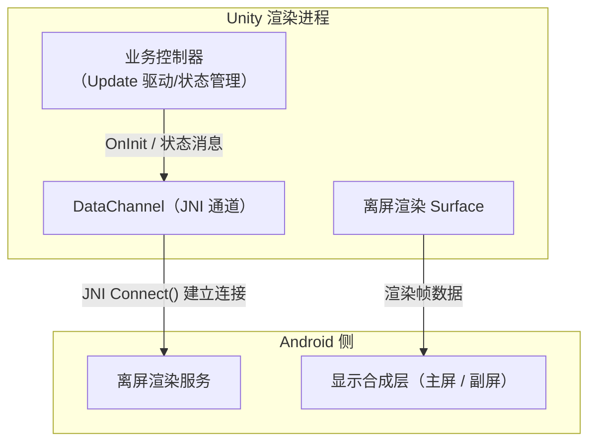
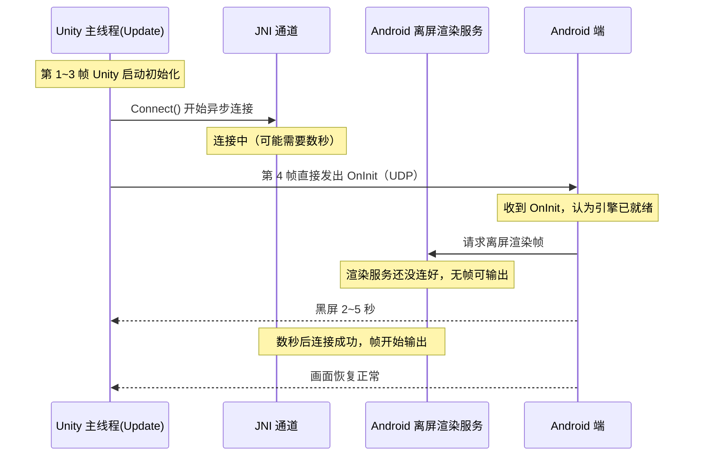
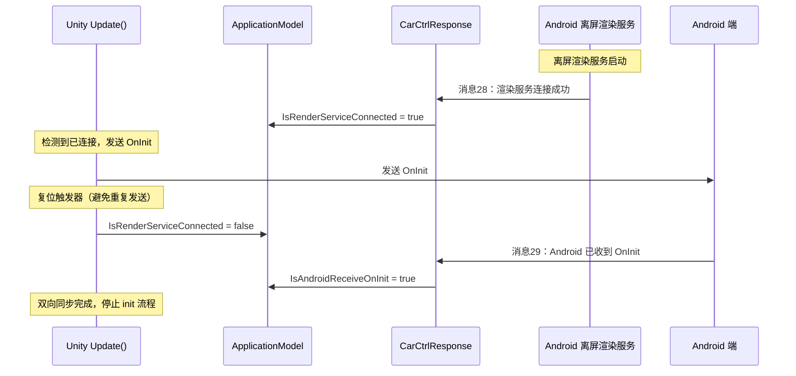


---

> 黑屏，是座舱 3D HMI 里最烦人的问题，比卡顿还烦，卡顿至少画面还在，黑屏是一点信息都不给你，用户只能干瞪眼。
>
> 上一篇聊了服务化渲染进程里 binder 死亡回调锁住消息通道导致的黑屏，这次再分享两个更"家常"的：一个出在**离屏渲染的启动时序**，固定帧数就把初始化通知发出去了，结果渲染服务还没接好线，Android 端拿不到帧就黑屏几秒；另一个出在**多屏分辨率 API 用错**，用 `Screen.SetResolution` 去设置副屏的分辨率，它只对主屏生效，副屏全黑，连 loading 都显示不出来。

这两个 Bug 一个在启动阶段、一个在切换阶段，根因看着八竿子打不着，但本质上都是同一件事：**渲染输出链路的某一环没就绪，就提前通知了外部"我可以显示了"**。

---

# 一、问题表现：两起黑屏 Bug

## 1.1 Bug 一：启动黑屏几秒

用户首次进入环视可视化模块（这里简称 SR）的页面时，屏幕全黑，没有任何渲染内容输出，持续 2~5 秒后画面才恢复正常。

这个黑屏是**必现**的，只要你"首次进入"，基本每次都黑。当时第一反应是渲染管线崩了，抓了日志才发现引擎层面一切正常，问题出在"谁先谁后"上。

## 1.2 Bug 二：切换到 3D 车模，全黑 + loading 不显示

在多屏座舱项目里，从其他界面切到 3D 车模页面，屏幕直接全黑，而且连加载 loading 动画都不显示。

正常逻辑是先弹 loading 再出画面，结果这次连 loading 都没了，用户看到的就是一块没有边框的黑屏，体验特别糟糕。也是**必现**问题，多屏环境下一切就黑。

## 1.3 两个 Bug 的量化对比

| 维度 | Bug 一（启动黑屏） | Bug 二（切车模黑屏） |
|------|--------------------|---------------------|
| 黑屏时长 | 启动后约 2~5 秒 | 切换后持续黑屏，直到手动恢复 |
| 触发条件 | 首次进入 SR 页面 | 多屏环境下切换到 3D 车模 |
| 复现率 | 必现（首次进入） | 必现（多屏环境） |
| 修复规模 | 3 个 C# 文件（+48 行） | 1 个 JSON 配置（+20 行） |
| 修复复杂度 | 中等（要设计同步机制） | 低（调用正确的 Display API） |

---

# 二、根因分析

## 2.1 先认识离屏渲染

这两个问题都发生在**离屏渲染架构**里，所以先把这个架构讲清楚。

普通 Unity 应用是直接把画面渲到屏幕上的，离屏渲染不一样：Unity 渲染进程不直接输出到屏幕，而是通过 JNI 通道跟 Android 侧的离屏渲染服务通信，渲染帧数据通过离屏 Surface 输出，最终由 Android 侧负责合成显示。



这个架构下有个天然的问题：**Unity 的"初始化完成"和 Android 侧的"可以显示"是两套独立状态，必须通过消息对齐。** 两个黑屏都是这个"对齐"没做好。

## 2.2 根因一：固定帧计数发 OnInit

### 2.2.1 原始写法

SR 模块启动时，控制器在 `Update()` 里用**固定帧计数**决定什么时候通知 Android 端"我初始化完成了"：

```csharp
// 源码路径：Assets/Scripts/CarCtrl/CarCtrlManager.cs
// 以下为示意代码（已脱敏）
public class CarCtrlManager : MonoBehaviour
{
    private int _updateCount;

    private void Update()
    {
        if (_updateCount >= 4) return;

        if (_updateCount == 3)              // 第 4 帧就发 OnInit
        {
            SendOnInitToAndroid();
        }
        _updateCount++;
    }

    private void SendOnInitToAndroid()
    {
        // 通过 UDP 交互通道给 Android 端发 OnInit
        SocketClient.Instance.SendToAndroid(
            (int)InteractionMessageType.OnInit,
            InteractionMessageString.OnInit);
    }
}
```

而离屏渲染服务的连接是**异步**的，走 JNI 通道：

```csharp
// 源码路径：Assets/Scripts/GameService/DataChannel.cs
// 以下为示意代码（已脱敏）
public class DataChannel
{
    public bool Connect()
    {
        // 通过 JNI 连接 Android 侧的离屏渲染服务
        AndroidJavaClass cls =
            new AndroidJavaClass("com.engine.offscreen.GameService");
        _androidObject = cls.CallStatic<AndroidJavaObject>("getInstance");
        _listener = new GameServiceListener(this);
        _androidObject.Call("setListener", _listener);
        return true;
    }
}
```

问题本质就一句话：**第 4 帧发 OnInit 是一个"固定时序假设"，假设 4 帧后所有渲染基础设施都就绪了。** 但离屏渲染服务是异步连接的，第 4 帧时 JNI 通道很可能根本没连上，这取决于系统调度、binder 传输快慢，运气好 1 帧就连上，运气差要好几秒。

### 2.2.2 时序冲突

画出时序图就一目了然了：



**根因总结**：`SendOnInitToAndroid()` 的触发条件是"固定帧数"，跟"离屏渲染服务实际连接状态"无关。当渲染服务连接慢于第 4 帧时，Android 端收到 OnInit 后就开始拉帧，但服务端根本无帧可输出 → 黑屏数秒。

当时的排查过程也挺有意思：日志里 Unity 侧一切正常，Android 侧也"确实收到 OnInit 了"，两边都在干活，就是画面黑的。直到把消息 28（渲染服务连接成功）和 OnInit 的到达时间拉出来一对比，才发现 OnInit 比消息 28 早发了整整两秒，**通知比就绪早了两秒**。

## 2.3 根因二：Screen.SetResolution 只对主屏生效

### 2.3.1 错误的源

切换到 3D 车模界面时，原来通过 `SetResolutionCmd` 设置分辨率：

```csharp
// 源码路径：Assets/Scripts/Setting/Commands/SetResolutionCmd.cs
// 以下为示意代码
public class SetResolutionCmd : AbstractCommand
{
    private int _width;
    private int _height;
    private bool _fullscreen;

    protected override void OnExecute()
    {
        App.Setting.SetResolution(_width, _height, _fullscreen);
    }
}
```

`SetResolution` 最终落到 `Screen.SetResolution`：

```csharp
// 源码路径：Assets/Scripts/Setting/SettingComponent.Graphic.cs
// 以下为示意代码
private IEnumerator CheckResolutionNextFrame()
{
    yield return null;   // 等一帧再设置
    int width = (int)(ResolutionWidth * ResolutionScaleX);
    int height = (int)(ResolutionHeight * ResolutionScaleY);
    Screen.SetResolution(width, height, true);  // ⚠️ 只对主 Display 生效
}
```

### 2.3.2 Screen 和 Display 的区别

多屏座舱环境里，UI 是分散在多个物理屏幕上的：主屏跑系统桌面、空调这些，副屏跑 3D 车模、SR 可视化。而 `Screen.SetResolution` 只操作 `Display.displays[0]`（主屏）：

| API | 作用对象 | 多屏支持 | 适用场景 |
|-----|---------|---------|---------|
| `Screen.SetResolution` | 主 Display（`Display[0]`） | ❌ 仅主屏 | 单屏应用 |
| `Display.SetRenderingResolution` | 指定 Display | ✅ 可指定 displayId | 多屏座舱环境 |

### 2.3.3 黑屏发生路径

```text
切换到 3D 车模
  → SetResolutionCmd 执行
  → Screen.SetResolution(w, h, true)
  → 仅主屏分辨率变更
  → 副屏分辨率未设置 / 不匹配
  → 副屏渲染输出异常
  → 黑屏（且 loading 也不显示，因为 loading 也渲在副屏上）
```

**为什么连 loading 都不显示？** 正常切到 3D 车模应该先弹 loading，但 loading UI 也渲染在副屏上，副屏分辨率没设对，不仅车模黑，loading 也跟着黑，所以用户看到的就是"全黑 + 无任何提示"。

---

# 三、解决方案

## 3.1 离屏渲染启动：从"单向通知"到"双向同步"

### 3.1.1 设计思路

核心改动：把"固定帧数发 OnInit"改成"**等服务连接成功再发 OnInit**"，并在 Android 端加一个**确认回执**，形成完整的双向同步链路：



整个同步链路是：**消息28（服务就绪）→ Unity 发 OnInit → 消息29（Android 确认）**。两步确认都走完，才说明这条渲染链路真的通了。

### 3.1.2 状态字段：ApplicationModel

在数据模型里新增两个状态字段，都用 `BindableProperty<bool>`，支持属性变更通知：

```csharp
// 源码路径：Assets/Scripts/Model/ApplicationModel.cs
// 以下为示意代码（已脱敏）
public class ApplicationModel
{
    // ... 已有字段 ...

    /// <summary>
    /// 离屏渲染服务是否连接成功（一次性触发标志）
    /// </summary>
    public BindableProperty<bool> IsRenderServiceConnected { get; private set; } =
        new BindableProperty<bool> { Value = false };

    /// <summary>
    /// Android 端是否已收到 OnInit（终态标志）
    /// </summary>
    public BindableProperty<bool> IsAndroidReceiveOnInit { get; private set; } =
        new BindableProperty<bool> { Value = false };
}
```

设计上有几个点值得抠一下：

- **两个字段初始值都是 false**，保证启动时处于"未就绪"状态，不会误判；
- `IsRenderServiceConnected` 是**一次性触发标志**，发完 OnInit 后立刻复位，避免每帧重复发送；
- `IsAndroidReceiveOnInit` 是**终态标志**，一旦为 true 就不再复位，用来终止整个 init 流程。

### 3.1.3 消息响应：CarCtrlResponse

新增两个消息处理器，接收来自 Android 端的状态消息：

```csharp
// 源码路径：Assets/Scripts/Network/ReceiveAndroidMsg/Base/CarCtrlResponse.cs
// 以下为示意代码（已脱敏）

/// <summary>
/// 消息28：离屏渲染引擎连接成功，确认 Unity 是否已启动完成
/// </summary>
public class Response_RenderServiceReady : AbstractResponse
{
    protected override void OnExecute()
    {
        var model = this.GetModel<ApplicationModel>();
        var msg = data as InteractionMsgData;
        Debug.Log($"receive 28: {msg.MsgData.Trim()}");
        model.IsRenderServiceConnected.Value = true;   // 标记渲染通道就绪
    }
}

/// <summary>
/// 消息29：Android 端确认已收到 OnInit 事件
/// </summary>
public class Response_OnInitAcked : AbstractResponse
{
    protected override void OnExecute()
    {
        var model = this.GetModel<ApplicationModel>();
        var msg = data as InteractionMsgData;
        Debug.Log($"receive 29: {msg.MsgData.Trim()}");
        model.IsAndroidReceiveOnInit.Value = true;      // 同步完成
    }
}
```

这两个处理器的职责非常单一：收到消息 → 改状态 → 完事。真正的决策逻辑全在 Update 里。

### 3.1.4 驱动改造：AbstractAppManagerController

把 Update 里的"固定帧计数"升级为"状态驱动"：

```csharp
// 源码路径：Assets/Scripts/Base/AppManager/Base/AbstractAppManagerController.cs
// 以下为示意代码（已脱敏）
public abstract class AbstractAppManagerController : MonoBehaviour, IController
{
    private ApplicationModel _applicationModel;
    private int _updateCount;

    private void Awake()
    {
        _applicationModel = this.GetModel<ApplicationModel>();
    }

    private void Update()
    {
        // 1. 终态检查：Android 已收到 OnInit，整个流程结束
        if (_applicationModel.IsAndroidReceiveOnInit.Value)
            return;

        // 2. 状态驱动：渲染服务已连接，才发 OnInit
        if (_applicationModel.IsRenderServiceConnected.Value)
        {
            SendOnInitToAndroid();
            // 一次性触发标志，立即复位，避免重复发送
            _applicationModel.IsRenderServiceConnected.Value = false;
            return;
        }

        // 3. 兜底：保留固定帧计数，防止双向消息丢失后永远等待
        //    正常路径由状态驱动；如果消息28一直没到（跨进程消息丢失、服务异常），
        //    超过阈值后按原逻辑兜底处理，避免死锁
        if (_updateCount < MAX_WAIT_FRAMES)
        {
            if (_updateCount == MAX_WAIT_FRAMES - 1)
            {
                SendOnInitToAndroid();     // 兜底发送
            }
            _updateCount++;
        }
    }
}
```

这里有个容易被忽略的点：**兜底策略**。双向同步看起来严谨，但跨进程通信本身可能丢消息，万一 Android 侧抽风没发消息 28，难道 Unity 永远等下去？显然不行。所以保留了固定帧计数作为降级路径：等不到就按原逻辑兜底，宁可偶尔黑一下，也不能永远不显示。

### 3.1.5 完整同步流程

```
1. Unity 启动，DataChannel.Connect() 开始异步连接离屏渲染服务
2. Android 侧离屏渲染服务连接成功，发送消息28 给 Unity
3. Unity Response_RenderServiceReady 处理：IsRenderServiceConnected = true
4. Update() 检测到已连接，执行 SendOnInitToAndroid()
5. 复位 IsRenderServiceConnected = false（避免重复发送）
6. Android 收到 OnInit，发送消息 29 给 Unity
7. Unity Response_OnInitAcked 处理：IsAndroidReceiveOnInit = true
8. Update() 检测到终态，停止 init 流程
9. 双向同步完成，渲染链路就绪，无黑屏
```

### 3.1.6 改造前后对比

| 维度 | 修复前 | 修复后 |
|------|--------|--------|
| 触发条件 | 固定第 4 帧 | 离屏渲染服务连接成功（消息28） |
| 同步机制 | 无（单向通知） | 双向同步（消息28 → OnInit → 消息29） |
| 状态管理 | 无状态 | 两个 `BindableProperty` 状态字段 |
| 黑屏风险 | 高（时序不匹配时必现） | 低（确保渲染服务就绪后才通知） |

## 3.2 多屏分辨率：SetDisplayResolutionCmd

### 3.2.1 新增命令

```csharp
// 源码路径：Assets/Scripts/Setting/Commands/SetDisplayResolutionCmd.cs
// 以下为示意代码
public class SetDisplayResolutionCmd : AbstractCommand
{
    private int _displayId;
    private int _width;
    private int _height;

    protected override void OnExecute()
    {
        App.Setting.SetDisplayResolution(_displayId, _width, _height);
    }

    public static SetDisplayResolutionCmd Create(int displayId, int width, int height)
    {
        var cmd = ReferencePool.Acquire<SetDisplayResolutionCmd>();
        cmd._displayId = displayId;
        cmd._width = width;
        cmd._height = height;
        return cmd;
    }
}
```

### 3.2.2 SetDisplayResolution 实现

```csharp
// 源码路径：Assets/Scripts/Setting/SettingComponent.Graphic.cs
// 以下为示意代码
public void SetDisplayResolution(int displayId, int width, int height)
{
    var display = Display.displays[displayId];
    display.Activate();                                  // ① 先激活目标 Display
    display.SetRenderingResolution(width, height);       // ② 再设置渲染分辨率
    _log.Debug($"DisplayRenderResolution " +
        $"{display.renderingWidth}x{display.renderingHeight}, " +
        $"SurfaceResolution={display.systemWidth}x{display.systemHeight}");
}
```

两个必须注意的细节：

1. **`Activate()` 必须在 `SetRenderingResolution()` 之前调用**，多屏环境下未激活的 Display 设置分辨率是无效的；
2. 设置完要**验证生效**：`renderingWidth × renderingHeight` 是实际渲染分辨率，`systemWidth × systemHeight` 是物理屏幕分辨率，两者要匹配。这段日志就是为验证准备的，出问题第一时间看日志就能定位。

### 3.2.3 配置注册

在命令配置文件里注册多种分辨率的 `SetDisplayResolutionCmd`（示意数据）：

```json
// 源码路径：Assets/StreamingAssets/Commands/commands.json（节选，示意）
{
  "category": "Graphic Settings",
  "displayName": "设置 Display 分辨率 1272*1200",
  "parameters": "type=Command&name=Hmi.SetDisplayResolutionCmd&displayId=0&width=1272&height=1200"
},
{
  "category": "Graphic Settings",
  "displayName": "设置 Display 分辨率 1920*1200",
  "parameters": "type=Command&name=Hmi.SetDisplayResolutionCmd&displayId=0&width=1920&height=1200"
}
```

其实在 `RefreshResolution` 里面留过 `SetDisplayResolution` 的注释调用，说明开发者早考虑过直接改，但最后还是选独立命令：**不影响原有的 `SetResolution` 单屏流程，多屏时单独触发，职责分离。**

### 3.2.4 两个命令对比

| 维度 | SetResolutionCmd | SetDisplayResolutionCmd |
|------|-------------------|------------------------|
| 调用 API | `Screen.SetResolution()` | `Display.SetRenderingResolution()` |
| 作用对象 | 主 Display（`Display[0]`） | 指定 displayId 的 Display |
| 多屏支持 | ❌ | ✅ |
| 参数 | width, height, fullscreen | displayId, width, height |
| 适用场景 | 单屏应用 / 主屏分辨率 | 多屏座舱 / 指定 Display |

---

# 四、多屏黑屏排查清单

多屏环境下再遇到黑屏，按下面这个顺序排查，基本能覆盖九成的情况：

1. **Display 是否激活**：`Display.displays[displayId].active` 是否为 true；
2. **渲染分辨率是否正确**：`display.renderingWidth × display.renderingHeight` 是否符合预期；
3. **有没有误用 `Screen.SetResolution`**：全局搜一下代码里有没有拿它设置副屏分辨率；
4. **Camera 的 Target Display**：相机 `targetDisplay` 是否指向正确的 Display；
5. **渲染分辨率 vs 物理分辨率**：`renderingWidth`/`systemWidth` 是否匹配。

| 检查项 | 关键 API / 属性 | 预期值 |
|--------|------------------|--------|
| Display 已激活 | `Display.displays[i].active` | true |
| 渲染分辨率正确 | `display.renderingWidth × renderingHeight` | 与目标一致 |
| 误用 Screen API | 搜索 `Screen.SetResolution` | 只用于主屏 |
| Camera 目标屏 | `Camera.targetDisplay` | 等于 displayId |
| 物理/渲染分辨率匹配 | `systemWidth` vs `renderingWidth` | 匹配 |

---

# 五、启示与沉淀

## 5.1 状态驱动优于时序假设

这两个 Bug 里最值得记住的一课是：**别用"固定帧数 / 固定延迟"去假设基础设施就绪**。

```csharp
// ❌ 反面：固定帧数假设
if (updateCount == 3)
{
    SendOnInitToAndroid();          // 假设 4 帧后一切就绪
}

// ✅ 正面：状态驱动
if (_applicationModel.IsRenderServiceConnected.Value)
{
    SendOnInitToAndroid();          // 确认渲染服务已连接
}
```

固定帧数在单机性能稳定的环境里能用，但在跨进程、跨设备、连接靠异步的离屏渲染架构里，就是地雷。渲染基础设施什么时候就绪，应该问它自己，不能拍脑袋数帧。

## 5.2 双向确认机制

离屏渲染场景下的启动同步，应该用**双向确认**，不能只做单向通知：

| 环节 | 消息方向 | 含义 | 缺失风险 |
|------|---------|------|---------|
| 渲染服务连接确认 | Android → Unity | 离屏渲染通道已就绪 | Unity 提前通知 → 黑屏 |
| OnInit 通知 | Unity → Android | Unity 引擎初始化完成 | Android 不知道何时开显示 |
| OnInit 确认 | Android → Unity | Android 已开始处理 | Unity 不知道是否需重试 |

## 5.3 API 选型看部署环境

| 部署环境 | 推荐 API | 原因 |
|---------|---------|------|
| 单屏 PC / 移动端 | `Screen.SetResolution` | 简单直接，无多屏管理 |
| 多屏车机 / 嵌入式 | `Display.SetRenderingResolution` | 可精确控制每个 Display |
| 离屏渲染 | RenderTexture + 自定义输出 | 不依赖 Display 系统 |

## 5.4 从 Bug 沉淀的工程规范

| 规范 | 来源 | 落地方式 |
|------|------|---------|
| 启动同步必须双向确认 | Bug 一 | 消息28 → OnInit → 消息29 |
| 多屏分辨率必须用 Display API | Bug 二 | SetDisplayResolutionCmd |
| 状态字段用 BindableProperty | Bug 一 | ApplicationModel 状态管理 |
| 分辨率设置后需验证生效 | Bug 二 | 打印 renderingWidth / Height |
| Command 要区分作用域 | Bug 二 | SetResolutionCmd vs SetDisplayResolutionCmd |

---

# 结语

两个黑屏，一个出在"启动时序假设"，一个出在"API 作用域选错"，看起来毫无关系，本质都是同一件事：**渲染输出链路没有真正就绪，就告诉外部"我可以显示了"。**

这也总结出了一个通用判据：任何涉及渲染输出的场景，在通知外部"画面已就绪"之前，先确认整条渲染链路已连通，`渲染管线初始化 → 渲染服务连接 → 帧数据可输出 → 通知外部就绪`，缺一环都可能变成"通知已发出，画面却黑着"。

黑屏问题在车载 3D HMI 里永远不缺素材，下一篇可以聊聊系统杀掉渲染进程后如何自动恢复，以及恢复过程中的画面保护策略，毕竟"别让用户看到黑屏"和"别让用户永远看不到画面"，都是稳定性的一部分。