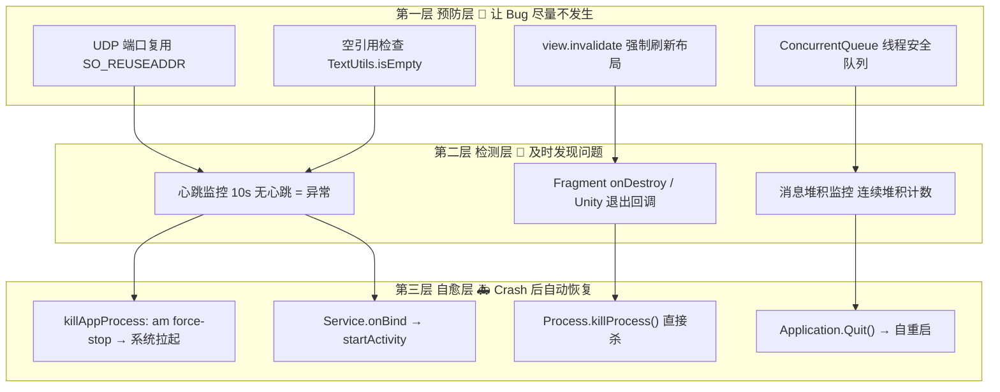
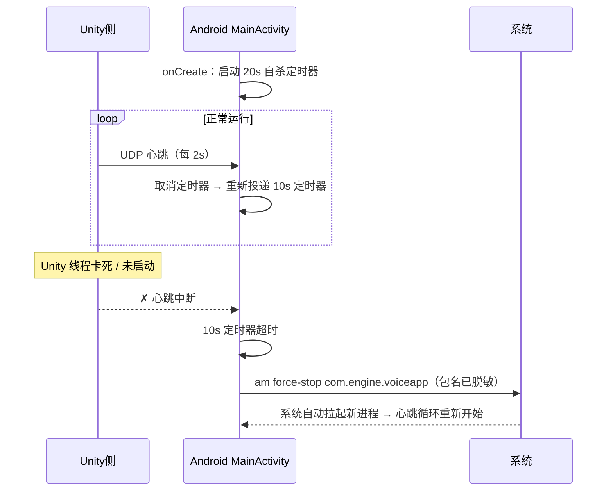


> 台架 Monkey 脚本跑了好几天，测试同学一口气甩过来几个单子：一个报 **34 次 ANR**，一个报 **95 小时 8 次 Crash**。还没消停，实车又说"语音形象只显示三分之二"，测试机上又复现"形象偶现消失"，能唤醒、能执行，就是没有画面跟"假死"一样。
>
> 这就是语音形象应用（Android 原生 + Unity 3D 双进程）从 2022 年 11 月到 2024 年 5 月的稳定性治理全过程。从"Socket 端口占用"到"假死自愈"，一年半沉淀出一套稳定性的三层模型：**预防 → 检测 → 自愈**。

---

# 问题表现

先泼盆冷水：这里碰到四个问题捆在一起，而且个个都是"偶现"。

## 1. Monkey 测试：ANR 34 次

台架 Monkey 脚本长时间跑，语音形象进程狂报 ANR，前后累计 **34 次**。频率不高，但每次 ANR 都意味着语音形象断线、悬浮窗掉帧，体验直接崩。

## 2. 95 小时：Crash 8 次

另一块台架跑 3D 测试，**95 小时出了 8 次 Crash**；同期实车 Monkey 跑 14 小时，语音形象唤醒后只显示三分之二，想想一个 3D 角色只剩三分之二画面，用户肯定觉得"这车机坏了"。

## 3. 偶现"消失"：能唤醒，但没画面也没文字

这个最诡异：语音功能正常（Android 侧还能干活），但 3D 形象没了，也没有文字显示。去查进程，**进程还活着**。

## 4. 系统杀掉后就再也回不来

- Launcher 拉起进程，但 **Unity 没初始化**；
- 或者 Service 绑起来了，**但 MainActivity 没拉起**，进程在，界面无。

这种"进程活着、界面没了"的状态，比直接崩溃还难搞：**系统以为你没死，不会自动重启**；用户看到的就是黑屏、半屏、没反应。

---

# 根因分析

问题多到无从下手时，就按"必现路径"拆。我们拆出来 **5 个根因**，全部都有代码证据。

## 根因一：UDP 端口占用，主线程卡在 bind：ANR

语音形象是"Android 原生 + Unity"双进程架构，两侧用本地 UDP Socket 通信，端口是固定的。

Monkey 测试里应用频繁重启。重启时上一次进程的 Socket 可能还没释放完（处于 TIME_WAIT 状态），新进程 `bind` 同一个端口就失败。

**修复前的创建逻辑：**

```java
// 源码路径：VoiceAvatar/app/src/main/java/com/engine/voiceapp/comm/UdpComm.java
// 以下为示意代码（已脱敏）
private void connect() {
    datagramSocket = createSocket();   // new DatagramSocket(null)
    // 直接 bind，未设置 SO_REUSEADDR
    datagramSocket.bind(new InetSocketAddress(addressStr, localPort));
    // ↑ TIME_WAIT 占着端口 → SocketException → 主线程卡住 → ANR
}
```

根因链路一句话：

```
进程杀掉/重启 → 旧 Socket 进入 TIME_WAIT → 新进程 bind 同一端口失败
→ SocketException 冒泡 → 主线程阻塞 → ANR × 34
```

同一根因还连累了一个 72 小时 1 次 Crash 的单子（Monkey 台架）。

## 根因二：WindowManager 异常 + 空指针：Crash 8 次

95 小时长时间运行，车机卡顿严重。卡顿下悬浮窗 `LayoutParams` 参数一变，调 `WindowManager.updateViewLayout()` 偶现异常；同时 Monkey 随机事件把 null / 空字符串塞进消息链路，一路传到 Unity 侧直接崩。

**修复前（截两段关键代码）：**

```java
// MainActivity.java，修复前，直接更新布局，无任何防护
layoutParams.alpha = 1;
windowManager.updateViewLayout(view, layoutParams);  // ← 卡顿时偶现异常
```

```java
// VoiceAvatarServiceManager.java，修复前，eventID 未判空
UnityAndroidBridge.GetInstance().OnCommunicationMsg(
        A2UMsgType.PlayAnimation, eventID);          // ← eventID 为 null 时 Crash
```

## 根因三：Unity 线程 Crash，但 Android 进程还活着：假死状态

这是最"坑"的一个。Unity 渲染线程崩了，但宿主进程还在运行，系统认为"应用还活着"，不会拉起。于是出现一个"活着的僵尸进程"：语音功能正常，3D 形象消失。

**真相全在回调里：**

```java
// UnityPlayerFragment，修复前
@Override
public void onDestroy() {
    super.onDestroy();          // ← 没有任何杀进程逻辑！
}

@Override
public void onUnityPlayerQuitted() {
    // ← 也没有任何逻辑
}
```

## 根因四：消息堆积，越堆越卡死

Android → Unity 的消息走 UDP。Unity 侧渲染一卡，**处理速度 < 接收速度**，队列就越堆越多。旧代码用非线程安全队列 + `Loom` 库切换线程，并发下既有数据竞争又有切换开销，最终整个应用卡死无响应。

## 根因五：进程杀掉后"半复活"

两个场景：

1. Launcher 拉起进程，但 **Unity 压根没初始化**；
2. Launcher 恢复后只 `bindService` 了 Service，**没有拉起 MainActivity**。

**修复前：**

```java
// VoiceAvatarServiceManager.java，修复前
@Override
public IBinder onBind(Intent intent) {
    return new VoiceAvatarServiceImpl();   // ← 只回 Binder，不拉 Activity
}
```

---

# 方案设计：稳定性三层模型

理顺 5 个根因后会发现：单打一修"代码 Bug"治标不治本。Monkey 压测 95 小时要求零崩溃不现实，正确姿势是把"不 Crash"改成**"Crash 了能快速恢复，用户无感"**。于是整个治理收敛成三层模型：



**核心思想：追求"Crash 后用户无感"，"永不 Crash"不现实**，把故障恢复时间压到 10~20 秒内，让系统自己把进程拉起来。

---

# 实现细节

## 1. 端口复用：一个选项，干掉 34 次 ANR

修复就是 `DatagramSocket` 三行代码的事，但**顺序很关键**：

```java
// 源码路径：VoiceAvatar/app/src/main/java/com/engine/voiceapp/comm/UdpComm.java
// 以下为示意代码（已脱敏）
private DatagramSocket createSocket() {
    DatagramSocket socket = null;
    try {
        socket = new DatagramSocket(null); // ① 先创建未绑定 Socket
    } catch (SocketException e) {
        notifyErrorListener("udp create socket error", e);
    }
    return socket;
}

private void connect() {
    if (connected) return;

    datagramSocket = createSocket();

    try {
        InetSocketAddress address = new InetSocketAddress(ADDR, LOCAL_PORT);
        datagramSocket.setReuseAddress(true);            // ② 必须在 bind 之前设置！
        datagramSocket.bind(address);                    // ③ 显式绑定
        datagramSocket.setSoTimeout(REC_TIMEOUT);        // ④ 接收超时，防永久阻塞
    } catch (SocketException e) {
        Log.e(TAG, "connect error, msg = " + e);
        datagramSocket.close();
        datagramSocket = null;
        onDisconnected();                                // ⑤ 触发重连流程
        return;
    }

    connected = true;
    onConnected();
}
```

三个要点：

- `new DatagramSocket(null)`：创建未绑定 Socket，给我们留出设置选项的机会；
- `setReuseAddress(true)` **必须在 `bind()` 之前调用**，bind 之后再设就无效了；
- 异常后 `close + 置 null + onDisconnected()`，进入内置重连流程（最大重试 3 次）兜底。

> 小 Tip：出问题先看 Socket 生命周期。任何"偶发 ANR"如果发生在重启/拉起场景，先怀疑 TIME_WAIT。

## 2. 布局与空指针的"预防性修补"

对根因二，两路并行：

**① 布局更新前 `view.invalidate()` 强制重绘**，卡顿时 View 树状态不可靠，先让它重绘再更新布局：

```java
// MainActivity.java，修复后（示意代码，已脱敏）
layoutParams.alpha = 1;
view.invalidate();                                    // 新增：强制刷新 View
windowManager.updateViewLayout(view, layoutParams);   // 卡顿时不再异常
```

三处关键点全部补上：`UpdateLayoutParams()`、`OnShow()`、`onResume()`，覆盖所有布局更新路径。

**② 消息入口全链路 `TextUtils.isEmpty()`**，Monkey 随机事件会塞 null / 空串，凡是要发给 Unity 的字符串先过一道闸：

```java
// 源码路径：VoiceAvatar/app/src/main/java/com/engine/voiceapp/service/VoiceAvatarServiceManager.java
// 以下为示意代码（已脱敏）
if (!TextUtils.isEmpty(eventID)) {                    // 同时挡 null 和空串
    UnityBridge.OnCommunicationMsg(A2UMsgType.PlayAnimation, eventID);
}
```

| 修复点 | 手段 | 覆盖路径 |
|--------|------|----------|
| 布局异常 | `view.invalidate()` | UpdateLayoutParams / OnShow / onResume |
| 空指针 | `TextUtils.isEmpty()` | Service 接口 / 广播接收 |

## 3. 心跳机制：20s / 10s "自杀"定时器

这是**核心**，专治"假死"和"杀掉回不来"。

**机制设计**：

1. Unity 每 **2 秒**通过 UDP 发一次心跳（单向，无需应答）；
2. Android 侧 `onCreate()` 启动一个 **20 秒**"自杀"定时器，给 Unity 初始化留足时间（启动比正常运行慢）；
3. 每次收到心跳，取消旧定时器、重新投递 **10 秒**的定时器，**心跳在，定时器永远不触发**；
4. 定时器真到期 = 10 秒没心跳 = Unity 肯定出问题了 → `killAppProcess()` 执行 `am force-stop`；
5. 进程 force-stop 后，**系统会自动再拉起它**，从"假死"变"自愈"。



**核心代码（精简成几个回调）：**

```java
// 源码路径：VoiceAvatar/app/src/main/java/com/engine/voiceapp/MainActivity.java
// 以下为示意代码（已脱敏）
public class MainActivity extends AppCompatActivity implements UnityBridgeCallback {

    private boolean suicideTaskPaused = false;   // 渲染暂停时暂停自杀任务

    @Override
    protected void onCreate(Bundle savedInstanceState) {
        // ...
        layoutHandler = new LayoutHandler(Looper.myLooper());
        layoutHandler.sendEmptyMessageDelayed(SUICIDE_MSG, 20_000); // 初始 20s
    }

    /** 收到 Unity 心跳：续命 10s */
    @Override
    public void onHeartbeatMessage() {
        layoutHandler.removeMessages(SUICIDE_MSG);
        if (suicideTaskPaused) return;   // Unity 节能暂停渲染时，别误杀
        layoutHandler.sendEmptyMessageDelayed(SUICIDE_MSG, 10_000);
    }

    /** Unity 渲染暂停（节能）→ 自杀任务暂停 */
    @Override
    public void onUnityRenderingPaused() {
        suicideTaskPaused = true;
        layoutHandler.removeMessages(SUICIDE_MSG);
    }

    /** Unity 渲染恢复 → 恢复监控 */
    @Override
    public void onUnityRenderingResumed() {
        suicideTaskPaused = false;
        layoutHandler.removeMessages(SUICIDE_MSG);
        layoutHandler.sendEmptyMessageDelayed(SUICIDE_MSG, 10_000);
    }

    /** 自杀：force-stop 触发系统重启（命令已脱敏为变量） */
    public void killAppProcess() {
        try {
            String[] cmd = {"am", "force-stop", "com.engine.voiceapp"}; // 包名已脱敏
            new ProcessBuilder(cmd).start();
        } catch (IOException e) {
            e.printStackTrace();
        }
    }
}
```

几个值得说的设计点：

- **单向心跳 + 自杀定时器**：Unity 只管发，Android 只管等。少一次 UDP 往返，逻辑简单不易错；
- **分阶段超时**：初始 20s（Unity 冷启动慢），正常运行 10s（给下一次心跳留缓冲）；
- **渲染暂停感知**：`suicideTaskPaused` 标志保证了"节能策略"和"稳定性策略"不打架，Unity 主动暂停渲染不代表死了；
- **演进路径**：v1 用 `pm clear` 重启（暴力，清数据）→ v2 改 `am force-stop`（优雅，系统拉起）→ v3 增加渲染暂停感知。**这是两年代码试错养出来的参数。**

| 版本 | 定时器 | 重启方式 | 特点 |
|------|--------|----------|------|
| v1 (2022-11) | 12s | `pm clear` | 暴力，清数据 |
| v2 (2022-11) | 12s | `am force-stop` | 更优雅 |
| v3 (2022-11) | 12s | `pm clear` | 心跳机制完善 |
| 当前 | 20s 初始 / 10s 续期 | `am force-stop` | 渲染暂停感知 |

## 4. 消息堆积自愈：ConcurrentQueue + 200 次阈值

Unity 侧做两件事：

1. **队列换线程安全**：非安全队列换成 `ConcurrentQueue`，去掉 `Loom` 库的线程切换开销；
2. **堆积趋势检测**：不盯队列绝对值，盯"队列在涨还是在降"，连续 200 次检测到堆积才判死。

```csharp
// Unity 侧 UDP_Socket_Client（il2cpp 反编译整理，示意代码）
private ConcurrentQueue<string> strQueue = new ConcurrentQueue<string>();
private int queueCount;   // 上次队列基数
private int times;        // 连续堆积次数

// UDP 接收回调（接收线程）
private void ReceiveCallback() {
    strQueue.Enqueue(recvStr);

    // 趋势检测：队列在"边长"说明处理跟不上接收
    if (strQueue.Count - queueCount > 0) {
        times++;
        if (times >= 200) {          // 连续 200 次检测到堆积 ≈ 10s
            Debug.LogInfo("quit!!!");  // 真的卡死了
            Application.Quit();        // 优雅退出 → 系统重启
        }
    } else {
        times = 0;                   // 队列在正常消化，重置
    }
    queueCount = strQueue.Count;     // 更新基准
}
```

| 要素 | 设计选择 | 理由 |
|------|----------|------|
| 检测方式 | `Count - queueCount > 0` | 检测趋势而非绝对值，适应不同负载 |
| 阈值 | 200 次 | 每次检测间隔约 50ms，200 次 ≈ 10s 堆积 |
| 自愈动作 | `Application.Quit()` | 优雅退出，触发系统重启 |
| 重置条件 | `Count - queueCount <= 0` | 队列在消化，恢复正常 |

> 200 次 ≈ 10 秒，跟心跳的 10s 超时对齐，两条检测线节奏一致，重启时机统一，不会互相打架。

## 5. 动态帧率 + 渲染暂停：节能与稳定协同

长时间空转时 GPU/CPU 负载高。Unity 根据业务状态动态切换 `targetFrameRate`：

| 场景 | 帧率 | 触发条件 |
|------|------|----------|
| 应用启动 | 20fps | `App.Awake()` |
| 语音唤醒/交互 | 30fps | Android 发 `msgType=100, msgData=1` |
| 待机/无交互 | 1fps | `msgData != 1` |
| 渲染暂停 | 0fps（pause） | Unity idle 10 秒后 `requestPauseRendering` |

```csharp
// Unity 侧 App.cs（示意代码，已脱敏）
void Awake() {
    Application.targetFrameRate = 20;   // 启动帧率
}

void OnCommunicationMsg(int msgType, string msgData) {
    if (msgType == 100 && int.Parse(msgData) == 1) {
        Application.targetFrameRate = 30;   // 活跃 → 30fps
    } else {
        Application.targetFrameRate = 1;    // 待机 → 1fps
    }
}
```

**与心跳的耦合点（容易忽视）**：渲染暂停（`UnityPlayer.pause()`）后心跳要一起暂停（上面 `suicideTaskPaused`）；发新消息前先 `ensureRenderingResumed()` 恢复渲染。**节能和稳定是两条线，必须联动，否则会把正常暂停的应用误杀。**

```java
// UnityAndroidBridge.java，示意，已脱敏
public void pauseUnityRendering() {
    if (!isRenderingPaused && unityPlayerRef != null) {
        unityPlayerRef.pause();
        isRenderingPaused = true;
        callback.onUnityRenderingPaused();     // 通知 MainActivity 暂停自杀任务
    }
}

public void ensureRenderingResumed() {
    if (isRenderingPaused && unityPlayerRef != null) {
        if (Looper.myLooper() == Looper.getMainLooper()) {
            resumeUnityRendering();
        } else {
            mainHandler.post(() -> resumeUnityRendering());  // 切主线程恢复
        }
    }
}
```

## 6. Fragment 销毁杀进程 / Service 拉起 Activity

补齐最后两个兜底：

```java
// UnityPlayerFragment.java，修复后（示意，已脱敏）
@Override
public void onDestroy() {
    super.onDestroy();
    // Unity 线程 Crash 后 Fragment 销毁，直接杀进程 → 触发系统重启
    String[] cmd = {"am", "force-stop", "com.engine.voiceapp"}; // 包名已脱敏
    new ProcessBuilder(cmd).start();
}

@Override
public void onUnityPlayerQuitted() {
    Process.killProcess(Process.myPid());   // Unity 退出 → 直接杀进程
}
```

```java
// VoiceAvatarServiceManager.java，修复后（示意，已脱敏）
@Override
public IBinder onBind(Intent intent) {
    // Launcher bindService 拉起进程时，顺手把 UI 也拉起来
    Intent startUi = new Intent(getApplicationContext(), MainActivity.class);
    startUi.setFlags(Intent.FLAG_ACTIVITY_NEW_TASK);
    startActivity(startUi);
    return new VoiceAvatarServiceImpl();
}
```

---

# 技术启示

## 1. 双进程架构的坑，全在"两边交接"的地方

Android 原生 + Unity 的架构，稳定性难点几乎都在跨进程交界处：

- **跨进程通信别裸奔**：端口复用、超时、重连、守护线程，一样不能少；
- **一侧死、另一侧状态**：用单向心跳 + 自杀定时器统一判定；
- **恢复必须全链路**：进程起来了，UI 拉了，Unity 还得能初始化。

## 2. 从"不 Crash"到"快速恢复"

高强度车机场景，Monkey 95 小时要求 0 Crash 不现实。目标从"代码完美"切换到**"恢复快速"**：心跳 + 自重启，把故障窗口压到 10s~20s 内，用户连骂的机会都没有。

## 3. 监控不是事后分析，是实时自愈

这里的两套监控（心跳 + 堆积检测）都是"报警即动作"：检测成立直接 `force-stop` / `Application.Quit()`，而不是打一行日志等运维回看。

| 监控 | 检测 | 自愈动作 |
|------|------|----------|
| 心跳超时 | 10s 无心跳 | am force-stop → 重启 |
| 队列堆积 | 连续 200 次堆积 | Application.Quit() → 重启 |
| Fragment 销毁 | onDestroy 回调 | am force-stop → 重启 |
| Unity 退出 | onUnityPlayerQuitted | Process.killProcess → 重启 |

**原则：监控的目的是实时自愈，事后分析只是附带。**

## 4. 多级防御，层层不冗余

```
端口占用 → 端口复用（预防）+ 重连机制（恢复）+ 守护线程（兜底）
空指针   → 空引用检查（预防）+ try-catch（防御）+ 杀进程重启（兜底）
消息堆积 → ConcurrentQueue（预防）+ 堆积检测（发现）+ Application.Quit（自愈）
Unity假死 → 心跳监控（检测）+ am force-stop（自愈）+ onDestroy 杀进程（兜底）
```

每一层都不是多余的，在不同 Crash 路径下，不同层的防御各自发挥。

---

# 结语

从 2022 年 11 月到 2024 年 5 月，5+ 个提交，一年半的试错，最后沉淀出的是 **预防、检测、自愈** 三板斧，没有某个"大招"。真正的稳定在于"崩了能自己爬起来"，把恢复当作系统能力本身来做，这才是 3D HMI 长期跑机的正确姿势。

下次遇到"某应用偶现卡死 / 假死"，可以先确认五件事：**端口复用设了吗？入口参数判空了吗？两侧有没有救活通道？队列有堆积阈值吗？节能和心跳会不会打起来？**

**戳心结语**：稳定性的尽头是一套能自己站起来的系统，完美的代码只是手段。