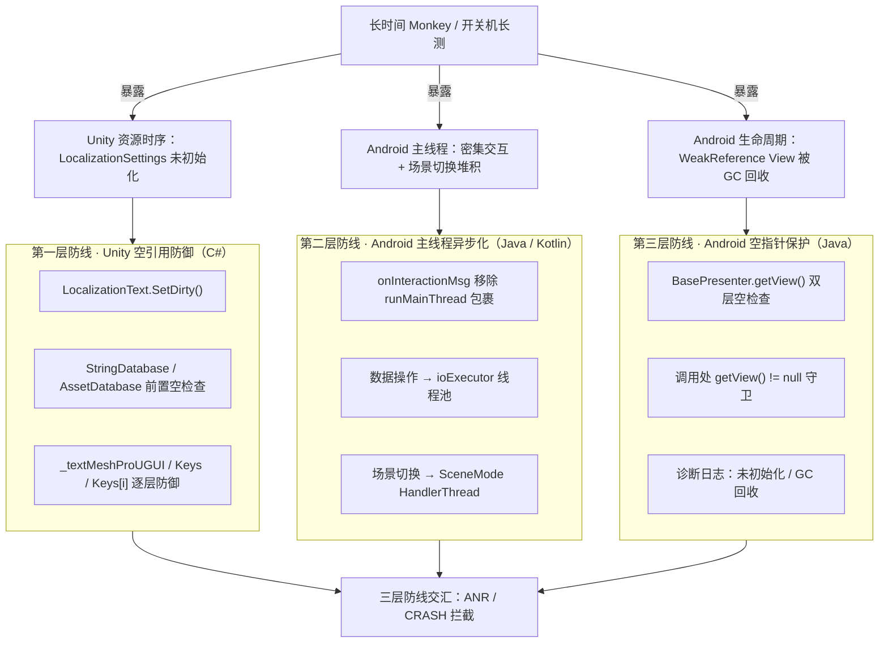


> 车载 3D HMI 的稳定性问题，最磨人的永远是"偶现"。偶现到什么程度呢？692 次开关机它才冒 1 次 ANR；14 个小时的 Monkey 测试里，它给你攒出 46 次 Input dispatching timed out；72 小时的空跑，一个空指针悄悄 CRASH 一次。
>
> 这篇文章聊聊这些"磨"出来的 ANR 是怎么暴露、怎么定位、怎么修的，以及我们最终搭起来的三层 ANR 防线。

---

# 前言

这次要讲的是一整组"长时间稳定性测试"的 Bug 修复记录，它们横跨 Unity 侧和 Android 侧，加起来五个案例：

- 开关机测试（692 次 / 159 次）：**Unity 侧空引用**，根源都在加载 ModeListWnd 资源时 `LocalizationSettings` 还没初始化；
- Monkey 测试（14 小时，46 次 ANR）：**Android 主线程阻塞**，一堆同步任务把主线程占满，系统的 onResume 都排不上队；
- Monkey 测试（72 小时，1 次 CRASH）：`getView()` 拿到的 WeakReference 被 GC 回收，调用处直接 NPE；
- 实车：SR 卡住 → 主界面黑屏重启，这是最"事故"的一个。

有意思的是，这几个问题不约而同指向同一个结论：**长测里暴露的，都是时序和线程问题，常规功能测试根本看不见**。

---

# 一、问题表现：长测"磨"出来的 Bug 全家桶

先把五个案例的量化数据摆出来，这张表就是全文的地图：

| 案例 | 测试场景 | 测试规模 | 现象 | 平台 | 根因概要 |
|------|---------|---------|------|------|---------|
| 案例① | 车型A 开关机测试 | 692 次 | 1 次 ANR | Unity (C#) | 加载 ModeListWnd 资源时空引用指针 |
| 案例② | 车型B 开关机测试 | 159 次 | 1 次 ANR（同源复发） | Unity (C#) | 同上，首轮防御不够前置 |
| 案例③ | 车型C Monkey 测试 | 14 小时 | **46 次 ANR** | Android (Java) | 主线程任务多，onResume 未收到 |
| 案例④ | 车型C Monkey 测试 | 72 小时 | 1 次 CRASH | Android (Java) | WeakReference View 被 GC 回收 |
| 案例⑤ | 车型C 实车 | — | SR 卡住 → 黑屏重启 | Android (Java) | init 接收数据后 ANR |

一眼能看出来的规律：**最短要跑 159 次开关机，最长要空转 72 小时，问题才会出来**。14 小时里憋出的 46 次 ANR，几乎都是"主线程被小任务一点点堆死"的教科书案例。

也就是说，方向各异的五个 Bug，本质是朝着同一个地方冲：**长测够久，主线程迟早被"几毫秒级"的微卡顿堆满；空对象防御迟早被打穿。**

---

# 二、根因分析：四个根因，一串"时序 + 线程"上的洞

## 2.1 根因一：Unity 侧 — 加载 ModeListWnd 资源时的空引用

先说最典型的开关机 Bug。`LocalizationText.cs` 的 `SetDirty()` 负责本地化文本刷新，问题就出在这里：

```csharp
// 源码路径：Assets/Scripts/Launcher/UI/LocalizationText.cs
// 以下为示意代码（修复前）
private void SetDirty()
{
    if (_textMeshProUGUI == null)
        _textMeshProUGUI = GetComponent<TextMeshProUGUI>();
    // ↑ 若 GetComponent 返回 null，后续直接用 _textMeshProUGUI 就会 NRE

    // ↓ 直接访问 LocalizationSettings.StringDatabase，无空检查
    Debug.Log($"{LanguageTaleName} Loaded = {LocalizationSettings.StringDatabase.IsTableLoaded(LanguageTaleName)}");
    Debug.Log($"{TmpFontTaleName} Loaded = {LocalizationSettings.AssetDatabase.IsTableLoaded(TmpFontTaleName)}");

    // ↓ Keys 可能为 null，Keys[i] 也可能为 null
    for (int i = 0; i < Keys.Count; i++)
    {
        tempTranslation = Keys[i].GetLocalizedString();   // ← 空引用指针发生点
        if (tempTranslation.StartsWith("No translation found for"))
            tempTranslation = Keys[i].TableEntryReference.Key;
        content += $"{_lstPrefixString[i]}{tempTranslation}";
    }
    // ...
}
```

问题为什么平时发现不了？因为**正常启动流程里，`LocalizationSettings` 一定先于 `SetDirty()` 完成初始化**。但 692 次开关机之后，GC、资源回收、线程调度一乱，时序就可能打破，`SetDirty()` 被调用时系统还没就绪，直接空引用。

**更坑的是它还会复发。** 案例①的第一轮修复，我把空检查放在了 `try` 块内部，以为 catch 住就完事了，结果在另一个车型（共享同一套主模块）上跑了 159 次开关机**又复发了**（案例②）。这让我彻底记住一句话：**防御不前置，等于没防御。** 具体到 4.1 再展开。

## 2.2 根因二：Android 侧 — 主线程任务太多，onResume 收到

第二个魔法的是 Android 侧。`SRPresenter.onInteractionMsg()` 接收 Unity 发来的各类交互消息，修复前** 整个 switch 被包在 `runMainThread()` 里**：

```java
// 源码路径：app/src/main/java/com/engine/sr/presenter/SRPresenter.java
// 修复前（示意代码）
@Override
public void onInteractionMsg(int msgType, String msgData) {
    CommonLog.d(TAG, "onInteractionMsg : msgType = " + msgType);

    runMainThread(() -> {                    // ← 整个 switch 在主线程执行
        switch (msgType) {
            case ON_INIT:
                syncUnityStatus();           // ← 数据同步在主线程
                break;
            case PARK_SLOT_SELECTED:
                int slotId = Integer.parseInt(msgData);
                if (mPilotMgr != null) {
                    mPilotMgr.setParkSlotSelection(slotId);   // ← 模块调用在主线程
                }
                if (getView() != null) {
                    runMainThread(() -> getView().onParkSlotSelected(slotId)); // ← 嵌套主线程 post
                }
                break;
            case AVM_SWITCH:
                // 视频切换、泊车激活等耗时操作全在主线程
                if ("FingerToAuto".equals(msgData)) {
                    if (startButtonState) {
                        startButtonState = false;
                        setStartParkAssist();          // ← 主线程
                    } else {
                        setActivationParkAssist(2);    // ← 主线程
                    }
                }
                break;
            // ... 更多 case
        }
    });
}
```

Monkey 测试的特点就是"疯狂"，把能点的、不能点的全点了，交互消息像潮水一样涌进来。主线程一个接一个处理，里面有 Gson 解析、有数据同步、有视频切换……单个操作单看不贵，**但叠加起来，主线程连系统级的 `onResume` 回调都处理不过来**，最后 InputDispatcher 等 5 秒超时，就是 14 小时里 46 次的 "Input dispatching timed out"。

### ANR 触发链路

```
Unity 发送密集交互消息
  → SimpleBridgeCallback.onInteractionMsg()（主线程）
  → SRPresenter.onInteractionMsg()（整个 switch 在 runMainThread 中）
  → syncStatus() + mPilotMgr.setXxx() + Gson 解析 + 视频切换（全在主线程）
  → 主线程被占满
  → InputDispatcher 等待主线程响应超时（默认 5s）
  → "Input dispatching timed out" ANR（14h 共 46 次）
```

## 2.3 根因三：Android 侧 — getView() 拿到被 GC 回收的 View

案例④（72 小时 1 次 CRASH）更直白。`BasePresenter.getView()` 返回的是 `WeakReference` 持有的 View：

```java
// 源码路径：app/src/main/java/com/engine/sr/presenter/BasePresenter.java
// 修复前（示意代码）
protected V getView() {
    return mView == null ? null : mView.get();
    // ↑ 返回 null 后，调用方 getView().onXxx() 直接 NPE
}
```

```java
// SRPresenter.java — 调用处（修复前，示意代码）
public void onSplitScreenStateChange() {
    runMainThread(() -> getView().onSplitScreenStateChange());
    // ↑ getView() 可能返回 null，直接使用导致 NPE
}
```

Monkey 测试狂点界面 → Activity/Fragment 频繁销毁重建 → `detach()` 里 `mView.clear()` + `mView = null` → 异步回调再找 `getView()` → 拿不到 → NPE → 一次 CRASH。72 小时空转，就等这"一声"。

### 空指针触发链路

```
Monkey 密集操作
  → Activity/Fragment 被销毁或重建
  → BasePresenter.detach()：mView.clear() + mView = null
  → 异步回调触发 onSplitScreenStateChange()
  → getView() 返回 null（未初始化 或 WeakReference 被 GC 回收）
  → getView().onSplitScreenStateChange() → NullPointerException → CRASH
```

## 2.4 根因四：SceneMode 的场景切机压在主线程

还有"压死主线程"的补充元凶：`SceneModeService` 负责场景统称切换（日常、唤醒、浪漫……），每个场景都是一串串行 Action。原先这些 Action 都串在主线程上，重启或频繁切换时，主线程开局就要背一堆活。

---

# 三、方案设计：三层 ANR 防线

根因看完了，方案就顺理成章：**一个根因对应一道防线**。



| 防线 | 平台 | 防护目标 | 核心手段 |
|------|------|---------|---------|
| 第一层 | Unity (C#) | 防止 NRE 引发 ANR | 前置空检查 + 逐层防御 |
| 第二层 | Android (Java/Kotlin) | 防止主线程阻塞 → Input dispatching timeout | 线程池异步化 + UI/数据分离 |
| 第三层 | Android (Java) | 防止 NPE 引发 CRASH | WeakReference 双层检查 + 调用处守卫 |

一句话总结这套设计：**能不进主线程的不进主线程，能前置检查的前置检查，防不住的也要留个日志。**

---

# 四、实现细节

## 4.1 第一层：LocalizationText 空引用防御（Unity 侧）

方案的核心是**检查顺序**：把 `LocalizationSettings.StringDatabase` / `AssetDatabase` 的空检查提到方法最前面，在所有后续操作之前完成拦截。这是案例②复发的教训：案例①把检查放在了 try 块内，可 `Debug.Log` 在检查之前就会碰到那个引用。

```csharp
// 源码路径：Assets/Scripts/Launcher/UI/LocalizationText.cs
// 最终版本（示意代码）
private void SetDirty()
{
    // ① 最先：检查 LocalizationSettings 依赖（防止时序问题导致系统未初始化）
    if (LocalizationSettings.StringDatabase == null)
    {
        Debug.LogError("SetDirty: LocalizationSettings.StringDatabase is null.");
        return;
    }
    if (LocalizationSettings.AssetDatabase == null)
    {
        Debug.LogError("SetDirty: LocalizationSettings.AssetDatabase is null.");
        return;
    }

    // ② 再检查组件引用
    if (_textMeshProUGUI == null)
    {
        _textMeshProUGUI = GetComponent<TextMeshProUGUI>();
        if (_textMeshProUGUI == null)
        {
            _log.Debug("SetDirty: TextMeshProUGUI component not found.");
            return;
        }
    }

    // ③ 检查数据列表
    if (Keys == null)
    {
        _log.Debug("SetDirty: Keys list is null.");
        return;
    }

    // ④ 安全地执行本地化刷新
    string content = "";
    try
    {
        for (int i = 0; i < Keys.Count; i++)
        {
            if (Keys[i] == null)                 // ← 逐元素空检查
            {
                Debug.LogWarning($"Keys[{i}] is null, skipping.");
                continue;
            }
            string tempTranslation = Keys[i].GetLocalizedString();
            if (tempTranslation.StartsWith("No translation found for"))
                tempTranslation = Keys[i].TableEntryReference.Key;
            content += $"{_lstPrefixString[i]}{tempTranslation}";
        }
        // ...
    }
    catch (Exception ex)
    {
        Debug.LogError($"SetDirty exception: {ex.Message}");
    }
}
```

为什么"前置"这么重要？因为空检查不只是"查一下"，而是要**保证检查之后没人绕过**。案例① 的教训代码长这样：

```csharp
// 案例① 的失误：空检查在 try 块内，Debug.Log 比它先踩坑
try
{
    if (LocalizationSettings.StringDatabase == null) { ... return; }
    Debug.Log($"{LanguageTaleName} Loaded = {LocalizationSettings.StringDatabase.IsTableLoaded(LanguageTaleName)}");
    // ↑ 若 StringDatabase 在这一行之前被 GC 掉，这里照样 NRE
```

| 防御层级 | 修复前 | 一轮修复 | 二轮修复（最终） |
|---------|-------|---------|----------------|
| StringDatabase 空检查 | ❌ 无 | ✅ try 块内 | ✅ 方法入口最前 |
| AssetDatabase 空检查 | ❌ 无 | ✅ try 块内 | ✅ 方法入口最前 |
| _textMeshProUGUI | ❌ 仅 GetComponent | ✅ GetComponent 后复查 | ✅ 同左 |
| Keys 列表 | ❌ 无 | ✅ | ✅ |
| Keys[i] 逐元素 | ❌ 无 | ✅ | ✅ |

## 4.2 第二层：SRPresenter ioExecutor 线程池（Android 数据异步化）

一句话方案：**"非 UI 操作别碰主线程"**。把 `onInteractionMsg()` 整体的 `runMainThread()` 包拆掉，数据操作丢进程池，UI 更新保留主线程回调。

线程池配置：

```java
// 源码路径：app/src/main/java/com/engine/sr/presenter/SRPresenter.java
// 线程池配置（示意代码）
private static final int CORE_POOL_SIZE = 4;      // 核心线程数
private static final int MAX_POOL_SIZE = 8;       // 峰值线程数
private static final long KEEP_ALIVE_TIME = 60L;  // 空闲线程存活 60s
private static final int QUEUE_CAPACITY = 100;    // 任务队列容量

private final ExecutorService ioExecutor = new ThreadPoolExecutor(
        CORE_POOL_SIZE,
        MAX_POOL_SIZE,
        KEEP_ALIVE_TIME,
        TimeUnit.SECONDS,
        new LinkedBlockingQueue<>(QUEUE_CAPACITY),
        Executors.defaultThreadFactory(),
        new ThreadPoolExecutor.AbortPolicy());     // 拒绝策略：直接抛出，快速失败

private volatile boolean startButtonState = false; // ← 跨线程共享，volatile 保证可见性
```

几个选择背后的**trad**：

- **拒绝策略选 AbortPolicy**：队列爆满时直接抛异常，宁可"大声失败"被监控看见，也不能静默丢任务导致功能悄悄坏掉；
- **volatile startButtonState**：这个标志在 ioExecutor 线程和主线程之间共享，不加 `volatile` 可能读到过期值；
- **核心线程 4 个**：停车类消息（车位选择、方向选择、AVM 切换等）并发量可控，4 个核心线程足够覆盖。

改造后的 `onInteractionMsg()` 核心部分：

```java
// 源码路径：app/src/main/java/com/engine/sr/presenter/SRPresenter.java
// 最终版本（示意代码）
@Override
public void onInteractionMsg(int msgType, String msgData) {
    CommonLog.d(TAG, "onInteractionMsg : msgType = " + msgType);

    // ← 不再包 runMainThread()，switch 直接执行
    switch (msgType) {
        case ON_INIT:
            ioExecutor.execute(() -> syncStatus());          // 数据同步 → 线程池
            break;

        case PARK_SLOT_SELECTED:
            int slotId = Integer.parseInt(msgData);
            ioExecutor.execute(() -> {                    // 模块调用 → 线程池
                if (mPilotMgr != null) {
                    mPilotMgr.setParkSlotSelection(slotId);
                }
            });
            if (getView() != null) {                      // UI 更新保留主线程
                runMainThread(() -> getView().onParkSlotSelected(slotId));
            }
            break;

        case AVM_SWITCH:
            ioExecutor.execute(() -> {                    // 整个视频切换逻辑 → 线程池
                if ("FingerToAuto".equals(msgData)) {
                    if (startButtonState) {
                        startButtonState = false;
                        setStartAVP();
                    } else {
                        if (isSupportAutoParkH5()) {      // 车型能力判断
                            setCustomParkMode(1001);
                        } else {
                            setActivationAV(2);
                        }
                    }
                }
            });
            break;
        // ... 其余 case 同样使用 ioExecutor
    }
}
```

`setViewSwitch()` 也是同一套思路：从以前主线程直接调，改成丢进线程池并 try-catch 兜底：

```java
// 修复前：主线程直接调用
@Override
public void setViewSwitch(int value) {
    mPilotMgr.setViewSwitch(value);
}

// 修复后：移到线程池
@Override
public void setViewSwitch(int value) {
    ioExecutor.execute(() -> {
        try {
            mPilotMgr.setViewSwitch(value);
        } catch (Exception e) {
            Log.e(TAG, "Failed to parse setViewSwitch", e);
        }
    });
}
```

### 修复前后对比

| 操作类型 | 修复前 | 修复后 |
|---------|--------|--------|
| onInteractionMsg 整体 | 全包 `runMainThread` | 直接 switch，按需异步 |
| syncStatus() 同步 | 主线程同步执行 | `ioExecutor.execute()` |
| mPilotMgr.setXxx() | 主线程同步执行 | `ioExecutor.execute()` |
| Gson 解析 + 结果处理 | 主线程同步执行 | `ioExecutor.execute()` |
| 视频切换（AVM_SWITCH） | 主线程同步执行 | `ioExecutor.execute()` |
| UI 更新（onParkSlotSelected 等） | `runMainThread()` | `runMainThread()`（保留） |
| startButtonState | `boolean` | `volatile boolean` |

这套下去之后，14 个小时里 46 次 ANR 的位置全部清空；实车里"SR 卡住 → 主界面黑屏重启"的 init 数据处理 ANR（案例⑤）也是同一套思路：把 `syncStatus()` 和 `AVM_SWITCH` 整个 case 挪进 `ioExecutor`，一次提交（+131 -135）彻底解决。

## 4.3 第三层：BasePresenter.getView() 双层空检查（Android 空指针保护）

针对 72 小时 Monkey 那次 CRASH。防御方案三步走：**检查、守卫、留日志**。

```java
// 源码路径：app/src/main/java/com/engine/sr/presenter/BasePresenter.java
// 修复后（示意代码）
protected V getView() {
    if (mView == null) {
        Log.w(TAG, "mView is not initialized");            // ① 未初始化
        return null;
    }
    V view = mView.get();
    if (view == null) {
        Log.w(TAG, "View has been garbage collected");     // ② 被 GC 回收
        return null;
    }
    return view;
}
```

```java
// SRPresenter.java — 调用处守卫（修复后，示意代码）
public void onSplitScreenStateChange() {
    runMainThread(() -> {
        if (getView() != null) {                            // ← 空检查守卫
            getView().onSplitScreenStateChange();
        }
    });
}
```

值得一提：两个日志把"未初始化"和"被 GC 回收"**区分开**，长测之后直接对着日志就能定位是生命周期还是时序问题，省一大圈排查。

### 诊断日志设计

| 日志内容 | 触发条件 | 日志级别 |
|---------|---------|---------|
| `mView is not initialized` | `mView == null`，View 尚未 attach | `WARN` |
| `View has been garbage collected` | `mView.get() == null`，WeakReference 已被 GC 回收 | `WARN` |
| `Failed to parse setViewSwitch` | 线程池执行 setViewSwitch 抛异常 | `ERROR` |

## 4.4 补充一拳：SceneModeService 使用 HandlerThread

场景模式切换是"一串串行 Action"，用一根专属的 HandlerThread 扛，别碰主线程：

```kotlin
// 源码路径：app/src/main/java/com/engine/scene/SceneModeService.kt
// 示意代码
class SceneModeService : Service() {
    // 创建专属子线程处理场景切换
    private val mHandlerThread = HandlerThread("SceneModeServiceThread").apply { start() }
    private val mHandler by lazy { Handler(mHandlerThread.looper) }

    private val mBinder = object : ISceneMode.Stub() {
        override fun setSceneMode(action: String?) {
            action?.let {
                mHandler.post {                          // ← 子线程执行
                    SceneModeManager.executeSceneAction(action)
                }
            }
        }
    }

    override fun onDestroy() {
        mHandlerThread.quitSafely()                       // ← 安全退出，不留僵尸线程
        super.onDestroy()
    }
}
```

## 4.5 方案汇总

| 方案 | 平台 | 核心改动 | 对应案例 |
|------|------|---------|---------|
| ① 空引用防御 | Unity (C#) | LocalizationSettings / 组件 / Keys 前置空检查 | 案例①、② |
| ② 数据初始化异步化 | Android (Java) | onInteractionMsg 移除 runMainThread 包裹 + ioExecutor | 案例③、⑤ |
| ③ SceneMode 启动优化 | Android (Kotlin) | HandlerThread 替代主线程处理场景切换 | 案例③ |
| ④ 空指针保护 + GC 日志 | Android (Java) | getView() 双层空检查 + 调用处守卫 | 案例④ |

---

# 五、技术启示

## 5.1 为什么说长测是"稳定性照妖镜"

| 测试类型 | 测试规模 | 发现的问题 | 常规测试能否发现 |
|---------|---------|-----------|----------------|
| 开关机测试 | 692 次 | Unity 空引用（LocalizationSettings 时序） | ❌ |
| 开关机测试 | 159 次 | 同源空引用复发（跨项目） | ❌ |
| Monkey 测试 | 14 小时 | 主线程阻塞 46 次 ANR | ❌ |
| Monkey 测试 | 72 小时 | WeakReference View 被 GC 回收 | ❌ |

共性的关键词是三个：**时序竞争、累积效应、生命周期**。

- **时序竞争**：正常启动 LocalizationSettings 一定先初始化，只有长时间运行后的极端时序下，才会出现"没初始化就先调用"；
- **累积效应**：一次 onInteractionMessage 只有几毫秒，14 小时密集调用后累积成主线程 5 秒不可用；
- **生命周期**：WeakReference 兜底的 View 在正常周期内不回收，Monkey 疯狂切页后才露出真相。

另一个工程上的后悔点：**首轮修复不够彻底，同源问题在另一个车型上复发**。同一套主模块被多个车型共用，一个项目修的坑，必须同步验证到所有项目，这就是跨项目回归测试的意义。

## 5.2 三层防线 = 防御编程的三个习惯

1. **空检查前置到方法入口**，并且覆盖所有路径（包括 `Debug.Log` 这种看似无害的代码）；
2. **非 UI 操作一律不进主线程**，数据 / 解析 / 模块调用丢线程池，UI 更新才回主线程；
3. **生命周期对象先测后用**，WeakReference 回来先判空，判空时顺手区分"未初始化 / GC 回收"两种日志。

## 5.3 修复验证策略

本次修复采用"版本号正确"作为验证标准（通过 App.cs 版本号日志确认修复已部署）。更彻底的验证建议三步走：

- **回归测试**：在修复版本上重复相同规模的开关机 / Monkey 测试；
- **跨项目验证**：一个项目修复后，同步验证共用代码库的其他车型项目；
- **日志监控**：用新增的诊断日志（`mView is not initialized`、`View has been garbage collected`）在长测期间持续盯。

---

# 结语

这波操作让我对"稳定"有了新认知：稳定性指的是在极端时序下依然不崩。692 次开关机、14 小时 Monkey、72 小时空转，这种"磨"出来的 Bug 才是真正的毒草，它们不靠聪明，靠"扛得住"。

三层防线搭完之后，这套模板的复用性很强：**空引用前置防御、主线程异步化、生命周期判空 + 诊断日志**，放之任何车机 HMI 都适用。下一步可以沿着这条线往下走，把 ANR 检测做成主动的 watchdog，不等系统钝刀割肉，下篇咱们聊聊主动 ANR 检测方案里踩过的坑。