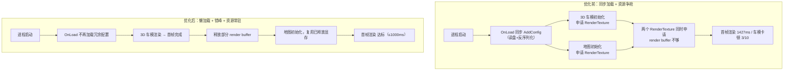


> 按下电源键，车机屏幕黑几秒、再转一圈加载动画，这个体验大家应该都不陌生。我们的冷启动性能标准是 1000ms，可快速下电场景实测是 **1427ms**，硬生生超了 **42%**。同期另一个项目，开机后 3D 车模动画还有 **3/10 的概率**推出卡顿。两个问题一个确定性、一个概率性，表面看毫无关系，挖到底却是同一个病根：**启动阶段的资源管理策略**。
>
> 这篇文章用两个真实案例完整复盘：问题表现 → 根因分析 → 方案设计 → 实现细节 → 效果对比，最后沉淀出冷启动优化的"三步法"：减法、错法、优法。文中的代码都做了脱敏，性能数据保留原值，方便对号入座。

---

# 一、问题表现

## 1.1 案例一：快速下电，冷启动 1427ms

"快速下电"是车载系统里一种快速上下电的场景：断电后系统要快速恢复显示，用户期望一按下去，没多久就能看到界面。这个场景的冷启动耗时标准是 1000ms，我们实测 **1427ms**，超出 **42%**。

| 指标 | 数值 |
|------|------|
| 实际冷启动耗时 | 1427ms |
| 性能标准 | 1000ms |
| 超出比例 | 42% |

多出来的这 427ms，用户体感就是黑屏时间、加载动画时间拉长了，非常劝退。

## 1.2 案例二：开机车模动画 3/10 概率卡顿

另一个项目开机后，3D 车模动画推出偶发不流畅，复现概率约 **3/10（30%）**。这种概率性问题最磨人，不是次次必现，说明根因藏在一个不稳定的**初始化时序**里，常规的"复现 → 截日志"打法效率极低。

两个问题放在一起看，共性非常明显：**都发生在启动阶段，根因都是资源管理不当**。

| 维度 | 案例一 | 案例二 |
|------|--------|--------|
| 场景 | 快速下电冷启动 | 开机后车模显示 |
| 问题类型 | 耗时超标（确定性） | 偶现卡顿（3/10 概率） |
| 根因（提交记录摘录） | 加载了不必要的模块和场景资源 | 3D 和地图资源抢占 render buffer |
| 修改文件 | MainModule.cs / UIComponent.cs | INIComponent.cs / UIComponent.cs |

---

# 二、根因分析

三个根因，两个问题。

## 2.1 根因一：启动时加载了用不上的 UI 配置表（同步 IO）

问题一的提交记录 Root Cause 就一句话：**加载模块和场景耗时过长导致**。

MainModule 是整个应用的模块入口，`OnLoad()` 在启动链路里由框架调用。原始代码在启动阶段就主动调了 `UI.AddConfig` 加载全量 UI 配置表：

```csharp
// 源码路径（脱敏）：Runtime/MainModule.cs
public sealed class MainModule : ModuleBase
{
    protected override void OnLoad()
    {
        //this.I18N.ReadData("MainModule/Configs/Localization/SignalLocalization");
        this.UI.AddConfig("MainModule/DataTables/UIForm");  // ← 启动时同步加载UI配置表
    }

    protected override void OnUnload()
    {
        //this.I18N.RemoveData("MainModule/Configs/Localization/SignalLocalization");
        this.UI.RemoveConfig("MainModule/DataTables/UIForm");
    }
}
```

`AddConfig` 的实现长这样：

```csharp
// 源码路径（脱敏）：Runtime/Functions/UI/UIComponent.cs
/// <summary>
/// 加载UI配置表
/// </summary>
public void AddConfig(string assetPath)
{
    if (_dataTable == null)
        _dataTable = Context.GetService<DataTableComponent>().CreateDataTable<DRUIForm>(assetPath);

    (_dataTable as DataTableBase).ReadData(assetPath);  // ← 同步读盘 + 反序列化
}
```

这一行启动代码，实际做了三件事：

1. **同步 IO**：从磁盘读 `DataTables/UIForm` 资源文件；
2. **反序列化**：把整张配置表解析成内存对象；
3. **常驻内存**：配置表整个生命周期都占着。

为什么说"用不上"？快速下电场景，用户只需要看到核心界面（时钟、状态栏），而 `UIForm` 这张表包含**所有** UI 界面的资源配置，启动阶段只用得上其中一个零头。加载全量，就是把启动时间预算花在了看不见的地方，这就是典型的"加载了不必要模块"。

## 2.2 根因二：3D 和地图抢 render buffer（时序竞争）

提交记录里写得很直白：**开机启动时，3d 和地图的资抢占导致，render buffer 不够**。

车机端 HMI 里，3D 车模和地图通常是**两套独立的渲染管线**，各自申请 RenderTexture 作为渲染目标。开机时两者几乎同时初始化：

```
启动时序（问题状态）：
  T0: 3D 车模初始化 → 申请 RenderTexture A
  T0: 地图初始化   → 申请 RenderTexture B
  ─────────────────────────────────
  结果：两个 RenderTexture 同时申请 GPU 内存，
        render buffer 不够 → 渲染卡顿
```

嵌入式车机的 GPU 显存本来就不宽裕（通常 128MB~256MB），render buffer 是显存消耗大户。两个渲染管线同时在启动阶段初始化，显存峰值直接顶到天花板。

**为什么是 3/10？** 因为竞争只在特定的初始化时序下发生：

- 3D 先于地图初始化 → render buffer 充足，无卡顿；
- 地图先于 3D 初始化 → render buffer 充足，无卡顿；
- **两者几乎同时初始化** → render buffer 不够，卡顿。

而启动时序受系统负载、CPU 调度、其他进程抢占影响，于是这个 Bug 呈现 30% 的复现概率，这就是概率性问题最恼人的地方：代码逻辑没"必错"，只是资源竞争"偶发"。

## 2.3 根因三：INI 组件每次读写都 Open/Close（冗余 IO）

这个是"顺手治"的隐藏炸弹。INI 文件是车机端存配置的标配（车型配置、用户偏好、上次状态等），开机时大量模块初始化都要读写 INI。而 INIComponent 的 **7 个 Save 重载 + 7 个 Load 重载，每个方法都独立执行 Open → 读写 → Close**：

```csharp
// 源码路径（脱敏）：Runtime/Functions/INI/INIComponent.cs
public void Save(string section, string key, string value, bool isAsync = false)
{
    Action action = () =>
    {
        try
        {
            _log.Info("save ini start");
            _iniParser.Open(AppConfigPath);       // ← 每次保存都重新打开文件
            _iniParser.WriteValue(section, key, value);
            _iniParser.Close();                    // ← 每次保存都关闭文件
            _log.Info("save ini end");
        }
        catch (Exception e)
        {
            _log.Info($"save ini error section: {section} key: {key} value: {value} error: {e}");
        }
    };

    if (isAsync)
        NewThreadToDo(action);
    else
        action();
}
```

问题有四条：

1. **文件句柄频繁创建销毁**：每次读写都重新打开/关闭文件，IO 冗余放大；
2. **线程安全隐患**：异步 Save 走 `NewThreadToDo`，内部用 `Thread.Abort()` 终止旧线程；
3. **代码膨胀**：7 个 Save 重载复制粘贴同一套模板，重复代码堆积；
4. **启动期加剧 IO 竞争**：开机时大量模块读写 INI，跟 3D/地图的加载抢存储带宽，间接恶化启动卡顿。

> 量化证据：重构前 INIComponent.cs 共 456 行，其中 7 个 Save 重载合计约 155 行，每个方法都包着完整的 Action + try-catch + Open/Close。

第三个根因看着跟"1427ms"没有直接关系，但它是"启动阶段 IO 竞争"这个池子里实打实的一份子，顺手治了。

---

# 三、方案设计：冷启动优化"三步法"

问题理清了，方案也就出来了。这次两个案例的优化思路，我抽象成"三步法"：

| 步骤 | 名字 | 动作 | 对应案例 |
|------|------|------|----------|
| 第一步 | **减法** | 去除启动阶段不必要的加载 | 案例一：注释掉 AddConfig（模块懒加载） |
| 第二步 | **错法** | 错开竞争资源的初始化时序 | 案例二：3D/地图错峰 + 释放 render buffer |
| 第三步 | **优法** | 优化资源管理策略 | INI 句柄生命周期管理（常驻） |

整体启动流程优化前后的对比，一张图看明白：



有个很值得玩味的细节：案例一只改了 **4 行代码（2 处注释化）**，效果却立竿见影。这说明在车机这种资源紧张的平台上，**"不加载"永远比"加载后再优化"更高效**，启动时间预算有限，每一行同步代码都在花启动分数。

---

# 四、实现细节

## 4.1 减法落地：模块懒加载 + 优雅降级

### MainModule：启动不再同步加载配置表

```csharp
// 源码路径（脱敏）：Runtime/MainModule.cs
// ===== 修改后 =====
public sealed class MainModule : ModuleBase
{
    protected override void OnLoad()
    {
        //this.I18N.ReadData("MainModule/Configs/Localization/SignalLocalization");
        //this.UI.AddConfig("MainModule/DataTables/UIForm");  // 注释掉，延迟到需要时加载
    }

    protected override void OnUnload()
    {
        //this.I18N.RemoveData("MainModule/Configs/Localization/SignalLocalization");
        //this.UI.RemoveConfig("MainModule/DataTables/UIForm");  // 注释掉
    }
}
```

配置表改为按需加载：哪个界面真正需要配置时，再显式 `AddConfig`。冷启动路径直接绕过了同步 IO + 反序列化。

### UIComponent：异常降级为警告

问题来了：配置表不提前加载，万一启动阶段真有 UI 访问配置呢？

按原来的写法，`_dataTable == null` 会直接 throw Exception，启动链路里抛异常，等于自杀。我们把它改成"输出警告 + 安全返回"：

```csharp
// 源码路径（脱敏）：Runtime/Functions/UI/UIComponent.cs
// ===== 修改后 =====
public DRUIForm GetConfig(string key)
{
    if (_dataTable == null)
    {
        //throw new Exception("configs is null");  // 改前：直接抛异常，启动崩溃

        _log.Warning("configs is null");           // 改后：输出警告
        return null;                               //       安全返回，不中断启动流程
    }
    // ...
}
```

| 维度 | 修改前 | 修改后 |
|------|--------|--------|
| 配置未加载时 | 抛异常，应用崩溃 | 输出警告，继续运行 |
| 启动稳定性 | 对模块加载顺序敏感 | 容错性强 |
| 可观测性 | 异常堆栈 | 日志警告 |

这背后是一条原则：**启动阶段绝不能因为配置缺失而崩溃，容错兜底优先。**

## 4.2 错法落地：资源错峰 + render buffer 释放

### 错峰初始化时序

```csharp
// 示意时序（对应提交 65b66ca9 的解决思路）
// 启动时序（优化后）：
//   T0:   3D 车模初始化并完成首帧渲染
//   T0:   释放部分 render buffer（保留最小必要资源）
//   T+Δ:  地图初始化 → 复用已释放的显存
//   ─────────────────────────────────
//   结果：render buffer 峰值下降，竞争窗口消失
```

3D 车模完成首帧渲染后释放非活跃的 render buffer，地图再开始初始化。显存峰值下去了，也就不存在"两个初始化同时抢 buffer"的时间窗口。

### render buffer 释放时机的 trade-off

"释放"是个权衡题：

- **释放过早**：车模可能还要重新渲染，产生额外开销；
- **释放过晚**：buffer 占着显存，影响其他模块初始化；
- **折中**：首帧渲染完成后释放非活跃 buffer，保留最小必要资源。

我们最终选的就是"首帧完成 → 释放非活跃资源"，既不伤害车模显示，又能给地图腾地方。

### UI 打开完成日志：给时序竞争留抓手

概率性问题最怕"没法观察"。同一个提交里，我们给 UI 打开流程补了**开始 + 完成**两组日志：

```csharp
// 源码路径（脱敏）：Runtime/Functions/UI/UIComponent.cs
private int OpenUIFormByAssetName(string uiFormAssetName, string uiGroupName,
    int priority, bool pauseCoveredUIForm, object userData)
{
    _log.Debug($"open ui form, name = {uiFormAssetName}, groupName = {uiGroupName}");
    int id = _uiManager.OpenUIForm(uiFormAssetName, uiGroupName, priority, pauseCoveredUIForm, userData);
    _log.Debug($"open ui complate, name = {uiFormAssetName}");  // ← 新增：完成日志
    return id;
}
```

开始 / 完成两个时间戳一对，谁覆盖了谁、时序是否重叠，一眼就能看出来，验证错峰策略是否生效，也有了客观依据。

## 4.3 优法落地：INI 组件重构（222 → 74 行）

这是这次重构里最"爽"的部分。

> 提交统计：INIComponent.cs 改动规模从 222 行精简到 74 行，净减 148 行，减少 67%；整个文件从 456 行降到 380 行（-17%）。其中 7 个 Save 重载合计从 ~155 行精简到 ~74 行（-52%）。

### 生命周期管理：Open/Close 从方法内提升到组件级

重构前的模式是"每次读写都 Open/Close"，属于典型的**过程式资源管理反模式**。重构后，文件句柄的生命周期和组件生命周期绑定：启动（OnCreate）时 Open 一次，销毁（OnDestroy）时 Close 一次。

```csharp
// 源码路径（脱敏）：Runtime/Functions/INI/INIComponent.cs
// ===== 修改前 =====
public sealed class INIComponent : MonoSingleton<INIComponent>
{
    private Thread _thread;

    public INIComponent()
    {
        _iniParser = new INIParser();
        // 注意：此处未 Open 文件，每次 Save/Load 时才 Open
    }
}

// ===== 修改后 =====
public sealed class INIComponent : MonoService
{
    private Thread _thread;
    private object _lock = new object();       // ← 新增互斥锁

    protected override void OnCreate()
    {
        _iniParser = new INIParser();
        _iniParser.Open(AppConfigPath);        // ← 启动时打开一次，整个生命周期常驻
    }

    private void OnDestroy()
    {
        _iniParser.Close();                     // ← 销毁时关闭一次
    }
}
```

### Save/Load：7 个重载全部瘦身

```csharp
// ===== 修改后：Save（从15行 → 8行）=====
public void Save(string section, string key, string value, bool isAsync = false)
{
    try
    {
        _log.Info("add ini value");
        _iniParser.WriteValue(section, key, value);  // 直接写入，无需 Open/Close
    }
    catch (Exception e)
    {
        _log.Info($"save ini error section: {section} key: {key} value: {value} error: {e}");
    }
}

// ===== 修改后：Load =====
public string Load(string section, string key, string defaultValue)
{
    try
    {
        return _iniParser.ReadValue(section, key, defaultValue);  // 直接读取
    }
    catch (Exception)
    {
        return defaultValue;
    }
}
```

每次 Save 的 IO 操作数从 3 次（Open+Write+Close）降到 1 次（Write），减少 67%；Load 同理。

### 统一 Flush + 线程池异步

原来"立即落盘"的时机散落在各调用方，现在统一由 `Flush()` 收敛，写盘动作交给线程池：

```csharp
// IntParser.cs：PerformFlush 由 private 改为 public，允许 INIComponent 统一管理刷新时机

// INIComponent.cs
public void Flush()
{
    _log.Info("save ini start");
    ThreadPool.QueueUserWorkItem(new WaitCallback(PerformFlush));  // 线程池异步执行
}

private void PerformFlush(object obj)
{
    _log.Info("PerformFlush start");
    lock (_lock)                                    // 互斥锁保证并发写安全
    {
        _iniParser.PerformFlush();
    }
    _log.Info("PerformFlush end");
}
```

两个好处：写盘不阻塞调用线程；`lock` 保证多线程写入安全，同时绕开了旧实现 `Thread.Abort()` 的隐患（后者在较新运行时已不可用）。

---

# 五、效果对比

| 维度 | 优化前 | 优化后 | 提升 |
|------|--------|--------|------|
| 冷启动耗时（案例一） | 1427ms | 达标（≤1000ms） | 消除 42% 超标 |
| 车模卡顿概率（案例二） | 3/10 | 基本不卡 | 显存峰值下降 |
| INIComponent.cs 总体量 | 456 行 | 380 行 | -17% |
| Save 7 个重载合计 | ~155 行 | ~74 行 | -52% |
| Save/Load 每次 IO 操作 | Open+读写+Close（3 次） | 读写（1 次） | -67% |
| 文件句柄管理 | 每次操作开关 | 生命周期常驻 | 根本性改善 |
| 异步保存线程 | Thread.Abort（不安全） | ThreadPool + lock（安全） | 安全性提升 |

---

# 六、踩坑与经验

## 6.1 概率性问题（3/10）怎么打

卡顿本身不是根因，**时序才是**。这类 3/10 概率的 Bug，我的调试心得是：

1. **先补"开始/完成"双日志**，把两个竞争资源的初始化区间打印出来，看是否重叠；
2. **反复跑**，用日志时间戳统计重叠率，跟卡顿概率 3/10 对不对比 对不上；
3. **改完再跑**，错峰之后时间戳不再重叠，问题自然消失，用数据验证，而不是"感觉好了"。

## 6.2 减法不是删代码，是"转移 + 兜底"

注释掉 `AddConfig` 只是第一步，真正风险在"后续有模块访问配置怎么办"，所以配套把 getter 从 throw 改成 Warning。这就是启动优先、容错兜底：宁可少做事，不可启动崩。

## 6.3 重构的"安全三原则"

INI 重构动了 7+7=14 个方法，但没有引入行为变化，靠的是守住三条红线：

1. **外部接口不变**：所有 Save/Load 的方法签名、参数、返回值全部保持一致；
2. **内部职责不变**：Save 还是保存，Load 还是读取；
3. **写盘时机收了一层**：新增 Flush，由调用方决定真正落盘的时机，行为语义反而更清晰。

只要这三条不变，再大的内部重构都不可怕。

---

# 结语

冷启动优化这件事，最终可以浓缩成一句话：**启动阶段每做一件事，先问一句"现在非做不可吗？"** "不加载"永远比"加载后再优化"更高效。

从 1427ms 到 1000ms 以内，核心改动加起来就十来行：注释两行（减法）、错峰一个时序（错法）、把 INI 句柄生命周期管起来（优法）。数据是具体案例的结果，但"减法 → 错法 → 优法"这套方法论可以复用，下次你的项目锁在启动超标的坑里，不妨先跑一遍三步法。

之前咱们聊过监控侧的方案（ANR 主动检测、帧率与内存异常捕获），冷启动这摊子正好补上"优化"这一侧。后续可以再聊聊启动阶段的资源加载排程，把"错法"做成系统化的调度器，而不是靠人工拍时序。咱们下篇见。