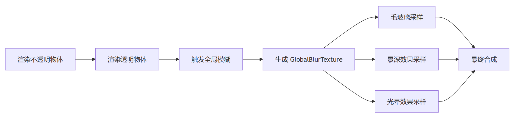
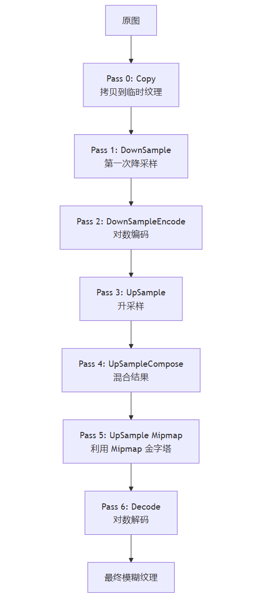

> Previous articles covered the material implementations of frosted glass and transparent glass; both rely on one foundation: the global blur texture. Blur underpins many post-processing effects — frosted glass, depth of field, radial blur, and edge glow all need it.

Traditional Gaussian blur requires many samples and is expensive, so it's generally not used on head units. The projects I've delivered all used **Dual Kawase Blur**, a high-performance blur scheme widely adopted in the industry — faster than Gaussian blur while keeping decent visual quality.

---

## 1. Starting from the Requirement

In cockpit 3D HMI scenes, the glass effect only starts working **after transparent objects finish rendering**. So could we compute the blur on its own when rendering the glass?

If every glass object computed its own blur, then on a head-unit GPU each extra texture sample means extra bandwidth. At a 1080p screen resolution, a single round of 5×5 Gaussian blur alone requires 50 million pixel samples.

So we can't compute it independently. Instead, we must: **make blur a shared service**. At a specific stage of the render pipeline, blur the whole screen once globally, and register the result as the global texture `_GlobalBlurTexture`. Everywhere that needs a blur effect samples this image — "compute once, use many times".



In code, this flow is implemented with a URP Renderer Feature: set it to trigger after transparent objects are rendered, generate the blur result through 7 shader passes, then register it as a global texture with `cmd.SetGlobalTexture("_GlobalBlurTexture", result)`.

So is Gaussian blur fast enough for this global blur?

---

## 2. Into the Algorithm

Intuitively, blur means "smearing" each pixel's color into the surrounding pixels. Traditional Gaussian blur takes a weighted average of the pixels around each pixel; the closer to the center, the higher the weight.

But it samples too much. A 5×5 blur kernel needs 25 samples of the surrounding pixels. The standard optimization splits it into two passes: blur horizontally once, then vertically once. That brings the sample count from 25 down to 10 (5 horizontal + 5 vertical). Even so, it's still a heavy lift on head units — and quite possibly Gaussian blur needs multiple iterative rounds to meet the visual requirements.

Sketch code (traditional Gaussian blur):

```hlsl
// Separable Gaussian blur: horizontal first, then vertical
// Horizontal pass
float weights[5] = {0.0545, 0.2442, 0.4026, 0.2442, 0.0545};
float3 horizontalBlur = float3(0, 0, 0);
for (int i = 0; i < 5; i++)
{
    float2 sampleUV = uv + float2(_MainTex_TexelSize.x * (i - 2), 0);
    horizontalBlur += SAMPLE_TEXTURE2D(_MainTex, sampleUV).rgb * weights[i];
}

// Vertical pass (uses the horizontal result as input)
float3 verticalBlur = float3(0, 0, 0);
for (int i = 0; i < 5; i++)
{
    float2 sampleUV = uv + float2(0, _MainTex_TexelSize.y * (i - 2));
    verticalBlur += SAMPLE_TEXTURE2D(_HorizontalResult, sampleUV).rgb * weights[i];
}
```

Can we reach a similar blur with fewer samples?

---

## 3. The Dual Kawase Algorithm

The idea of Dual Kawase Blur: **first shrink the image, blur it, then enlarge it back**.

For example, shrink a 1920×1080 image to 240×135 (1/8 resolution) — only 1/64 of the original pixels. Blurring this small image cuts bandwidth dramatically. Then enlarge the blurred small image back to the original resolution, and you get a roughly blurred result.

**Step 1: Downsample**  
Shrink step by step from the original resolution to the smallest level. Each time, sample the current pixel plus the 4 pixels along the diagonals and take a weighted average to get the blurred result. As you can see, it blurs while it downsamples.

Sketch code (downsampling):

```hlsl
// Sample the current pixel and the 4 pixels along the diagonals
float2 halfPixel = _SourceTex_TexelSize.xy * 0.5;
float2 offset = float2(_BlurOffsetX, _BlurOffsetY);  // Blur radius

float2 uv1 = uv - halfPixel * offset;  // Top-left corner
float2 uv2 = uv + halfPixel * offset;  // Bottom-right corner
float2 uv3 = uv - float2(halfPixel.x, -halfPixel.y) * offset;  // Bottom-left corner
float2 uv4 = uv + float2(halfPixel.x, -halfPixel.y) * offset;  // Top-right corner

// The center weight is high (×4), the four corners are low (×1), and the sum is divided by 8
half4 sum = SAMPLE_TEXTURE2D(_SourceTex, uv) * 4;
sum.rgb += SAMPLE_TEXTURE2D(_SourceTex, uv1).rgb;
sum.rgb += SAMPLE_TEXTURE2D(_SourceTex, uv2).rgb;
sum.rgb += SAMPLE_TEXTURE2D(_SourceTex, uv3).rgb;
sum.rgb += SAMPLE_TEXTURE2D(_SourceTex, uv4).rgb;
sum.rgb *= 0.125f;  // (4+1+1+1+1)/8 = 1
```

**Step 2: Upsample**  
Enlarge step by step from the smallest level back to the original resolution. Each time, sample the 8 surrounding pixels — one on each of the four edges, two on each of the four corners. Here too, it blurs while it upsamples.

Sketch code (upsampling):

```hlsl
// Sample the 9 pixels of a 3×3 grid, with higher weights on the mid-edge points
float2 halfPixel = _SourceTex_TexelSize.xy * 0.5;
float2 offset = float2(_BlurOffsetX, _BlurOffsetY);

// Extended samples in the four directions
float2 uv1 = uv + float2(-halfPixel.x * 2.0, 0.0) * offset;
float2 uv2 = uv + float2(-halfPixel.x, halfPixel.y) * offset;
float2 uv3 = uv + float2(0.0, halfPixel.y * 2.0) * offset;
float2 uv4 = uv + halfPixel * offset;
// ... and 5 more sample points

// The four mid-edge points get weight ×2, the corners weight ×1
half4 sum = SAMPLE_TEXTURE2D(_SourceTex, uv1) * 1.0;
sum.rgb += SAMPLE_TEXTURE2D(_SourceTex, uv2) * 2.0;
sum.rgb += SAMPLE_TEXTURE2D(_SourceTex, uv3) * 1.0;
sum.rgb += SAMPLE_TEXTURE2D(_SourceTex, uv4) * 2.0;
// ... the remaining 5 sample points
sum.rgb *= 0.0833;  // 1/12
```

The weight distribution: pixels at the middle of the four edges have weight 2, and the four corner pixels have weight 1. It's designed this way because smoother transitions are needed — edge pixels contribute more to the transition, so they get higher weights.

Downsampling is itself a blur; upsampling then applies a second blur — effectively "two blurs stacked", which makes the result even smoother.

---

## 4. Engineering Optimizations: The Pass Chain and Log Encoding

But Dual Kawase alone isn't enough. The color values of bright areas (like headlights) can be enormous; blurring them directly tends to produce unnatural halos.

So the actual shader implements a chained 7-pass flow:



Key design points:

**1. Log encoding to prevent overflow**  
The DownSampleEncode pass applies a `log(1 + color)` transform, compressing bright areas into log space so they don't overflow during blurring. The Decode pass restores them with `exp(color) - 1`.

> The principle: a logarithm compresses large values into small ones — 1000 becomes about 6.9, for example — and the exponential function brings them back.

Sketch code (log encoding):

```hlsl
// DownSampleEncode pass: compress the dynamic range
half4 Frag_DownSampleEncode(const V2F_DownSample input) : SV_TARGET
{
    // ... blur computation logic ...
    sum.rgb = log(1.0 + max(sum.rgb, 0.0));  // Log compression
    sum.rgb = clamp(sum.rgb, 0.0, 12.0);    // Prevent overflow
    return sum;
}

// UpSampleDecode pass: restore the dynamic range
half4 Frag_UpSampleDecode(const V2F_UpSample input) : SV_TARGET
{
    // ... blur computation logic ...
    sum.rgb = exp(sum.rgb) - 1.0;           // Exponential restore
    sum.rgb = min(sum.rgb, 65504.0);        // FP16-safe
    return sum;
}
```

**2. Mipmap pyramid blur**  
The UpSample Mipmap pass leverages the GPU's built-in Mipmap mechanism. The downsampled texture carries multiple Mipmap levels, each one a natural blur of the level above. When upsampling, sampling the corresponding Mipmap level directly is essentially a "free" blur operation.

Sketch code (Mipmap sampling):

```hlsl
half _SourceMipLevel;  // The Mipmap level passed in from C#

half4 Frag_UpSampleMip(const V2F_UpSample input) : SV_TARGET
{
    float2 mipTexelSize = _SourceTex_TexelSize.xy * exp2(_SourceMipLevel);
    // ... offset computation ...
    
    // Sample the specified Mipmap level directly, leveraging the GPU's hardware optimization
    half4 sum = SAMPLE_TEXTURE2D_LOD(_SourceTex, uv1, _SourceMipLevel);
    sum.rgb += SAMPLE_TEXTURE2D_LOD(_SourceTex, uv2, _SourceMipLevel).rgb * 2.0;
    // ... other sample points ...
    sum.rgb *= 0.0833;
    return sum;
}
```

**3. Iterative enhancement**  
You can strengthen the blur by running the DownSample→UpSample loop multiple times.

---

## 5. Deployment Configuration (Tuanjie)

### 1. Prepare the Shader Files

Create three files:

- `DualKawaseBlur.shader`: defines the 7 passes
- `DualKawaseBlur.hlsl`: the core algorithm implementation
- `DualKawaseBlurRendererFeature.cs`: the URP Renderer Feature

### 2. Create the Renderer Feature

Add a custom Render Feature in the URP Renderer Data:

```csharp
public class DualKawaseBlurRendererFeature : ScriptableRendererFeature
{
    [SerializeField] private Shader blurShader;
    [SerializeField] private int downsampleIterations = 3; // Controls the number of downsample passes; larger value = stronger blur
    [SerializeField] private float blurOffset = 2.0f; // Controls the blur radius; usually set to 2.0-3.0
    
    private Material blurMaterial;
    private DualKawaseBlurPass blurPass;
    
    public override void Create()
    {
        blurMaterial = new Material(blurShader);
        blurPass = new DualKawaseBlurPass(blurMaterial, downsampleIterations, blurOffset);
        blurPass.renderPassEvent = RenderPassEvent.AfterRenderingTransparents;
    }
    
    public override void AddRenderPasses(ScriptableRenderer renderer, ref RenderingData renderingData)
    {
        renderer.EnqueuePass(blurPass);
    }
}
```

### 3. Register the Global Texture

After running the blur in the Render Pass, register it as a global texture:

```csharp
public class DualKawaseBlurPass : ScriptableRenderPass
{
    private Material blurMaterial;
    private int iterations;
    private float offset;
    
    public override void Execute(ScriptableRenderContext context, ref RenderingData renderingData)
    {
        CommandBuffer cmd = CommandBufferPool.Get("Dual Kawase Blur");
        
        // Create the downsample texture (1/8 resolution)
        RenderTextureDescriptor desc = renderingData.cameraData.cameraTargetDescriptor;
        desc.width /= 8;
        desc.height /= 8;
        desc.useMipMap = true;
        
        RenderTexture downsampled = RenderTexture.GetTemporary(desc);
        RenderTexture upsampled = RenderTexture.GetTemporary(renderingData.cameraData.cameraTargetDescriptor);
        
        // Run the blur pass chain
        cmd.Blit(sourceTexture, downsampled, blurMaterial, 1);  // DownSample
        cmd.Blit(downsampled, upsampled, blurMaterial, 3);      // UpSample
        
        // Register as a global texture for all shaders to sample
        cmd.SetGlobalTexture("_GlobalBlurTexture", upsampled);
        
        context.ExecuteCommandBuffer(cmd);
        CommandBufferPool.Release(cmd);
    }
}
```

### 4. Using It in a Shader

Any shader that needs a blur effect can sample the global texture directly:

```hlsl
TEXTURE2D(_GlobalBlurTexture);
SAMPLER(sampler_GlobalBlurTexture);

// Sample in the fragment shader
float4 blurredBG = SAMPLE_TEXTURE2D(_GlobalBlurTexture, screenUV);
finalColor.rgb = lerp(blurredBG.rgb, originalColor.rgb, fresnel);
```

---

## Closing

A global-blur Render Feature like this is common, and resources are easy to find. But understanding its mechanics helps a lot in understanding how images are rendered and some clever mathematical tricks. After some time away, I might not remember exactly how the hlsl is written — but the downsample/upsample engineering mindset stays with us.
