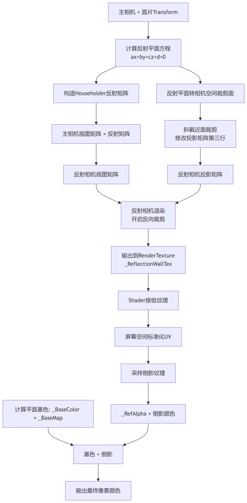

> 座舱HMI的特效类开发中，常遇到对于倒影/投影的需求。比如洗车场景墙面的高反射感，车库地面要环氧树脂镜面感。那么是靠反射探针呢，还是用屏幕空间反射，还是应该用老方法在镜面后面复制一套物体？

本文介绍的是一套轻量通用的平面反射倒影方案，**一张面片、一个额外相机、一张 RenderTexture**，不管是墙面还是地面，都可以考虑使用这个方案。

## 方案对比

真反射的下面几个方案线往往不适合车机端和平面设计场景：

- **反射探针**：静态烘焙行不通，因为场景里的车辆一定是动态的；实时探针比较昂贵，而且倒影画面对于视角的需求，有时要的不是某一个点，而是一块平面镜的几何对应关系。
- **屏幕空间反射**：项目交付时，SSR还没有正式加入URP。它带来的全屏Pass需要多次深度缓冲采样，性能堪忧。对于墙面的情况，可能需要反射屏幕外的物体。
- **镜面复制**：额外占顶点，性价比太低，而且要保证复制物体的同步很是麻烦。

平面反射的路线：**用反射矩阵把相机镜像到平面另一侧拍一张，再把画面贴回原平面**，不需要物理反射，但要花一次额外渲染的成本，能得到和真镜面一致的几何对齐效果。

## 方案总览

整套方案分 C# 渲染侧和 Shader 采样侧：

1. **C# 侧**：用 Householder 反射矩阵把主相机镜像变换到平面另一侧，创建反射相机渲染场景到 RenderTexture，用斜截近面裁剪裁掉平面后方穿帮几何体。以下代码都在一个脚本中完成。
2. **Shader 侧**：用屏幕空间 UV 采样 RenderTexture，乘以透明度叠到basecolor上

## 一、反射矩阵

平面倒影的核心就是模拟这个过程：**放一个相机在镜子背后，它拍到的就是镜子该显示的倒影**。这个动作用**Householder反射矩阵**实现：给定平面法线`N`和位置`P₀`，构造4×4变换矩阵，就能把空间中任意点变换为它关于平面的镜像。

整套逻辑在一个脚本里完成，分两步走：`Start()` 做一次性初始化，`RenderObject()` 每帧执行渲染。

### 初始化：Start()

`Start()` 做三件事：创建反射相机、创建 RenderTexture、注册每帧回调。

反射相机的创建有几个必须关闭的选项：阴影（`renderShadows = false`）、Color/Depth Prepass（`requiresColorOption / requiresDepthOption = Off`）——反射相机只需要颜色信息，这些全部是多余开销。

剔除层需要设置两层：`~(1 << 4)` 剔除 Water 层防止"镜中镜"递归，`LayersToReflect`（LayerMask，默认全部）排除反射平面自身所在层防止自反射，两层缺一不可。

相机类型标记为 `CameraType.Reflection` 并禁用自动渲染（`enabled = false`），由脚本在回调中手动触发。

RenderTexture 的分辨率由 `ReflectionTexResolution`（int，默认 512，必须为 2 的幂）控制。格式默认 ARGB32，`HDR`（bool，默认 false）开启后改用 ARGBFloat 保留高光信息，但显存翻倍。

**代码示意：**

```csharp
void Start()
{
    targetCam = Camera.main;

    // 创建反射相机，关闭阴影和 Prepass
    // 剔除 Water 层 + LayersToReflect 排除自身层
    // 标记为 Reflection 类型，禁用自动渲染
    reflectionCamera = /* ... */;
    reflectionCamera.cullingMask = ~(1 << 4) & LayersToReflect.value;
    reflectionCamera.cameraType = CameraType.Reflection;
    reflectionCamera.enabled = false;

    // 创建 RenderTexture
    // ReflectionTexResolution 控制分辨率，HDR 控制浮点格式
    reflectionTexture = new RenderTexture(
        ReflectionTexResolution, ReflectionTexResolution, 16, format
    ) { isPowerOfTwo = true };

    // 注册每帧渲染回调
    RenderPipelineManager.beginCameraRendering += this.RenderObject;
}
```

### 每帧渲染：RenderObject()

`RenderObject()` 注册在 `beginCameraRendering` 回调上，每帧主相机渲染前触发。内部按五个步骤执行。

**代码示意：**

```csharp
void RenderObject(ScriptableRenderContext context, Camera cam)
{
    // 只对主相机执行，避免反射相机自身触发递归
    if (isRendering || cam != targetCam) return;
    isRendering = true;

    // ---- 1. 同步反射相机参数（FOV、裁剪面、纵横比等） ----
    reflectionCamera.fieldOfView = cam.fieldOfView;
    reflectionCamera.aspect = cam.aspect;
    // 关闭天空盒，倒影中不应出现天空
    reflectionCamera.clearFlags = CameraClearFlags.SolidColor;
    reflectionCamera.backgroundColor = Color.clear;

    // ---- 2. 构造反射矩阵 ----
    // 法线由面片 transform.up 决定——竖直墙面水平朝前，水平地面垂直朝上
    Vector3 normal = transform.up;
    Vector3 position = transform.position;
    // Offset（float，默认 0.0）：反射平面沿法线方向的微调偏移，控制倒影贴合度
    Vector4 reflectionPlane = new Vector4(
        normal.x, normal.y, normal.z,
        -Vector3.Dot(normal, position) - Offset
    );
    // Householder 反射矩阵: M = I - 2 * n * n^T
    // 16 个元素由 reflectionPlane 展开，此处省略逐行赋值
    Matrix4x4 reflectionMatrix = CalculateReflectMatrix(reflectionPlane);
    // 变换视图矩阵和世界位置
    reflectionCamera.worldToCameraMatrix = cam.worldToCameraMatrix * reflectionMatrix;
    reflectionCamera.transform.position = reflectionMatrix.MultiplyPoint(cam.transform.position);

    // ---- 3. 斜截近面裁剪（下一节详述） ----
    // ...

    // ---- 4. 渲染反射相机 ----
    // 镜像变换把左手坐标系翻成右手坐标系，必须翻转背面裁剪
    GL.invertCulling = true;
    UniversalRenderPipeline.RenderSingleCamera(context, reflectionCamera);
    GL.invertCulling = false; // 渲染完毕立刻恢复，否则主相机也会"里朝外"

    // ---- 5. 将渲染结果注入材质 ----
    // BlurredReflection（bool，默认 false）：是否开启模糊倒影
    foreach (var material in reflectionMats)
    {
        material.SetTexture(reflectionTexString, reflectionTexture);
        if (BlurredReflection) material.EnableKeyword(blurString);
        else material.DisableKeyword(blurString);
    }

    isRendering = false;
}
```

## 二、裁剪

反射相机翻到平面另一侧后，会拍到平面后方多余的几何体，比如地面倒影会拍到地下的场景建筑，这些穿帮必须裁掉。

我们用**斜截近面裁剪**实现零开销裁剪：直接修改反射相机投影矩阵的第三行，让近裁剪面倾斜对齐反射平面，GPU硬件会自动裁掉平面后方所有像素。

### 代码示意

```csharp
// 符号函数：和Mathf.Sign不同，sgn(0)返回0而非1
static float Sgn(float a) => a > 0f ? 1f : a < 0f ? -1f : 0f;

// 把反射平面从世界空间变换到反射相机空间
Matrix4x4 worldToCamera = reflectionCamera.worldToCameraMatrix;
Vector3 clipNormal = worldToCamera.MultiplyVector(normal).normalized;
Vector4 clipPlane = new Vector4(
    clipNormal.x, clipNormal.y, clipNormal.z,
    -Vector3.Dot(worldToCamera.MultiplyPoint(position + normal * Offset), clipNormal)
);

// 计算斜截投影矩阵
// Q是近裁剪面远角点在投影空间中的坐标，用sgn确定其方向
Matrix4x4 projection = mainCamera.projectionMatrix;
Vector4 oblique = clipPlane * (2f / Vector4.Dot(
    clipPlane, 
    projection.inverse * new Vector4(Sgn(clipPlane.x), Sgn(clipPlane.y), 1f, 1f)
));
// 替换投影矩阵第三行，完成斜截
projection[2] = oblique.x - projection[3];
projection[6] = oblique.y - projection[7];
projection[10] = oblique.z - projection[11];
projection[14] = oblique.w - projection[15];

reflectionCamera.projectionMatrix = projection;
```

## 三、屏幕空间UV采样

反射相机拍好的RenderTexture，要贴回原平面并和主相机视角对齐。

用建模展开的UV肯定不行，UV是模型空间固定坐标，主相机一动位置就错了。正确做法是用**屏幕空间标准化UV**采样：

URP内置提供了`GetNormalizedScreenSpaceUV`方法，可以直接得到当前像素在0~1范围的屏幕坐标，反射相机本来就是按主相机视角镜像渲染的，用屏幕UV采样天然对齐。

### Shader代码示意

```hlsl
// 计算当前像素的屏幕空间标准化UV
float2 screenUV = GetNormalizedScreenSpaceUV(i.clipPos);

// 采样基础颜色：_BaseColor（Color，默认透明黑，实参由材质覆盖）× _BaseMap（2D，平面基础贴图）
float3 baseColor = _BaseColor * tex2D(_BaseMap, i.uv).rgb;
// 采样倒影颜色：_ReflectionWallTex（2D，C#注入的倒影RenderTexture）
float3 reflectionColor = tex2D(_ReflectionWallTex, screenUV).rgb;

// 叠加倒影，_RefAlpha 控制强度
float3 finalColor = baseColor + _RefAlpha * reflectionColor;
return float4(finalColor, 1);
```

有三个关键参数：

- `_ReflectionWallTex`（2D）：C# 侧注入的倒影 RenderTexture，不需要手动赋值，由反射相机渲染后自动设置。
- `_RefAlpha`（Float，默认 0）：倒影叠加强度。0 时看不到任何倒影，1 时倒影完全覆盖，建议 0.4~0.7。让倒影成为氛围辅助，不要盖过平面本身的底色。这个值与 C# 侧的 `ReflectionAlpha`同步。
- 如果需要做模糊倒影、水波纹扭曲，对`screenUV`加法线扰动即可。

## 四、完整数据流

完整的处理流程：




## 五、注意事项

1. **主要开销来自反射相机渲染**：建议只在需要倒影的场景激活，退出就销毁，不要常驻。
2. **多个反射会叠加开销**：不建议场景里同时开多个Planar反射，性能可能扛不住。
3. **HDR不随便开**：ARGBFloat显存是ARGB32的两倍，灯光倒影需要保留高光时再开。

## 结语

本文只是介绍了平面反射实现的基础，然而在真正使用的时候，很可能还需要叠加更多的能力：模糊、菲涅尔效果、从一个独立的相机组件内化为管线BeforeOpaque的处理、反射随深度淡出等。

