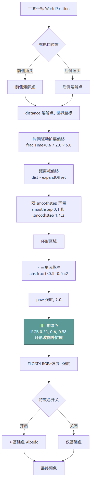

> The charging/discharging scene is a must-do for any 3D car model. To convey the flow of energy, most implementations use some kind of scanning effect. What I once implemented in a project was an energy wave that starts near the charge port and expands outward, sweeping across the doors and the front compartment. It's part of the car paint material — a kind of dissolve effect.

This article presents a charging dissolve effect built on **world-space positions**: **one world-space point acts as the dissolve origin, and each pixel's actual world-space coordinates determine when, and in what way, it lights up**. This achieves a sequential scan expanding outward from the charge port, without turning into a mess even when the same material is spread across multiple meshes.

The core idea is:

- With the charge port as the center, an **annular wave** expands outward, with a periodic pulse, in a teal-green color.
- Different charge port positions only change the dissolve origin coordinates (front port / rear port).
- Controlled from the C# side via global Keywords.

It can be summarized in three steps: **the C# side switches Keywords and the global coordinate according to the charging state → the Shader reads the Keyword to pick the dissolve origin → computes the glow color and adds it on top of the Albedo**.

---

## 1. Global Variables

The dissolve effect needs a world-space "starting point" — the position of the charge port. Since the car body shares a single car paint material, injecting a global Shader variable is the most direct approach.

The following is illustrative code:

```csharp
// Dissolve point coordinates, set when the vehicle model controller initializes
public class VehicleModelController : MonoBehaviour
{
    // World coordinates of the rear charge port
    public Vector4 RearChargeOrigin = new Vector4(-1f, 1f, -1f, 0);
    // World coordinates of the front charge port
    public Vector4 FrontChargeOrigin = new Vector4(-1f, 1f, 1f, 0);

    protected virtual void Awake()
    {
        // Global injection; every material using this variable name picks it up automatically
        Shader.SetGlobalVector("RearDissolvePoint", RearChargeOrigin);
        Shader.SetGlobalVector("FrontDissolvePoint", FrontChargeOrigin);
    }
}

```

---

## 2. The C# Side

Vehicle-side signals (charging state, plug type, charge port cover open/closed) are processed by the module handlers, which then centrally control the Shader's Keywords.


| Keyword                | Purpose                                                                       |
| ---------------------- | ----------------------------------------------------------------------------- |
| `_ISCHARGEDISSOLVE_ON` | Master switch for the effect; controls whether the dissolve color is finally added |
| `_ISFRONTCHARGE_ON`    | Dissolve origin switch; controls whether the front or rear charge port coordinates are used |


The following is illustrative code:

```csharp
public class VehicleChargeVisual : MonoBehaviour
{
    private void Awake()
    {
        CloseChargeEffect();
        // Listen for changes in charging state, plug type, and port cover open/close
        // ... RegisterOnValueChanged(OnXxxChanged)
    }

    private void UpdateEffect()
    {
        // When the charge port cover is closed → turn off the effect
        // if (IsAllCapClosed()) { CloseChargeEffect(); return; }

        // While charging → enable the effect
        Shader.EnableKeyword("_ISCHARGEDISSOLVE_ON");

        // Not charging → disable
        // default: CloseChargeEffect();
    }

    private void OnPlugTypeChanged(PlugType plugType)
    {
        // Front plug → use the front dissolve point
        if (plugType == PlugType.Front)
            Shader.EnableKeyword("_ISFRONTCHARGE_ON");
        // Rear plug → use the rear dissolve point
        else if (plugType == PlugType.Rear)
            Shader.DisableKeyword("_ISFRONTCHARGE_ON");
    }

    private void CloseChargeEffect()
    {
        Shader.DisableKeyword("_ISCHARGEDISSOLVE_ON");
        Shader.DisableKeyword("_ISFRONTCHARGE_ON");
    }
}

```

---

## 3. The Shader Side

The whole dissolve effect can be wrapped into a Function of a Shader utility, outputting a `FLOAT4` (RGB = glow color, A = intensity), which is added onto the Albedo line in the car paint Shader.

### 3.1 Time-Space Mapping

```hlsl
// frac keeps the offset looping within [0, 1); multiplied by speed, the wavefront advances outward at 3 units/second
float timePhase = frac((_TimeParameters.x - offset) / period);
float expandOffset = timePhase * speed;
float distFromWave = (dist - expandOffset) / 1.0;

```


| Parameter | Value | Meaning                                                       |
| --------- | ----- | ------------------------------------------------------------- |
| offset    | -0.6  | Start offset, ensuring the wave already has some distance at t=0 |
| period    | 2.0   | Period; the expansion repeats every 2 seconds                  |
| speed     | 6.0   | World units traveled per cycle, equivalent to 3 units/second   |


`dist - expandOffset` gives the signed distance from the current pixel to the wavefront: negative = the wave has already swept past; positive = the wave hasn't arrived yet.

### 3.2 The Ring Band

Edge blending is done with two smoothstep calls.

```hlsl
float innerEdge = smoothstep(0.0, 1.0, distFromWave);   // inner edge of the wavefront
float outerEdge = smoothstep(1.0, 1.2, distFromWave);   // outer edge of the wavefront
float ring = 1.0 - ((1.0 - innerEdge) + outerEdge);

```


| `distFromWave` Range | `innerEdge` | `outerEdge` | `ring` | Meaning                |
| -------------------- | ----------- | ----------- | ------ | ---------------------- |
| < 0                  | ≈ 0         | ≈ 0         | ≈ 1    | Wave has swept past    |
| 0 → 1                | 0 → 1       | ≈ 0         | 1 → 0  | Inner edge transition  |
| 1 → 1.2              | ≈ 1         | 0 → 1       | 0      | Outer edge transition  |
| > 1.2                | ≈ 1         | ≈ 1         | ≈ 0    | Wave hasn't arrived    |


The final `ring` forms a bright band roughly **1.2 units wide** near the wavefront, with a soft 0.2-unit transition on the outer edge.

### 3.3 Triangle-Wave Pulse + Quadratic Falloff

A triangle wave is used to compute a periodic 1 Hz pulse, giving the glowing ring a breathing effect; a quadratic power then makes the bright ring's center stand out more while the edge transition stays natural.

```hlsl
// frac(t×0.5) → 0~1 sawtooth; subtract 0.5 and take the absolute value → 0~0.5~0 triangle wave; ×2 normalizes to 0~1~0
// A period of 1 second, letting the ring "breathe" at 1 Hz
float pulse = abs(frac(_TimeParameters.x * 0.5) - 0.5) * 2.0;

// The quadratic power makes the bright ring's center pop while the edges transition sharply
float intensity = pow(ring * pulse, 2.0);

```

### 3.4 Color and Output

```hlsl
// Teal green
float4 effectColor = IsGammaSpace()
    ? float4(0.35, 0.6, 0.58, 1)   // Gamma
    : float4(0.10, 0.32, 0.30, 1); // Linear

// Output: RGB = glow color × intensity, A = intensity (used for blending)
float4 dissolveResult = float4(
    (intensity * effectColor).rgb,
    intensity
);

```

### 3.5 Adding onto the Albedo

In the car paint Shader, the dissolve effect is added onto the base color with **additive blending**:

```hlsl
#ifdef _ISCHARGEDISSOLVE_ON
    float4 finalAlbedo = baseAlbedo + dissolveResult;
#else
    float4 finalAlbedo = baseAlbedo;
#endif

```

---

## 4. Processing Flow



---

## 7. Notes and Caveats

1. **The dissolve point must match the vehicle model**: different vehicle models have their charge ports in different places. The dissolve point coordinates must be set when the controller initializes; when switching vehicle models, make sure the coordinates are correct.
2. **Edge softness of pow 2**: the quadratic falloff leaves a fairly wide transition band near the wavefront. If you need sharper edges, raise it to pow 3~4; if you need something softer, drop it to pow 1.5.

---

## Closing Words

Many interaction effects — charging/discharging and rain/snow included — are tied to the car paint material. You could say the car paint material is the combined result of many different effects. This article covered charging; discharging looks different enough in presentation that it may get its own short post later.
