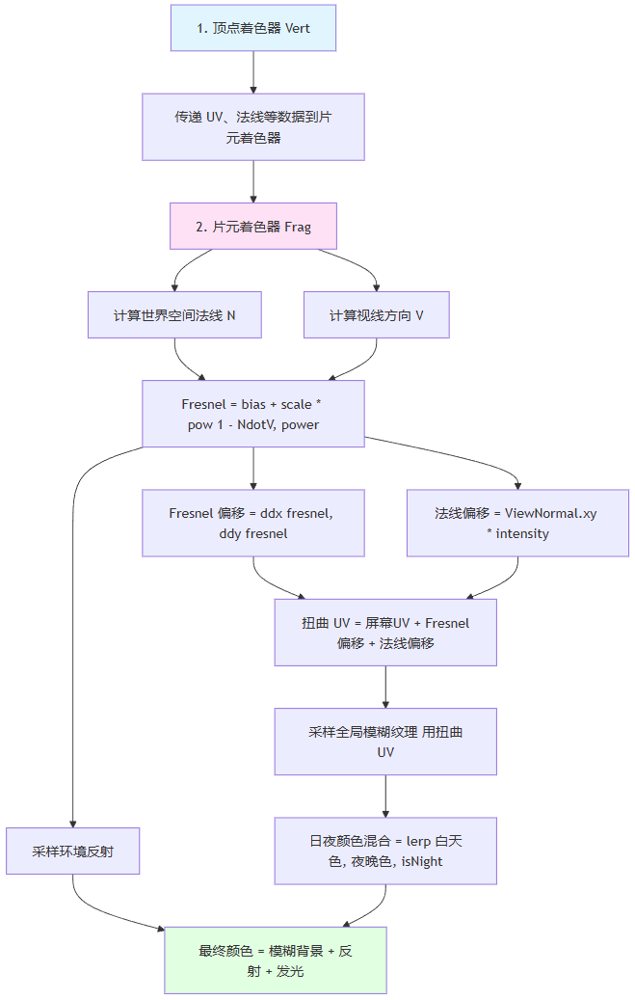

> In smart cockpit 3D HMI scenes, glass materials are used widely — car windows, semi-transparent areas of the car shell, lamp covers on headlights, and more. The material needs to let light through while also presenting a somewhat blurry, frosted quality.

The frosted-glass effect in automotive scenes is essentially a **screen-space** simulation of the refraction and scattering of light as it passes through frosted glass.

# The Previous Approach

The traditional approach was to write a genuine refraction Shader, whose core is GrabPass + normal offset:

1. GrabPass grabs the current screen's rendered image. Before the glass object is rendered, the current screen result gets copied into the `_RefractionTex` texture.

```
// Grab the screen image inside the SubShader
GrabPass{"_RefractionTex"}
```

2. Vertex shader: compute the screen sampling coordinate scrPos, and prepare the tangent-space-to-world-space transformation matrix TtoW.
3. Fragment shader: sample the tangent-space normal from the normal map, then convert it to world space using the TtoW matrix prepared by the vertex shader.

```
fixed3 tanNormal = UnpackNormal(tex2D(_BumpMap, i.uv.zw));
fixed3 worldNormal = mul(TtoW, tanNormal);
```

4. Use the tangent-space normal's XY components (which happen to correspond to the screen-space offset directions), multiplied by the distortion strength and pixel size, to get an offset, then add it to the screen coordinates.

```
float2 offset = tanNormal.xy * _Distortion * _RefractionTex_TexelSize.xy;
i.scrPos.xy += offset;
```

5. Sample the image captured by GrabPass using the offset screen coordinates to get the refracted color.

```
fixed3 refractCol = tex2D(_RefractionTex, i.scrPos.xy / i.scrPos.w).xyz;
```

GrabPass copying the current screen's rendered result into a texture is an expensive operation.

If there are multiple glass-like objects, each one needs its own Grab pass. Moreover, every pixel has to sample the normal map and compute an offset.

# The Current Approach

So for the sake of performance, we adopted the following approach:

1. **Unify the sampled texture across all glass objects:** a URP Renderer Feature performs one Gaussian blur on the camera's Color Buffer after transparent objects finish rendering, producing a global blur texture. All glass objects sample this one texture — no need for each one to compute its own.
2. **Offset sampling**: when rendering the glass, don't sample the current pixel's color directly; instead, offset the screen UV and sample that blur texture. The offset is computed from the normal direction and the viewing angle, simulating the bending of light as it passes through the glass.
3. **Layered detail**: use the Fresnel term to distinguish the glass's inner and outer faces. Viewed head-on it leans transparent; viewed obliquely it leans white. If needed, you can also layer environment reflection on top to make the glass look more realistic. All these details are optional.

> Pros: blur happens only once globally, and all glass objects share the result — excellent performance.
>
> Cons: the content behind the glass isn't a true refraction, but in a cockpit scene that's acceptable.

---

## 1. The Global Blur Texture

Create a URP Render Feature that triggers after all transparent objects are rendered.

This Feature first downsamples the current frame, then applies multiple Gaussian blur passes, and finally registers the result as a global texture that all frosted-glass shaders can sample.

Downsampling (reducing width and height by 8x each) reduces the computation of the subsequent blur passes. The blur then only needs to process 1/64 of the original pixel count, significantly lowering GPU bandwidth pressure.

After downsampling comes the blur loop. Each round contains one horizontal Gaussian pass and one vertical Gaussian pass. Through this "separable" approach, a 5×5 Gaussian kernel that would normally need 25 samples shrinks to 10 samples (5 horizontal + 5 vertical) — a major performance win.

When the blur finishes, `SetGlobalTexture` registers the result as `_GlobalBlurTexture`. All shaders can then sample directly by that name, with no need to pass parameters manually.

Illustrative code:

```hlsl
// Downsample pass: copy the source image into a 1/8-resolution temporary texture
// The C# side specifies the width/height reduction via RenderTextureDescriptor
cmd.Blit(sourceTexture, downsampledTexture);

// Horizontal Gaussian blur pass: sample 5 pixels along the X axis
float weights[5] = {0.0545, 0.2442, 0.4026, 0.2442, 0.0545};
int offsets[5] = {-2, -1, 0, 1, 2};

float3 horizontalBlur = float3(0, 0, 0);
for (int i = 0; i < 5; i++)
{
    float2 sampleUV = uv + float2(_MainTex_TexelSize.x * offsets[i], 0);
    horizontalBlur += SAMPLE_TEXTURE2D(_MainTex, sampleUV).rgb * weights[i];
}

// Vertical Gaussian blur pass: sample 5 pixels along the Y axis
float3 verticalBlur = float3(0, 0, 0);
for (int i = 0; i < 5; i++)
{
    float2 sampleUV = uv + float2(0, _MainTex_TexelSize.y * offsets[i]);
    verticalBlur += SAMPLE_TEXTURE2D(horizontalResult, sampleUV).rgb * weights[i];
}
```

---

## 2. Fresnel Edge Blending

The Fresnel effect on frosted glass isn't just about seeing "glowing edges" — it also needs to distinguish the glass's inner and outer faces, enabling two-layer shading. Viewed head-on, the glass looks more translucent; viewed at a slant, its edges become brighter and whiter. This variation needs to be driven by the Fresnel value, which controls the blend ratio between the inner and outer colors.

The Fresnel computation uses the classic Fresnel approximation:

```
fresnel = bias + scale * pow(max(1.0 - dot(N, V), 0.0001), power)
```

- `N`: the surface normal direction
- `V`: the view direction
- `bias`: base brightness (there's a little brightness even when viewed head-on)
- `scale`: edge glow strength
- `power`: controls the "sharpness" of the glow (higher values make the edge narrower)

The dot product between the normal and the view direction reflects the angle between the line of sight and the surface: when the view is perpendicular to the surface, the dot product is 1 and the Fresnel value is close to the base offset; as the view becomes more oblique, the dot product approaches 0 and the Fresnel value, amplified by the power function, rises sharply.

In the formula, `bias` controls base brightness, `scale` controls glow strength, and `power` determines the sharpness of the glow.

With the Fresnel value in hand, blending the inner and outer colors becomes simple:

- The inner color is the blurred background layered with the inner tint
- The outer color is the blurred background layered with the outer tint

The two are blended using Fresnel as the interpolation factor. This two-layer blend looks more realistic than simple edge glow: viewed head-on you see the blurred scene behind the glass; viewed at a slant, the edges take on a porcelain-white quality. Illustrative code:

```hlsl
// Compute the Fresnel value: base offset + scale * pow(1 - dot(N,V))
float3 worldNormal = normalize(input.normalWS);
float3 viewDir = normalize(_WorldSpaceCameraPos - input.positionWS);
float NdotV = dot(worldNormal, viewDir);

// Avoid division by zero; clamp the minimum to 0.0001
float fresnel = _Bias + _Scale * pow(max(1.0 - NdotV, 0.0001), _Power);

// Inner/outer two-layer shading
float4 blurredBG = SampleBlurTexture(distortedUV);  // Sample the global blur texture
float4 innerColor = _GlassInColor * blurredBG;       // Head-on: inner tint
float4 outerColor = blurredBG * _GlassOutColor;      // Oblique: outer tint
```

---

## 3. Screen-Space Distortion

Offsetting the sampling coordinates simulates the bending of light after it passes through frosted glass. This offset consists of two main components: the Fresnel-derivative offset and the normal offset.

The Fresnel derivative computes the gradient of the Fresnel value in screen space — its rate of change along X and Y. Because the Fresnel value changes sharply near edges, its derivative directly reflects how "bent" the glass surface is. Multiplying the derivative offset by the `_DistortIntensity` parameter controls the distortion strength.

The normal offset is more direct: convert the world-space normal to view space and take its XY components as the offset.

After sampling the blurred background, it still needs to be blended with the day/night base color to make sure the glass doesn't "disappear" in night scenes. During the day, the base color's Alpha is 0, fully showing the blurred background; at night, the Alpha is greater than 0, layering a gray tint on top so the glass remains visible in dark environments.

Illustrative code:

```hlsl
// Compute the Fresnel derivative in screen space (rate of change)
float2 fresnelGradient = float2(ddx(fresnel), ddy(fresnel));

// Convert the world-space normal to view space, take XY as the offset
float3 viewNormal = normalize(mul(UNITY_MATRIX_V, float4(worldNormal, 0.0)).xyz);

// Combine the two offset components
float2 distortionOffset = fresnelGradient * _DistortIntensity;
float2 normalOffset = viewNormal.xy * _NormalDitortIntensity;

// Compute the offset sampling coordinates
float2 distortedUV = screenUV + distortionOffset + normalOffset;

// Sample the global blur texture
float4 blurredSample = SAMPLE_TEXTURE2D(_GlobalBlurTexture, distortedUV);

// Blend with the day/night base color
float4 dayColor = _BaseColor;
float4 nightColor = _NightBaseColor;
float4 baseColor = lerp(dayColor, nightColor, _IsNight);
float4 blurredBG = lerp(blurredSample, baseColor, baseColor.a);
```

---

## 4. The Normal Map

The normal map doesn't participate in UV offsetting; instead, it indirectly changes the Fresnel value and the reflection direction through the normal. The benefit of this approach is that normal details blend naturally into the frosted glass's overall look: in areas with bumpy texture, the Fresnel value varies and the reflection direction changes, ultimately producing richer visual detail.

Illustrative code:

```hlsl
// Sample the tangent-space normal from the normal map
float3 tangentNormal = UnpackNormal(SAMPLE_TEXTURE2D(_BumpMap, uv));
tangentNormal *= _BumpScale;  // Control normal strength

// Convert to world space via the TBN matrix
float3 worldNormal = normalize(mul(TBN, tangentNormal));

// This worldNormal affects:
// 1. The Fresnel computation (dot(worldNormal, viewDir))
// 2. The reflection direction (reflect(-viewDir, worldNormal))
// 3. Environment reflection sampling (GlossyEnvironmentReflection)
```

---

## 5. Layering Environment Reflection

To make the frosted glass feel more realistic, you can also add support for environment reflection.

Environment reflection sampling is based on the reflection direction and the world-space position, fetching the pre-blurred ambient light through Unity's function. That function needs the reflection vector and roughness.

The final output color is a blend of the texture color and the reflection color, with the blend factor being the reflection intensity — so the reflection integrates naturally into the frosted glass's overall look.

Illustrative code:

```hlsl
// Compute the reflection direction
half3 reflectDir = reflect(-viewDir, worldNormal);

// Sample environment reflection (already blurred)
float roughness = 1.0 - _Smoothness;
float3 envReflection = GlossyEnvironmentReflection(
    reflectDir,
    worldPosition,
    roughness,
    1.0,  // occlusion
    screenUV
);

// Blend with the frosted glass color
float4 texColor = SAMPLE_TEXTURE2D(_MainTex, uv) * glassColor;
float4 finalColor = lerp(texColor, float4(envReflection, 0.0), _RefIntensity);
```

---

# Flow Summary



# Closing Thoughts

In real-world use, glass effects require tuning the various parameters for different environments. For example: if the glass looks too bright, lower BaseColor.a (0.2–0.4); if the edge glow looks too fake, reduce the Power value (1.0–1.2); if the distortion effect is barely visible, raise DistorIntensity (1.5–2).
