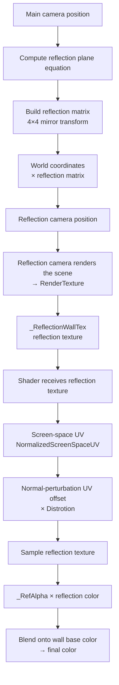

> In car wash mode, the wall needs to reflect the silhouette of the car model on its water-stained surface — but the wall is only a single quad. Can we skip the mirror mesh and get a usable reflection from just one texture?

---

## About the Figure

**Opening image**: a Unity render; a car reflection overlaid on a gray wall, with a clear reflection silhouette and a water-stain blurriness.

---

## 1. Requirements Background

Car wash mode needs to show the visual effect of "a water-stained wall with the car model reflected in it". The realistic rendering route would be: make the wall mirror glass, add a reflection probe, and let the car model produce a reflection on the wall — but here comes the problem: the wall is a flat quad with no thickness, unsuitable for a mirror-glass water-stain layer; and using a water-stain normal map plus screen-space reflections means high shader complexity and heavy performance pressure on mobile.

Engineering took a lighter path: **render a reflection texture, apply it to an ordinary quad, and use a shader to produce the visual effect of mirror reflection**. No real physical reflection, no mirror mesh — just one extra camera + one RenderTexture + a bit of sampling logic.

---

## 2. Core Mechanism

The solution has two parts:

**Rendering side (PlanarURPWashWall.cs)**: creates a camera dedicated to reflection, computes the reflection matrix from the plane equation, mirrors the camera to the other side of the plane, and renders the scene into a RenderTexture.

**Shader side (ASE_Env_Wash_RainWall_8295.shader)**: receives this RenderTexture, samples it with screen-space UVs for the reflection color, adds normal perturbation for the water-stain distortion, and finally blends the result onto the wall color.

```
Extra camera → renders the scene into a RenderTexture
    ↓
Shader receives _ReflectionWallTex
    ↓
Samples the reflection with screen-space UVs
    ↓
+ normal perturbation (water-stain distortion)
    ↓
Blended onto the wall color → final pixel
```

---

## 3. Rendering Side: PlanarURPWashWall.cs

### Core Principle

The essence of reflection is "placing the camera on the other side of the plane to take the shot". Given a plane (normal N, position P), the mirrored position P' of any point P in space satisfies: P' = P − 2 × (N·(P−P₀)) × N.

The code implements this transform through a reflection matrix:

```csharp
// The following is illustrative code, aligned with the production logic but not copied verbatim.
// Build the reflection plane equation: ax + by + cz + d = 0
// normal = plane normal, posistion = plane position, Offset = distance offset along the positive normal direction
reflectionPlane = new Vector4(
    normal.x, normal.y, normal.z,
    -Vector3.Dot(normal, posistion) - Offset
);

// Build the 4×4 reflection matrix (mirror transform in homogeneous coordinates)
reflectionMatrix.m00 = (1F - 2F * reflectionPlane[0] * reflectionPlane[0]);
reflectionMatrix.m01 = (-2F * reflectionPlane[0] * reflectionPlane[1]);
// ... the remaining 15 elements are similar
reflectionMatrix.m33 = 1F;

// Transform the camera's world coordinates with the reflection matrix
reflectionCamera.worldToCameraMatrix = cam.worldToCameraMatrix * reflectionMatrix;
```

### Creating the Reflection Camera

```csharp
// The following is illustrative code, aligned with the production logic but not copied verbatim.
// Create a dedicated reflection camera
var go = new GameObject("ReflectionCamera", typeof(Camera), typeof(Skybox));
reflectionCamera = go.GetComponent<Camera>();

// Disable shadows to keep the reflection camera from producing interfering shadows
var lwrpCamData = go.AddComponent(typeof(UniversalAdditionalCameraData))
    as UniversalAdditionalCameraData;
lwrpCamData.renderShadows = false;

// Match the camera's frustum and layer mask to the main camera
reflectionCamera.cullingMask = ~(1 << 4) & LayersToReflect.value;
reflectionCamera.cameraType = CameraType.Reflection;
```

Key point: **disable shadow rendering** (`renderShadows = false`) — the reflection camera only needs color information; shadow information is interference and adds overhead instead.

### Render Texture Format

```csharp
// The following is illustrative code, aligned with the production logic but not copied verbatim.
// Prefer ARGB32; choose ARGBFloat when HDR is needed
RenderTextureFormat textureFormat = RenderTextureFormat.ARGB32;
if (HDR && SystemInfo.SupportsRenderTextureFormat(RenderTextureFormat.ARGBFloat))
{
    textureFormat = RenderTextureFormat.ARGBFloat;
}

reflectionTexture = new RenderTexture(
    ReflectionTexResolution, ReflectionTexResolution, 16, textureFormat
)
{
    isPowerOfTwo = true,
    hideFlags = HideFlags.DontSave
};
```

The resolution defaults to 512, a power of two (mobile-friendly). HDR mode uses a floating-point texture, preserving more highlight information.

---

## 4. Shader Side: Screen-Space UV Sampling

### Why Use Screen-Space UVs?

A regular texture's UVs are 2D coordinates unwrapped by modeling software, but the reflection must correspond exactly to the main camera's view — each pixel's reflection color should come from the object seen in the "mirror direction" of the main camera's frame.

The solution: **use the screen-space coordinates (NormalizedScreenSpaceUV) as the reflection sampling UV**. That way, each pixel's reflection sampling position naturally aligns with the main camera's view.

```hlsl
// The following is illustrative code, aligned with the production logic but not copied verbatim.
// Get the normalized screen-space coordinates from URP's NormalizedScreenSpaceUV
// This is a screen UV in the 0–1 range: x=0 is the left edge, x=1 is the right edge
float2 reflectionUV = NormalizedScreenSpaceUV.xy;

// Sample the reflection texture
float4 reflectionColor = tex2D(_ReflectionWallTex, reflectionUV);

// Blend onto the wall base color; multiply by _RefAlpha to control intensity
float3 wallColor = _BaseColor * tex2D(_BaseMap, uv_BaseMap)
    + _RefAlpha * reflectionColor;
```

### Water-Stain Distortion: Normal Perturbation

A car-wash water-stained wall is not a perfect mirror; the water-stain surface has bumps and ripples that distort the reflection. The shader's approach: **add the normal-perturbation offset before sampling the reflection UV**.

```hlsl
// The following is illustrative code, aligned with the production logic but not copied verbatim.
// Unpack the normal map
float3 tex2DNode343 = UnpackNormalScale(tex2D(_NormalTex, uv_NormalTex), 1.0f);

// Transform the normal from tangent space to world space
float3 localTangentToWorld = TangentToWorld13_g40(tex2DNode343, TBN);
float3 ResultNormal313 = localTangentToWorld;

// Normal perturbation × distortion factor → UV offset
float3 normalOffset = mul(ResultNormal313, ase_worldToTangent) * _Distrotion;

// Sample the reflection texture with the perturbed UV
float4 reflectionUV = NormalizedScreenSpaceUV
    + float4(normalOffset.xy, 0.0, 1.0);
float4 reflectionColor = tex2D(_ReflectionWallTex, reflectionUV.xy);
```

What these lines mean: the XY components of the normal map represent the micro-bump directions of the water-stain surface; adding this direction to the screen-space UV produces the visual effect of "an uneven water surface distorting the reflection". `_Distrotion` controls the distortion strength.

### Blur Effect: Multi-Level Sampling

When `BlurredReflection` is enabled, the shader additionally performs a multi-level sampling (box blur) on the reflection color, making the reflection softer:

```hlsl
// The following is illustrative code, aligned with the production logic but not copied verbatim.
#ifdef BLUR
// Apply a 3×3 window box blur to the reflection texture
float4 blurColor = tex2D(_ReflectionWallTex, reflectionUV.xy);
// Multi-level sampling (simplified expression; the actual implementation does multi-level pyramid sampling)
ResultBaseColor355 = lerp(reflectionColor, blurColor, _BlurStrength);
#else
ResultBaseColor355 = reflectionColor;
#endif
```

---

## 5. The Full Data Flow



Three key data flows:
- **Reflection camera matrix**: main camera position → reflection plane equation → reflection matrix → reflection camera world coordinates
- **Reflection texture**: reflection camera render → RenderTexture → `_ReflectionWallTex` property
- **Shader sampling**: screen-space UV + normal-perturbation offset → sample reflection → blend onto the wall color

---

## 6. Parameter Tuning Guide

| Parameter | Purpose | Tuning advice |
|------|------|----------|
| `ReflectionTexResolution` | Reflection texture resolution | Default 512; can be dropped to 256 on mobile |
| `ReflectionAlpha` | Reflection opacity | Affects reflection clarity; 0.4–0.7 recommended |
| `BlurredReflection` | Whether blur is enabled | Enable for water-stain mode, disable for a pure mirror |
| `Distrotion` | Normal perturbation strength (shader side) | Degree of water-stain distortion; higher = stronger distortion |
| `Offset` | Reflection plane offset | Adjusts how closely the reflection hugs the wall |

---

## 7. Performance Notes

1. **Reflection camera render cost**: one extra scene render, which is the main cost on mobile. Recommended: activate it when car wash mode starts and disable it on exit; do not keep it alive permanently.
2. **Reflection resolution 512×512**: on a cockpit SoC this is roughly equivalent to half a full-screen render — acceptable; but if multiple walls need reflections simultaneously, the cost doubles.
3. **Blur pass**: if `BlurredReflection` is enabled, the shader does 3×3 blur sampling, which adds fragment shader cost; consider dialing it down or disabling it on mid-tier devices.
4. **HDR vs LDR**: ARGBFloat uses twice the VRAM of ARGB32; enable HDR only in scenes where you have confirmed highlight preservation matters (e.g., nighttime light reflections).

---

## 8. Summary

The car-wash mirror-reflection solution is, in essence, another exercise in "trading computation for realism": no mirror mesh; the rendering side takes a snapshot of the scene with a dedicated camera, the shader side samples it back with screen-space UVs, and normal perturbation simulates the water-stain distortion.

Compared with the tree-shadow shader, the two share the same idea — **bake realism into textures and parameters, then activate it dynamically with the shader**. The tree shadow fakes "having a shadow"; the mirror reflection fakes "having a reflection". Different directions, same methodology.