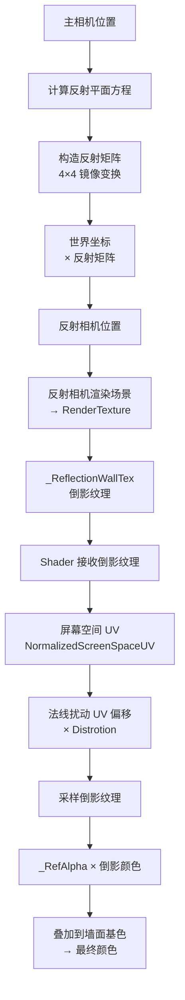

> 洗车模式下，墙面需要倒映出车模在水渍墙面的轮廓——但墙面只有一张面片。能不能不做镜面网格，只靠一张贴图做出可以用的倒影？

---

## 配图说明

**开篇图**：Unity 渲染画面，灰色墙面上叠加了车辆倒影，倒影轮廓清晰，有水渍模糊感。

---

## 一、需求背景

洗车模式需要展示"墙面有水渍、车模倒影其中"的视觉效果。真实渲染路线是：墙面做成镜面玻璃，加反射探针，让车模在墙面上产生倒影——但问题来了：墙是一张平面片，没有厚度，不适合做镜面玻璃的水渍层；如果用水渍法线贴图加屏幕空间反射，Shader 复杂度高，移动端性能压力大。

工程上走了一条更轻量的路：**用一张渲染出来的倒影贴图，贴在一张普通面片上，用 Shader 实现镜面反射的视觉效果**。不需要真实的物理反射，不需要镜面网格，只需要一个额外相机 + 一个 RenderTexture + 一段采样逻辑。

---

## 二、核心机制

这套方案分为两个部分：

**渲染侧（PlanarURPWashWall.cs）**：创建一个专门用于反射的相机，根据平面方程计算反射矩阵，把相机镜像到平面的另一侧，渲染场景输出到一张 RenderTexture。

**Shader 侧（ASE_Env_Wash_RainWall_8295.shader）**：接收这张 RenderTexture，用屏幕空间 UV 采样做倒影颜色，加上法线扰动做水渍扭曲，最后叠加到墙面颜色上。

```
额外相机 → 渲染场景到 RenderTexture
    ↓
Shader 接收 _ReflectionWallTex
    ↓
屏幕空间 UV 采样倒影
    ↓
+ 法线扰动（水渍扭曲效果）
    ↓
叠加到墙面颜色 → 最终像素
```

---

## 三、渲染侧：PlanarURPWashWall.cs

### 核心原理

反射的本质是"把相机放到平面另一侧去拍"。给定一个平面（法线 N、位置 P），空间中任意一点 P 关于平面的镜像位置 P' 满足：P' = P - 2 × (N·(P-P₀)) × N。

代码里通过反射矩阵实现这个变换：

```csharp
// 以下为示意代码，已与工程逻辑对齐但非拷贝。
// 构造反射平面方程：ax + by + cz + d = 0
// normal = 平面法线，posistion = 平面位置，Offset = 往法线正方向偏移的距离
reflectionPlane = new Vector4(
    normal.x, normal.y, normal.z,
    -Vector3.Dot(normal, posistion) - Offset
);

// 构造 4×4 反射矩阵（齐次坐标下的镜像变换）
reflectionMatrix.m00 = (1F - 2F * reflectionPlane[0] * reflectionPlane[0]);
reflectionMatrix.m01 = (-2F * reflectionPlane[0] * reflectionPlane[1]);
// ... 其余 15 个元素类似
reflectionMatrix.m33 = 1F;

// 用反射矩阵变换相机的世界坐标
reflectionCamera.worldToCameraMatrix = cam.worldToCameraMatrix * reflectionMatrix;
```

### 反射相机创建

```csharp
// 以下为示意代码，已与工程逻辑对齐但非拷贝。
// 创建专用反射相机
var go = new GameObject("ReflectionCamera", typeof(Camera), typeof(Skybox));
reflectionCamera = go.GetComponent<Camera>();

// 关闭阴影，避免反射相机自身产生阴影干扰
var lwrpCamData = go.AddComponent(typeof(UniversalAdditionalCameraData))
    as UniversalAdditionalCameraData;
lwrpCamData.renderShadows = false;

// 设置相机的平截头体和层级掩码与主相机一致
reflectionCamera.cullingMask = ~(1 << 4) & LayersToReflect.value;
reflectionCamera.cameraType = CameraType.Reflection;
```

关键点：**关闭阴影渲染**（`renderShadows = false`）——反射相机只需要颜色信息，阴影信息是干扰，反而增加开销。

### 渲染纹理格式

```csharp
// 以下为示意代码，已与工程逻辑对齐但非拷贝。
// 优先选 ARGB32，需要 HDR 效果则选 ARGBFloat
RenderTextureFormat textureFormat = RenderTextureFormat.ARGB32;
if (HDR && SystemInfo.SupportsRenderTextureFormat(RenderTextureFormat.ARGBFloat))
{
    textureFormat = RenderTextureFormat.ARGBFloat;
}

reflectionTexture = new RenderTexture(
    ReflectionTexResolution, ReflectionTexResolution, 16, textureFormat
)
{
    isPowerOfTwo = true,
    hideFlags = HideFlags.DontSave
};
```

分辨率默认 512，2 的幂次方（移动端友好）。HDR 模式使用浮点纹理，保留更多高光信息。

---

## 四、Shader 侧：屏幕空间 UV 采样

### 为什么用屏幕空间 UV？

普通贴图的 UV 是由建模软件展开的 2D 坐标，但倒影需要和主相机的视角完全对应——每个像素的倒影颜色应该来自主相机画面中"镜像方向"看到的物体。

解决方案：**用屏幕空间坐标（NormalizedScreenSpaceUV）作为倒影采样的 UV**。这样每个像素的倒影采样位置，天然对齐了主相机的视角。

```hlsl
// 以下为示意代码，已与工程逻辑对齐但非拷贝。
// 从 URP 的 NormalizedScreenSpaceUV 获取屏幕空间的标准化坐标
// 这是 0~1 范围的屏幕 UV，x=0 是左边界，x=1 是右边界
float2 reflectionUV = NormalizedScreenSpaceUV.xy;

// 采样倒影纹理
float4 reflectionColor = tex2D(_ReflectionWallTex, reflectionUV);

// 叠加到墙面基色上，乘以 _RefAlpha 控制强度
float3 wallColor = _BaseColor * tex2D(_BaseMap, uv_BaseMap)
    + _RefAlpha * reflectionColor;
```

### 水渍扭曲：法线扰动

洗车模式的水渍墙不是一面完美的镜子，水渍表面有凹凸起伏，会让倒影产生扭曲。Shader 里做法是：**在采样倒影 UV 之前，加上法线扰动偏移量**。

```hlsl
// 以下为示意代码，已与工程逻辑对齐但非拷贝。
// 解出法线贴图
float3 tex2DNode343 = UnpackNormalScale(tex2D(_NormalTex, uv_NormalTex), 1.0f);

// 把法线从切线空间转换到世界空间
float3 localTangentToWorld = TangentToWorld13_g40(tex2DNode343, TBN);
float3 ResultNormal313 = localTangentToWorld;

// 法线扰动 × 扰动系数 → UV 偏移量
float3 normalOffset = mul(ResultNormal313, ase_worldToTangent) * _Distrotion;

// 扰动后的 UV 采样倒影纹理
float4 reflectionUV = NormalizedScreenSpaceUV
    + float4(normalOffset.xy, 0.0, 1.0);
float4 reflectionColor = tex2D(_ReflectionWallTex, reflectionUV.xy);
```

这行代码的含义：法线贴图的 XY 分量代表水渍表面的微小凹凸方向，把这个方向叠加到屏幕空间 UV 上，就产生了"水渍不平导致倒影扭曲"的视觉效果。`_Distrotion` 控制扭曲强度。

### 模糊效果：多级渐进采样

当 `BlurredReflection` 开启时，Shader 还会在倒影颜色上做一次多级渐进采样（Box Blur），让倒影更柔和：

```hlsl
// 以下为示意代码，已与工程逻辑对齐但非拷贝。
#ifdef BLUR
// 对倒影纹理做 3×3 窗口均值模糊
float4 blurColor = tex2D(_ReflectionWallTex, reflectionUV.xy);
// 多级采样（简化表达，实际做了多级金字塔采样）
ResultBaseColor355 = lerp(reflectionColor, blurColor, _BlurStrength);
#else
ResultBaseColor355 = reflectionColor;
#endif
```

---

## 五、数据流全景



三条关键数据流：
- **反射相机矩阵**：主相机位置 → 反射平面方程 → 反射矩阵 → 反射相机世界坐标
- **倒影纹理**：反射相机渲染 → RenderTexture → `_ReflectionWallTex` 属性
- **Shader 采样**：屏幕空间 UV + 法线扰动偏移 → 采样倒影 → 叠加到墙面颜色

---

## 六、参数调试指南

| 参数 | 作用 | 调试建议 |
|------|------|----------|
| `ReflectionTexResolution` | 倒影纹理分辨率 | 默认 512，移动端可降到 256 |
| `ReflectionAlpha` | 倒影透明度 | 影响倒影清晰度，建议 0.4～0.7 |
| `BlurredReflection` | 是否开启模糊 | 水渍模式开启，纯镜面关闭 |
| `Distrotion` | 法线扰动强度（Shader 侧） | 水渍扭曲程度，越大扭曲越剧烈 |
| `Offset` | 反射平面偏移 | 调整倒影与墙面的贴合距离 |

---

## 七、性能注意点

1. **反射相机的渲染开销**：额外一次场景渲染，对移动端来说是主要成本。建议在洗车模式开启时激活，退出时关闭，不要常驻。
2. **倒影分辨率 512×512**：在座舱 SoC 上约等于一次半屏渲染，可以接受；但如果同时有多个墙面需要倒影，开销会翻倍。
3. **模糊 Pass**：如果 `BlurredReflection` 开启，Shader 内做 3×3 模糊采样，会增加片段着色器开销，建议在中等画质设备上降频或关闭。
4. **HDR vs LDR**：ARGBFloat 格式比 ARGB32 显存占用多一倍，只有在确认需要高光保留的场景（如夜间灯光倒影）才开启 HDR。

---

## 八、总结

洗车模式的镜面倒影方案，本质上是"用计算换真实感"的又一次实践：不用镜面网格，用渲染侧相机把场景拍一份，Shader 侧用屏幕空间 UV 采样贴回去，加上法线扰动模拟水渍扭曲。

和树影 Shader 相比，两者思路是一致的——**把真实感烘焙进贴图和参数，用 Shader 动态激活**。只是树影伪造的是"有影"，镜面倒影伪造的是"有反"。方向不同，方法论相同。