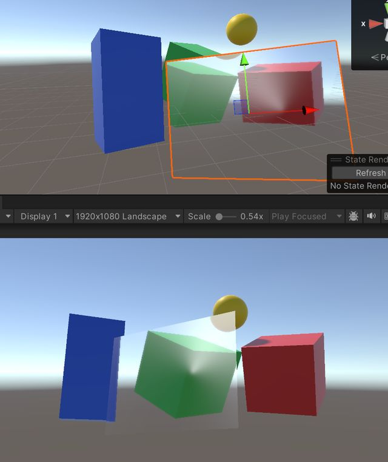

> After I wrote [“Cockpit 3D HMI Scenes: A Frosted Glass Material Scheme with Optimized Global Blur”](https://mp.weixin.qq.com/s/hx1XGh2fdBDcPpxR8GJXRQ), a friend commented that they wanted to see something on liquid glass. However, I have never used liquid glass in a project deliverable, so this article is a record made in the spirit of learning and exploration.

Apple unveiled the "Liquid Glass" design language at WWDC 2025. It looks similar to frosted glass, but far surpasses ordinary frosted glass in richness of detail and sense of premium quality.

The core of liquid glass is a three-layer structure: a base refraction layer, an edge refraction-and-reflection layer, and a surface highlight layer; only with the three layers working together does it present a realistic glass feel.

> The most obvious difference between liquid glass and ordinary frosted glass should lie in the edge quality. Ordinary frosted glass has only uniform blur, while liquid glass has its own light refraction and reflective quality in the edge region — the edges carry far more visual layering than the center.

That said, as I understand it, liquid glass belongs to the material domain of UI widgets and is not a common requirement in my scene. So my current attempt still starts from a 3D object to reproduce it, without using UGUI components.



---

## Layer 1: The Base Refraction Layer

The base refraction layer's job is to sample the background image and blur it. It does two things at once: sample the sharp background with a normal-driven refraction offset, and obtain a blurred background with a multi-tap Box Blur, then blend between the two.

The refraction offset is computed on the same principle as in the transparent glass article. The difference is that transparent glass samples only the sharp background, while liquid glass, on top of the sharp sample, also performs an 8-tap Box Blur (one sample each in the up/down/left/right directions plus the four diagonal directions, then averaged) to get the blurred version.

One design point in the blending: a Fresnel edge mask (edgeMask) controls the blend ratio. In the center, edgeMask is close to 0, so the sharp background dominates (you can see what's behind clearly); at the edges, edgeMask is close to 1, so the blurred background dominates (a sense of wrapping). This "sharp center, blurred edge" gradient is the visual signature of liquid glass's base layer.

After blending, a base-color tint (_BaseColor) is layered on, giving the glass a slight color lean rather than being completely colorless.

Illustrative code:

```hlsl
// Refraction offset: normal XY × (IOR - 1) × factor
float2 refractionOffset = finalNormal.xy * (_IOR - 1.0) * 0.05;
float2 refractionUV = screenUV + refractionOffset;

// Sharp background sampling
float3 clearColor = SAMPLE_TEXTURE2D(_BackgroundTex, sampler_BackgroundTex, refractionUV).rgb;

// 8-tap Box Blur blurred background sampling
float2 texel = _BackgroundTex_TexelSize.xy * _BlurIntensity;
float3 blurColor = float3(0, 0, 0);
blurColor += SAMPLE_TEXTURE2D(_BackgroundTex, sampler_BackgroundTex, refractionUV + float2(texel.x, 0)).rgb;
blurColor += SAMPLE_TEXTURE2D(_BackgroundTex, sampler_BackgroundTex, refractionUV - float2(texel.x, 0)).rgb;
blurColor += SAMPLE_TEXTURE2D(_BackgroundTex, sampler_BackgroundTex, refractionUV + float2(0, texel.y)).rgb;
blurColor += SAMPLE_TEXTURE2D(_BackgroundTex, sampler_BackgroundTex, refractionUV - float2(0, texel.y)).rgb;
blurColor += SAMPLE_TEXTURE2D(_BackgroundTex, sampler_BackgroundTex, refractionUV + float2(texel.x, texel.y)).rgb;
blurColor += SAMPLE_TEXTURE2D(_BackgroundTex, sampler_BackgroundTex, refractionUV - float2(texel.x, texel.y)).rgb;
blurColor += SAMPLE_TEXTURE2D(_BackgroundTex, sampler_BackgroundTex, refractionUV + float2(-texel.x, texel.y)).rgb;
blurColor += SAMPLE_TEXTURE2D(_BackgroundTex, sampler_BackgroundTex, refractionUV + float2(texel.x, -texel.y)).rgb;
blurColor /= 8.0;

// Use edgeMask to control the blend: sharper toward the center, blurrier toward the edges
float blurMix = lerp(_BlurMix * 0.3, _BlurMix, edgeMask);
float3 layer1 = lerp(clearColor, blurColor, blurMix);

// Base color tint
layer1 = lerp(layer1, layer1 * _BaseColor.rgb, _BaseColor.a);
```

---

## Layer 2: The Edge Refraction and Reflection Layer

This is what distinguishes liquid glass from ordinary frosted glass. It only takes effect in the panel's edge region, controlled via edgeMask: 0 at the center (not rendered), 1 at the edges (fully rendered).

Stronger refraction sampling: the refraction offset factor is larger than in Layer 1 (0.15 vs 0.05), producing more pronounced background distortion at the edges, simulating the greater light bending caused by the glass's higher-curvature rim.

Edge reflection: a power function over the dot product of the reflection direction and the light direction produces the highlight, simulating the reflective quality of the glass edge under ambient light.

After the two are summed, the result is masked by edgeMask, ensuring it is visible only in the edge region.

Illustrative code:

```hlsl
// Edge refraction: a stronger offset than Layer 1
float2 edgeRefractionOffset = finalNormal.xy * (_IOR - 1.0) * 0.15 * _EdgeRefractionIntensity;
float3 edgeRefraction = SAMPLE_TEXTURE2D(_BackgroundTex, sampler_BackgroundTex, screenUV + edgeRefractionOffset).rgb;

// Edge reflection: reflection direction × light direction
float3 reflectDir = reflect(-viewDirWS, finalNormal);
float edgeReflection = pow(max(dot(reflectDir, normalize(_LightDir.xyz)), 0.0), 8.0);
edgeReflection *= _EdgeReflectionIntensity;

// Mask with edgeMask after summing
float3 layer2 = edgeRefraction + edgeReflection * _EdgeColor.rgb;
layer2 = lerp(float3(0, 0, 0), layer2, edgeMask);
```

---

## Layer 3: The Surface Highlight Layer

With this layer, the glass surface gains a highlight spot lit by the light source. Take the half-vector between the light direction and the view direction, dot it with the normal, and apply a power function to get a sharp highlight point. The highlight's color, intensity, and sharpness are all tunable via parameters.

On top of the main light highlight, a top ambient-light highlight band is added, simulating ambient light from above reflecting off the glass surface. This band makes the glass look like it sits in an environment with overhead lighting.

Illustrative code:

```hlsl
// Highlight: normal × half-vector
float3 lightDir = normalize(_LightDir.xyz);
float3 halfDir = normalize(lightDir + viewDirWS);
float specHighlight = pow(max(dot(finalNormal, halfDir), 0.0), _SpecPower);
specHighlight *= _SpecIntensity;

// Top ambient-light highlight band
float topGloss = pow(max(dot(finalNormal, float3(0, 1, 0)), 0.0), 5.0) * 0.3;

float3 layer3 = _SpecColor.rgb * specHighlight + float3(1, 1, 1) * topGloss;
```

---

## Compositing the Three Layers

The final color comes from additively stacking the three layers. After compositing, a Fresnel edge highlight and a color tint are layered on to round out the overall effect.

The interaction response computes, in the fragment shader, the distance from the current pixel to the touch point and produces a normal deformation with distance-based falloff. Once this deformation is added to the normal, it simultaneously affects Layer 1's refraction offset, Layer 2's edge refraction direction, and Layer 3's highlight position — realizing an interactive effect.

Illustrative code:

```hlsl
// Touch deformation (computed before the three layers)
float distToTouch = distance(worldPos, _TouchPos.xyz);
float touchFalloff = saturate(1.0 - distToTouch / _TouchRadius);
float3 touchDir = normalize(worldPos - _TouchPos.xyz + float3(0.001, 0.001, 0.001));
float3 finalNormal = normalize(normalWS + touchDir * touchFalloff * _TouchIntensity * 0.5);

// Compositing the three layers
float3 finalColor = layer1 + layer2 + layer3;
finalColor = lerp(finalColor, finalColor * _Tint.rgb, _Tint.a);
finalColor += _EdgeColor.rgb * fresnel * 0.2;
```

---

## Conclusion

Treat the above as reference material; I hope it proves useful to Duanxx.

This reminds me of an earlier feature contest over the Launcher's horizontal-row cards. In the proposal from the interaction design colleagues at the time, the home-screen cards needed a frosted-glass-like feel. But the car-model home screen's visuals are provided by the 3D side; if the cards had been handed to native Android development, it would have been troublesome and difficult.

So it was handed to the 3D team instead. Compared with what the earlier frosted glass article described: no UV offset, no Fresnel edge transition; being a 2D UI like a card, there is naturally no normal map, and no environment reflection sampling was added either. I think the things we chose not to do here can serve as a reference for a 2D frosted glass.