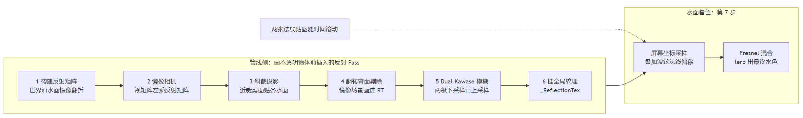

> 有的车模桌面在HMI设计上，会在场景中设计一个水面，利用这种方式，让整个场景的空间感更广阔，细节更多，动感更强。虽然用的不多，但我想去复盘这类水体的做法。





# 了解方案

水面反射在 URP 管线下有几个可参照的方案：

- Boat Attack：这个是Unity官方出了示例游戏。
- Stylized Water：风格化水体渲染商业插件。
- Crest Ocean System：高度逼真海洋场景生成插件。

从这几款示例项目/插件来看，平静水面基本都选平面反射，比如 Boat Attack 和 Stylized Water 。平面反射，就是将整个场景用一台虚拟相机重新渲染一遍，存成反射图，用于水面着色时采样的办法。

 Crest 创造的是起伏海浪，水面本身有顶点动画，平面反射用不了，用的是实时反射探针。依靠探针形成立方体贴图提供近似反射。

至于屏幕空间反射（SSR），它们并不使用或不作为主方案使用。屏幕空间反射不额外渲染一遍场景，仅凭当前帧的数据计算，只能反射屏幕内看得见的内容。

# 方案选择

回到我们自己的环境约束。Launcher的水面有三个前提：

**一，水面是纯平面。** 几何上一动不动，波纹靠法线贴图在像素层扰动。这意味着平面反射的假设是满足的。

**二，俯视视角。** 相机大部分时间从斜上方看水，视线反射方向大量朝向天空和屏幕外。屏幕空间反射恐难满足。

**三，车机硬件性能。** 反射图的性能消耗成本需要可调节。

所以选择和业内主流一致：平面反射。剩下的工作是**控制成本。**

# 实现过程


**1. 构建反射矩阵**

```csharp
// 平面四元组：法线 + 平面到原点的距离
Vector4 plane = new Vector4(up.x, up.y, up.z,
    -Vector3.Dot(up, position) - heightOffset);
reflectionMatrix = CalculateReflectMatrix(plane);
```

水面就是一面无限大的镜子，反射矩阵的作用就是把世界沿这面镜子翻个面。实现上是标准的平面反射推导。实际渲染时，反射范围受限于相机视锥体。`heightOffset` 参数可以让反射平面相对水面上下微调。

**2. 镜像世界里的相机**

```csharp
Matrix4x4 reflWorldToCam = originWorldToCam * reflectionMatrix;
```

不会真的去创建一个Camera物体或是组件。把主相机的视矩阵左乘反射矩阵，等于把相机搬进镜像世界，用这套矩阵渲染，画出来的就是水面该映出的画面。

**3. 斜截投影，裁掉水下**

```csharp
Vector4 clipNormal = reflWorldToCam.MultiplyVector(planeUp);
Vector4 clipPlane = new Vector4(clipNormal.x, clipNormal.y, clipNormal.z,
    -Vector3.Dot(reflWorldToCam.MultiplyPoint(positionOnPlane), clipNormal));
var oblique = clipPlane * (2.0f / Vector4.Dot(clipPlane,
    refProjection.inverse * new Vector4(sgn(clipPlane.x), sgn(clipPlane.y), 1f, 1f)));
refProjection[2]  = oblique.x - refProjection[3];
refProjection[6]  = oblique.y - refProjection[7];
```

镜像相机从水下往上拍，为了让倒影里不出现水下内容，做法是把投影矩阵的近裁剪面掰到和水面对齐，让近裁剪面正好贴在水面上。这个被叫做斜切近裁剪面。

Unity内置的 Camera.CalculateObliqueMatrix(clipPlane) 是上面操作的封装，可以直接得到。

**4. 翻转背面剔除**

```csharp
cmd.SetViewProjectionMatrices(reflWorldToCam, refProjection);
cmd.SetInvertCulling(true);
cmd.DrawRendererList(context.CreateRendererList(ref rendererListParams));
```

这里开始写命令缓冲了：设置视投影矩阵，打开背面剔除翻转，绘制一批物体。镜像变换之后，三角面的顶点排序会反过来，原来顺时针排序的正面，镜像后变逆时针，以为是背面就会剔除，那整个镜像世界就外翻了。所以要开翻转背面剔除，把剔除规则也反过来。

**5. Dual Kawase 模糊**

```csharp
// 两级下采样再两级上采样，共四趟全屏 blit，结果写回原 RT
cmd.SetGlobalFloat(BlurOffsetX, blurRadiusH * blurRadius);
cmd.SetGlobalFloat(BlurOffsetY, blurRadiusV * blurRadius);
DrawFullScreenTriangle(cmd, reflRT, blurTempRT[0], blurMat, 1);   // 全分辨率 → 1/2
DrawFullScreenTriangle(cmd, blurTempRT[0], blurTempRT[1], blurMat, 1);   // 1/2 → 1/4
DrawFullScreenTriangle(cmd, blurTempRT[1], blurTempRT[0], blurMat, 2);   // 1/4 → 1/2
DrawFullScreenTriangle(cmd, blurTempRT[0], reflRT, blurMat, 2);   // 1/2 → 全分辨率
```

反射图还要做一次模糊，这里用的是 Dual Kawase。

**6. 结果挂到全局纹理**

```csharp
cmd.SetGlobalTexture(ReflectionTexID, m_FRPCamera.planarReflectionRTHandle.nameID);
```

渲染完的 RT 用 `SetGlobalTexture` 赋值给全局纹理 `_ReflectionTex` 上。挂引用发生在模糊之前，而 Dual Kawase 的最后一趟把模糊结果写回的就是同一张 RT，全局引用不需要更新。

**7. 水面按屏幕坐标采样**

```hlsl
// 屏幕坐标即采样坐标：反射相机与主相机共享投影
float2 reflUV = screenUV.xy / screenUV.w;

// 波纹扰动：法线的 y 分量直接叠加到采样坐标上，倒影跟着水波晃
reflUV += N.y;

float3 reflection = SAMPLE_TEXTURE2D(_ReflectionTex, sampler_ReflectionTex, reflUV).rgb;

// Fresnel：俯视水面时以水色为主，贴着水面看时反射占主导
float fresnel = pow(1.0 - saturate(dot(N, V)), 4.0);
float3 col = lerp(waterColor, reflection, fresnel);
```

水面像素在反射图里的采样坐标就是它自己的屏幕坐标，不需要换算，因为反射相机和主相机共享同一个投影，唯一的差别是视矩阵翻了面。

在这个基础上，采样坐标会叠加一个微小的偏移，让倒影跟着水波一起晃动。偏移量来自水面法线，具体的法线怎么算、波纹怎么动，下一章讲。

最后引入 Fresnel：正视水面时反射很弱，视线越贴近水面，反射越强。来lerp出最终的像素颜色值。

# 水波扰动

水面的波纹没有顶点动画，mesh始终是平的，波动发生在法线贴图层面：

```hlsl
// UV 源是世界坐标 XZ（不依赖网格 UV，所以平铺值都是小数）
// 两个 Tiling And Offset 节点：平铺一正一负，同一个滚动速度下流向相反
float2 uv1 = worldPos.xz * _NormalTiling1 + _Time.y * _OffsetSpeed;
float2 uv2 = worldPos.xz * _NormalTiling2 + _Time.y * _OffsetSpeed;
float3 N = NormalStrength(
    BlendNormal(UnpackNormal(SAMPLE_TEXTURE2D(_Normal_Map, uv1)),
                UnpackNormal(SAMPLE_TEXTURE2D(_Blend_Map, uv2))),
    _NormalMapStrength);
```

具体做法是用两张法线贴图叠加：_Normal_Map 和 *Blend*Map，平铺系数分别是 0.05 和 -0.05，然后以同一个 _OffsetSpeed 随时间滚动。用两张是为了制造不重复的波纹感。算出来的N，它的 y 分量直接叠加到反射采样坐标。

# 结语

之前说到成本要控制，主要是通过：反射图分辨率缩放（0.1 到 1.0 倍），参与反射的物体按layer裁剪。或者也可以只渲染指定的几个 Layer（比如天空盒 + 远处山脉），拼一个近似倒影。最狠的就是如果不存在交互上穿帮的隐患，那就预先烘好一张静态反射图存在贴图里，连这一遍渲染都省掉。