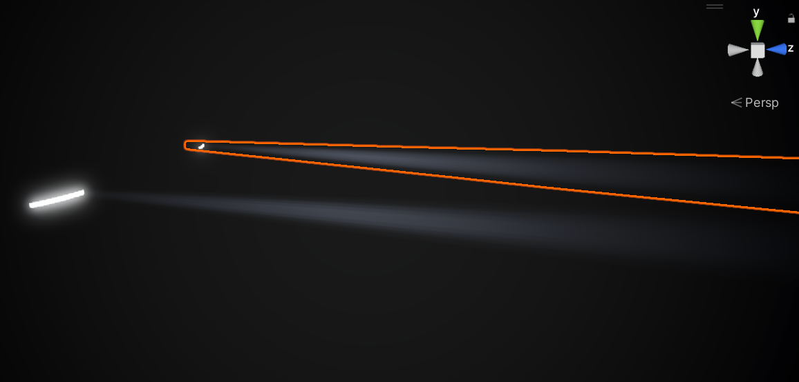
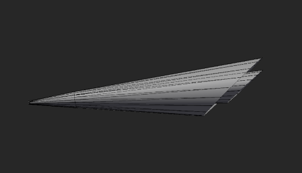

> On the 3D HMI car-model home screen, glowing car lights and light beams are a very common sight. Especially in night mode, they need to convey a clear sense of "light shining". From a design standpoint, car lights must express three key points: the light lens switching on/off, the volumetric feel of the beam, and dust drifting through the air.

The solution presented in this article: **1 cone-shaped mesh + 1 custom shader + a screen-space noise texture**.

The core idea is fairly simple:

- Place a cone-shaped mesh in front of the light lens
- Render it with a transparent shader, simulating light illuminating dust in the air
- Sample the noise texture with screen-space UVs to create the flowing feel of dust



# 1. The Light Beam

## 1. The Mesh

Use a somewhat squashed cone-shaped mesh: a small cone nested inside a parent cone.

> This is so that, under the influence of the shader described below, the inner beam appears brighter and the outer one dimmer, creating a sense of layered depth.

The mesh has a few hundred triangles.



## 2. The Shader

### (1) Vertex Shader

#### Basic Transform

First the standard vertex transform and direction computation:

```hlsl
v2f vert (a2v v)
{
    v2f o;
    half4 worldPos = mul(UNITY_MATRIX_M, v.vertex);
    half3 worldDir = UnityObjectToWorldDir(half3(-1,0,0));
    
    half3 normal = UnityObjectToWorldNormal(v.normal);
    half3 OutwardNormal = UnityObjectToWorldDir(normalize(half3(0, v.normal.y, v.normal.z)));
    o.viewDir = normalize(WorldSpaceViewDir(v.vertex));
```

This transforms the vertices to world space; `worldDir` serves as the beam's main direction (along the negative X axis, the car light facing forward). Everything else is routine.

#### View-Dependent Deformation

Next comes the view-dependent deformation logic:

```hlsl
    // View-dependent beam spread deformation
    half vd = max(0, dot(o.viewDir, worldDir));
    worldPos.xyz += OutwardNormal * _Spread * (1-v.uv0.x) * v.uv0.x * pow(vd,abs(_SpreadPow));
```

- `vd`: the dot product of the view direction and the beam direction — close to 1 when viewed head-on, close to 0 from the side
- `(1-v.uv0.x) * v.uv0.x`: a parabolic distribution — maximum spread in the middle, zero at both ends
- `pow(vd,abs(_SpreadPow))`: view sensitivity — the larger the exponent, the less view changes matter
- Finally the vertex is offset along `OutwardNormal`, realizing the spread effect

#### Screen-Space UV

Finally the screen-space UV is computed, for dust texture sampling:

```hlsl
    o.worldY = worldPos.y;
    o.vertex = mul(UNITY_MATRIX_VP, worldPos);
    
    // Screen-space UV for dust texture sampling
    o.screenUV = (o.vertex.xy + o.vertex.zz) * _ScreenScale + _Time.xx*_SmokeSpeed;
    
    o.localDir = worldDir;
    o.normalDir = normal;
    o.uv0 = v.uv0;
    o.uv1 = v.uv1;
    return o;
}
```

The key here is the `screenUV` computation: adding the `o.vertex.zz` depth information makes distant samples offset more, producing parallax — when the camera moves, near and far dust move at different speeds, which gives a sense of depth. And `_Time.xx*_SmokeSpeed` makes the UV coordinates change over time, so the noise texture sampling position keeps shifting, realizing the flowing-dust effect.

### (2) Fragment Shader

#### Texture Sampling

The fragment shader first samples the noise and mask textures:

```hlsl
fixed4 frag (v2f i) : SV_Target
{
    // Sample the noise texture for the dust effect
    fixed alpha = min(1, tex2D(_NoiseTex, i.screenUV)+_SmokeInten).r;
    fixed mask = tex2D(_MaskTex, i.uv1).r;
    
    fixed3 viewDir = normalize(i.viewDir);
    fixed3 normal = normalize(i.normalDir);
    fixed3 localDir = normalize(i.localDir);
```

- `alpha`: noise sampled from screen-space UVs, plus the base dust intensity
- `mask`: the mask texture's purpose is to give the beam a gradient — making the beam transparent in the region near the light lens.

#### Multiple Masks

Then four independent masks are computed:

```hlsl
    // Edge mask: simulates beam edge softening
    fixed edgeMask = pow(max(0, dot(i.normalDir, -i.viewDir)), _EdgePower);
    
    // Distance mask: controls the beam length
    fixed farMask = min(1, i.uv0.x);
    
    // View-dependent brightness adjustment
    fixed vd = dot(viewDir, localDir)*.5 + .8;
    
    // Height mask: keeps the beam from getting too tall
    fixed heightClip = saturate(i.worldY * 2 + _HighCut);
```

- `edgeMask`: the dot product of the normal and view direction; small at the edges, realizing edge softening
- `farMask`: UV.x controls length; the farther, the more transparent
- `vd`: view-dependent brightness; brighter when viewed "head-on" (in fact from directly beside the beam)
- `heightClip`: the world-space Y coordinate limits the height

#### Final Composition

Finally all the masks are multiplied together:

```hlsl
    fixed4 final = _Color;
    final.a = farMask * edgeMask * heightClip * alpha * _Color.a * _LightInten * vd * mask;
    return final;
}
```

The alpha is the product of all masks; any mask being 0 makes that pixel fully transparent.

### (3) Blend Mode

```
Blend SrcAlpha One  // Additive blending
ZWrite Off          // No depth writes
Cull Off            // Two-sided rendering
```

- Additive blending: beams get brighter when overlapped
- No depth writes: avoids occluding objects behind
- Two-sided rendering: visible from any angle

## 2. The Light Lens

For the light lens, any material whose shader has the ISEMISSION property and supports emission will do. It needs to be paired with the Volume's Bloom post-processing effect for the glow to show up.

Below is the script that toggles the light lens on/off; it controls the lens's emission state via the shader keyword `_ISEMISSION_ON`, working together with the beam:

```csharp
public class LightEffectController : MonoBehaviour
{
    public Material lightMaterial;
    private bool _isLightOn = false;
    
    public void SetLightState(bool isOn)
    {
        _isLightOn = isOn;
        if (lightMaterial != null)
        {
            if (_isLightOn)
            {
                lightMaterial.EnableKeyword("_ISEMISSION_ON");
            }
            else
            {
                lightMaterial.DisableKeyword("_ISEMISSION_ON");
            }
        }
    }
}
```

## Conclusion

This volumetric light solution is not complicated to implement. The core is using screen-space noise and time parameters to set the dust in motion — the beam stops being a rigid piece of geometry and becomes light with a dynamic feel. This kind of detail polishing is a rather enjoyable process.