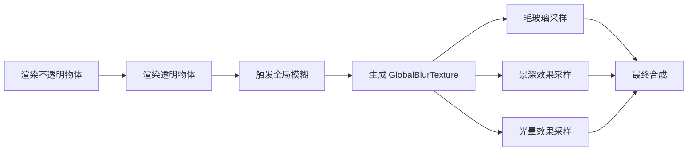

> 之前文章写了毛玻璃和透明玻璃的材质实现，它们都依赖一个基础：全局模糊纹理。模糊是很多后处理效果的基础，毛玻璃、景深、径向模糊、边缘光晕都需要它。

传统的高斯模糊需要多次采样，性能开销大，车机端一般是不会采用这种方式的。之前交付的项目都采用的是 **Dual Kawase Blur**，一个在业内广泛使用的高性能模糊方案，比高斯模糊快，同时保持不错的视觉效果。

---

## 一、从需求出发

在座舱3D HMI的场景中，玻璃效果要在**透明物体渲染完成后**才开始工作。那能不能在渲染玻璃的时候再独自计算模糊呢？

如果每个玻璃物体都自己算一遍模糊，在车机 GPU 上，每多一次纹理采样，就多一次带宽消耗。如果屏幕分辨率是 1080p，一轮 5×5 高斯模糊就要采样5千万次像素。

所以我们不能独立运算，而是要：**把模糊做成一个公共服务**。在渲染管线的特定阶段，对整个屏幕做一次全局模糊，把结果注册为全局纹理 `_GlobalBlurTexture`。所有需要模糊效果的地方都来采样这张图，相当于"算一次，用多次"。



这个流程在代码中是通过 URP Renderer Feature 实现的：设置为在透明物体渲染后触发，通过 7 个 Shader Pass 生成模糊结果，然后用 `cmd.SetGlobalTexture("_GlobalBlurTexture", result)` 注册为全局纹理。

那么用高斯模糊做这个全局模糊，性能够不够？

---

## 二、到算法中去

直观上想，模糊就是把每个像素的颜色"抹匀"到周围像素。传统的高斯模糊是对每个像素周围一圈像素做加权平均，离中心越近的像素权重越高。

然而它采样次数太多了。一个 5×5 的模糊核就需要采样 25 次周围像素。如果优化做法，是把它拆成两次：先横向模糊一次，再纵向模糊一次。这样采样次数能从 25 次降到 10 次（5 次横向 + 5 次纵向）。即便如此，在车机端还是很吃力，而很可能在使用时高斯模糊需要做多轮迭代运算才能满足效果要求。

示意代码（传统高斯模糊）：

```hlsl
// 可分离高斯模糊：先横向，再纵向
// 横向 Pass
float weights[5] = {0.0545, 0.2442, 0.4026, 0.2442, 0.0545};
float3 horizontalBlur = float3(0, 0, 0);
for (int i = 0; i < 5; i++)
{
    float2 sampleUV = uv + float2(_MainTex_TexelSize.x * (i - 2), 0);
    horizontalBlur += SAMPLE_TEXTURE2D(_MainTex, sampleUV).rgb * weights[i];
}

// 纵向 Pass（用横向结果作为输入）
float3 verticalBlur = float3(0, 0, 0);
for (int i = 0; i < 5; i++)
{
    float2 sampleUV = uv + float2(0, _MainTex_TexelSize.y * (i - 2));
    verticalBlur += SAMPLE_TEXTURE2D(_HorizontalResult, sampleUV).rgb * weights[i];
}
```

能不能用更少的采样次数达到类似的模糊效果？

---

## 三、Dual Kawase 算法

Dual Kawase Blur 的思路是：**先把图像缩小，模糊，再放大回去**。

比如，把一张 1920×1080 的图缩小到 240×135（1/8 分辨率），像素数量只有原来的 1/64。在这个小图上做模糊，带宽消耗大幅降低。然后再把模糊后的小图放大回原分辨率，就得到了一个大致模糊的结果。

**第一步：降采样（DownSample）**
从原分辨率逐步缩小到最小层级。每次缩小后采样当前像素及其对角线方向的 4 个像素，用加权平均得到模糊结果。可以看出，一边降一边就模糊了。

示意代码（降采样）：

```hlsl
// 采样当前像素和对角线方向的 4 个像素
float2 halfPixel = _SourceTex_TexelSize.xy * 0.5;
float2 offset = float2(_BlurOffsetX, _BlurOffsetY);  // 模糊半径

float2 uv1 = uv - halfPixel * offset;  // 左上角
float2 uv2 = uv + halfPixel * offset;  // 右下角
float2 uv3 = uv - float2(halfPixel.x, -halfPixel.y) * offset;  // 左下角
float2 uv4 = uv + float2(halfPixel.x, -halfPixel.y) * offset;  // 右上角

// 中心权重高（×4），四角权重低（×1），总和除以 8
half4 sum = SAMPLE_TEXTURE2D(_SourceTex, uv) * 4;
sum.rgb += SAMPLE_TEXTURE2D(_SourceTex, uv1).rgb;
sum.rgb += SAMPLE_TEXTURE2D(_SourceTex, uv2).rgb;
sum.rgb += SAMPLE_TEXTURE2D(_SourceTex, uv3).rgb;
sum.rgb += SAMPLE_TEXTURE2D(_SourceTex, uv4).rgb;
sum.rgb *= 0.125f;  // (4+1+1+1+1)/8 = 1
```

**第二步：升采样（UpSample）**
从最小层级逐步放大回原分辨率。每次放大时采样周围 8 个像素，四条边上各取一个像素，四个角上各取两个像素。这里也是，一边升一边又做了模糊。

示意代码（升采样）：

```hlsl
// 采样 3×3 网格的 9 个像素，角落权重更高
float2 halfPixel = _SourceTex_TexelSize.xy * 0.5;
float2 offset = float2(_BlurOffsetX, _BlurOffsetY);

// 四个方向的扩展采样
float2 uv1 = uv + float2(-halfPixel.x * 2.0, 0.0) * offset;
float2 uv2 = uv + float2(-halfPixel.x, halfPixel.y) * offset;
float2 uv3 = uv + float2(0.0, halfPixel.y * 2.0) * offset;
float2 uv4 = uv + halfPixel * offset;
// ... 还有 5 个采样点

// 四个中间点权重 ×2，角落点权重 ×1
half4 sum = SAMPLE_TEXTURE2D(_SourceTex, uv1) * 1.0;
sum.rgb += SAMPLE_TEXTURE2D(_SourceTex, uv2) * 2.0;
sum.rgb += SAMPLE_TEXTURE2D(_SourceTex, uv3) * 1.0;
sum.rgb += SAMPLE_TEXTURE2D(_SourceTex, uv4) * 2.0;
// ... 剩余 5 个采样点
sum.rgb *= 0.0833;  // 1/12
```

权重分布是：四条边中间的像素权重为 2，四个角的像素权重为 1。这样设计是因为需要更平滑的过渡，边上的像素对过渡贡献更大，所以权重更高。

降采样本身就是一种模糊，然后再升采样做第二次模糊，相当于"两次模糊叠加"，效果更平滑。

---

## 四、工程优化：Pass 链和对数编码

但光有 Dual Kawase 还不够。高亮区域（比如车灯）的颜色值可能非常大，直接做模糊容易产生不自然的光晕。

所以实际的 Shader 实现了一个 7 个 Pass 的链式流程：

```mermaid
flowchart LR
    A[原图] --> B[Pass 0: Copy<br/>拷贝到临时纹理]
    B --> C[Pass 1: DownSample<br/>第一次降采样]
    C --> D[Pass 2: DownSampleEncode<br/>对数编码<br/>log(1+color)]
    D --> E[Pass 3: UpSample<br/>升采样]
    E --> F[Pass 4: UpSampleCompose<br/>混合结果]
    F --> G[Pass 5: UpSample Mipmap<br/>利用 Mipmap 金字塔]
    G --> H[Pass 6: Decode<br/>对数解码<br/>exp(color)-1]
    H --> I[最终模糊纹理]
```

关键设计：

**1. 对数编码防溢出**
DownSampleEncode Pass 做了 `log(1 + color)` 变换，高亮区域的值被压缩到对数空间，模糊时不会溢出。Decode Pass 再用 `exp(color) - 1` 还原。

> 这个原理是：对数函数能把大值压缩到小值，比如 1000 压缩成约 6.9，指数函数再还原回来。

示意代码（对数编码）：

```hlsl
// DownSampleEncode Pass：压缩动态范围
half4 Frag_DownSampleEncode(const V2F_DownSample input) : SV_TARGET
{
    // ... 模糊计算逻辑 ...
    sum.rgb = log(1.0 + max(sum.rgb, 0.0));  // 对数压缩
    sum.rgb = clamp(sum.rgb, 0.0, 12.0);    // 防止溢出
    return sum;
}

// UpSampleDecode Pass：还原动态范围
half4 Frag_UpSampleDecode(const V2F_UpSample input) : SV_TARGET
{
    // ... 模糊计算逻辑 ...
    sum.rgb = exp(sum.rgb) - 1.0;           // 指数还原
    sum.rgb = min(sum.rgb, 65504.0);        // FP16 安全
    return sum;
}
```

**2. Mipmap 金字塔模糊**
UpSample Mipmap Pass 利用 GPU 自带的 Mipmap 机制。降采样后的纹理是含有多级 Mipmap的，每一级都是上一级的自然模糊。升采样时直接采样对应级别的 Mipmap ，相当于"免费的"模糊操作。

示意代码（Mipmap 采样）：

```hlsl
half _SourceMipLevel;  // 从 C# 传入的 Mipmap 级别

half4 Frag_UpSampleMip(const V2F_UpSample input) : SV_TARGET
{
    float2 mipTexelSize = _SourceTex_TexelSize.xy * exp2(_SourceMipLevel);
    // ... 偏移量计算 ...
    
    // 直接采样指定 Mipmap 级别，利用 GPU 的硬件优化
    half4 sum = SAMPLE_TEXTURE2D_LOD(_SourceTex, uv1, _SourceMipLevel);
    sum.rgb += SAMPLE_TEXTURE2D_LOD(_SourceTex, uv2, _SourceMipLevel).rgb * 2.0;
    // ... 其他采样点 ...
    sum.rgb *= 0.0833;
    return sum;
}
```

**3. 迭代增强**
可以通过多次执行 DownSample→UpSample 循环来增强模糊强度。

---

## 五、部署配置（Tuanjie）

### 1. 准备 Shader 文件

创建三个文件：
- `DualKawaseBlur.shader`：定义 7 个 Pass
- `DualKawaseBlur.hlsl`：核心算法实现
- `DualKawaseBlurRendererFeature.cs`：URP Renderer Feature

### 2. 创建 Renderer Feature

在 URP Renderer Data 中添加一个自定义 Render Feature：

```csharp
public class DualKawaseBlurRendererFeature : ScriptableRendererFeature
{
    [SerializeField] private Shader blurShader;
    [SerializeField] private int downsampleIterations = 3; //控制降采样次数，值越大模糊越强
    [SerializeField] private float blurOffset = 2.0f; //控制模糊半径，通常设置为 2.0-3.0
    
    private Material blurMaterial;
    private DualKawaseBlurPass blurPass;
    
    public override void Create()
    {
        blurMaterial = new Material(blurShader);
        blurPass = new DualKawaseBlurPass(blurMaterial, downsampleIterations, blurOffset);
        blurPass.renderPassEvent = RenderPassEvent.AfterRenderingTransparents;
    }
    
    public override void AddRenderPasses(ScriptableRenderer renderer, ref RenderingData renderingData)
    {
        renderer.EnqueuePass(blurPass);
    }
}
```

### 3. 设置全局纹理

在 Render Pass 中执行模糊后，注册为全局纹理：

```csharp
public class DualKawaseBlurPass : ScriptableRenderPass
{
    private Material blurMaterial;
    private int iterations;
    private float offset;
    
    public override void Execute(ScriptableRenderContext context, ref RenderingData renderingData)
    {
        CommandBuffer cmd = CommandBufferPool.Get("Dual Kawase Blur");
        
        // 创建降采样纹理（1/8 分辨率）
        RenderTextureDescriptor desc = renderingData.cameraData.cameraTargetDescriptor;
        desc.width /= 8;
        desc.height /= 8;
        desc.useMipMap = true;
        
        RenderTexture downsampled = RenderTexture.GetTemporary(desc);
        RenderTexture upsampled = RenderTexture.GetTemporary(renderingData.cameraData.cameraTargetDescriptor);
        
        // 执行模糊 Pass 链
        cmd.Blit(sourceTexture, downsampled, blurMaterial, 1);  // DownSample
        cmd.Blit(downsampled, upsampled, blurMaterial, 3);      // UpSample
        
        // 注册为全局纹理，供所有 Shader 采样
        cmd.SetGlobalTexture("_GlobalBlurTexture", upsampled);
        
        context.ExecuteCommandBuffer(cmd);
        CommandBufferPool.Release(cmd);
    }
}
```

### 4. 在 Shader 中使用

任何需要模糊效果的 Shader 都可以直接采样全局纹理：

```hlsl
TEXTURE2D(_GlobalBlurTexture);
SAMPLER(sampler_GlobalBlurTexture);

// 在 Fragment Shader 中采样
float4 blurredBG = SAMPLE_TEXTURE2D(_GlobalBlurTexture, screenUV);
finalColor.rgb = lerp(blurredBG.rgb, originalColor.rgb, fresnel);
```

---

##结语
全局模糊这种Render Feature很常见，也很容易找到资源，但是了解它的机制对于了解图像的渲染过程和一些精妙的数学原理很有帮助。过段时间不看，咱可能也不一定能记得住具体的hlsl是怎么写的，不过升降采样这种思路大概率会影响我们。
