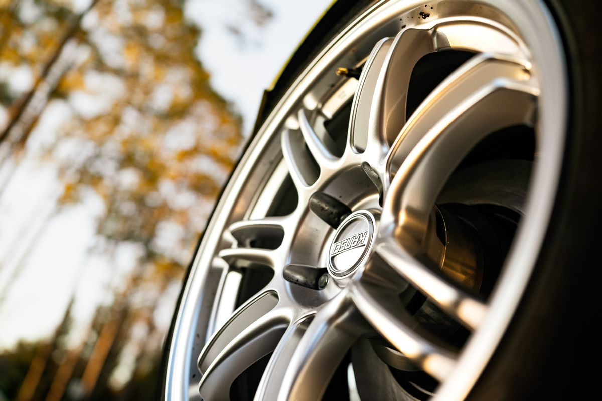
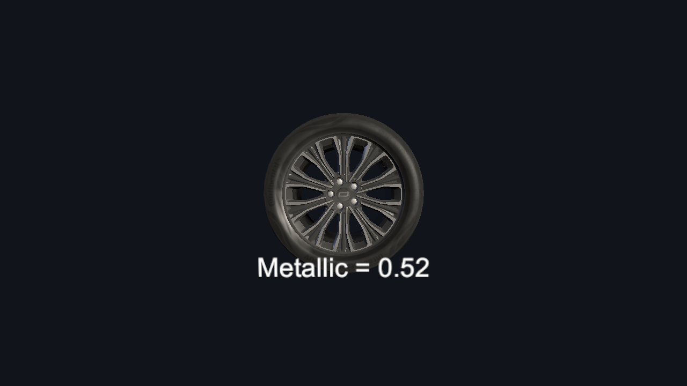
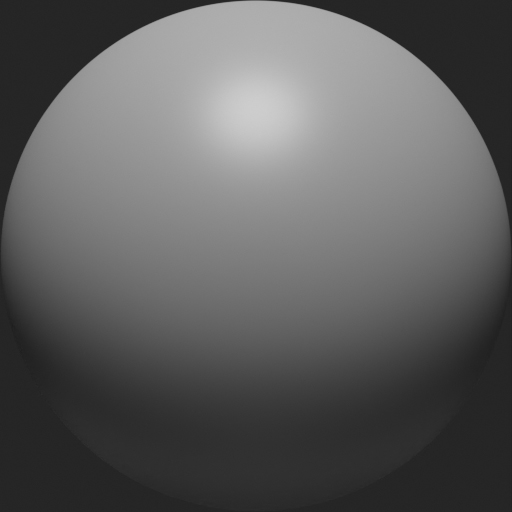
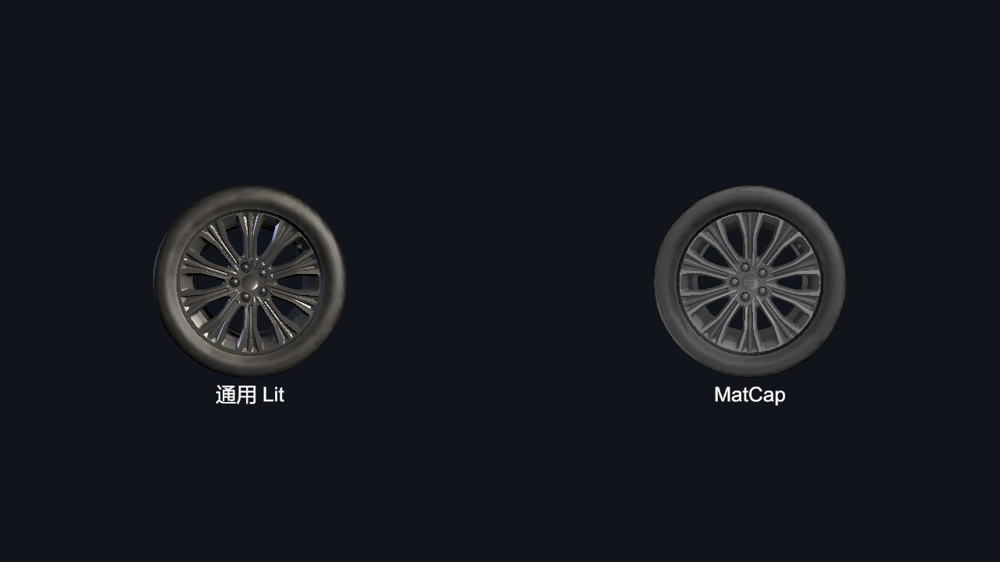

> 我们观察3D车模桌面中车模的渲染效果，除了看车漆材质，还会去关注轮毂。轮毂的金属感和细节，可以明显提升一台车的高级感。但如果做得不好，看上去昏暗而粗糙，也会让人觉得不够真实。



一张真实轮毂的照片，最显眼的就是多辐条铝合金轮毂，阳光从侧面打过来，辐条的抛光面反射出高光，辐条之间的凹陷处呈现深色阴影，轮胎的橡胶近乎纯黑，但近看又能分辨其纹理。我们要做的，就是把这些要点复现出来。

在过往的项目中，车模桌面使用的方案是用通用 Lit 材质调参数实现，SR的方案是用MatCap把反射预先画进贴图，整体内容结构：

*[配图见公众号原文]*

---

# 通用 Lit 方案

第一次做轮毂材质的时候，用的是全车通用，引擎自带的URP Lit 材质。金属感来自 PBR 的参数调整、贴图以及场景光源的部署，即：**Metallic 金属度、Smoothness 光滑度、BaseColor 基础颜色（深灰），法线贴图，AO图**。

## 金属度

金属度是所有参数里最关键的，它直接定义了材质的质感。从Shader代码中可以看到：

```hlsl
half oneMinusReflectivity = OneMinusReflectivityMetallic(metallic);
half3 brdfDiffuse  = albedo * oneMinusReflectivity;       // 漫反射被金属度削弱
half3 brdfSpecular = lerp(kDieletricSpec.rgb, albedo, metallic);       // F0 = lerp(0.04, 本体色, 金属度)
outBRDFData.grazingTerm = saturate(smoothness + reflectivity);    // 掠射边缘，近似菲涅尔

```

第一，**漫反射和金属度成反比**。金属度越高，漫反射越弱，金属本身没有漫反射，光来了直接反射走。

第二，**高光反射的基础色在非金属和本体色之间插值**。`kDieletricSpec.rgb` 是half4 的0.04，就是说非金属的菲涅尔反射率是0.04，金属的菲涅尔反射率就是albedo本体色本身。金属度作为lerp系数，在两者之间按比例过渡。

第三，**掠射边缘由光滑度加反射率共同决定**。

具体到轮毂参数，**0.5** 意味着F0在0.04和深灰色本体色之间大约取一半。反射里掺一半深色底，光泽做了一定收敛，不会像全金属那样把轮辐形状盖掉。



拉到1是什么效果？F0变成了本体色全量，轮辐形状被反射吃掉，看起来像镀铬镜面。压到0呢？只剩漫反射，高光没了，像塑料。半金属恰好卡在中间：有金属的冷光泽，又不丢形状。这就是"钢琴黑"轮毂的质感来源。

*[配图见公众号原文]*

## 光滑度

光滑度决定了这个金属的高光的锐利程度。调低了，高光发散铺开，像磨砂面；调高了，高光变锐，高光过曝。所以一般也给到 0.5 左右，让高光呈现一条清晰的亮带，但又不会过曝成一条白线。

至于代码里的`saturate(smoothness + reflectivity)`，光滑度加反射率，再截取0到1的值。可以把边缘抬亮一圈。"亮边"效果通过这里得到，菲涅尔效应把轮廓描出来。

## 法线和AO贴图

参数可能只能在质感上给一个大体的感觉，真正的细节还需要贴图。

*[配图见公众号原文]*

法线不多赘述了，作用就是表现出**模型表面的凹凸起伏**。

AO图则是为了表现出辐条与辐条之间、辐条和轮毂中心连接处，这些**缝隙的深浅**。这些地方相对更暗一些，AO图通过某一个通道（比如G）来实现：

```
float ResultAO = lerp(1.0, tex2D(_OcclusionMap, uv).g, _Occlusion);
```

缝隙越深，立体感越强，但也不能过头，过了就显得脏。

## 轮胎

轮胎用的也是同一套Lit材质，只是另一组参数：**Metallic 0.2、Smoothness 0.4、近黑底色**。

橡胶是低反射材质，金属度和光滑度都压得比轮毂低。一方面，是因为轮胎的圆弧面很容易收光影响而变得更亮。另一方面，轮胎偏暗，就把视觉对比让给轮毂，体现出层次感。

轮胎如果需要满足呈现出下雨下雪的效果，可以根据车漆材质改。

---

# MatCap 方案

实时反射成本比较高，涉及到环境采样、视角计算。3D桌面这个场景是有这个资格的，但 SR 这种应用，在一帧里面的负载过高，那么反射这里就会考虑是不是能省省。

把环境反射的效果预先存在一张"金属球"贴图里，运行时，用法线方向当成索引去查这张图，这样一次贴图采样就拿到“看起来像反射”的颜色。这就是MatCap方案。



上图就是一张示例的matcap图，它的采样原理是把法线变换到视空间，取 xy 分量缩放平移到 0 到 1，当成 UV 采这张图。按节点图还原的等效代码：

```hlsl
float2 matcapUV = normalViewSpace.xy * 0.5 + 0.5;
float3 matcap = tex2D(_MatCapLookup, matcapUV);
```

正对相机的面采到贴图中心，轮廓处的法线垂直视线，采到贴图边缘。所以这个反射的丰富程度和真实感，很大程度依赖这张 matcap 贴图，你可能需要尝试多张 matcap 贴图的效果，以下是Lit和它的对比，左边通用 Lit 实时算光照，右边换上 SR 模式轮毂的 matcap 材质。



这个方案的代价是反射内容固定，镜头旋转，高光不会像真实反射那样扫过。但对于SR来说这是一笔划算的交易。

---

# 结语

轮毂的最终表现并不完全由材质参数决定，还和场景灯光布置强相关。当前方案里轮毂只受一盏方向光影响，其次就是全局的环境光，环境光配的方案是Gradiant，三种高度对应不同颜色。

