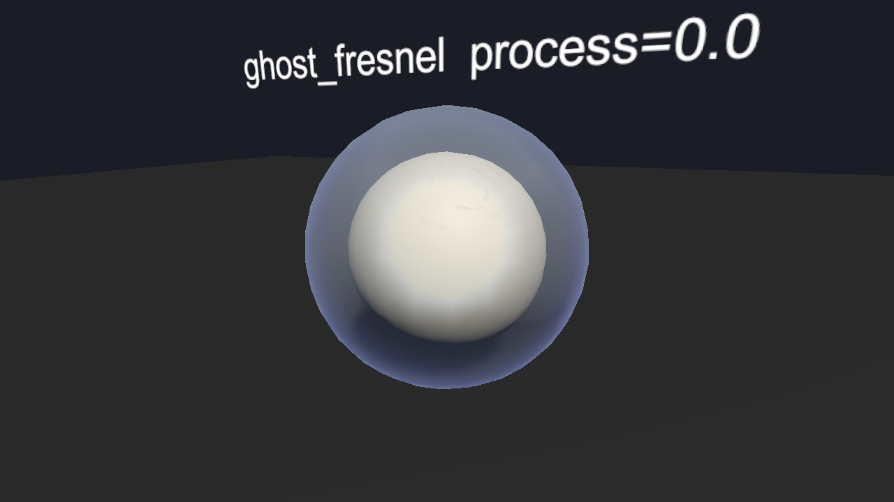

> 很多HMI设计方案，在能源管理界面，会需要让车身呈现出一个半透明的外壳，内腔透明，能看得见电池板。壳的边缘还亮着一圈白蓝。那么这个半透的材质是怎么做的？

为了方便看效果，下面用一个 sphere 代替车模，中间放一颗不透明白球当"电池板"，外面赋上工程里的壳体材质。可以看到：壳体呈蓝灰色半透，把里面的白球罩出一层蔚蓝；外轮廓比中间亮，发白偏蓝；环境反射用了一张程序生成的渐变天空 cubemap。



---

# 一、半透的壳

透明车壳的做法分两步：第一步用 alpha 混合让壳半透，第二步用模板测试确保壳只出现在车身表面，避免“多层皮”的感觉。

## 1. 混合模式与渲染队列

壳体材质的透明选择：

```hlsl
Blend SrcAlpha OneMinusSrcAlpha, One OneMinusSrcAlpha
ZWrite Off
```

渲染队列设在 Geometry 队列之后，Transparent 队列之前，原因是壳体是要罩在车身上，需要和车身混合，介于透明层和不透明层的中间。所以先画不透明的车身和电池，再画壳叠在上面。

本体颜色是一个蓝灰色的 BaseColor，alpha 约 0.3。所以壳呈现出一层"罩在外面"的膜，里面的电池和内饰都能透出来。夜间模式需要更换其他颜色和更低的透明度来表现。

## 2. 模板测试

车壳的显示范围由模板测试控制。这是关键的设计：车壳不决定画哪里，由模板缓冲里的标记决定。

模板缓冲可以理解成一层"遮罩层"，像素能不能画，先看遮罩上对应位置有没有标记模板值。

```
Stencil {
    Ref [_Reference]       // 参考值：拿这个数去和模板缓冲比
    Comp [_Comparison]     // 比较方式：满足什么条件才画
    Pass [_PassFront]      // 通过测试后，模板缓冲要不要更新
}
```

这套材质的默认配置是 Comp = Disabled，比较永远不通过，那么车壳自身的像素都不会画。相当于车壳默认是"关"的。它需要外部先往模板缓冲里写入参考值，然后把车壳的 Comp 改成 Equal。这样壳就只会在"模板缓冲里有标记"的地方画出来。标记是什么形状，壳就是什么形状。

这么设计的好处是壳的形状可以由外部控制，不用改车壳的 mesh，壳的材质本身只负责"长什么样"（半透、边缘光、反射），至于"出现在哪里"，完全交给模板缓冲。

---

# 二、蓝白的光

壳的边缘有一点白、有一点蓝是怎么营造出来的？

## 1. 主菲涅尔

正对着人的面暗，侧面对着人的边亮。 像玻璃球、肥皂泡，边缘总是比中间亮一圈。公式还是菲涅尔的标准公式。

主菲涅尔在这里的作用不是出边缘光，它是控制壳面本身的颜色从哪色过渡到哪色，即本体的颜色变化。它要让正对你的地方偏暗偏灰，边缘偏亮偏蓝。

```
// 主菲涅尔：正对暗，边缘亮
float NdotV = dot(normalWS, viewDirWS);
float fresnelBase = pow(max(1.0 - NdotV, 0.0001), _FresnelPower);

// 用主菲涅尔在内色和外色之间过渡
float3 glassColor = lerp(_GlassInColor * baseColor, baseColor * _GlassOutColor, fresnelBase);
```

_FresnelPower 控制过渡的快慢，值越大，边缘亮带越窄；值越小，亮区越往中间扩散。

## 2. 两条偏移菲涅尔

一条菲涅尔只能出"一圈边"，太单薄了。想要有厚度的光晕，就可以画两条错开的边叠在一起。

那么，把视线方向往旁边偏一点再算一遍菲涅尔，亮边的位置就跟着偏了。两条偏不同方向的亮边叠在一起，边缘就变得更厚重了一些。

```
// 偏移菲涅尔一：深蓝灰，打底的暗边
float3 viewDirOffset1 = normalize(viewDirWS + _ViewDirOffset_One);
float fresnelRim1 = pow(max(1.0 - dot(normalWS, viewDirOffset1), 0.0001), _FresnelPower);
float3 rimColor1 = fresnelRim1 * _FCol_One;

// 偏移菲涅尔二：纯蓝，提色的亮边
float3 viewDirOffset2 = normalize(viewDirWS + _ViewDirOffset_Sec);
float fresnelRim2 = pow(max(1.0 - dot(normalWS, viewDirOffset2), 0.0001), _FresnelPower);
float3 rimColor2 = fresnelRim2 * _FCol_Sec;
```

两条边颜色也不一样：一条赋深蓝灰作为底色，另一条配纯蓝提色。叠出来的效果就是边缘有层次，不是单色一条线。

到这里，三条菲涅尔就齐了：一条管壳面的颜色过渡，两条错开做边缘光。

## 3. 环境反射

光有菲涅尔的话，边缘只是颜色变浅，不会有"发亮"的感觉。那点白来自环境反射。壳的材质采样了一张立方体贴图（cubemap）当环境。

```
// 环境反射：反射向量采样 cubemap
float3 reflDir = reflect(-viewDirWS, normalWS);
float3 envColor = texCUBE(_CubeDay, reflDir);

// 本体色和环境反射按比例混合
float3 bodyColor = lerp(glassColor, envColor, _RefIntensity);
```

正对你的面，反射的是你身后的环境；侧面的面，反射的是侧面的环境。再加上 cubemap 本身上亮下暗的渐变，轮廓上自然就有一圈偏白的高光。

## 4. 可控方向的高光带

有时候美术想让车的某一侧固定有一道亮带（比如右肩一道扫光，展示车的侧面线条），这就需要第四个角色：方向可控的高光带。

给一个自定义的光方向，用 dot(光方向, 法线) 算出哪些面朝光，再过 smoothstep 算出一条亮带：

```
// 自定义方向的高光带
float lightDot = dot(normalWS, _CustomLightDir);
float specBand = pow(saturate(smoothstep(_SpecularRange, _SpecularRange + _EdgeWidth, lightDot)), _CustomDirectLightPow);
float3 specColor = specBand * _Day_SpecularColor;
```

- _SpecularRange：亮带在什么位置出现
- _EdgeWidth：亮带有多宽
- _CustomDirectLightPow：亮带边缘的软硬程度
- _Day_SpecularColor：亮带什么颜色

需要让哪侧亮，就把 _CustomLightDir 摆向哪边。

以上组合起来得到最终颜色：

```
float3 finalColor = bodyColor + rimColor1 + rimColor2 + specColor;
finalColor = clamp(finalColor, 0, _ClampMaxValue);
```

bodyColor 是车壳面底色（主菲涅尔过渡 + 环境反射），两条 rimColor 是错开的边缘光，specColor 是可控方向的高光带。叠在一起就形成了车壳中段是蓝灰的反射色，轮廓一圈泛白偏蓝，美术指定的那一侧还有一道扫光。

---

# 结语

这些设计细节让我觉得挺有意思：看似简单的一个透明壳体的效果，可以因为这样或者那样的真实的需求，而去分出更多层级去添加不同的处理方式，并最终组合起来，形成了在一块画面中不同区域不同的表现结果。