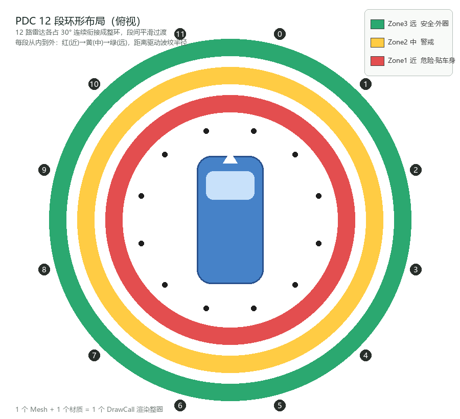

> 泊车距离控制（PDC）用车身 12 个点位的超声波雷达测距，覆盖车身前后左右、内外侧。倒车时，每路雷达上报一个距离值，SR 要把这 12 个距离画成一个围绕车身的波纹环，远近用波纹长短表示，越近越红。

PDC 既然表达的是12 路雷达测到的距离，并且用了环绕的波纹效果，那么是不是在预置的时候直接给它配好相应的波纹的mesh，或者直接是贴图就好了呢？是可以的，也确实有项目是这么做的，这么做也很直观，脚本管理的时候也单纯。但如果性能上要求极其严格，且假设美术设计这些波纹相对比较“传统”，那是不是还有别的方法呢？



# 处理思路


# 技术美术

美术上这个方案依赖一张环形 Mesh，目标画面是围绕车身的一条波纹带，半径随角度变化，每段颜色不同。

## UV

**uv.x 是角度**：0~1 绕车一圈，0 在车头前；**uv.y 是径向**：0 贴着车身，1 在最外圈。这样的话，波纹就是这张画布上的一条细带。接下来，整个环按角度切成 12 段，每段独立计算自己的偏移和颜色，再拼合成一圈完整的波纹。

## 分段

整个UV展开来，想象成一个画布，我们按照角度切成 12 段，对应 12 路雷达。片元着色器处理的部分需要先算出当前片元的角度 uv.x 属于这12路中的哪一路：

```hlsl
// u 是片元角度，posFront/posNext 是相邻两段的位置
mask = step(posFront, u) * (1 - step(posNext, u));
```

- `mask` 是一个 0/1 的开关值，决定当前这个片元显示还是不显示，每个片元只有一个所属段，控制方法就是最终输出颜色的时候需要乘以这个`mask`。
- `posFront` 和 `posNext` 是这段的左右边界（角度位置）。我们会给12个 Area 预设好它们的 `uv.x` 的范围，下文有介绍。
- `step` 是超过返回1、不超过返回0的函数，两个 step 相乘，只有 u 夹在中间时 mask 才是 1。

## 径向

这里是核心操作：第一步是把距离加到uv.y上，它等于是在**抬高每个片元的径向坐标**。让形成的波纹，先有一个0.45的基准位置，实现不会贴在车身上的目的，然后根据本段雷达的距离值 levelSelf，去除以雷达最大探测距离（乘了1.2是给最外圈留点余量），得到一个把**距离值从厘米换算成UV 径向偏移量**的一个目的。距离越大，就越向外偏移。

```hlsl
// 径向位置 = 原始uv.y + 波纹基准0.45 + 本段距离/最大距离
uv.y += 0.45 + levelSelf / (_MaxLevel * 1.2);
// 只保留 |uv.y - 0.5| < _Width 的像素，即一条宽为_Width的环带
col.a *= smoothstep(_Width, _Width - 0.02, abs(uv.y - 0.5));

```

波纹带的结构，通过smoothstep实现了中间实心 + 两侧渐变的效果。

## 平滑弯曲过渡

相邻两段的距离有可能不同（比如车头 100cm、车侧 30cm），各画各的话交界处会生硬突变。所以交界区域（各占间距一半）要做过渡：颜色和偏移量一起 lerp ，波纹从大半径平滑弯到小半径，出来的是弧线。

```hlsl
// 邻段透明时：本段端点的偏移不向邻段距离弯曲
uvOffsetTemp = lerp(levelSelf, uvOffsetTemp, AlphaFront);
// 本段自己透明则整体不渲染
colorTemp.a *= pow(smoothstep(0.0, 0.1, colorSelf.a), 4);
```

uvOffsetTemp 在邻段可见的时候，端点会往邻段的距离偏移一些，形成平滑弧线。

# 代码控制

看完 Shader 的设计，它对上游的要求已经全部体现在材质参数里了。每个区域占三个参数，一共12组：


| 参数            | 含义                   | 谁写   |
| ------------- | -------------------- | ---- |
| `_AreaN`      | 该段在环上的角度位置（0~1 绕车一圈） | 预先配置 |
| `_AreaNLevel` | 该段的雷达距离（cm）          | 智驾数据 |
| `_AreaNColor` | 该段的颜色（含 alpha 显隐）    | 预先配置 |


## PDC控制组件

组件拿到 12 路距离后，需要去实现纵向的颜色。

### 对应段数

车上的雷达位置用枚举描述，从 In_Front_Left（车头内侧左）到 Side_Rear_Right（车尾侧向右）。但波纹环上的段是按顺时针 0~11 编号的，需要做个映射：

```csharp
// 位置枚举 → 区域索引（0在车头右前，顺时针排到11车头左前）
case RadarLocation.In_Front_Right:  index = 0;  break;
case RadarLocation.Out_Front_Right: index = 1;  break;
// ...
case RadarLocation.In_Front_Left:   index = 11; break;

```

### 匹配颜色

得按区间匹配到红黄绿三色之一上去：

```csharp
void AnalysisPDCColor(int index, float minDistance, float middleDistance)
{
    if (AreaLevels[index] > middleDistance)      AreaColors[index] = 绿色;
    else if (AreaLevels[index] > minDistance)    AreaColors[index] = 黄色;
    else                                         AreaColors[index] = 红色;
}

```


| 距离区间          | 颜色  | 语义  |
| ------------- | --- | --- |
| > 中档阈值        | 绿   | 安全  |
| 中档~最小阈值       | 黄   | 警戒  |
| ≤ 最小阈值        | 红   | 危险  |
| > 最大值 比如 2000 | 透明  | 不显示 |


---

# 结语

遇到同类多实例的渲染需求，我们值得去在"对象驱动"和"参数驱动"之间做一次有意识的权衡，让凭直觉上手就堆对象等一等。多问一句"能不能找到某一种共性结构？"。