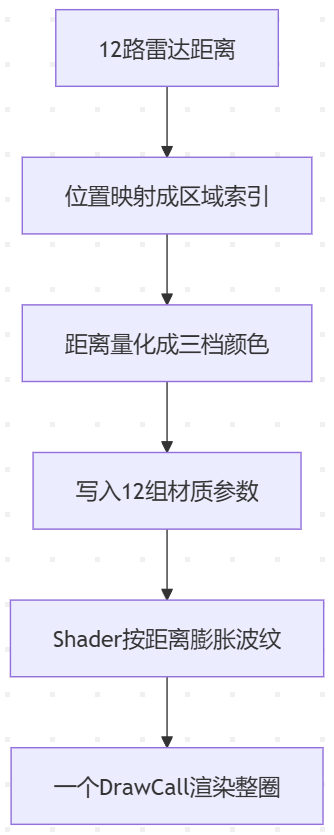

> Parking Distance Control (PDC) uses ultrasonic sensors at 12 points on the vehicle body, covering front, rear, left, right, and the inner/outer sides. When reversing, each sensor reports one distance value, and the SR must draw these 12 distances as a ripple ring around the vehicle body—distance shown by ripple length, red intensity increasing as objects get closer.

Since PDC expresses the distances measured by 12 radar channels and uses a surrounding ripple effect, wouldn't it be simpler to just preconfigure a corresponding ripple mesh, or simply a texture? Yes, that works—some projects really do it that way. It's intuitive, and script management stays simple. But if performance requirements are extremely strict, and assuming the art design of these ripples is relatively "traditional," is there another way?


# The Approach



# Technical Art

Art-wise, this approach depends on a ring-shaped Mesh. The target picture is a ripple band around the vehicle body, with a radius that varies by angle and a different color per segment.

## UV

**uv.x is the angle**: 0–1 goes once around the car, with 0 at the front of the hood; **uv.y is radial**: 0 hugs the car body, 1 is at the outermost ring. This way, the ripple is just a thin band on this canvas. Next, the whole ring is cut into 12 segments by angle, each segment independently computes its own offset and color, and then everything is assembled into one complete ring of ripples.

## Segmentation

Unrolled, the whole UV is like a canvas, which we cut into 12 segments by angle, corresponding to the 12 radar channels. The part the fragment shader handles needs to first determine, for the current fragment's angle uv.x, which of the 12 channels it belongs to:

```hlsl
// u is the fragment angle; posFront/posNext are the positions of the two adjacent segment boundaries
mask = step(posFront, u) * (1 - step(posNext, u));
```

- `mask` is a 0/1 switch that decides whether the current fragment is displayed. Each fragment belongs to exactly one segment; the control method is to multiply by this `mask` when finally outputting the color.
- `posFront` and `posNext` are the segment's left and right boundaries (angular positions). We preconfigure the `uv.x` ranges for the 12 Areas, described below.
- `step` returns 1 past the threshold and 0 otherwise; multiplying two steps makes mask 1 only when u is caught in between.

## Radial Direction

Here is the core operation: step one is adding the distance onto uv.y, effectively **raising each fragment's radial coordinate**. This gives the ripple a 0.45 baseline position first, so it doesn't stick to the car body; then, using the segment's radar distance value levelSelf, divide by the radar's maximum detection range (multiplied by 1.2 to leave some headroom for the outermost ring), achieving the goal of **converting the distance value from centimeters into a UV radial offset**. The larger the distance, the farther outward the offset.

```hlsl
// Radial position = original uv.y + ripple baseline 0.45 + this segment's distance / max distance
uv.y += 0.45 + levelSelf / (_MaxLevel * 1.2);
// Keep only pixels with |uv.y - 0.5| < _Width, i.e. a ring band of width _Width
col.a *= smoothstep(_Width, _Width - 0.02, abs(uv.y - 0.5));

```

The ripple band's structure—solid in the middle with gradients on both sides—is achieved through smoothstep.

## Smooth Curved Transitions

Adjacent segments may have different distances (say 100 cm at the hood, 30 cm at the side). If each segment draws independently, the junction will show a hard jump. So the junction region (each side taking half the spacing) needs a transition: color and offset are lerped together, and the ripple bends smoothly from a large radius to a small one, producing an arc.

```hlsl
// When the neighboring segment is transparent: this segment's endpoint offset doesn't bend toward the neighbor's distance
uvOffsetTemp = lerp(levelSelf, uvOffsetTemp, AlphaFront);
// If this segment is transparent itself, nothing renders
colorTemp.a *= pow(smoothstep(0.0, 0.1, colorSelf.a), 4);
```

When the neighboring segment is visible, uvOffsetTemp makes the endpoint shift somewhat toward the neighbor's distance, forming a smooth arc.

# Code Control

Having seen the shader design, its requirements on upstream are all expressed in the material parameters. Each area takes three parameters, 12 groups in total:


| Parameter            | Meaning                   | Written by   |
| ------------- | -------------------- | ---- |
| `_AreaN`      | The segment's angular position on the ring (0–1 around the car) | Preconfigured |
| `_AreaNLevel` | The segment's radar distance (cm)          | ADAS data |
| `_AreaNColor` | The segment's color (alpha for show/hide)    | Preconfigured |


## The PDC Control Component

Once the component has the 12 distances, it needs to implement the color by severity.

### Mapping to Segment Indices

The radar positions on the car are described by an enum, from In_Front_Left (hood inner left) to Side_Rear_Right (rear side right). But the segments on the ripple ring are numbered 0–11 clockwise, so a mapping is needed:

```csharp
// Position enum → area index (0 at front right, clockwise around to 11 at front left)
case RadarLocation.In_Front_Right:  index = 0;  break;
case RadarLocation.Out_Front_Right: index = 1;  break;
// ...
case RadarLocation.In_Front_Left:   index = 11; break;

```

### Matching Colors

Each distance must be matched by interval to one of red/yellow/green:

```csharp
void AnalysisPDCColor(int index, float minDistance, float middleDistance)
{
    if (AreaLevels[index] > middleDistance)      AreaColors[index] = green;
    else if (AreaLevels[index] > minDistance)    AreaColors[index] = yellow;
    else                                         AreaColors[index] = red;
}

```


| Distance interval          | Color  | Meaning  |
| ------------- | --- | --- |
| > middle threshold        | Green   | Safe  |
| Middle threshold ~ min threshold       | Yellow   | Caution  |
| ≤ min threshold        | Red   | Danger  |
| > max value, e.g. 2000 | Transparent  | Not displayed |


---

# Closing

When you hit a multi-instance rendering requirement of the same kind, it's worth making a conscious trade-off between "object-driven" and "parameter-driven"—hold back the instinct to just pile up objects. Ask one more question: "can I find some shared structure?"
