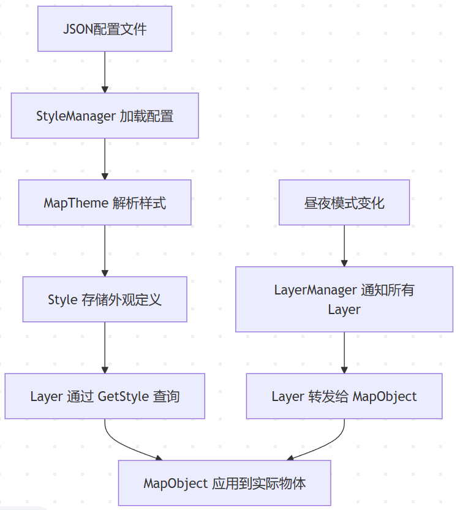
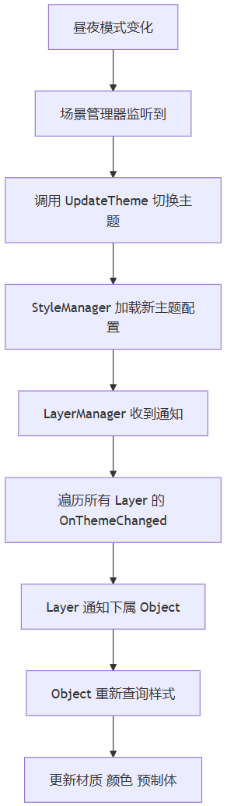

> 上一篇写了SR场景里怎么用Layer分层管理物体，把车道线、泊车位等按物体分层，每层管自己的生命周期。之后在物体的创建这块，有提到说这里会嵌入一个风格化的机制，即主题管理，这一篇分享StyleManager这个模块，一个给SR场景换皮的机制。



---

## 1、需求

SR场景里一个物体的外观表现，受多个维度的影响。这些维度不是互斥的，而是同时作用于同一个物体，通过不同的机制解析：

- **环境维度**（昼夜模式）：白天车道线是白色，夜间是灰色。这个维度是全局的，所有物体一起变。
- **功能维度**（状态变化）：泊车位可用时一个颜色，已选时另一个颜色。这个维度是每个物体各自的，不同物体状态不同。

如果每个模块各自监听昼夜变化、各自根据状态加载材质，代码会非常分散。StyleCatalog 的做法是把所有物体的外观定义集中到一份 JSON 配置里，用两个维度定位一个物体的具体表现：**主题（Theme）决定环境上下文，样式名（Style Name）决定物体自身身份**。运行时通过主题加样式名去查"在当前环境下，这个物体应该长什么样"。

## 2、整体架构

这个模块由三个核心部分组成：`StyleManager`（总管）、`Theme`（主题包）、`Style`（单个样式）。

### 2.1 Style：外观定义

一个`Style`就是一个物体在某个主题下的完整外观描述：

```csharp
public class Style
{
    public string Type;           // 样式类型
    public string PrefabPath;     // 预制体路径
    public Color Color;           // 主色
    public Color Color2;          // 辅色2
    public Color Color3;          // 辅色3
    public Material Material;     // 材质（懒加载）
    public Texture Texture;       // 贴图（懒加载）
    public ShadowCastingMode CastShadowMode;
    public bool ReceiveShadow;
}

```

`Style`里面对于材质和纹理的存储，可以换成 url 的形式，当需要的时候再去通过资源管理模块 LoadAsset处理。

### 2.2 Theme：主题定义

一个`Theme`对应一个主题（比如白天主题、夜间主题、春节主题），它的内部主要是维护一个 Style 字典：

```csharp
public class Theme
{
    public string ThemeName { get; }
    private Dictionary<string, Style> _styles;

    public bool InitStyle(Dictionary<string, StyleThemeJson> raw);
    public Style GetStyle(string styleName);
}

```

### 2.3 StyleManager：主题管理者

`StyleManager`负责加载JSON配置、管理当前主题、提供样式查询。

```csharp
public class StyleManager : IStyleManager
{
    public void Init(string configPath);              // 加载JSON配置
    public bool UpdateTheme(string themeName);        // 切换到指定主题
    public Style GetStyle(string styleName);          // 查询当前主题下的样式
}

```

初始化流程示意代码：

```csharp
_styleManager = new StyleManager(this);
_styleManager.Init("Configs/StyleConfig");   // 加载JSON
_styleManager.UpdateTheme("Day");             // 默认白天主题

```

---

## 3、JSON 配置文件

所有样式定义集中在一份JSON文件中：

```json
{
  "style": {
    "Theme.Day": {
      "config": {
        "StopLineMat": {
          "material": "Materials/StopLineMat_Day",
          "color": "#FFFFFFFF"
        },
        "ParkingSlot_Available": {
          "prefab_path": "Prefabs/Slot_Available",
          "color": "#4CAF50FF"
        },
        "ParkingSlot_Selected": {
          "prefab_path": "Prefabs/Slot_Selected",
          "color": "#2196F3FF"
        }
      }
    },
    "Theme.Night": {
      "config": {
        "StopLineMat": {
          "material": "Materials/StopLineMat_Night",
          "color": "#808080FF"
        }
      }
    }
  }
}

```

每个主题下每个样式都有一个或多个属性，属性字段的取舍根据物体所需去配置。白天主题里定义了`StopLineMat`的材质和颜色，夜间主题可以只改材质。

注意这里两个维度的分工：**主题对应环境维度，样式名对应功能维度**。一个泊车位在白天"可用"状态，查的是 Theme.Day 下的 ParkingSlot_Available；切换到夜间后，同一个样式名在 Theme.Night 下指向另一套贴图。环境变化由主题切换统一处理，状态变化由样式名精确索引。

### 样式名的层级设计

实际项目中，同一个语义下的变体远多于两个。拿泊车位来说，分机械车位和普通车位，每种又分 Default、Disable、CanSelect、Checking、ParkingHead、ParkingRear 等多个状态，再加上窄车位和非窄车位，变体很多，如果每个变体都重复写 `prefab_path`就很不智能了。

StyleCatalog 的做法是：**样式名用** `.` **分隔，按层级自动继承父样式**。

```csharp
private Style CreateStyle(string styleName, Dictionary<string, StyleElementConfigJson> elementsJson)
{
    int index = styleName.IndexOf('.');
    Style ret = null;
    Style parent = null;
    if (index > 0) {
        // 递归创建父样式
        string parentStyle = styleName.Substring(0, index);
        parent = CreateStyle(parentStyle, elementsJson);
    }

    if (!_styles.TryGetValue(styleName, out ret)) {
        ret = new Style(parent);   // 克隆父样式的所有属性
        _styles.Add(styleName, ret);
    }

    if (elementsJson.TryGetValue(styleName, out StyleElementConfigJson elementJson)) {
        ret.LoadJson(elementJson); // 加载自身配置，覆盖父样式中的属性
    }
    return ret;
}

```

---

## 4、主题切换链路



整体理解下来就是 StyleManager 负责更新数据，LayerManager 去消费这些数据。

### Layer 的做法

Layer的`OnThemeChanged()`触发之后，可以 **直接更新材质**：Layer自己重新获取材质，遍历下属物体更新。

```csharp
// CrossWalkLaye
public override void OnThemeChanged()
{
    m_CrossWalkMaterial = Context.GetStyleSystem().GetStyle("CrossWalkMat").Material;
    foreach (var obj in activeObjects)
    {
        obj.GetComponent<Renderer>().material = m_CrossWalkMaterial;
    }
}

```

也可以**转发给 Layer 下的 Object**：Layer不直接处理，交给每个Object自己决定怎么换。

### Object 的做法

这是换肤的核心操作的位置，Object收到主题切换通知后，重新查询样式，然后把样式的值给赋值好，并标记需要更新。

```csharp
public override void FillData(IMapData data)
{
    _data = (ParkingSlotData)data;
    // 只记样式名，标记脏，不碰资源
    StyleName = _data.StyleName;
    ColorStyleName = _data.ColorStyle;
}

protected override void OnUpdate()
{
    if (_needUpdateStyle)
    {
        UpdateStyle();
        _needUpdateStyle = false;
    }
}

public override void OnThemeChanged()
{
    UpdateStyle();  // 主题切了，强制按当前Catalog再刷一遍
}

private void UpdateStyle()
{
    Style style = StyleCatalog.GetStyle(StyleName);
    if (style == null) return;

    // 路径变了才触发 Rebuild，变了就销毁旧GO用新预制体重建
    PrefabPath = style.PrefabPath;

    // 颜色和贴图就地改，不需要重建
    Style colorStyle = StyleCatalog.GetStyle(ColorStyleName);
    if (colorStyle.Texture != null)
        _slotController.Material.SetTexture(ShaderProperty.BaseMap, colorStyle.Texture);
    _slotController.RefreshParkBackgroundColor(colorStyle.Color);
}
```

---

## 结语

这套关于样式的设计，与分层框架的结合，可以把外观定义从代码中剥离。让设计同事和开发同事在这里的边界更清晰，协作更直接。